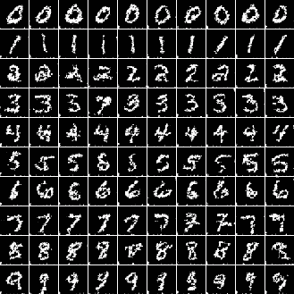
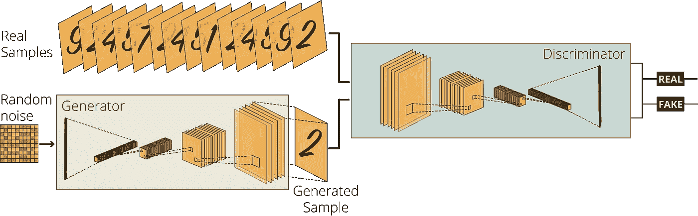
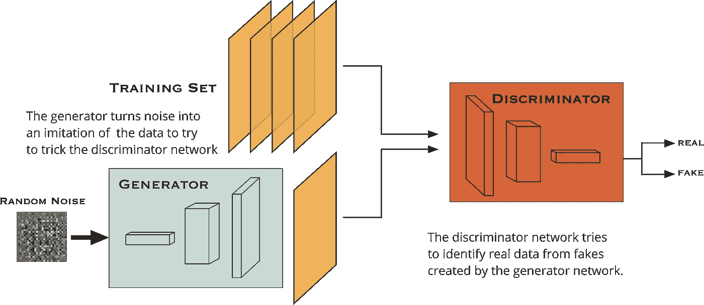
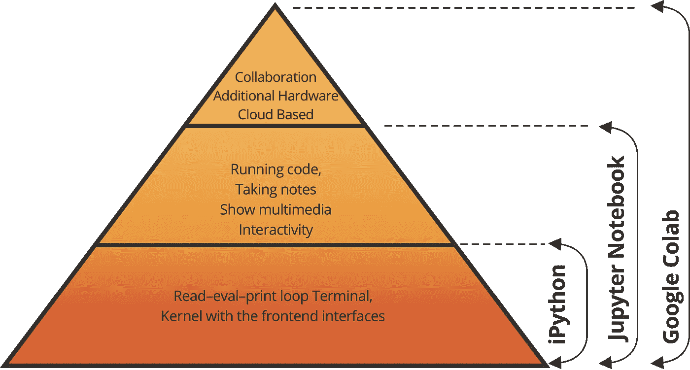
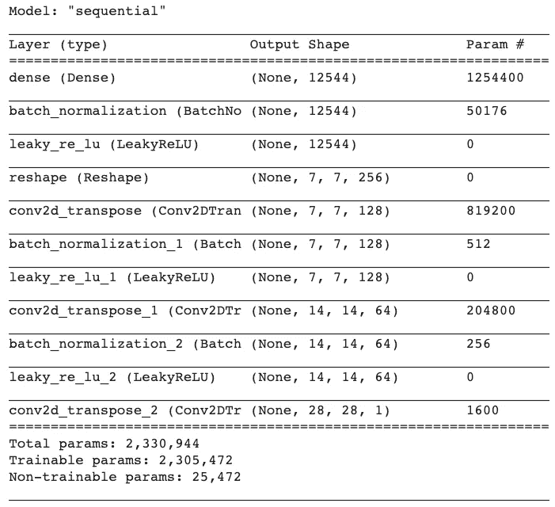
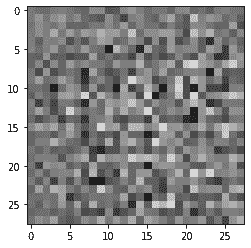
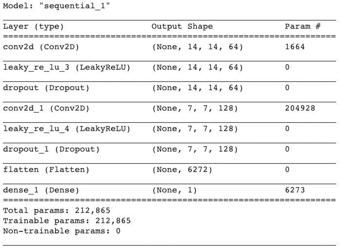
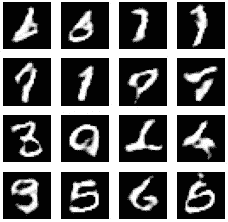
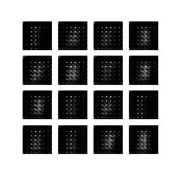

# 利用生成性对抗网络在 10 分钟内生成图像

> 原文：<https://towardsdatascience.com/image-generation-in-10-minutes-with-generative-adversarial-networks-c2afc56bfa3b?source=collection_archive---------0----------------------->

## 深度学习案例研究

## 与 [VIZIO AI](https://medium.com/u/1811adfc2b83?source=post_page-----c2afc56bfa3b--------------------------------) 合作，使用 TensorFlow 和 MNIST 数据集，使用无监督深度学习生成具有深度卷积 gan 的手写数字

***如今机器正在生成完美的图像，区分机器生成的图像和原件变得越来越困难。***

如果你正在阅读这篇文章，我确信我们有着相似的兴趣，并且正在/将要从事相似的行业。那么我们就通过[*Linkedin*](https://linkedin.com/in/orhangaziyalcin/)*来连线吧！请不要犹豫发送联系请求！*[*Orhan g . Yal n—Linkedin*](https://linkedin.com/in/orhangaziyalcin/)

图一。Nvidia 的 StyleGAN 生成的图像示例【2】

图二。机器生成的数字使用 MNIST [ [3](https://www.researchgate.net/profile/Or_Sharir/publication/309131743)

在我的文章[用 MNIST 数据集](/image-classification-in-10-minutes-with-mnist-dataset-54c35b77a38d)在 10 分钟内进行图像分类获得了超过 30 万的浏览量后，我决定准备另一个关于深度学习的教程。但这一次，我们不是对图像进行分类，而是使用相同的 MNIST 数据集来生成图像，该数据集代表修改后的国家标准与技术研究所数据库。它是一个手写数字的大型数据库，通常用于训练各种图像处理系统[1]。

# 生成对抗网络

为了用机器学习生成——基本上——任何东西，我们必须使用生成算法，至少目前，用于图像生成的最好的生成算法之一是生成对抗网络(或 GANs)。

# 生成对抗网络的发明

图 3。[维基百科](https://upload.wikimedia.org/wikipedia/commons/f/fe/Ian_Goodfellow.jpg) [ [4](https://upload.wikimedia.org/wikipedia/commons/f/fe/Ian_Goodfellow.jpg) ]上[伊恩·古德菲勒](https://en.wikipedia.org/wiki/Ian_Goodfellow)的照片

GANs 的发明出乎意料。著名的人工智能研究人员*，当时是蒙特利尔大学的博士研究员*，[伊恩·古德菲勒](https://en.wikipedia.org/wiki/Ian_Goodfellow)，当他在一个朋友的告别派对上与他的朋友讨论其他生成算法的缺陷时，偶然想到了这个想法。聚会结束后，他满怀希望地回到家中，实施了他心中的构想。令人惊讶的是，在第一次试验中，一切都如他所愿[ [5](https://www.youtube.com/watch?v=pWAc9B2zJS4) ]，他成功地创建了生成性对抗网络(简称 GANs)。根据脸书人工智能研究主任、纽约大学教授 Yann Lecun 的说法，GANs 是“过去 10 年机器学习中最有趣的想法”。

GANs 的大致结构如下所示:

图 4。利用 CNN 的生成对抗网络(GANs)

在一个普通的 GAN 结构中，有两个相互竞争的代理:一个**生成器**和一个**鉴别器**。它们可以使用不同的网络来设计(例如，卷积神经网络([CNN](/image-classification-in-10-minutes-with-mnist-dataset-54c35b77a38d))、递归神经网络( [RNNs](/using-recurrent-neural-networks-to-predict-bitcoin-btc-prices-c4ff70f9f3e4) )，或者仅仅是常规神经网络([ann](/improving-our-model-for-kaggles-titanic-competition-with-natural-language-processing-nlp-deep-8fa8d3e1fa83)或常规网络)。由于我们将生成图像，CNN 更适合这项任务。因此，我们将用卷积神经网络来构建我们的代理。

# 我们的 GAN 模型是如何运作的？

图 5。GAN 网络中的生成器和鉴别器关系|(图表由作者提供)

简而言之，我们将要求生成器生成手写数字，而不给它任何附加数据。同时，我们将获取现有的手写数字到鉴别器，并要求它决定由生成器生成的图像是否是真实的。起初，生成器会生成糟糕的图像，这些图像会立即被鉴别器标记为假的。在从鉴别器获得足够的反馈后，由于与真实图像的差异减少，生成器将学习欺骗鉴别器。因此，我们将获得一个非常好的生成模型，可以给我们非常现实的输出。

# 构建 GAN 模型

GANs 经常使用复杂的计算，因此，支持 GPU 的机器将使你的生活变得容易得多。所以我会用 Google Colab，用 GPU 加速来减少训练时间。

## 使用 Google Colab 进行支持 GPU 的培训

对于机器学习任务，在很长一段时间里，我几乎专门通过 Anaconda 发行版使用-iPython- Jupyter Notebook 进行建模、训练和测试。不过，最近我因为几个好的原因转而使用 Google Colab。

Google Colab 在 Jupyter 笔记本的基础上提供了几个附加功能，例如(I)与其他开发人员的协作，(ii)基于云的托管，以及(iii) GPU 和 TPU 加速培训。你可以用免费版的 Google Colab 完成所有这些工作。Python、Jupyter Notebook 和 Google Colab 之间的关系可以形象化如下:

图 6。iPython、Jupyter Notebook、Google Colab |(图由作者提供)之间的关系

Anaconda 为科学计算提供免费和开源的 Python 和 R 编程语言发行版，包括 Jupyter Notebook (iPython)或 Jupyter Lab 等工具。在这些工具之上，Google Colab 允许其用户使用 iPython 笔记本和实验室工具及其服务器的计算能力。

现在，我们已经对作为我们的神经网络架构的生成式对抗网络和作为我们的编程环境的 Google Collaboratory 有了大致的了解，我们可以开始构建我们的模型了。在本教程中，我们将从一个官方的 [TensorFlow 教程](https://www.tensorflow.org/tutorials/generative/dcgan) [ [7](https://www.tensorflow.org/tutorials/generative/dcgan) ]中获取我们自己的内容。

# 初始进口

Colab 已经预装了大多数机器学习库，因此，您可以通过以下共享方式导入它们:

TensorFlow、Keras 图层和 Matplotlib 导入

为了代码更短，我更喜欢单独导入层，如上所示。

# 加载并处理 MNIST 数据集

对于本教程，我们可以使用 MNIST 数据集。MNIST 数据集包含 60，000 张训练图像和 10，000 张测试图像，分别来自美国人口普查局员工和美国高中生[ [8](https://en.wikipedia.org/wiki/MNIST_database) ]。

幸运的是，我们可以直接从 TensorFlow 库中检索 MNIST 数据集。我们从 Tensorflow 中检索数据集，因为这样，我们可以得到它的已处理版本。我们仍然需要做一些准备和处理工作，以使我们的数据适合 GAN 模型。因此，在第二行中，我们将这两组分为训练组和测试组，还将标签和图像分开。

*x_train* 和 *x_test* 零件包含灰度 RGB 代码(从 0 到 255)，而 *y_train* 和 *y_test* 零件包含从 0 到 9 的标签，代表它们实际上是哪个数字。由于我们正在进行无监督的学习任务，我们将不需要标签值，因此，我们使用下划线(即 _)来忽略它们。我们还需要使用 reshape 函数将数据集转换为 4 维。最后，我们将 NumPy 数组转换为 TensorFlow Dataset 对象，以便更有效地进行训练。下面的代码行完成所有这些任务:

我们的数据已经处理完毕，是时候建立我们的 GAN 模型了。

# 建立模型

如上所述，每个 GAN 必须至少有一个发生器和一个鉴别器。由于我们正在处理图像数据，我们需要从这些网络中的卷积和转置卷积(逆卷积)层中受益。下面我们来定义一下我们的发生器和鉴别器网络。

## 发电机网络

我们的生成器网络负责从随机噪声中生成 28×28 像素的灰度假图像。因此，它需要接受一维数组并输出 28x28 像素的图像。对于这项任务，我们需要转置卷积层后，重塑我们的 1 维阵列到 2 维阵列。转置卷积层会增加较小数组的大小。我们还利用了 BatchNormalization 和 LeakyReLU 层。以下代码行创建了一个函数，该函数将使用 Keras Sequential API 生成一个发电机网络:

我们可以用下面的代码调用生成器函数:

图 7。我们发电机网的总结|(图由作者提供)

现在我们有了生成器网络，我们可以用下面的代码轻松地生成一个示例图像:

看起来像这样:

图 8。未经训练的生成器网络生成的样本图片|(图片由作者提供)

这只是普通的噪音。但是，它可以从随机噪声阵列中创建图像的事实证明了它的潜力。

## 鉴别器网络

对于我们的鉴别器网络，我们需要遵循我们的发生器网络的逆版本。它获取 28×28 像素的图像数据并输出单个值，表示真实性的可能性。因此，我们的鉴别器可以检查由生成器生成的样本图像是否是假的。

我们使用与创建生成器网络相同的方法，以下代码行创建了一个函数，该函数将使用 Keras Sequential API 创建一个鉴别器模型:

我们可以用下面的代码调用函数来创建我们的鉴别器网络:

图 9。我们的鉴频器网络总结|(图由作者提供)

最后，我们可以检查未经训练的鉴别器对未经训练的生成器生成的样本说了什么:

**输出:** tf。张量([[ **-0.00108097** ])，shape=(1，1)，dtype=float32)

负值表明我们未经训练的鉴别器断定图 8 中的图像样本是假的。目前，重要的是它可以检查图像并提供结果，经过训练后结果会可靠得多。

## 配置模型

由于我们在 GAN 网络中训练两个子网络，因此需要定义两个损失函数和两个优化器。

***损失函数:*** 我们从从 *tf.keras.losses* 模块创建一个**二元交叉熵**对象开始。我们还将 *from_logits* 参数设置为 **True** 。创建对象后，我们用定制的鉴别器和生成器损耗函数填充它们。我们的鉴别器损耗计算为(I)鉴别器对真实图像的预测为一组 1，以及(ii)鉴别器对生成图像的预测为一组 0 的组合。我们的发电机损耗是通过测量它欺骗鉴别器的能力来计算的。因此，我们需要将鉴别器对生成图像的决策与 1 的数组进行比较。

***优化器:*** 我们还为发生器和鉴别器网络分别设置了两个优化器。我们可以使用来自*TF . keras . optimizer*模块的**亚当**优化器对象。

下面几行配置了我们的损失函数和优化器

## 设置检查点

我们希望访问之前的训练步骤，TensorFlow 为此提供了一个选项: [***检查点***](https://www.tensorflow.org/guide/checkpoint) 。通过设置一个检查点目录，我们可以保存每个时期的进度。当我们从上一个纪元恢复我们的模型时，这将特别有用。以下代码行通过使用 os 库设置保存所有培训步骤的路径来配置培训检查点

# 训练模型

现在我们的数据准备好了，我们的模型也创建并配置好了。是时候设计我们的训练循环了。请注意，目前，甘需要定制的训练循环和步骤。我会尽量让你明白。确保阅读了 [Github Gists](https://www.liquidweb.com/kb/little-known-ways-to-utilize-github-gists) 中的代码注释。

让我们用下面几行创建一些变量:

我们的种子是我们用来生成图像的噪音。下面的代码生成一个形状为(16，100)的正态分布的随机数组。

## 定义培训步骤

这是我们教程中最不寻常的部分:我们正在设置一个定制的训练步骤。通过注释 **tf.function** 模块定义自定义 *train_step()* 函数后，我们的模型将基于我们定义的自定义 *train_step()* 函数进行训练。

下面带有过多注释的代码是针对培训步骤的。请仔细阅读评论:

现在我们已经用 ***tf.function*** 注释创建了我们的定制训练步骤，我们可以为训练循环定义我们的训练函数了。

## 定义训练循环

我们为训练循环定义了一个名为 train 的函数。我们不仅运行 for 循环在 MNIST 上迭代我们的自定义训练步骤，还使用单个函数执行以下操作:

培训期间:

*   开始记录每个时期开始时花费的时间；
*   制作 GIF 图像并显示它们，
*   每五个时期保存一个模型作为检查点，
*   打印出完整的历元时间；和
*   训练完成后，最终生成最终图像。

以下带有详细注释的行执行所有这些任务:

## 图像生成功能

在训练函数中，有一个我们还没有定义的自定义图像生成函数。我们的图像生成功能执行以下任务:

*   通过使用模型生成图像；
*   使用 matplotlib 在 4x4 网格布局中显示生成的图像；
*   最后保存最后的数字

以下部门负责这些任务:

## 开始训练

在训练了三个复杂的函数之后，开始训练是相当容易的。只需使用以下参数调用 train 函数:

如果您使用支持 GPU 的 Google Colab 笔记本电脑，培训将需要大约 10 分钟。如果你用的是 CPU，可能要多花很多。让我们看看 60 个纪元后的最终产品。

图 10。我们的 GAN 在 60 个纪元后生成的数字。请注意，我们看到的是 16 个样本，因为我们是这样配置输出的。|(图片由作者提供)

# 生成数字

在生成新映像之前，让我们确保使用以下代码行从最新的检查点恢复值:

我们还可以通过查看生成的 4x4 网格来查看我们的生成式 GAN 模型的演变，该网格包含任何时期的 16 个样本数字，代码如下:

这段代码为我们提供了最新生成的网格。在 display_image(函数)中传递一个 0 到 60 之间的不同数字

或者更好的是，让我们用下面的代码创建一个 GIF 图像，可视化我们的 GAN 生成的样本的演变:

我们的输出如下:

图 11。GIF 图像显示了我们的 GAN 生成的样本数字随时间的演变|(图片由作者提供)

如图 11 所示，随着时间的推移，GAN 产生的输出变得更加真实。

# 恭喜

您已经建立并训练了一个生成式对抗网络(GAN)模型，它可以成功地创建手写数字。显然有一些样本不是很清楚，但对于仅在 6 万个样本上训练的 60 个纪元，我会说结果非常有希望。

一旦你能建立并训练这个网络，你就能生成更复杂的图像，

*   通过处理具有高清晰度彩色图像的较大数据集；
*   通过创建更复杂的鉴别器和发生器网络；
*   通过增加历元的数量；
*   通过在支持 GPU 的强大硬件上工作

最后，你可以创作艺术作品，如诗歌、绘画、文字或现实照片和视频。

# 订阅邮件列表获取完整代码

如果你想在 Google Colab 上获得完整的代码，并获得我的最新内容，请订阅邮件列表:✉️

> [立即订阅](http://eepurl.com/hd6Xfv)

# 喜欢这篇文章吗？

如果你喜欢这篇文章，可以考虑看看我的其他类似文章:

 [## 使用 MNIST 数据集在 10 分钟内完成图像分类

towardsdatascience.com](/image-classification-in-10-minutes-with-mnist-dataset-54c35b77a38d)  [## TensorFlow 和 VGG19 可以帮助您将照片转换成美丽的波普艺术作品

### 神经风格转移基于安迪沃霍尔的门罗双联画与预训练的计算机视觉网络 VGG19，转移…

towardsdatascience.com](/tensorflow-and-vgg19-can-help-you-convert-your-photos-into-beautiful-pop-art-pieces-c1abe87e7e01)  [## 伯特和拥抱脸 10 分钟情感分析

### 学习预训练的自然语言处理模型的基础，伯特，并建立一个使用 IMDB 电影评论的情感分类器…

towardsdatascience.com](/sentiment-analysis-in-10-minutes-with-bert-and-hugging-face-294e8a04b671)  [## 使用递归神经网络预测比特币(BTC)价格

### 如果你能以某种方式预测明天的比特币(BTC)价格，这不是很棒吗？加密货币市场有…

towardsdatascience.com](/using-recurrent-neural-networks-to-predict-bitcoin-btc-prices-c4ff70f9f3e4) 

# 资源

[1]奥尔汉·g·亚尔琴，用 MNIST 数据集在 10 分钟内进行图像分类，走向数据科学，[https://towardsdatascience . com/Image-Classification-in-10-Minutes-with-Mn ist-Dataset-54c 35 b 77 a 38d](/image-classification-in-10-minutes-with-mnist-dataset-54c35b77a38d)

[2]莱蒂宁法官(未注明日期)。*分析并改善 StyleGAN Tero Karras NVIDIA samu Li Laine NVIDIA Miika Aittala NVIDIA Janne hells ten NVIDIA*的图像质量。从 https://github.com/NVlabs/stylegan2[取回](https://github.com/NVlabs/stylegan2)

[3]或 Sharir & Ronen Tamari & Nadav Cohen & am non sha shua，Tensorial Mixture Models，[https://www . research gate . net/profile/Or _ Sharir/publication/309131743](https://www.researchgate.net/publication/309131743_Tensorial_Mixture_Models)。

[4]维基百科，文件:伊恩 Goodfellow.jpg，[https://upload . wikimedia . org/Wikipedia/commons/f/Fe/Ian _ good fellow . jpg](https://upload.wikimedia.org/wikipedia/commons/f/fe/Ian_Goodfellow.jpg)

同步，甘斯之父伊恩·古德费勒为苹果拆分谷歌，[https://medium . com/SYNCED review/甘斯之父-伊恩·古德费勒-Splits-Google-For-Apple-279 FCC 54 b 328](https://medium.com/syncedreview/father-of-gans-ian-goodfellow-splits-google-for-apple-279fcc54b328)

[5] YOUTUBE，深度学习的英雄:https://www.youtube.com/watch?v=pWAc9B2zJS4 吴恩达采访伊恩·古德菲勒

[6] George Lawton，Generative adversarial networks 可能是 AI 中最强大的算法，[https://search enterprise AI . tech target . com/feature/Generative-adversarial-networks-can-be-most-powerful-algorithm-in-AI](https://searchenterpriseai.techtarget.com/feature/Generative-adversarial-networks-could-be-most-powerful-algorithm-in-AI)

[7]深度卷积生成对抗网络，TensorFlow，可在[https://www.tensorflow.org/tutorials/generative/dcgan](https://www.tensorflow.org/tutorials/generative/dcgan)获得

[8]维基百科，https://en.wikipedia.org/wiki/MNIST_database MNIST 数据库，