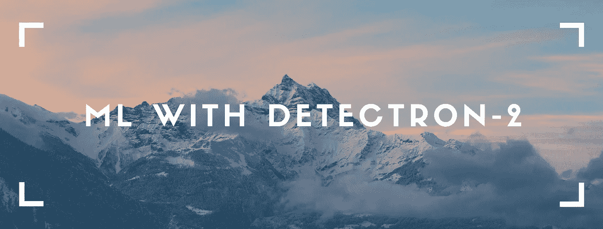
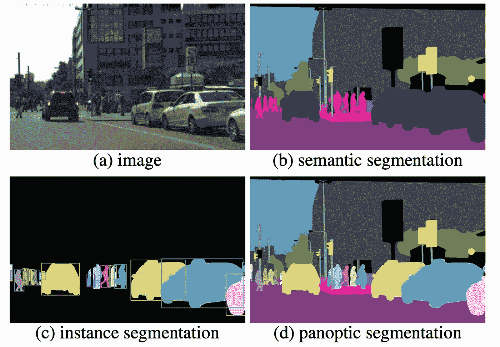
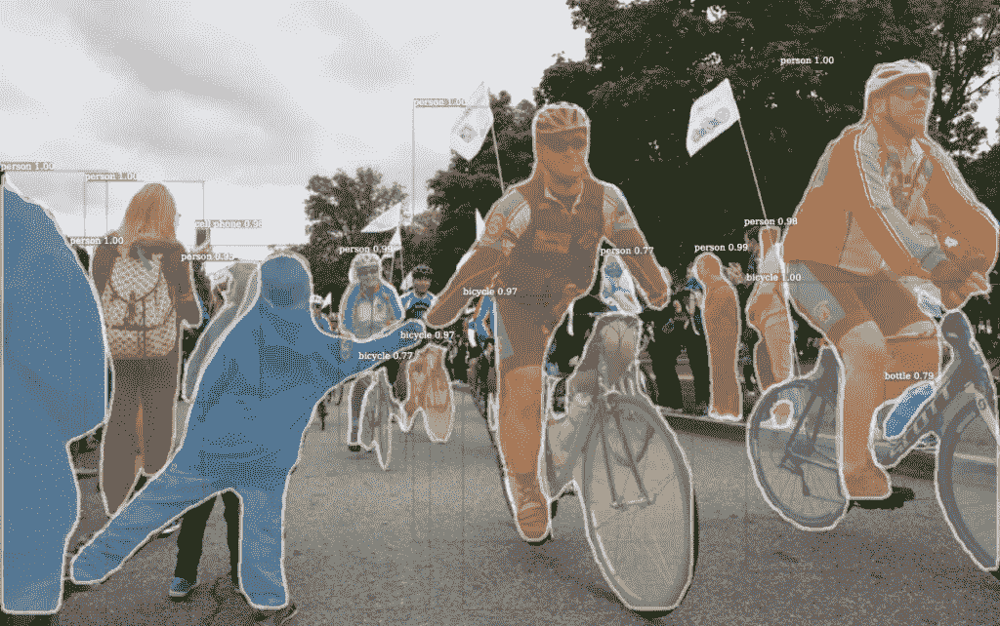
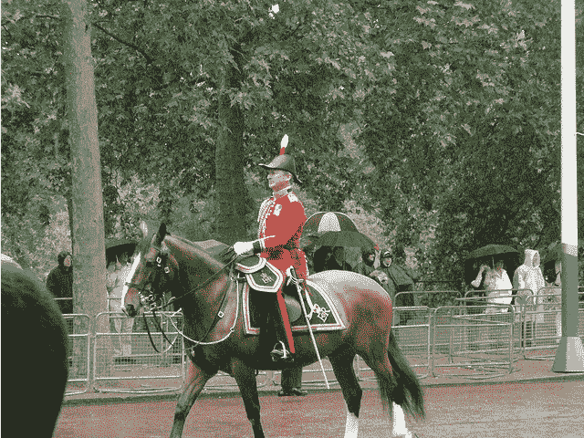
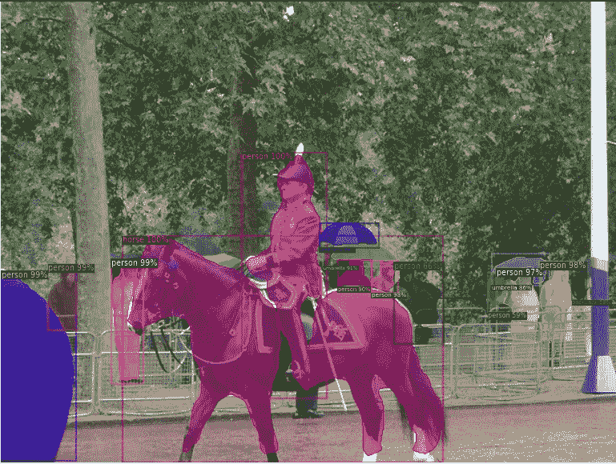

# 使用脸书探测器的图像标记🤖🤖

> 原文：<https://towardsdatascience.com/image-labelling-using-facebooks-detectron-4931e30c4d0c?source=collection_archive---------55----------------------->

## 你好，脸书探测器世界

Canva.com 地平线|免费媒体许可证

训练一个模型从头开始检测文本可能是一项非常困难和令人沮丧的任务。传统的方法是使用具有特征金字塔网络的 R-CNN 或者使用像 YOLO 这样的算法。

如果你不知道这两种方法背后的数学和逻辑，那么这两种方法都很难实现。

由脸书人工智能研究团队开发的 Detectron 2 是一个基于 mask-r-CNN 基准的最新目标检测模型。它的动力来自 Pytorch 深度学习框架。主要功能包括

[来源](https://openaccess.thecvf.com/content_CVPR_2019/papers/Kirillov_Panoptic_Segmentation_CVPR_2019_paper.pdf)

1.  [**全景分割**](https://openaccess.thecvf.com/content_CVPR_2019/papers/Kirillov_Panoptic_Segmentation_CVPR_2019_paper.pdf):FAIR 的另一个产品，是一种将语义分割(给每个像素分配一个类标签)和实例分割(检测和分割每个对象实例)这两种典型的不同任务统一起来的分割类型。

[FAIR GITHUB](https://github.com/facebookresearch/Detectron)

2.**密集姿态**:用于将 RGB 图像的所有人体像素映射到人体的 3D 表面。这是由咖啡 2 驱动的。

“这种模式旨在通过提供快速培训和解决公司在从研究走向生产时面临的问题来推进物体检测”

# 我们开始吧！

Detectron 2 可以使用 Google Colab Notebook 实现对象检测。我们选择 Google Colab 而不是本地系统，以利用 GPU 进行更快的训练。

# **步骤 1:安装并导入 Detectron 2**

我们将在 google colab 上编写这些代码，或者您可以在这里 *获得整个笔记本 [*。*](https://colab.research.google.com/drive/16jcaJoc6bCFAQ96jDe2HwtXj7BMD_-m5#scrollTo=b-i4hmGYk1dL)*

为了开始，我们将安装一些依赖项，如 COCO API，CUDA(获取关于 GPU 的信息)，Tourch Visison

**导入实用程序和公共库**

# 步骤 2:运行预训练的检测器 2 模型

我们将使用来自 COCO 数据集的图像，并将运行一个预训练的模型，如果你想在客户数据集上运行这个模型，请参见[这里](https://colab.research.google.com/drive/16jcaJoc6bCFAQ96jDe2HwtXj7BMD_-m5)。

在 COCO 的图像上运行模型的代码:

> 你已经成功地用 detectron 实现了你的第一个项目。

# 结果:可视化前后

下面列出了来源。

[来源](https://colab.research.google.com/drive/16jcaJoc6bCFAQ96jDe2HwtXj7BMD_-m5#scrollTo=dq9GY37ml1kr)

## 资源:

1.  [脸书探测仪人工智能研究页面](https://github.com/facebookresearch/Detectron)
2.  [论文讲解全景分割](https://openaccess.thecvf.com/content_CVPR_2019/papers/Kirillov_Panoptic_Segmentation_CVPR_2019_paper.pdf)