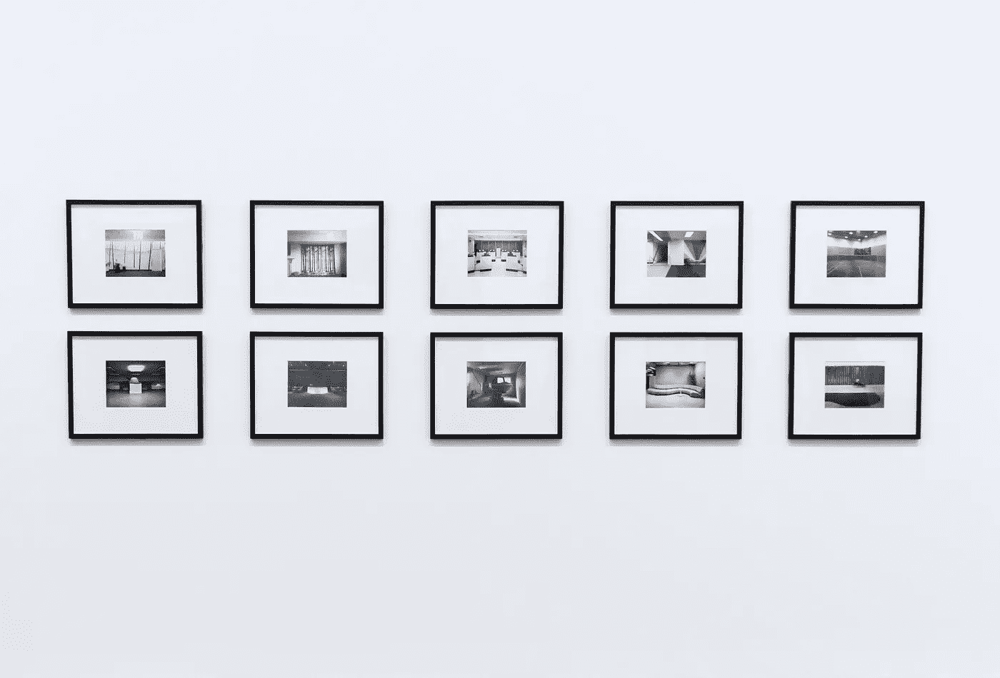
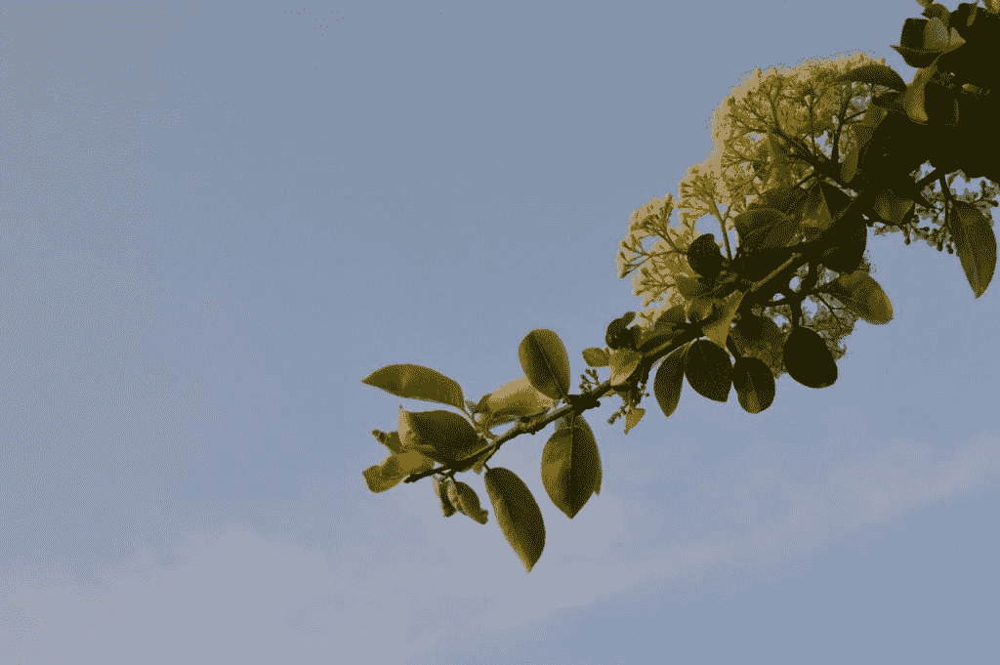
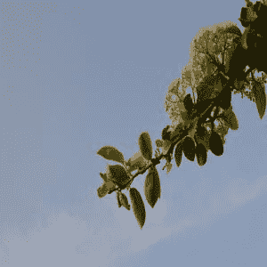
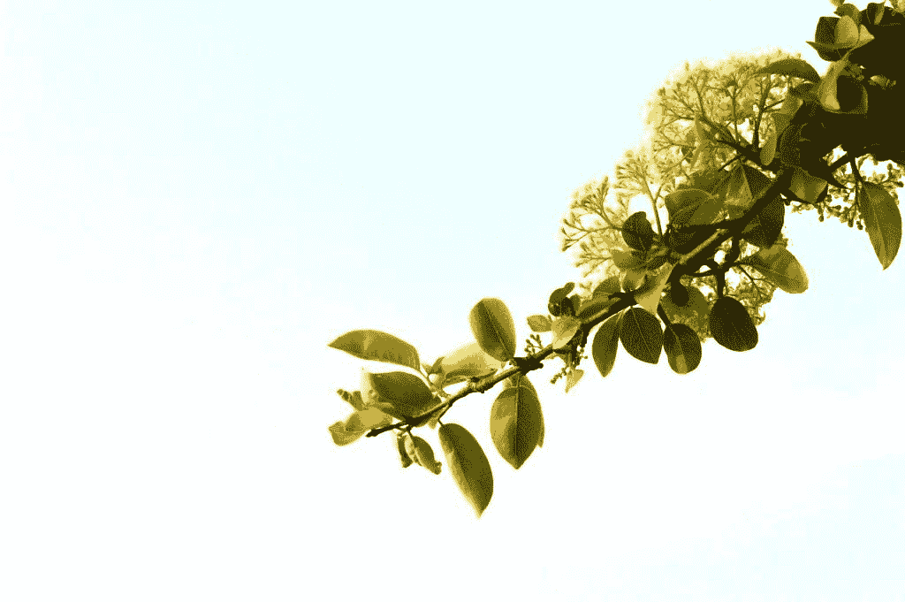
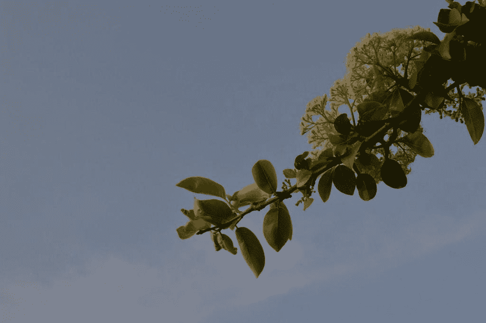

# Python 中的图像处理

> 原文：<https://towardsdatascience.com/image-manipulation-in-python-cbb86a61cf0?source=collection_archive---------22----------------------->

## 常用图像处理技术逐步指南



来自[的照片](https://www.pexels.com/photo/frames-on-white-background-310435/?utm_content=attributionCopyText&utm_medium=referral&utm_source=pexels)

在这篇文章中，我将向你展示如何使用 Python 编辑图像。编辑图像的过程称为图像处理。您可能想知道为什么在项目中使用图像之前需要对它们进行一些润色。这有许多原因，但几个主要原因可以列为节省存储空间、提高培训质量和更快的运行时间。这篇文章中涉及的操作技术包括图像大小调整、图像亮度，以及最后将图像颜色转换成灰度。我们将通过测试每一张图片来进行一些实际操作。

## 图像大小调整

对于一个图像来说，这没有太大的区别，但是当你考虑在你的程序中处理成千上万的图像时，很小的尺寸变化将会节省你大量的时间和存储空间。

## 图像亮度

当我们看一幅图像时，很容易理解我们看到的东西，但对于机器来说，这可能有点挑战性。因此，为了帮助机器更好地处理图像，一点亮度可以帮助提高精确度。

## 图像灰度

当训练机器时，灰度图像做得更好。原因是因为机器将图像视为阵列的矩阵，所以存储黑白图像比存储多幅彩色图像更容易。

这些只是我们将在本帖中介绍的一些图像处理技术。还有很多，但如前所述，这些是最常用的技术，可以应用于任何格式的图像。如果你准备好了，我们开始吧！

# 图像

在我们开始编码之前，让我们选择一个图像来测试我们的代码。这张图片可以是任何格式，但我建议使用“png”或“jpg”。这是我选择玩的图像。这张图片的好处是没有使用滤镜和特效。



照片由[贝希克·居文](https://www.pexels.com/@behic-guven-701967?utm_content=attributionCopyText&utm_medium=referral&utm_source=pexels)从[派克斯](https://www.pexels.com/photo/4765748/?utm_content=attributionCopyText&utm_medium=referral&utm_source=pexels)拍摄

## 包装

我们总共只用一个包。我们将用于图像操作的主要库称为 PIL，它是图像处理库。PIL 将被安装为“枕头”，不要混淆，他们是一回事。

让我们从安装包开始吧。

```
pip install pillow
```

是时候将包作为库导入了，这样我们就可以使用它们了。

```
from PIL import Image, ImageEnhance
```

## 导入图像

我已经将我的图像重命名为“testme.jpg”，在这一步中，我通过将它分配给一个名为“img”的变量名来导入图像。我们将做最常用的三种手法。为了使事情变得简单明了，我将为每种技术使用相同的图像，但是可以随意为每种操作技术定义不同的图像。

```
img = Image.open("testme.jpg")
```

# 技巧 1 —调整大小

我们将对这张图片做的第一件事是调整它的大小。使用 PIL 库调整大小是非常容易的，这是一个图像处理库，如前所述。调整图像大小后，我想保存它，以便我们运行程序后可以看到图像。而最后要把图像保存为图像文件，我们就要用'保存'的方法。

在我们调整大小之前，您可以通过下面的代码打印图像的当前大小。

```
print(img.size)
```

调整图像大小:

```
newsize = (300, 300) 
img_resized = img.resize(newsize) print(img_resized.size)
```

现在，我们可以将图像文件保存在我们的文件夹中。

```
img_resized.save("resized.jpg")
```

## 结果



resized.jpg

# 技术 2 —亮度

其次，让我们给我们的形象增加一些光亮。尤其是有阴影的图像，增加亮度有助于机器更好地看到图像中的线条。这在训练机器时非常重要，因为机器接受事物的本来面目，很少的错误信息都会导致错误的训练。不管怎样，下面是增加一些亮度的代码:

```
# Define enhancer
enhancer = ImageEnhance.Brightness(img) img_light = enhancer.enhance(1.8) img_light.save("brightened.jpg")
```

## 结果



Brightened.jpg

对于光线太强的图像，我们能做些什么吗？当然，和加光一样，也有一种方法可以让一些光出来。这将有助于在晴天拍摄的图像。要做到这一点非常容易，我们只需改变括号之间的值。如果数量大于 1，增强器将增加光线。如果该值介于 0 和 1 之间，增强器会发出一些光，这将使图像变得更暗。

值越小，颜色越深。你可以玩这个值，并观察它的行为。

```
enhancer = ImageEnhance.Brightness(img) 
img_light = enhancer.enhance(0.8) img_light.save("darkened.jpg")
```

## 结果



darkened.jpg

# 技术 3 —灰度

作为我们的第三种图像处理技术，我们将看到如何将图像转换成灰度。换句话说，我们可以说非黑即白。存储灰度图像比存储多种颜色的图像更有效，机器也更容易理解。特别是，当训练机器学习图像中的特定对象时，灰度是最常用的技术之一。

```
img = Image.open('testme.jpg') 
img = img.convert('L') img.save('grayscaled.jpg')
```

## 结果


grayscaled.jpg

这些是一些最常用的图像处理技术。这些技巧将帮助你更快更容易地编辑图像。在这个练习中，我们只编辑了一个图像，但是也可以在一个循环中运行相同的代码，这样你就可以用几行代码编辑成千上万的图像。

我是贝希克·居文，我喜欢分享关于创造力、编程、动力和生活的故事。

*跟随我的* [*博客*](https://medium.com/@lifexplorer) *和* [*走向数据科学*](https://towardsdatascience.com/) *留下灵感。*

## 你可能喜欢的计算机视觉项目

[](/simple-face-detection-in-python-1fcda0ea648e) [## Python 中的简单人脸检测

### 如何使用 OpenCV 库检测图像中的人脸

towardsdatascience.com](/simple-face-detection-in-python-1fcda0ea648e)