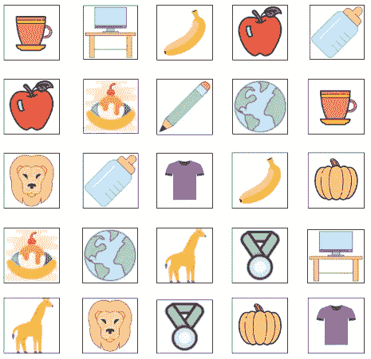
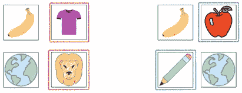
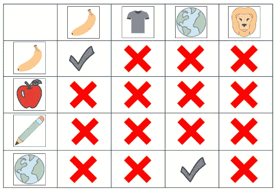
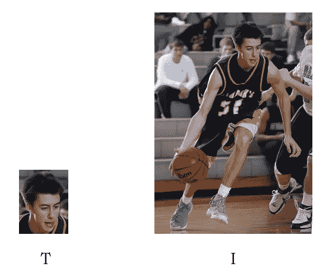

# 利用 OpenCV 的模板匹配进行图像匹配

> 原文：<https://towardsdatascience.com/image-matching-with-opencvs-template-matching-5df577a3ce2e?source=collection_archive---------23----------------------->

## 现实世界问题的高效计算解决方案



来自 icons8.com 的图片

## 介绍

作为 VATBox 的一名数据科学家，我主要从事核心涉及构建机器学习模型的项目。这个项目的好处在于，它纯粹包括建立一个算法来解决给定的任务。定制解决方案的现实问题。

## 问题定义

手头的问题本质上是两个接近相同的图像之间的匹配(例如，变化可能是由于图像大小)。这里的目标是实时地这样做，因此我们需要算法相对较快。

在 VATBox，我们的世界是一个发票的世界。用户将包含发票图像的报告上传到我们的平台。一份报告包含两组图像，一组是单独发票的集合，另一组是所有发票的集合。由于某些原因，我们不会深入探讨，一个组中的图像可能不会出现在另一个组中。目标是检测没有出现在另一组中的图像(如果有的话)。如果我们在本质上是相同图像的所有图像之间进行匹配，我们也可以识别备用图像。



我们想要检测备用图像(在左边用红色标记，在右边用蓝色标记)

## 解决办法

因此，为了找到备用图像，我们需要在每两个图像之间进行比较(或者..？我们会谈到这一点..)，一个图像来自第一组，另一个来自第二组。一旦完成，我们就可以在图像之间进行匹配，然后查看哪些图像没有匹配。我们可以构建一个包含这些比较的比较矩阵。



比较矩阵

在我的研究中，我遇到的大多数解决方案都是基于从图像中提取的[特征来匹配图像，但对于我们的情况来说，这在计算上是昂贵的，因为我们对每对图像都感兴趣。因此，我们需要一种不同的方法。](https://docs.opencv.org/master/dc/dc3/tutorial_py_matcher.html)

如上所述，实际匹配的图像几乎完全相同。所以我们可以预期它们的像素值相对相似。那么我们是否可以计算两个给定信号之间的相关性？但是如何用图像有效地做到这一点呢？

OpenCV 有一个[模板匹配](https://opencv-python-tutroals.readthedocs.io/en/latest/py_tutorials/py_imgproc/py_template_matching/py_template_matching.html)模块。这个模块的目的是在一个(更大的)图像中找到一个给定的模板。该模块使我们能够在图像(I)上“滑动”模板(T)并有效地执行计算(类似于在 CNN 中卷积核如何在图像上滑动)。



照片来自[pexels.com](https://www.pexels.com/)

这对我们的需求很有帮助！我们可以使用它来有效地将第一组中的图像滑动到另一组的图像上，因为 OpenCV 的实现是最佳的。当然，由于我们寻找的是两个匹配的图像(而不是另一个图像中的模板),所以滑动只进行一次。

模板匹配模块包括[计算相关性的不同方法](https://docs.opencv.org/2.4/doc/tutorials/imgproc/histograms/template_matching/template_matching.html)，其中一种是归一化计算，返回值介于 0(无相似性)到 1(完全相同的图像)之间:

```
corr = cv2.matchTemplate(group1_image, group2_image, 
                        cv2.TM_CCOEFF_NORMED)[0][0]
```

索引显示我们正在访问一个矩阵。如前所述，我们本质上是执行一次滑动，因此我们只是从具有单个元素的矩阵中获取单个值。

关于计算的一句话。在实际的相关性计算之前，图像被归一化，产生具有负值和正值的矩阵(或张量)。当执行相关性计算时，相似的区域将在相关性计算中获得正值，而不同的区域将获得负值(导致较低的相关性)。

## 复杂性

因为我们正在比较每一对图像，所以算法的复杂度是 O(n*m)，n 是第一组中图像的数量，m 是第二组中图像的数量。能不能让算法更高效？

由于上面的函数为相似的图像返回接近 1 的值，我们可以设置一个阈值(例如 0.9)，如果找到一个匹配，就不需要继续搜索。此外，如果找到匹配，我们将从搜索中删除匹配的图像。例如，如果在第一次迭代中，我们将第一组中的一幅图像与第二组中的 4 幅图像进行比较，那么在第二次迭代中，我们将只与 3 幅图像进行比较，依此类推。

## 摘要

在本文中，我们回顾了一个有点不同寻常的现实世界的数据科学问题，它需要一个定制的解决方案。我们深入研究了 OpenCV 的模板匹配，了解了如何使用它来满足手头问题的需求。希望你喜欢它！