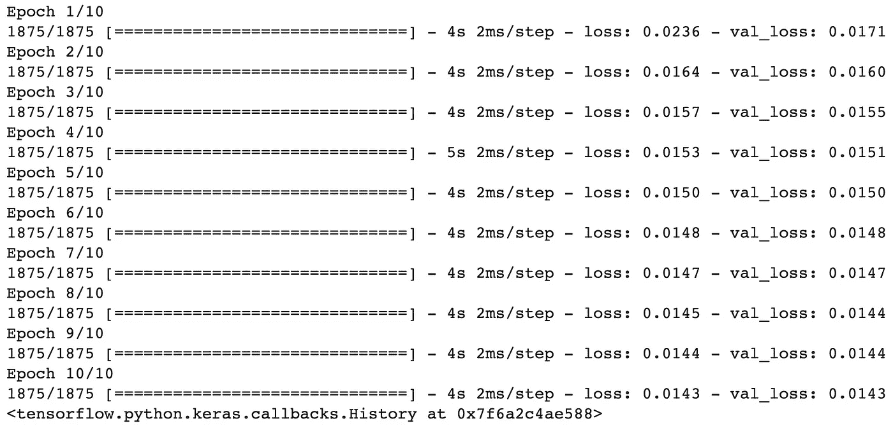

# 使用深度卷积自动编码器在 10 分钟内降低图像噪声

> 原文：<https://towardsdatascience.com/image-noise-reduction-in-10-minutes-with-convolutional-autoencoders-d16219d2956a?source=collection_archive---------7----------------------->

## 深度学习案例研究

## 借助时尚 MNIST |使用 TensorFlow 的无监督深度学习，使用自动编码器清理(或去噪)有噪声的图像

如果你正在阅读这篇文章，我确信我们有着相似的兴趣，并且现在/将来会从事相似的行业。那么我们就通过 [*Linkedin*](https://linkedin.com/in/orhangaziyalcin/) *来连线吧！请不要犹豫发送联系请求！*[*Orhan g . yaln—Linkedin*](https://linkedin.com/in/orhangaziyalcin/)

图一。一只贪玩的狗的图像降噪前后(由 [Anna Dudkova](https://unsplash.com/@annadudkova) 在 [Unsplash](https://unsplash.com/?utm_source=medium&utm_medium=referral) 上拍摄)

*如果你在这个页面上，你也可能对不同的神经网络架构有些熟悉。你可能听说过前馈神经网络，CNN，RNNs，这些神经网络非常适合解决监督学习任务，如回归和分类。*

*但是，在无监督学习领域，我们有大量的问题，例如降维、特征提取、异常检测、数据生成、增强以及降噪。对于这些任务，我们需要专门为无监督学习任务开发的特殊神经网络的帮助。因此，他们必须能够在不需要监督的情况下解数学方程。这些特殊的神经网络架构之一是自动编码器*。

获取最新的机器学习教程

# 自动编码器

## 什么是自动编码器？

自动编码器是由两个子网络组成的神经网络架构，即编码器和解码器网络，它们通过潜在空间相互联系。自动编码器最初是由人工智能界最受尊敬的科学家之一 Geoffrey Hinton 和 PDP 小组在 20 世纪 80 年代开发的。Hinton 和 PDP 小组旨在通过将输入作为教师来解决“无教师反向传播”问题，也称为无监督学习。换句话说，他们只是将特征数据用作特征数据和标签数据。让我们仔细看看自动编码器是如何工作的！

图二。具有编码器和解码器网络的自动编码器网络

## 自动编码器架构

自动编码器由一个编码器网络组成，它获取特征数据并对其进行编码以适应潜在空间。该编码数据(即代码)被解码器用来转换回特征数据。在编码器中，模型学习的是如何有效地编码数据，以便解码器可以将其转换回原始数据。因此，自动编码器训练的基本部分是生成优化的潜在空间。

现在，我们知道，在大多数情况下，潜在空间中的神经元数量比输入和输出层要少得多，但也不一定是这样。有不同类型的自动编码器，如欠完整、过完整、稀疏、去噪、收缩和变化自动编码器。在本教程中，我们只关注用于去噪的欠完整自动编码器。

## 自动编码器中的图层

构建自动编码器时的标准做法是设计一个编码器，并创建该网络的反向版本作为该自动编码器的解码器。因此，只要编码器和解码器网络之间存在反向关系，您就可以自由地向这些子网添加任何层。例如，如果您正在处理图像数据，您肯定会需要卷积和池层。另一方面，如果您正在处理序列数据，您可能需要 LSTM、GRU 或 RNN 单位。这里重要的一点是，你可以自由地建造任何你想要的东西。

图 3。欠完整自动编码器中的潜在空间通常比其他层窄

现在，您已经有了可以为图像降噪构建自动编码器的想法，我们可以继续学习教程，并开始为我们的图像降噪模型编写代码。对于本教程，我们选择做我们自己对 TensorFlow 的官方教程之一，[自动编码器简介](https://www.tensorflow.org/tutorials/generative/autoencoder)，我们将使用人工智能社区成员中非常受欢迎的数据集: ***时尚 MNIST*** 。

# 下载时尚 MNIST 数据集

时尚 MNIST 由位于德国柏林的欧洲电子商务公司 Zalando 设计和维护。时尚 MNIST 由 60，000 幅图像的训练集和 10，000 幅图像的测试集组成。每个示例都是 28×28 灰度图像，与来自 10 个类别的标签相关联。“时尚 MNIST”包含服装商品的图像(如图 4 所示)，它被设计为包含手写数字的 MNIST 数据集的替代数据集。我们选择时尚 MNIST 仅仅是因为 MNIST 已经在许多教程中被过度使用。

下面几行导入 TensorFlow 和 load Fashion MNIST:

现在，让我们用数据集的样本生成一个网格，代码如下:

我们的输出显示了测试数据集中的前 50 个样本:

图 4。显示时尚 MNIST 测试数据集中前 50 个样本的 5x10 网格

# 处理时尚 MNIST 数据

为了计算效率和模型可靠性，我们必须对我们的图像数据应用最小最大归一化，将值范围限制在 0 和 1 之间。由于我们的数据是 RGB 格式的，最小值是 0，最大值是 255，我们可以用下面几行进行最小最大规范化操作:

我们还必须调整 NumPy 数组的形状，因为数据集的当前形状是(60000，28，28)和(10000，28，28)。我们只需要添加一个具有单一值的第四维(例如，从(60000，28，28)到(60000，28，28，1))。第四维几乎可以证明我们的数据是灰度格式的，用一个值表示从白色到黑色的颜色信息。如果我们有彩色图像，那么我们就需要第四维中的三个值。但是我们所需要的是包含单一值的第四维，因为我们使用灰度图像。以下代码行可以做到这一点:

让我们用下面几行来看看 NumPy 数组的形状:

***输出:*** *(60000，28，28，1)和(10000，28，28，1)*

# 向图像添加噪声

请记住，我们的目标是建立一个能够对图像进行降噪的模型。为了做到这一点，我们将使用现有的图像数据，并将它们添加到随机噪声中。然后，我们将原始图像作为输入，含噪图像作为输出。我们的自动编码器将学习干净的图像和有噪声的图像之间的关系，以及如何清洁有噪声的图像。因此，让我们创建一个噪声版本的时尚 MNIST 数据集。

对于此任务，我们使用 tf.random.normal 方法向每个数组项添加一个随机生成的值。然后，我们将这个随机值乘以一个 noise_factor，你可以随意使用它。以下代码向图像添加了噪声:

我们还需要确保数组项的值在 0 到 1 的范围内。为此，我们可以使用 *tf.clip_by_value* 方法。 *clip_by_value* 是一种张量流方法，它剪切最小-最大范围之外的值，并用指定的最小或最大值替换它们。以下代码将值截取到范围之外:

现在我们已经创建了数据集的正则化和噪声版本，我们可以检查它的外观:

图 5。显示清晰和嘈杂图像样本的 2x5 网格

正如你所看到的，几乎不可能理解我们在嘈杂的图像中看到的东西。然而，我们的自动编码器会神奇地学会清理它。

# 构建我们的模型

在 TensorFlow 中，除了顺序 API 和函数 API 之外，还有第三种构建模型的选择:模型子类化。在模型子类化中，我们可以自由地从头开始实现任何东西。模型子类化是完全可定制的，使我们能够实现我们自己的定制模型。这是一个非常强大的方法，因为我们可以建立任何类型的模型。但是，它需要基本的面向对象编程知识。我们的自定义类将继承 tf.keras.Model 对象。它还需要声明几个变量和函数。不过，这没什么可怕的。

另请注意，由于我们处理的是图像数据，因此构建卷积自动编码器会更有效，如下所示:

图 6。卷积自动编码器示例

要构建模型，我们只需完成以下任务:

*   创建一个扩展 keras 的类。模型对象
*   创建一个 **__init__** 函数来声明用顺序 API 构建的两个独立的模型。在它们内部，我们需要声明可以相互反转的层。一个 Conv2D 层用于编码器模型，而一个 conv 2d 转置层用于解码器模型。
*   创建一个调用函数，告诉模型如何通过 **__init__** 方法使用初始化的变量处理输入:
*   我们需要调用初始化的编码器模型，该模型将图像作为输入
*   我们还需要调用初始化的解码器模型，该模型将编码器模型(已编码)的输出作为输入
*   返回解码器的输出

我们可以用下面的代码实现所有这些:

让我们用一个对象调用来创建模型:

# 配置我们的模型

对于这项任务，我们将使用 Adam 优化器和模型的均方误差。我们可以很容易地使用**编译**功能来配置我们的自动编码器，如下所示:

最后，我们可以通过输入有噪声和干净的图像来运行我们的模型 10 个时期，这将需要大约 1 分钟来训练。我们还使用测试数据集进行验证。以下代码用于训练模型:

图 7。深度卷积自动编码器训练性能

# 使用我们训练有素的自动编码器降低图像噪音

既然我们已经训练了我们的自动编码器，我们可以开始清理噪声图像。注意，我们可以访问编码器和解码器网络，因为我们是在 NoiseReducer 对象下定义它们的。

因此，首先，我们将使用一个编码器来编码我们的噪声测试数据集(x _ test _ noisy)。然后，我们将把编码器的编码输出送入解码器，以获得干净的图像。以下代码行完成这些任务:

让我们绘制前 10 个样本，进行并列比较:

第一行是有噪声的图像，第二行是干净的(重建的)图像，最后，第三行是原始图像。查看清理后的图像与原始图像有何相似之处:

图 5。一个 3x10 的网格，显示干净和有噪声的图像样本以及它们的重建副本

# 恭喜

你已经建立了一个 autoencoder 模型，它可以成功地清理非常嘈杂的图像，这是它以前从未见过的(*我们使用了测试数据集*)。显然有一些未恢复的失真，例如右边第二个图像中缺失的拖鞋底部。然而，如果你考虑噪声图像的变形程度，我们可以说我们的模型在恢复失真图像方面相当成功。

在我的脑海中，你可以-例如-考虑扩展这个自动编码器，并将其嵌入到照片增强应用程序中，这可以增加照片的清晰度和清晰度。

# 订阅邮件列表获取完整代码

如果你想访问 Google Colab 的全部代码，并访问我的最新内容，请订阅邮件列表:

> [现在就订阅](http://eepurl.com/hd6Xfv)

# 喜欢这篇文章

如果你喜欢这篇文章，可以考虑看看我的其他类似文章:

 [## 使用 MNIST 数据集在 10 分钟内完成图像分类

towardsdatascience.com](/image-classification-in-10-minutes-with-mnist-dataset-54c35b77a38d)  [## 利用生成性对抗网络在 10 分钟内生成图像

### 使用无监督深度学习生成手写数字与深度卷积甘斯使用张量流和…

towardsdatascience.com](/image-generation-in-10-minutes-with-generative-adversarial-networks-c2afc56bfa3b)  [## 伯特和拥抱脸 10 分钟情感分析

### 学习预训练的自然语言处理模型的基础，伯特，并建立一个使用 IMDB 电影评论的情感分类器…

towardsdatascience.com](/sentiment-analysis-in-10-minutes-with-bert-and-hugging-face-294e8a04b671)  [## TensorFlow 和 VGG19 可以帮助您将照片转换成美丽的波普艺术作品

### 神经风格转移基于安迪沃霍尔的门罗双联画与预训练的计算机视觉网络 VGG19，转移…

towardsdatascience.com](/tensorflow-and-vgg19-can-help-you-convert-your-photos-into-beautiful-pop-art-pieces-c1abe87e7e01)