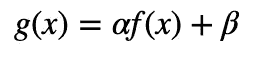

# 计算机视觉的图像处理和数据增强技术

> 原文：<https://towardsdatascience.com/image-processing-techniques-for-computer-vision-11f92f511e21?source=collection_archive---------14----------------------->

[来源](https://www.topbots.com/most-important-ai-computer-vision-research/)

图像处理是计算机视觉的一个组成部分。我们几乎总是想要调整图像的大小，增加数据，查看网格中的图像，等等。 [OpenCV](https://docs.opencv.org/master/d9/df8/tutorial_root.html) (开源计算机视觉)、 [scikit-image](https://scikit-image.org/) 、 [Pillow](https://pillow.readthedocs.io/en/stable/index.html) 是 Python 中比较流行的一些图像处理库。在本文中，我介绍了一些最常用的图像处理技术。

这是我在这篇文章中使用的 Jupyter 笔记本:[https://jovian.ml/aakanksha-ns/image-processing](https://jovian.ml/aakanksha-ns/image-processing)

# 1)读取图像

图像表示为由像素值组成的数组。8 位图像的像素值范围从 0(黑色)到 255(白色)。根据色阶的不同，图像中有不同的[通道](https://en.wikipedia.org/wiki/Channel_(digital_image))，每个通道代表一种特定颜色的像素值。RGB(红、绿、蓝)是最常用的色标，我在示例中使用的所有图像都是 RGB 图像。

我们可以使用 OpenCV 中的`imread`函数轻松读取图像数组。这里需要记住的一点是，OpenCV 默认按照 BGR 顺序读取图像。

# 2)裁剪

裁剪是一种广泛使用的增强技术。然而，注意不要裁剪图像的重要部分(非常明显，但是当你有太多不同大小的图像时容易被忽略)。因为图像是用数组表示的，所以裁剪相当于从数组中取出一个切片:

**中心裁剪:**

**随机裁剪:**

# 3)调整大小

大多数深度学习模型架构期望所有输入图像都具有相同的维度。

# 4)翻转图像

这是另一种非常流行的图像增强技术。这里唯一要记住的是，翻转应该对您的用例有意义。例如，如果您正在对建筑类型进行分类，您不会在测试集中遇到任何倒置的建筑，因此在这种情况下进行垂直翻转是没有意义的。

**垂直翻转:**

**水平翻转:**

# 5)旋转图像:

在大多数情况下，可以将图像旋转一个小角度。在某些情况下，这种天真的做法可能会改变图像的整个方向，就像这样:

因此，更好的旋转方式是使用 OpenCV 进行仿射变换。仿射变换保留了共线性和距离比(例如:即使在变换后，线段的中点仍然是中点)。您也可以使用`BORDER_REFLECT`标志来填充边框。

# 6)更改亮度和对比度:

这包括对每个像素应用以下函数:

这里α(> 0)称为增益，β称为偏置，这些参数据说分别控制对比度和亮度。因为我们使用数组表示图像，所以可以通过遍历数组将该函数应用于每个像素:

然而，对于较大的图像(如下图所示)，这可能需要一段时间，因此您需要使用优化的库函数:

增加对比度

增加亮度

# 7)显示包围盒:

目标检测是一个非常流行的计算机视觉问题，涉及到寻找包围感兴趣的目标的包围盒。在图片上显示包围盒可以帮助我们直观地检查问题和需求。在处理这些问题时要记住的一件事是，如果你打算翻转图像，确保你也相应地翻转了框坐标。这里有一个简单的方法来显示图像及其边界框。

# 8)在网格中显示多个图像:

我们通常希望一次检查多幅图像。使用 matplotlib 中的子情节可以很容易地做到这一点。

# 9)将图像转换为黑白图像:

虽然没有在计算机视觉中广泛使用，但知道如何将彩色图像转换为灰度图像还是很不错的。

# 10)模糊:

这项技术有助于使您的模型对图像质量问题更加稳健。如果一个模型可以在模糊的图像上表现良好，这可能表明该模型总体上表现良好。

当然，还有很多针对特定问题的图像处理技术。例如，对于自动驾驶汽车，您可能想要标记道路上的其他汽车，并从各种角度查看它。但是，对于大多数问题，上述函数应该是有用的！