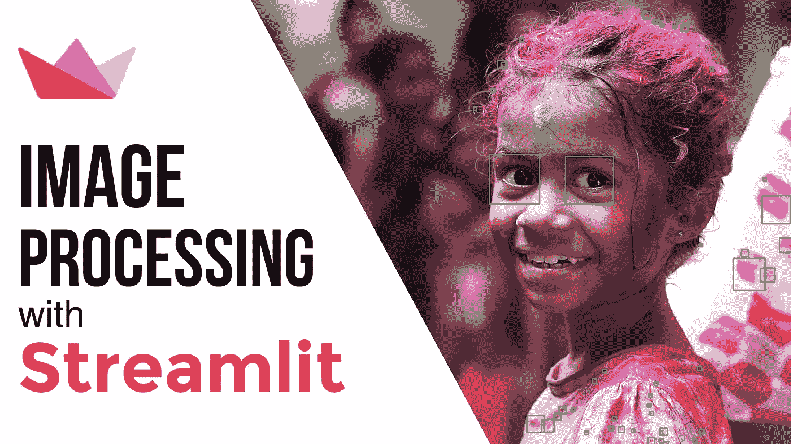
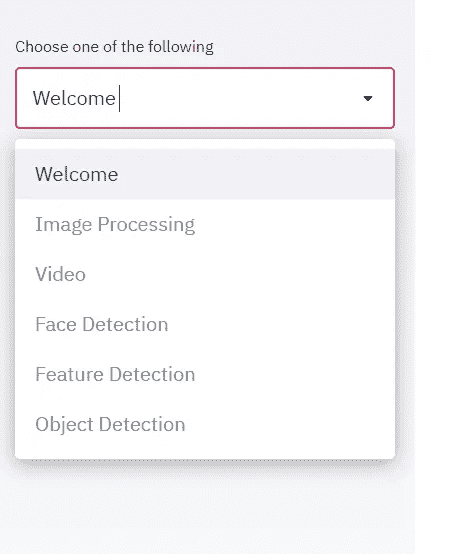
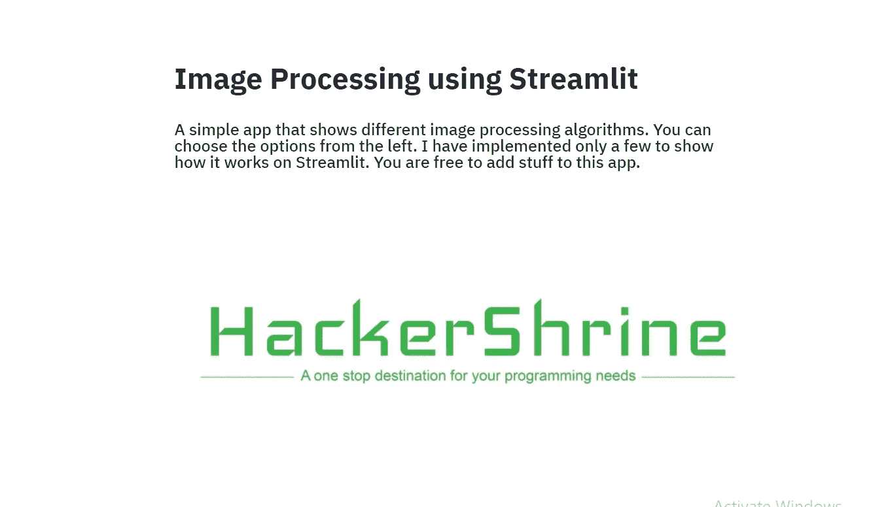
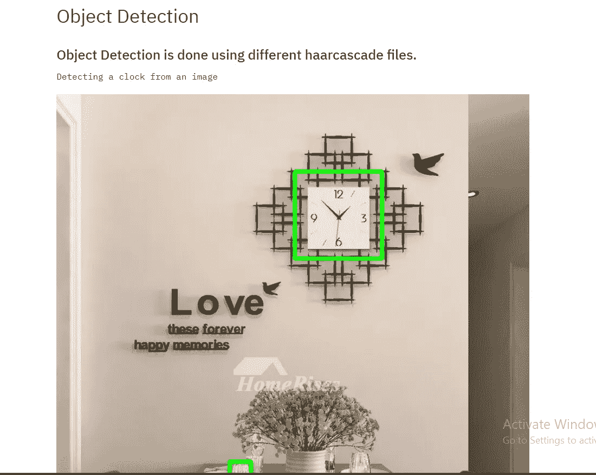
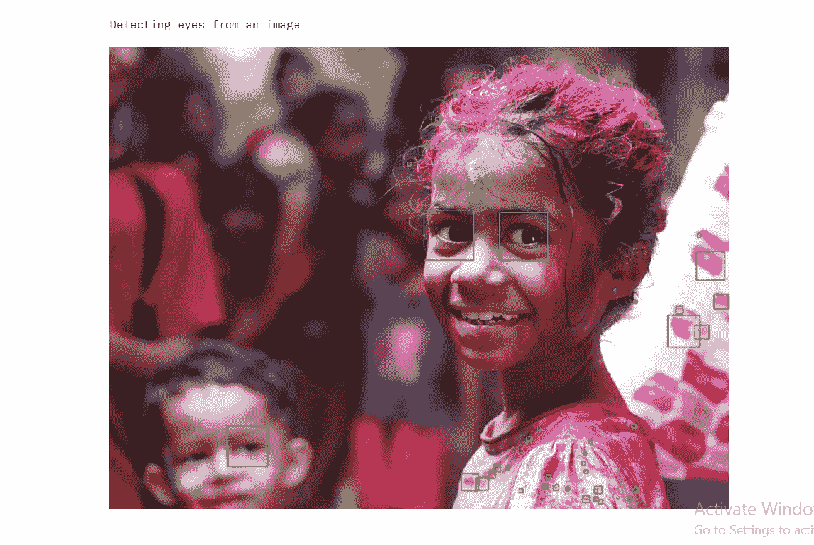

# 使用 Streamlit 进行图像处理

> 原文：<https://towardsdatascience.com/image-processing-using-streamlit-d650fb0ccf8?source=collection_archive---------16----------------------->

## 使用 OpenCV 了解 Streamlit



作者图片

在本文中，我们将了解如何将 Streamlit 与图像处理技术和对象检测算法结合使用。我假设您已经在系统上安装并运行了 Streamlit。如果你不知道如何从 streamlit 开始，那么你可以参考我的[以前的文章](/data-visualization-using-streamlit-151f4c85c79a),在那里我简单地解释了一下。

我还在 streamlit 共享上部署了这个 Streamlit 应用程序。在进一步阅读这篇文章之前，你可以先看一下。

以下是链接:[使用 Streamlit 的图像处理](https://share.streamlit.io/aniketwattamwar/image-processing-with-streamlit/main/main.py)

现在让我们深入研究代码。

首先导入必要的库

```
import streamlit as st
from PIL import Image
import cv2 
import numpy as np
```

我已经创建了 main 函数，这是代码的起点。在这个函数中，你会看到一个我创建的侧边栏。Streamlit 为您提供了边栏选择框功能，可以轻松创建一个。在侧边栏中，我添加了一些值，每个值都与一个函数相关联。当用户点击它们中的任何一个时，相应的功能被触发。默认情况下，选择第一个值，即 welcome 字符串，if 语句调用 Welcome()函数。

```
def main():selected_box = st.sidebar.selectbox(
    'Choose one of the following',
    ('Welcome','Image Processing', 'Video', 'Face Detection', 'Feature Detection', 'Object Detection')
    )

    if selected_box == 'Welcome':
        welcome() 
    if selected_box == 'Image Processing':
        photo()
    if selected_box == 'Video':
        video()
    if selected_box == 'Face Detection':
        face_detection()
    if selected_box == 'Feature Detection':
        feature_detection()
    if selected_box == 'Object Detection':
        object_detection()if __name__ == "__main__":
    main()
```



作者图片

下图显示了欢迎页面。让我们看看欢迎函数。



作者图片

```
def welcome():

    st.title('Image Processing using Streamlit')

    st.subheader('A simple app that shows different image processing algorithms. You can choose the options'
             + ' from the left. I have implemented only a few to show how it works on Streamlit. ' + 
             'You are free to add stuff to this app.')

    st.image('hackershrine.jpg',use_column_width=True)
```

用 st.title 你可以创建一个粗体标题，用 st.subheader 你可以有一个较低字体大小的粗体。使用 st.image，您可以在 streamlit 应用程序上显示任何图像。请确保将列宽设置为 true，以使其合适。

接下来，我们在侧边栏中有图像处理部分。在这里，我们将看到阈值，边缘检测和轮廓。为了方便用户，我使用了一个滑块来改变阈值。要制作一个交互式滑块，只需在 streamlit 中编写 st.slider。在 OpenCV 的帮助下，我们正在进行 RGB 到灰度的转换，然后使用 OpenCV 中的阈值函数。我们在阈值函数中传递滑块的值。所以当我们移动滑块时，值会改变并存储在 thresh1 中。然后我们使用 st.image 来显示 thresh1 图像。确保将 clamp 设置为 True。

接下来，我们有一个显示该图像的条形图。您可以使用 streamlit 中的条形图功能来完成此操作。传递的值是用 cv2.calchist 函数计算的。您可以使用不同的直方图和图来分析您的图像。

然后，我们有精明的边缘检测技术。我做了一个按钮，当用户点击它时，它运行算法并显示输出。您可以简单地通过编写 st.button 和 if 语句来创建一个按钮。如果你写了边缘检测代码。

对于轮廓，我再次使用滑块来改变图像，使轮廓发生变化。在 OpenCV 中，您可以在传递图像的地方找到轮廓和绘制轮廓。

```
def photo():st.header("Thresholding, Edge Detection and Contours")

    if st.button('See Original Image of Tom'):

        original = Image.open('tom.jpg')
        st.image(original, use_column_width=True)

    image = cv2.imread('tom.jpg')
    image = cv2.cvtColor(image, cv2.COLOR_BGR2GRAY)

    x = st.slider('Change Threshold value',min_value = 50,max_value = 255)ret,thresh1 = cv2.threshold(image,x,255,cv2.THRESH_BINARY)
    thresh1 = thresh1.astype(np.float64)
    st.image(thresh1, use_column_width=True,clamp = True)

    st.text("Bar Chart of the image")
    histr = cv2.calcHist([image],[0],None,[256],[0,256])
    st.bar_chart(histr)

    st.text("Press the button below to view Canny Edge Detection Technique")
    if st.button('Canny Edge Detector'):
        image = load_image("jerry.jpg")
        edges = cv2.Canny(image,50,300)
        cv2.imwrite('edges.jpg',edges)
        st.image(edges,use_column_width=True,clamp=True)

    y = st.slider('Change Value to increase or decrease contours',min_value = 50,max_value = 255)     

    if st.button('Contours'):
        im = load_image("jerry1.jpg")

        imgray = cv2.cvtColor(im,cv2.COLOR_BGR2GRAY)
        ret,thresh = cv2.threshold(imgray,y,255,0)
        image, contours, hierarchy = cv2.findContours(thresh,cv2.RETR_TREE,cv2.CHAIN_APPROX_SIMPLE)

        img = cv2.drawContours(im, contours, -1, (0,255,0), 3)

        st.image(thresh, use_column_width=True, clamp = True)
        st.image(img, use_column_width=True, clamp = True)
```

我们接下来要看的是人脸检测。对于人脸检测，我使用的是哈尔级联文件。使用 cascadeClassifier，我们将加载 XML 文件。我们有 detectMultiScale 函数，我们传递图像来寻找图像中的人脸。如果我们找到图像，然后在脸部周围画一个矩形。如果您希望保存图像，那么您可以使用写入功能。然后，我们使用 Streamlit 使用 st.image 显示图像。

```
def face_detection():

    st.header("Face Detection using haarcascade")

    if st.button('See Original Image'):

        original = Image.open('friends.jpeg')
        st.image(original, use_column_width=True)

    image2 = cv2.imread("friends.jpeg")face_cascade = cv2.CascadeClassifier("haarcascade_frontalface_default.xml")
    faces = face_cascade.detectMultiScale(image2)
    print(f"{len(faces)} faces detected in the image.")
    for x, y, width, height in faces:
        cv2.rectangle(image2, (x, y), (x + width, y + height), color=(255, 0, 0), thickness=2)

    cv2.imwrite("faces.jpg", image2)

    st.image(image2, use_column_width=True,clamp = True)
```

我想展示的最后一部分是对象检测。我已经使用挂钟和眼哈尔级联文件做对象检测。与人脸检测类似，我们将加载 XML 文件并使用检测多尺度函数。如果找到了相应的对象，我们将在该对象周围绘制一个矩形。下图显示了输出。

```
def object_detection():

    st.header('Object Detection')
    st.subheader("Object Detection is done using different haarcascade files.")
    img = load_image("clock.jpg")
    img_gray = cv2.cvtColor(img, cv2.COLOR_BGR2GRAY) 
    img_rgb = cv2.cvtColor(img, cv2.COLOR_BGR2RGB) 

    clock = cv2.CascadeClassifier('haarcascade_wallclock.xml')  
    found = clock.detectMultiScale(img_gray,  
                                   minSize =(20, 20)) 
    amount_found = len(found)
    st.text("Detecting a clock from an image")
    if amount_found != 0:  
        for (x, y, width, height) in found:

            cv2.rectangle(img_rgb, (x, y),  
                          (x + height, y + width),  
                          (0, 255, 0), 5) 
    st.image(img_rgb, use_column_width=True,clamp = True)

    st.text("Detecting eyes from an image")

    image = load_image("eyes.jpg")
    img_gray_ = cv2.cvtColor(image, cv2.COLOR_BGR2GRAY) 
    img_rgb_ = cv2.cvtColor(image, cv2.COLOR_BGR2RGB) 

    eye = cv2.CascadeClassifier('haarcascade_eye.xml')  
    found = eye.detectMultiScale(img_gray_,  
                                       minSize =(20, 20)) 
    amount_found_ = len(found)

    if amount_found_ != 0:  
        for (x, y, width, height) in found:

            cv2.rectangle(img_rgb_, (x, y),  
                              (x + height, y + width),  
                              (0, 255, 0), 5) 
        st.image(img_rgb_, use_column_width=True,clamp = True)
```



检测挂钟|作者图片



检测眼睛|作者图片

你可以在我的 [Github](https://github.com/aniketwattamwar/Image-Processing-with-Streamlit) 上找到代码。我还为此制作了一个视频。

关于图像处理和机器学习的进一步阅读，可以参考这篇资料丰富的文章。

[https://Neptune . ai/blog/what-image-processing-techniques-is-actual-used-in-the-ml-industry](https://neptune.ai/blog/what-image-processing-techniques-are-actually-used-in-the-ml-industry)

和平！