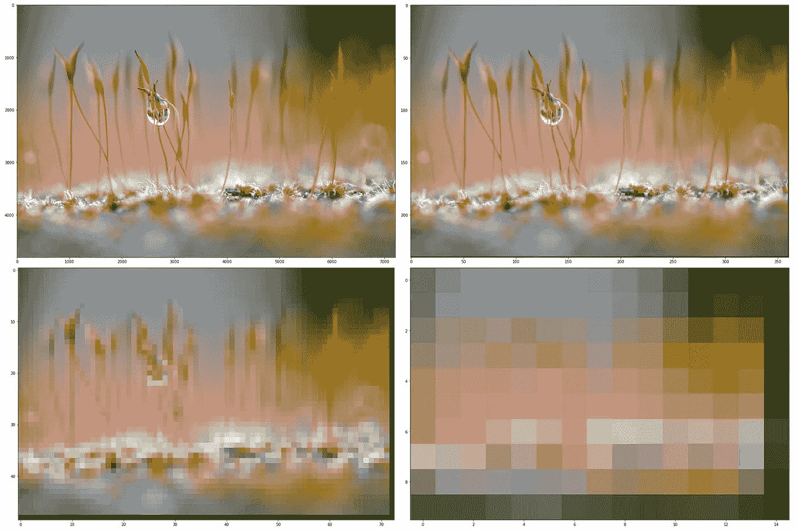

# 用 Python 进行图像处理

> 原文：<https://towardsdatascience.com/image-processing-with-python-5b35320a4f3c?source=collection_archive---------13----------------------->

## 字节、采样和过滤器——编码图像处理介绍


照片由 [Giulio Magnifico](https://unsplash.com/@giuliomagnifico?utm_source=medium&utm_medium=referral) 在 [Unsplash](https://unsplash.com?utm_source=medium&utm_medium=referral) 上拍摄

图像处理通常是一项不太频繁的任务。当然，这将在很大程度上取决于我们的角色——但即使在数据科学或机器学习等繁重的分析角色中，图像处理也很常见。

在机器学习中，我们可能需要拍摄一些图像，并根据它们的内容对它们进行分类——我们可能需要对图像进行下采样——将它们从原始的 2，4，8K 分辨率图像转换为更易于管理的大小。

还有许多其他学科需要少量的图像处理，比如 web 开发，或者更多，比如图像处理工程师。

我们将触及图像数据在计算机中如何组织的基础知识，然后探索几种不同的图像处理方法:

```
**Images as Arrays** - intro to images in code and their representation in bits and bytes **Resize and Scaling** - resizing our images, save on compute with downsampling
**Filters** - how to build an overly complicated Photoshop with significantly less features
```

我们将在整篇文章中使用 Numpy 为了快速简便地处理图像，我建议使用另一个名为 PIL 的库。

PIL 代码也将包括在内，但我们不会关注它——因为它将一切都抽象到我们无法关注实际过程的程度。

# 图像作为数组

在整篇文章中，我们将使用文章封面图像。

在原始格式中，此图像由 7207 x 4801 像素组成。

我们将把这个图像表示为一个数组。在这个阵列中，我们将有三个“通道”(层)——代表红色、绿色和蓝色。

所有这些给了我们图像数组中包含的总共`7207*4801*3 = **103,802,421**`个数值。

现在，让我们编写一些代码来将我们的图像转换成一个 Numpy 数组:

```
from PIL import Image
import numpy as npimg = Image.open(PATH)
img.load()
**img_array** = np.asarray(img, dtype='int32')
```


我们的数组形状匹配我们预期的宽度和高度，加上三个颜色通道 RGB。请注意，尽管我们将图像维度称为宽度*高度，但在数组维度中，我们交换了顺序—给出高度*宽度。

我们还可以看看组成数组的值:


我们数组中的所有值从最小值的**零变化到最大值**的 **255。使用这个范围是因为我们的每种颜色都是一个 8 位字节。每个位可以是 0 或 1。**

这给了我们总共`2^8 = **256**`种可能的组合，范围从 0 到 255。

哪里—

```
0 = 00000000
1 = 00000001
2 = 00000010
3 = 00000011
...
254 = 01111111
255 = 11111111
```

正如我们所见，`0`显示所有字节关闭，而`255`显示所有字节打开——这是有意义的，因为 0 对应于图像中相应颜色的最小值，255 对应于最大值。让我们试着打开和关闭我们的颜色。

```
red1 = np.copy(img_array)
**red1[:,:,*0*] = 255** # this is **on** (top row below)plt.imshow(red0)blue0 = np.copy(img_array)
**blue0[:,:,*2*] = 0** # this is **off** (bottom row below)
plt.imshow(blue0)
```


当设置为 **255** 【红色 1、绿色 1、蓝色 1】时，顶行显示我们的 RGB 颜色。当设置为 **0** [red0，green0，blue0]时，最下面一行是我们的 RGB 颜色。

# 调整大小和缩放

在机器学习应用中这样做有两个主要原因:

1.  **下采样**节省计算成本——用 8K 分辨率的图像训练图像分类器将需要令人印象深刻的设置——360 p 更真实一些。
2.  增加数据集的大小—(我们必须在分类中坚持相同的图像大小，但这并不意味着我们不能使用不同分辨率的图像)

这两个原因需要相同的方法，我们采用原始阵列，以最大限度地保留信息的方式将像素组压缩为单个像素。

这里，我们将通过取多个像素的平均值来创建一个新像素，从而对图像进行缩减采样。


这里，我们通过用一个像素替换九个像素来减少值的总数，这是前九个像素的平均值。

我们使用`sklearn.measure.block_reduce`来执行这个操作，使用`np.mean`来指定使用平均值的归约操作。

为了看出明显的区别，我们将图像缩减采样 20 倍。

```
downsample = 20# first, change to 0-1
ds_array = img_array/255r = skimage.measure.block_reduce(ds_array[:, :, 0],
                                 (downsample, downsample),
                                 np.mean)
g = skimage.measure.block_reduce(ds_array[:, :, 1],
                                 (downsample, downsample),
                                 np.mean)
b = skimage.measure.block_reduce(ds_array[:, :, 2],
                                 (downsample, downsample),
                                 np.mean)ds_array = np.stack((r, g, b), axis=-1)
```

我们可以使用`imshow`比较原始图像和缩减像素采样后的图像，这样我们可以得到:



原始图像(左上)和缩减像素采样图像，使用因子 20(右上)、100(左下)和 500(右下)。

再一次，从 ML/数据科学的角度来说,(对于任何一台普通的计算机来说)在超过 100 万个数组的大集合上训练一个分类器是不可能的。

但是经过 20 倍的缩减采样后，我们的数组总共只有`241 * 361 * 3 = **261,003**`个值——这是一个易于管理的大小。

# 过滤

这是有趣的部分——我们将编写一些代码来修改我们的图片——比如 Instagram 滤镜。

## 小插图

晕影本质上是像素向图像外边缘变暗，看起来像这样:


约翰·埃尔南德斯在 [Unsplash](https://unsplash.com?utm_source=medium&utm_medium=referral) 上拍摄的照片

不久前，这是急躁的青少年试图掩盖他们平庸的摄影技巧的最佳效果。

这是一个有趣的效果。我们所需要的是一个函数，我们可以应用到我们的数组，将减少向外边缘的值。

为了达到这个效果，我们从一个高斯函数开始——我们将为每个整数的行和列输入一个值。

这段代码生成两个如下所示的高斯分布:


两个高斯函数，较暗的线代表行值，其中较大的 x 值意味着较少的晕影。对于较亮的线条，较大的 y 值会导致列方向应用较少的晕影。

然后，我们将这些分布标准化，并将其应用到我们的图像中。将应用于白色正方形的两个分布可视化，可以得到以下结果:


纯高斯晕影效果(左)和应用平方根函数的相同函数(右)——我们将使用平方根晕影滤镜。

这种效果可以很容易地应用于阵列:

将这些代码应用到我们的不整洁的图片上，我们就能得到前卫的青少年/潮人 Instagram 效果:


## 色彩平衡

我们可以做的另一件很酷的事情是单独修改图像中的颜色层。

通过单独访问每个颜色层并增加/减少层值，可以轻松实现简单的平衡。

当我们这样做的时候，我们会不经意地创建超出 0-255 范围的数字。为了处理这些问题，我们使用一个简单的`clamp`函数将数组压缩回正确的范围，如上所示。

摆弄`col_bal`中的`r, g, b`值可以产生一些有趣的效果:


## 聪明

我们使用完全相同的方法来修改图像亮度。我们需要做的就是用完全相同的值修改我们的 RGB 值:


调整图像亮度，原稿，+50，+100(从左至右)。

# 把所有的放在一起

最后，我们可以把所有这些放在一起。一些带有晕影效果的色彩平衡可以非常容易地建立一些很酷的效果。


向所有摄影师/设计人员道歉——请在评论中随意抨击我的图像编辑技巧。

# 最后几点

在本文中，我们一直避免使用 PIL 库。PIL 是 Python 中图像处理的*专家*——所以不提到它，这篇文章就不完整。

PIL 是一个优秀的库，专门用于 Python 中的图像处理。有了它，我们可以将需要几行 Numpy 代码的工作压缩到一个函数中。

然而，PIL 把一切都抽象到了不可能理解其机制的程度——因此我们大量使用 Numpy。

我们已经介绍了以位/字节为单位的图像背后的基础知识，如何对图像进行缩减采样，以及如何编辑带有晕影和色彩平衡的图像。

如果你有兴趣学习更高级的概念，我强烈推荐 Datacamp 上的[这门课程(第一部分是免费的)。](https://learn.datacamp.com/courses/image-processing-in-python?tap_a=5644-dce66f&tap_s=1014685-c39058&utm_medium=affiliate&utm_source=jamesbriggs3)

我希望你从文章中学到了一些东西，如果你有任何问题或建议，请在 [Twitter](https://twitter.com/jamescalam) 或在下面的评论中联系！

感谢阅读！

# 进一步阅读

[ML 行业实际使用的图像处理技术有哪些](https://neptune.ai/blog/what-image-processing-techniques-are-actually-used-in-the-ml-industry) (2020)，Neptune.ai