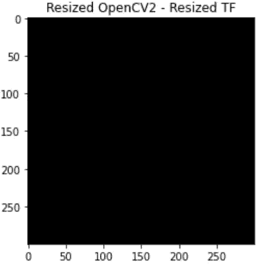

# OpenCV，Tensorflow，Pillow 之间的切换？等等！！！

> 原文：<https://towardsdatascience.com/image-read-and-resize-with-opencv-tensorflow-and-pil-3e0f29b992be?source=collection_archive---------8----------------------->

## 深入探讨 OpenCV、Tensorflow 和 Pillow 在 JPEG 图像读取和大小调整方面的差异，以及如何使它们保持一致。

现代计算机视觉(CV)目前是一个热门的研究领域，主要涉及图像处理。为此，需要使用一个框架来打开这些图像，对它们进行一些处理。

在框架快速发展的今天，每个框架都有自己处理图像的方式，每个框架都有自己的规范。因此，在一个框架中开发的 CV 解决方案在另一个框架中可能不会像预期的那样工作。博客“Tensorflow 的 tf.image.resize 如何偷走了我生命中的 60 天”([https://hacker noon . com/How-tensor flow-TF-image-resize-skeet-60-days-of-my-life-ABA 5 EB 093 f 35](https://hackernoon.com/how-tensorflows-tf-image-resize-stole-60-days-of-my-life-aba5eb093f35))就是这类情况的绝佳例子。找出问题所在可能需要几天的时间，而且可能会大大延迟项目。

本博客将详细讨论一个这样的用例，其中 OpenCV 和 Tensorflow 展示了读取 JPEG 图像和调整其大小的差异。它还将展示一种让它们持续工作的方法。此外，感谢 [Tejas Pandey](https://medium.com/u/59b036ba6f25?source=post_page-----3e0f29b992be--------------------------------) 帮助实现 OpenCV 和 Tensorflow 之间的一致性。

## 请注意，我是英特尔的员工，博客中的所有信息和观点都是我个人的，并不代表我的雇主。

我们先用两个框架 Tensorflow 1.x 和 OpenCV 打开一个简单的狗的 JPEG 图像。

让我们开始吧。我们将用 python 导入一些基本的库。

```
%tensorflow_version 1.x
import cv2
import matplotlib.pyplot as plt
import numpy as np
from skimage import io
import tensorflow as tf
```

让我们使用 OpenCV 打开一个图像。

```
image_path = 'dog2.JPG'def plt_display(image, title):
  fig = plt.figure()
  a = fig.add_subplot(1, 1, 1)
  imgplot = plt.imshow(image)
  a.set_title(title)image = cv2.imread(image_path)
plt_display(image, 'cv2-BGR')
```


上图有些奇怪。它看起来不像原来的。嗯，是的，确实如此。在深入研究这个之前，首先让我们了解图像中的颜色是如何表现的。通常，图像有三个颜色通道红色、绿色和蓝色(RGB ),这产生了像素中的颜色。这些通道的顺序会改变像素的颜色，因为像素总是将第一个通道解释为红色，第二个通道解释为绿色，第三个通道解释为蓝色。

现在我们已经了解了颜色通道在图像中是如何工作的，让我们看看为什么我们在上面看到了不同的颜色图像。当我们使用 OpenCV 打开图像时，默认情况下 OpenCV 会以蓝色、绿色和红色通道(BGR)打开图像。这很好，但当我们显示图像时，像素误解了通道(即像素混淆，将蓝色解释为红色，反之亦然)。这就是为什么我们在图像中得到上述错误的颜色。

那么如何解决这个问题呢？打开图像后，我们将图像从 BGR 转换为 RGB。我们通过使用 OpenCV 标志 COLOR_BGR2RGB 来实现这一点。下面的代码展示了如何用 OpenCV 正确地打开一个图像。

```
image_cv = cv2.cvtColor(image, cv2.COLOR_BGR2RGB)
print(image_cv.dtype)
print(np.max(image_cv))
plt_display(image_cv, 'cv2-RGB')
```


让我们现在用 Tensorflow 打开一个图像，看看是否得到相同的结果。在 Tensorflow 中打开 JPEG 图像需要两步。第一步是打开图像，第二步是执行 JPEG 解码，因为 JPEG 是压缩图像。

```
print("Tensorflow version: ", tf.__version__)
image_tf = tf.io.read_file(image_path)image_tf = tf.image.decode_jpeg(image_tf, channels=3)with tf.Session() as sess:
    image_tf = image_tf.eval()print(image_tf.dtype)
plt_display(image_tf, 'TF')
```


目测，从 OpenCV 和 Tensorflow 读取的图像看起来是一样的。但是他们是吗？要看有什么区别，让我们把两者相减。如果两者相同，我们应该看到一个完全黑色的图像。如果不是，那么我们会看到一些不同颜色的像素。

```
image_diff = np.abs(image_cv- image_tf)
plt_display(image_diff, 'OpenCV-TF')
```


哇哦。这是一个巨大的差异。哪里出了问题？这种差异是由于 OpenCV 默认使用 JPEG 图像的整数精确解压缩。相比之下，TensorFlow 默认使用离散余弦变换。这种类型的解码是不准确的，所以为了使它和 OpenCV 一样，我们需要使用整数精确解压缩来解码它。这可以通过设置参数 dct_method='INTEGER_ACCURATE '来实现，如下所示。

```
image_tf = tf.io.read_file(image_path)image_tf = tf.image.decode_jpeg(image_tf, channels=3, dct_method='INTEGER_ACCURATE')with tf.Session() as sess:
    image_tf = image_tf.eval()plt_display(image_tf,'TF_INT_ACC')
```


现在减去 OpenCV 图像，我们得到一个黑色的图像。这意味着我们的 TF 和 OpenCV 现在在读取图像时是一致的。这是一个重要的步骤，因为你阅读图像的方式的一个小的改变将会在随后的图像处理中产生显著的差异。

```
image_diff = np.abs(image_cv- image_tf)
plt_display(image_diff, 'OpenCV-TF')
```


现在，既然我们已经用 OpenCV 和 TensorFlow 一致地读取了图像，让我们用这些框架来尝试调整图像的大小。我们将首先从 OpenCV resize 开始。

```
# resizing the image with OpenCV
print("image shape before resize:", image_cv.shape)
image_cv_resized = cv2.resize(image_cv,(300,300))
print("image shape after resize:", image_cv_resized.shape)
print("image dtype: ", image_cv_resized.dtype)
```


我们已经完成了 OpenCV 的大小调整。现在让我们调整张量流的大小。张量流与张量一起工作。它的调整大小方法需要一个 4D 张量并返回一个 4D 张量输出。因此，我们必须首先将图像从三个扩展到四个。然后调整图像大小，将尺寸压缩回 3。由于我们的图像仍然是一个张量，我们将创建并运行一个 Tensorflow 会话，以 NumPy 格式获取调整后的图像。一旦我们有了 NumPy 映像，我们就将其转换为 uint8 类型，因为默认情况下，session 会将 NumPy 转换为 float32 类型。这使得类型与 OpenCV 不一致。如下图所示-

```
# resizing the image with tensorflow 1.x
print("image shape before resize:", image_tf.shape)
print("image dtype: ", image_tf.dtype)#This function takes in a 4D input. Hence we will have to expand the image and then squeeze back to three dimensions before we can use it as an image.
image_tf_4D= tf.expand_dims(image_tf,0)# doing bilinear resize
image_tf_resized_4D = tf.image.resize_bilinear(
    image_tf_4D,
    (300,300)
)#squeezing back the image to 3D
image_tf_resized = tf.squeeze(image_tf_resized_4D)#Above is still a tensor. So we need to convert it to numpy. We do this by using tf session.
with tf.Session() as sess:
  image_tf_resized = image_tf_resized.eval()print("image shape after resize:", image_tf_resized.shape)
print("image dtype: ", image_tf_resized.dtype)#Since it is in float32 format, we need to convert it back to uint8.
image_tf_resized = image_tf_resized.astype(np.uint8)
print("image dtype after conversion uint8: ", image_tf_resized.dtype)
```


现在让我们来看看 OpenCV 和 TF 的调整大小的图像之间的区别。

```
image_resized_diff = np.abs(image_cv_resized- image_tf_resized)
plt_display(image_resized_diff, 'Resized OpenCV2 - Resized TF')
```


我们再次看到两个框架在调整大小方法上的巨大差异。即使我们在两个框架中一致地打开图像，resize 方法给出了不同的结果。默认情况下，OpenCV resize 方法使用双线性变换。我们对 Tensorflow 使用了相同的双线性方法。尽管如此，我们最终得到了不同的结果。

发生这种情况是因为 OpenCV 在调整大小时向图像添加了半像素校正。而 Tensorflow 默认不会。这增加了调整大小方法输出的差异。

为了解决这个问题，TensorFlow 双线性调整大小中有一个参数可以进行半像素校正。如下图所示-

```
image_tf_4D= tf.expand_dims(image_tf,0)# doing bilinear resize with half pixel correction
image_tf_resized_hpc_4D = tf.image.resize_bilinear(
    image_tf_4D,
    (300,300),
    half_pixel_centers=True
)image_tf_resized_hpc = tf.squeeze(image_tf_resized_hpc_4D)with tf.Session() as sess:
  image_tf_resized_hpc = image_tf_resized_hpc.eval()image_tf_resized_hpc = image_tf_resized_hpc.astype(np.uint8)
image_resized_diff = np.abs(image_cv_resized- image_tf_resized_hpc)
plt_display(image_resized_diff, 'Resized OpenCV2 - Resized TF')
```



现在我们有了预期的结果。最后，我们让 Tensorflow 和 OpenCV 在读取和调整图像大小方面保持一致。

一个计算机视觉领域的新人尝试这些功能将更有可能犯这些错误，并会有一个糟糕的开始。网上的教程不详细讨论这个。我创建这个博客是为了向人们展示，从一个框架到另一个框架，像我讨论的这样的小细节需要检查并保持一致。否则，它们将在不同的框架中产生不同的结果，并对它们的工作产生不利影响。

另一个广泛使用的框架是 Pillow (PIL)。让我们看看 PIL 和 OpenCV 的区别。我们将首先使用 PIL 读取图像。

```
from PIL import Imageorig_image_pil = Image.open(image_path)
image_pil = np.asarray(orig_image_pil)
print(image_pil.dtype)
plt_display(image_pil, 'PIL')
```


现在我们来看看 PIL 打开的 JPEG 图像和 OpenCV 有什么不同。

```
image_cv_pil_diff = np.abs(image_cv - image_pil)
plt_display(image_cv_pil_diff, 'CV-PIL-DIFF')
```


正如我们从 TF 和 OpenCV 中获得的经验所预期的那样，这两个框架再次以不同的方式打开图像。默认情况下，PIL 不提供任何使用整数精确解压缩的方法。然而，人们可以自己编写解码器来解码图像。但是在这个博客中，我只是展示了不同之处，如果可能的话，如果图书馆提供支持的话，让它们保持一致。

由于这些框架对图像的读取方式不同，所以当我们调整大小时，这种差异将会扩大。如下图所示-

```
image_pil_resized = orig_image_pil.resize((300,300),       resample=Image.BILINEAR)
image_pil_resized = np.asarray(image_pil_resized)#making sure we have the same dtype as OpenCV image.
print(image_pil_resized.dtype)
```


```
image_cv_pil_resize_diff = np.abs(image_cv_resized - image_pil_resized)
plt_display(image_cv_pil_resize_diff, 'Resized CV- Resized PIL')
```


因此，我们得到了调整大小的预期差异。PIL 库不提供任何对半像素校正的支持，因此默认情况下不支持半像素校正。因为我们知道 TF 和 OpenCV 是一致的，所以当考虑到 PIL 和 TF 之间的差异时，我们可以期待相同的结果。

因此，当使用 PIL 框架时，必须记住，如果工作依赖于上述图像的预处理，则不能直接切换到另一个框架。这将导致意想不到的结果。

我希望这篇博客对你有用，能够让你意识到框架依赖处理。