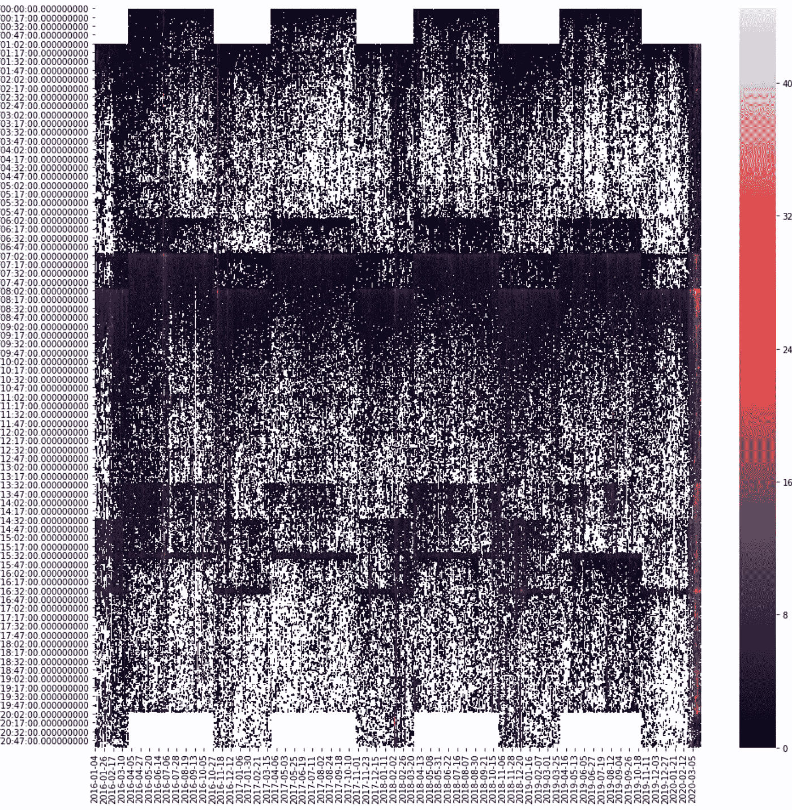

# 图像识别与其他技术在预测金融市场中的比较

> 原文：<https://towardsdatascience.com/image-recognition-vs-other-techniques-in-predicting-the-financial-market-55548d4cda4?source=collection_archive---------34----------------------->

## 使用 CNN 进行上电时间序列分析，以及它与其他技术的比较

这项工作是与@Vesko Karadjov 合作完成的，他总能迸发出绝妙的想法。

金融市场主要处理时间序列，围绕时间序列预测有大量的技术和工具。我们要做的是使用 CNN 进行基于回归的预测，并与一些传统方法进行比较，看看它的表现如何。

在金融领域，金融产品价格或回报预测一直是任何定量分析的共同目标。这是几十年来反复研究的。我们这里关注的是市场的波动性，具体来说，就是股市开盘前后的波动性。

## 问题

我们怀疑的是，盘前时段的波动性(vol)可能是开市后可能立即发生的事情的一个很好的指标。如果我们能准确地预测体积，我们也许能利用它。例如，我们从 OANDA 获取了 FTSE 100 CFD 的价格数据。

## 准备数据

我们要求从 2016 年 1 月到 2020 年 3 月按分钟提取汇总价格数据，其格式如下。

整个时期的时间序列都是这样的。

我们感兴趣的数据是价格的波动性，本质上是价格的标准差。由于我们使用的是有高低点数据的烛台数据，我用分钟棒线内的最高价减去最低价来估算波动率，并应用大小为 *n* 的滚动平均窗口。

原则上，当价格波动较大时，成交量应该较高，作为一项明智的检查，我们随机选取了一个交易日，对照当天的价格查看其成交量，以确认这一点。

为了比较所有交易日的成交量，我绘制了基于时间的成交量图。vol 是根据 5 分钟的时间窗口计算的。每个点代表过去 5 分钟的 vol，它是在 1070 天内每分钟计算的。

我们可以看到，峰值似乎以一小时为一段复制，例如 0000 和 0100、0700 和 0800 处的峰值。让我们绘制热图来检查这些值。

我们可以看到夏令时的影响，所以我们需要通过将夏令时改为 GMT 来使这种影响正常化，如下所示。

有些时期 vol 最大。热图中的实线表示在某些时候持续的高波动性，所有这些都是合理的。

*   0100:开始差价合约交易
*   0700:欧盟盘前开盘
*   0800:英国市场开盘
*   中午 12 点
*   14:30:美国市场开盘
*   1630:英国市场收盘

我们还可以看到 2020 年 3 月全天的高波动性。

如果我们想利用波动性，越高越好，因此利息最高的时间是开市时间，即 0800。如果我们可以使用开市前一小时的成交量来预测开市后 5 分钟的成交量，而开市后 5 分钟的成交量通常是一天中最高的，我们就可以围绕这个成交量进行交易。

上图显示了 2016 年至 2020 年间所有交易日的综合成交量。我们可以看到，在 0800 点开盘后，成交量往往会上升，几分钟后就会冷却下来。

我们假设开市前后的成交量之间存在相关性。因此，如果我们在开市前一小时画出成交量的平均值，在开市后 5 分钟画出成交量的平均值，我们应该有一个总体上升的趋势，事实也确实如此。

x 轴是开市前 1 小时的平均成交量，y 轴是开市后 5 分钟的平均成交量。这两者之间有相关性，但有很多差异，因此它不是一个可靠的预测。例如，基于此图表，如果我们在开市前的平均成交量为 7.5，则有理由假设我们在开市后的成交量将在 5 到 25 之间，这不是很有帮助。

# 有趣的是

我们基本上已经对开市前后的成交量做了线性回归分析。然而，公平地说，更复杂的技术，并证明这些技术确实是可预测的。我们将 1070 个样本分成三组:训练组、验证组和测试组。

*   列车:0–699(2018–10–09 结束)
*   验证:700–899(2019 年 7 月 25 日结束)
*   测试:900–1070(结束于 2020 年 3 月 25 日)

## 经典方法 1 —线性回归

由于现在有一个分割，线性回归的统计数据将与使用完整数据集生成的统计数据略有不同。

根据上面的图表，我们可以看到强相关性仍然存在，但决定系数很低，我们不能用这种技术解释开市后成交量的变化。

要提高预测，方法之一就是增加特征的数量，这就引出了**多元回归**。在这种情况下，我们可以利用开市前一小时的每一分钟来预测开市后的成交量。这应该会给我们一个比开市前波动率简单均值更好的结果。

所有的统计数据都有轻微的改善，但是，它仍然不是很有用。这里所有的线性回归都使用 statsmodel 库中的 OLS。

## 经典方法 2 —梯度推进法

执行预测(尤其是分类)时，梯度增强是标准方法，它将为您提供一个非常好的进一步改进的基准。尽管在预测连续表面时，基于梯度推进的回归结果可能不稳定。它通常以最小的努力给出合理的性能。

这里我们选择了 LightGBM 作为库。用于输入模型的特征基本上与多变量回归相同。

对于 5 个不同的交叉验证评估，该模型在我们数据样本的不同部分不是非常稳定，这表明在我们数据的不同部分中存在某种异常样本的不平衡。虽然当我们更深入地研究预测过程时，这可能是一个问题，但是对于本文的范围来说，只要我们有相同的训练集、验证集和测试集，我们就不需要担心那么多，因为这本质上是第一轮预测方法选择过程。

如前所述，我们需要在不同的技术中保持样本的一致性，因此我们只训练前 700 个样本，并预测 900 个以上的样本。

这是我们设计训练集和测试集的结果。

训练结果是令人鼓舞的，r 平方得分为 0.94，但测试集中的预测失败了。尽管它在测试集中做得不太好，但它仍然优于我们使用纯线性回归数据所做的预测。

## 经典方法 3 — MLP(神经网络)

当我们在预测中有如此高的方差时，神经网络可能能够描述输入特征之间的复杂关系，并发现它们之间的任何隐藏关系。

我们正在使用 [FastAI](https://www.fast.ai/) 作为深度学习库来构建底层网络，目前来看，FastAI 是建立在 PyTorch 之上的。您可以描述定制的 PyTorch 模型，并将其传递给 FastAI，以获得 FastAI 提供的培训小工具。

我们使用与 LightGBM 相同的一组输入和输出，并将数据输入到一个有两个隐藏层的 MLP 网络中，每个隐藏层有 300 个神经元。

经过几次迭代训练后，我们可以得到一个与此类似的预测结果。

我们可以看到，由于市场最近的波动性，测试集中的波动性最高，因此我们的验证数据集对我们的测试数据来说不是很有代表性。然而，与以前的技术相比，它在统计方面仍然做得很好。

# 基于图像识别的回归

在我们继续进行基于图像的回归之前，我们的目标参数需要稍微改变一下，因为在转换过程中我们会丢失数值。因为在转换过程中，在转换成图像之前，这些值在每个时间窗口内被归一化。

为了补偿它，我们使用开市前和开市后的平均成交量之比作为我们的目标。这样我们就向神经网络提出了一个稍微不同的问题。相对于开市前的成交量，开市后的市场波动有多大？例如，如果开市前的平均成交量为 10，开市后的成交量为 50，我们要预测的目标将是 5，而不是原始的 50。

为了防止拿苹果和橙子做比较，我训练了一个 MLP 网络，它以前有相同的结构，使用相同的数据。

注意:vol 的上限是 30，因为在除法计算后会出现巨大的峰值，如下所示。

原始卷后/卷前

封顶@30 卷 _ 后/卷 _ 前

与原始值预测相比，MLP 间接预测的结果稍微差一些，但差别不大。现在我们有了一个 CNN 网络的基线来比较。

## 图像转换

在 Gramian Angular Field 和 pyts 库的帮助下，我们现在可以根据点之间的极坐标关系将任何时间序列转换为图像。[ [原文](https://arxiv.org/pdf/1506.00327.pdf)

在这段代码中，它每天创建一个图像，每个图像描述开市前 60 分钟的 vol。我们还将目标体积比导出为 CSV 格式，以便在 FastAI 中导入标签。

对于 CNN 网络，它实际上是使用 ResNET34 作为底层，并在顶层安装一个[1024，512]密集层，并使用简单的线性激活节点执行最终回归。

经过几次迭代训练，我们得到了这样的结果。

我们可以看到，即使预测相同的目标，基于图像的回归比 MLP 的回归执行得好得多。

下面是所有不同技术的统计数据汇总，以供比较。

我们可以看到，在预测绝对音量值时，MLP 优于所有其他方法，而在预测相对音量比时，CNN 在各个方面都优于相同的网络。

因此，当进行时间序列预测时，CNN 技术是一个突出的候选选择，尽管它在图像转换和训练方面确实需要更多的计算能力。

如果有人感兴趣，我们可以将原始的波动性结果提供给 CNN 的最后几层，但这不是本文的范围。如果你有任何其他想法或想法，请告诉我，希望你喜欢。