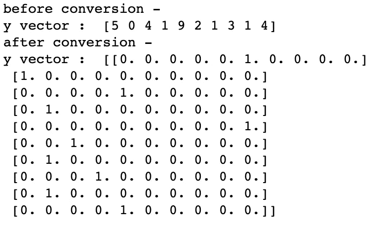
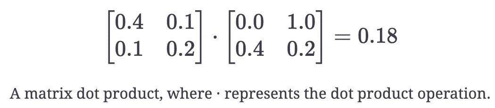
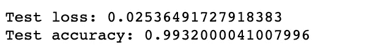
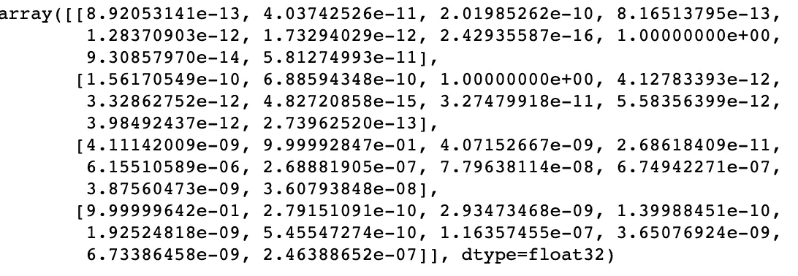
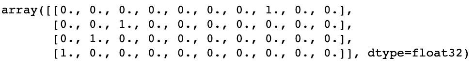

# 基于 Python、卷积神经网络的机器学习图像识别

> 原文：<https://towardsdatascience.com/image-recognition-with-machine-learning-on-python-convolutional-neural-network-363073020588?source=collection_archive---------15----------------------->


来源:[爱尔兰时间](https://www.irishtimes.com/opinion/the-write-idea-an-irishman-s-diary-about-pens-1.3158020) s，[波尔缪里](https://www.irishtimes.com/profile/p%C3%B3l-%C3%B3-muir%C3%AD-7.1837486)

## 在预处理数据之后，是时候构建我们的模型来执行图像识别任务了。其中一种方法是使用卷积神经网络。

这篇文章是我写的关于图像处理的文章的后续。在使数据可用于图像识别任务之后，是时候创建将执行该任务的算法了。在许多用于多层感知器模型识别图像的技术中，**卷积神经网络(CNN)** 是一种非常有效的技术。在这篇文章中，我们将看到如何建立一个 CNN，以及如何将它应用于一个图像数据集。

当我们第一次开始构建图像识别模型时，在相对简单的数据集上训练和评估它通常是一个好主意。

我们可以执行的最简单的任务之一是手写数字识别。给定一个手写数字的图像(例如，0，1，…，9)，我们希望我们的模型能够正确地分类它的数值。虽然这个任务看起来相对简单，但它实际上在现实生活中经常使用，比如从一张照片中自动提取信用卡号码。我们将用于数字识别的数据集是 [MNIST 数据集](https://en.wikipedia.org/wiki/MNIST_database)，这是用于**基于机器学习的数字识别**的数据集。

**MNIST** (修改后的国家标准与技术研究所)数据库包含**60000 个训练实例**和**10000 个测试实例**。该数据库包含灰度手写数字，这些数字被调整大小以适合 20x20 像素的框，然后在 28x28 的图像中居中(用空白填充)。MNIST 数据库可以通过 Python 访问。

在本文中，我将向您展示如何使用 TensorFlow 的高级 API**keras**对您的卷积神经网络进行编码。我在本文中使用的是 **tensorflow 2.0** 。

# 预处理

## 1-初始化

由于每个灰度图像的尺寸为 28×28，因此每个图像有 784 个像素。因此，每个输入图像对应于 0.0 和 1.0 之间的 784 个归一化浮点值的张量。图像的标签是一个有 10 个类别的单热张量(每个类别代表一个数字)。就我们的代码而言，我们有 **img_rows = 28** 、 **img_cols = 28** 和 **num_classes = 10** 。因此，输入的形状为 **(number_examples，img_rows，img_cols)** ，因此为 60000x28x28。
另一个需要设置的重要元素是[随机种子](https://www.statisticshowto.com/random-seed-definition/)，因为我们希望在计算机生成随机数序列时保留起始点。

我们还导入了 MNIST 数据集。

```
**import tensorflow as tf** # tensorflow 2.0 **from** **keras.datasets** **import** mnist
import numpy as npseed=0
np.random.seed(seed) # fix random seed
tf.random.set_seed(seed)*# input image dimensions*
num_classes = 10 *# 10 digits*

img_rows, img_cols = 28, 28 *# number of pixels* 

*# the data, shuffled and split between train and test sets*
(X_train, Y_train), (X_test, Y_test) = mnist.load_data()
```

## 2-重塑和重新缩放

如前所述，输入具有形状 **(number_examples，img_rows，img_cols)** 。然而，为了将数据用于我们的卷积神经网络，我们需要将它转换成 **NHWC** 格式。

**NHWC** 格式有一个四维的形状:

1.  图像数据样本的数量(批量)
2.  每个图像的高度
3.  每个图像的宽度
4.  每个图像的通道数

来自数据集的每个图像的高度和宽度是 img_rows 和 img_cols，而通道的数量是 1(因为图像是灰度的)。

此外，每个像素包含一个由 0 到 255 之间的整数量化的灰度值。因此，数据库被**规范化**为 0.0 到 1.0 之间的浮点值。在这种情况下， **0.0** 对应灰度像素值 255 ( **纯白**)，而 **1.0** 对应灰度像素值 0 ( **纯黑**)。

```
X_train = X_train.reshape(X_train.shape[0], img_rows, img_cols, 1) 
X_test = X_test.reshape(X_test.shape[0], img_rows, img_cols, 1)input_shape = (img_rows, img_cols, 1)# cast floats to single precision
X_train = X_train.astype('float32')
X_test = X_test.astype('float32')*# rescale data in interval [0,1]*
X_train /= 255
X_test /= 255
```

## 3-投射标签向量 Y

我们需要将我们的类转换成向量。我们通过点击以下线路来实现这一点:

```
Y_train = keras.utils.to_categorical(Y_train, num_classes)
Y_test = keras.utils.to_categorical(Y_test, num_classes)
```



要对这一步有更好的解释，你应该看看这篇文章。

既然我们已经处理了数据，我们可以开始构建模型了。

# 卷积神经网络模型

## 盘旋

正如我在关于[图像处理](/image-recognition-with-machine-learning-on-python-image-processing-3abe6b158e9a)的文章结尾提到的，**滤镜**在图像识别中发挥着巨大的作用。我们使用过滤器来转换输入，**提取特征**，使我们的模型能够识别某些图像。一个非常高级的例子是曲线检测过滤器，它允许我们的模型区分有曲线的数字和没有曲线的数字。

**1-过滤器**

像所有的神经网络权重一样，**滤波器的权重是可训练变量**。我们训练我们的神经网络(通过核矩阵权重)来产生能够提取最有用的隐藏特征的过滤器。

当输入数据具有**多个通道**时，**滤波器将为每个通道**提供一个单独的内核矩阵。MNIST 数据集只有一个通道，但对于其他类型的图像数据(如 RGB)，我们将训练模型以获得每个通道的核矩阵的最佳权重。

**2-卷积**

我们现在已经到达卷积神经网络的焦点:卷积。卷积表示我们如何将滤波器权重应用于输入数据。卷积使用的主要运算是矩阵点积，即两个矩阵的元素乘积之和。



卷积中矩阵点积的数量取决于输入数据和内核矩阵的维数，以及 [*步长*](/visualizing-the-fundamentals-of-convolutional-neural-networks-6021e5b07f69) 。步长是核矩阵沿输入数据移动时的垂直/水平偏移。

**3-填充**

有时，当我们像前面看到的那样做点积运算时，我们不使用行或列。为了避免这种现象，我们可以使用**填充**。

因此，如果我们想在卷积中使用所有的输入数据，我们可以*用 0 填充*输入数据矩阵。这意味着我们将完全由 0 组成的行/列添加到输入数据矩阵的边缘。因为 0 乘以任何数字都会得到 0，所以填充不会影响矩阵点积。这很重要，因为我们不想在卷积中增加任何失真。

**4-卷积层**

CNN 中的卷积层将多个过滤器应用于输入张量。虽然每个滤波器对每个输入通道都有一个单独的核矩阵，但滤波器卷积的总体结果是所有输入通道的**卷积的总和。**

向卷积图层添加更多过滤器可使图层更好地提取隐藏要素。然而，这是以**额外的训练时间**和**计算复杂度**为代价的，因为滤波器给模型增加了额外的权重。输出数据的通道数等于卷积层使用的过滤器数。

## 联营

虽然卷积图层提取了重要的隐藏要素，但要素的数量仍然很大。我们可以使用*池*来**减少数据在高度和宽度维度**上的大小。这允许模型执行更少的计算，并最终训练得更快。它还通过仅提取最显著的特征并忽略仅在少数例子中发现的潜在失真或不常见特征来防止过度拟合。

> 共用是如何工作的？

类似于卷积，我们在池中使用过滤器矩阵。然而，池过滤器没有任何权重，也不执行矩阵点积。相反，它对输入数据的子部分应用归约运算。

CNN 中通常使用的池类型被称为 ***最大池*** 。max pooling 的过滤器使用 *max* 运算来获得输入数据的每个子矩阵中的最大数。

## 多层

**1-添加额外的层**

像所有神经网络一样，CNN 可以受益于附加层。附加层允许 CNN 将多个滤波器堆叠在一起，用于图像数据。然而，与构建任何神经网络类似，我们需要小心添加多少额外的层。**如果我们向一个模型添加太多的层，我们就有可能使模型过度适应训练数据，从而导致泛化能力非常差**。此外，每增加一层都会增加计算的复杂性，并增加模型的训练时间。

**2-增加过滤器**

**在我们的模型中，卷积层越深，我们通常会增加其过滤器的数量**。在这种情况下，我们的第二卷积层有 64 个过滤器，相比之下，第一卷积层有 32 个过滤器。卷积层越深，提取的特征就越详细。例如，第一卷积层可以具有提取诸如线、边和曲线等特征的过滤器。当我们到达第二层时，卷积层的过滤器现在可以提取更多有区别的特征，例如 77°的锐角或 88°的相交曲线。

## 全连接层

**1-全连接层**

我们将大小为 1024(即层中神经元的数量)的全连接层应用于第二池层的输出数据。单位的数量多少有些随意。足够强大，但不至于过于耗费资源。全连接层的目的是在我们将数据特征转换成类之前**聚集数据特征。这使得模型能够做出比我们直接将池输出转换成类更好的预测。**

**2-展平**

我们在模型中使用的数据是 NHWC 格式的。然而，为了使用全连接层，**我们需要数据是一个矩阵**，其中行数代表批量大小，列数代表数据特征。这一次，我们需要在相反的方向重塑，将 T2 从 NHWC 转换成二维矩阵。

## 拒绝传统社会的人

**1-合作改编**

协同适应指的是一层中的多个神经元从输入数据中提取相同或非常相似的隐藏特征。当两个不同神经元的连接权重几乎相同时，会发生这种情况。

当全连接层有大量神经元时，更有可能发生共同适应。这可能是一个问题，原因有两个。首先，当我们有冗余的神经元计算相同的输出时，这是一种计算的浪费。第二，如果许多神经元正在**提取相同的特征**，它为我们的模型增加了这些特征的重要性。如果重复提取的特征仅特定于训练集，这将导致过度拟合。

**2-辍学**

我们最小化具有许多神经元的全连接层的共同适应的方法是在训练期间应用*丢弃*。在 dropout 中，**我们通过将神经元值清零，在每个训练步骤中随机关闭一层神经元的一部分。**

## **软最大层**

由于 MNIST 图像可能有 10 个可能的数字，我们使用一个 **10 神经元全连接层**来获得每个数字类别的类别。Softmax 函数应用于类，将它们转换为每个类的概率。

## 构建模型

现在我们已经准备好构建我们的模型了。代码如下:

```
**from keras.models import Sequential
from keras.layers import Dense, Conv2D, Flatten 
from keras.layers import MaxPooling2D, Dropout**model = Sequential()#add model layers
model.add(Conv2D(32, kernel_size=(5, 5),
                     activation='relu',
                     input_shape=input_shape))
model.add(MaxPooling2D(pool_size=(2, 2)))# add second convolutional layer with 20 filters
model.add(Conv2D(64, (5, 5), activation='relu'))

# add 2D pooling layer
model.add(MaxPooling2D(pool_size=(2, 2)))

# flatten data
model.add(Flatten())

# add a dense all-to-all relu layer
model.add(Dense(1024, activation='relu'))

# apply dropout with rate 0.5
model.add(Dropout(0.5))

# soft-max layer
model.add(Dense(num_classes, activation='softmax'))
```

我们将使用的型号是**序列**。顺序是在 Keras 中建立模型的最简单的方法。它允许你一层一层地建立模型。

我们使用 **add()** 方法将层附加到我们的模型上。出于介绍性示例的目的，为了简单起见，只关注密集层就足够了。每个 Dense()层都接受一个整数作为其第一个必需参数，该整数指定了神经元的数量。使用激活可选参数定义层的**激活函数**的类型，其输入为字符串格式的激活函数名称。例子包括 **relu，tanh，elu，sigmoid，softmax。**

在这个神经网络中，我们有两个卷积层，每次都有一个汇集层。然后，我们将数据展平，添加一个密集层，我们以 **0.5** 的速率对其应用 dropout。最后，我们添加一个密集层来为每个图像分配正确的类别。

# 编译模型

接下来，我们需要编译我们的模型。编译模型需要三个参数:优化器、损失和指标。

优化器控制学习速率。我们将使用' **adam** '作为我们的优化器。在许多情况下，Adam 通常是一个很好的优化器。**亚当**优化器在整个训练过程中调整学习率。

学习率决定了计算模型最佳权重的速度。较小的学习率可能会导致更准确的权重(直到某一点)，但减少的是计算时间。

我们将使用**‘分类交叉熵’**作为我们的损失函数。这是最常见的分类选择。分数越低，表示模型的性能越好。

为了使事情更容易解释，当我们训练模型时，我们将使用**‘准确性’**度量来查看验证集的准确性分数。

```
#compile model *using accuracy to measure model performance*
model.compile(optimizer='adam', loss='categorical_crossentropy', metrics=['accuracy'])
```

# 训练模型

现在我们将训练我们的模型。为了进行训练，我们将在我们的模型上使用带有以下参数的**‘fit()’**函数:训练数据(X_train)、目标数据(Y_train)、验证数据和时期数。

对于我们的验证数据，我们将使用我们的数据集中提供给我们的测试集，我们已经将它分为 X_test 和 Y_test。

**历元数**是模型在数据中循环的次数。在一定程度上，我们运行的时代越多，模型就会改进得越多。此后，模型将在每个时期停止改进。对于我们的模型，我们将把历元的数量设置为 3。

```
#train the model
model.fit(X_train, Y_train, validation_data=(X_test, Y_test), epochs=3)
```

# 评估模型

现在我们已经训练了我们的模型，我们可以评估它的性能:

```
*# evaluate the model*
score = model.evaluate(X_test, Y_test, verbose=1)

*# print performance*
print()
print('Test loss:', score[0])
print('Test accuracy:', score[1])
```



因此，我们在测试集上有 99.3%的准确度和 0.025 的损失，这是非常好的。我们还可以通过增加历元数和引入批量大小来改进模型。

# 做预测

如果您想要查看我们的模型对测试数据做出的实际预测，我们可以使用 predict_classes 函数。我们也可以通过使用 predict 函数给出一个包含 10 个数字的数组。这些数字是输入图像代表每个数字(0-9)的概率。编号最高的数组索引表示模型预测。每个数组的总和等于 1(因为每个数字都是一个概率)。

为了显示这一点，我们将显示测试集中前 4 幅图像的预测。

注意:如果我们有新数据，我们可以将新数据输入到 predict 函数中，以查看我们的模型对新数据做出的预测。由于我们没有任何新的未知数据，我们现在将使用测试集显示预测。

```
#predict first 4 images in the test set
model.predict_classes(X_test[:4])
```


```
#predict first 4 images in the test set
model.predict(X_test[:4])
```



我们可以看到，我们的模型预测了前四幅图像的 7、2、1 和 0。

我们来对比一下这个和实际结果。

```
#actual results for first 4 images in test set
y_test[:4]
```



实际结果显示，前四个图像也是 7、2、1 和 0。我们的模型预测正确！

# **整体模型**

```
import tensorflow as tf # tensorflow 2.0
from keras.datasets import mnist
import numpy as np
seed=0
np.random.seed(seed) # fix random seed
tf.random.set_seed(seed)
# input image dimensions
num_classes = 10 # 10 digitsimg_rows, img_cols = 28, 28 # number of pixels# the data, shuffled and split between train and test sets
(X_train, Y_train), (X_test, Y_test) = mnist.load_data()X_train = X_train.reshape(X_train.shape[0], img_rows, img_cols, 1) 
X_test = X_test.reshape(X_test.shape[0], img_rows, img_cols, 1)
input_shape = (img_rows, img_cols, 1)# cast floats to single precision
X_train = X_train.astype('float32')
X_test = X_test.astype('float32')# rescale data in interval [0,1]
X_train /= 255
X_test /= 255Y_train = keras.utils.to_categorical(Y_train, num_classes)
Y_test = keras.utils.to_categorical(Y_test, num_classes)from keras.models import Sequential
from keras.layers import Dense, Conv2D, Flatten 
from keras.layers import MaxPooling2D, Dropout
model = Sequential()#add model layers
model.add(Conv2D(32, kernel_size=(5, 5),
                     activation='relu',
                     input_shape=input_shape))
model.add(MaxPooling2D(pool_size=(2, 2)))
# add second convolutional layer with 20 filters
model.add(Conv2D(64, (5, 5), activation='relu'))

# add 2D pooling layer
model.add(MaxPooling2D(pool_size=(2, 2)))

# flatten data
model.add(Flatten())

# add a dense all-to-all relu layer
model.add(Dense(1024, activation='relu'))

# apply dropout with rate 0.5
model.add(Dropout(0.5))

# soft-max layer
model.add(Dense(num_classes, activation='softmax'))#compile model using accuracy to measure model performance
model.compile(optimizer='adam', loss='categorical_crossentropy', metrics=['accuracy'])#train the model
model.fit(X_train, Y_train, validation_data=(X_test, Y_test), epochs=3)# evaluate the model
score = model.evaluate(X_test, Y_test, verbose=1)# print performance
print()
print('Test loss:', score[0])
print('Test accuracy:', score[1])#predict first 4 images in the test set
model.predict(X_test[:4])model.predict_classes(X_test[:4])#actual results for first 4 images in test set
Y_test[:4] 
```

# 未完待续…

在本文中，我解决了图像识别的第二部分，即**构建卷积神经网络。**

我希望你在这篇文章中找到了你来这里的目的，并在接下来的图像识别之旅中与我在一起！

如果你喜欢阅读这样的故事，并想支持我成为一名作家，考虑注册成为一名灵媒成员。每月 5 美元，你可以无限制地阅读媒体上的故事。如果你使用[我的链接](https://medium.com/@jonathan_leban/membership)注册，我将赚取一小笔佣金，你仍需支付 5 美元。谢谢大家！！

[](https://medium.com/@jonathan_leban/membership) [## 通过我的推荐链接加入媒体-乔纳森·莱班

### 阅读乔纳森·莱班的每一个故事(以及媒体上成千上万的其他作家)。您的会员费直接支持…

medium.com](https://medium.com/@jonathan_leban/membership) 

*PS:我现在是柏克莱大学的工程硕士，如果你想讨论这个话题，请随时联系我。* [*这里的*](http://jonathan_leban@berkeley.edu/) *是我的邮箱。*