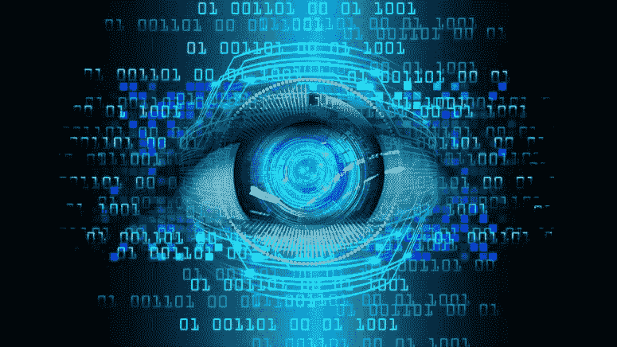
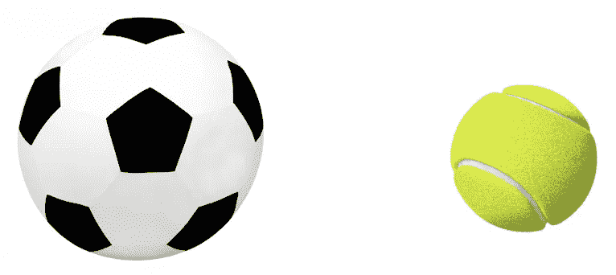
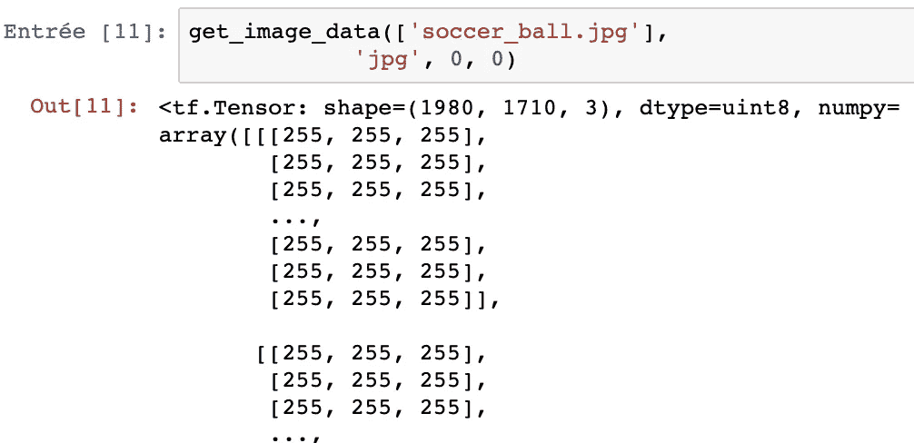

# 基于 Python 的机器学习图像识别，图像处理

> 原文：<https://towardsdatascience.com/image-recognition-with-machine-learning-on-python-image-processing-3abe6b158e9a?source=collection_archive---------1----------------------->



来源:[在线斯坦福课程](https://online.stanford.edu/courses/cs231n-convolutional-neural-networks-visual-recognition)

## 作为图像识别的第一步，图像处理对于创建可用于操作图像识别的神经网络的数据集是必不可少的

计算机视觉，即机器能够理解图像和视频的领域，是科技行业最热门的话题之一。机器人技术、自动驾驶汽车和面部识别都依赖于计算机视觉来工作。计算机视觉的核心是*图像识别*，即识别图像代表什么的任务。

在执行任何与图像相关的任务之前，几乎总是需要首先处理图像，以使它们更适合作为输入数据。在这篇文章中，我将重点介绍图像处理，特别是我们如何将图像从 JPEG 或 PNG 文件转换为我们的神经网络可用的数据。然后，在其他文章中，我将集中讨论经典卷积神经网络或 ResNet 和 SqueezeNet 等特定网络的实现。

我将使用的库是 TensorFlow 2.0，因为它提供了各种实用函数来从文件中获取图像数据，调整图像大小，甚至一次性转换大量图像。

# 图象档案

在我们进行任何图像处理之前，我们需要了解图像文件是如何工作的。具体来说，我们将讨论这些文件如何使用字节数据和像素来表示图像。

如果你以前看过一个图像文件的属性，它会显示图像的尺寸，即图像的高度和宽度。高度和宽度基于像素数。例如，如果图像的尺寸为 400x300(宽 x 高)，则图像中的像素总数为 120000。



来源:[足球](https://scoresports.com/giant-40-soccer-ball-no-1790.html)，[网球](http://hobieclass.com/focus-on-the-stripes-of-the-tennis-ball/)

足球图像的尺寸为 1710x1980(宽 1710 像素，高 1980 像素)，而网球图像的尺寸为 1024x1024(宽 1024 像素，高 1024 像素)。

函数 **tensorflow.io.read_file** 将文件名作为其必需的参数，并以张量的形式返回文件内容，类型为 **tensorflow.string** 。当输入文件是图像时，**tensor flow . io . read _ file**的输出将是图像文件的原始字节数据。虽然原始字节输出代表图像的像素数据，但不能直接使用。让我们首先看看使用足球图像的 Python 实现。

```
import tensorflow values = tf.io.read_file('soccer_ball.jpg')
```

> **像素到底是什么？**

像素本质上只是图像上的一个点，具有特定的阴影、颜色和/或不透明度。我们通常将一个像素表示为一个整数或多个整数。基于对图像的解释，像素采用特定的形式，通常是以下形式之一:

*   *:以黑白阴影的形式查看图像。每个像素都是 0-255 之间的整数，其中 0 表示全黑，255 表示全白。*
*   ****RGB*** :彩色图像的默认解释。每个像素由 0-255 之间的 3 个整数组成，其中整数分别代表像素的红色、绿色和蓝色强度。*
*   ****RGBA*** :增加了 *alpha* 字段的 RGB 扩展。alpha 字段表示图像的不透明度，在本实验中，我们将像素的 alpha 值表示为 0-255 之间的整数，其中 0 表示完全透明，255 表示完全不透明。*

*我们可以选择以任何我们想要的方式来解释一幅图像，但是通常有一种解释是最佳的。例如，我们可以用 RGB 像素值解释黑白图像，但更有效的方法是将其视为灰度图像(使用 3 倍的整数)。另一方面，用灰度像素解释彩色图像是不明智的，因为这些像素无法捕捉任何实际的颜色。*

# *图像类型*

*既然已经学习了如何加载图像，那么是时候使用 TensorFlow 将图像数据解码为像素数据了。
我们使用的解码功能取决于图像的格式。对于一般解码(即解码任何图像格式)，我们使用**tensor flow . image . decode _ image**，但是如果输入是 JPEG 图像，我们使用**tensor flow . image . decode _ JPEG**。*

*既然**tensor flow . image . decode _ image**可以解码任何类型的图像，你可能会奇怪为什么我们还要为其他两个解码函数费心。一个原因是，您可能希望只使用特定的图像格式，在这种情况下，只使用特定格式的解码函数会更有效，对代码清晰度也更好。*

*另一个原因是**tensor flow . image . decode _ image**支持 GIF 解码，结果输出形状为(num_frames，height，width，channels。由于函数可以返回不同形状的数据，当我们还需要用**tensor flow . image . resize _ images**调整图像大小时，我们就不能用**tensor flow . image . decode _ image**(见下一节)。*

*在上一节中，我们讨论了图像解释。如果我们只传递**值(见前面的代码)**作为一个解码函数的必需参数，我们使用的是原始图像数据中指定的解释。通常这样做是没问题的，但有时我们希望对像素使用特定的格式。*

*我们可以通过**通道**关键字参数改变解码图像的像素格式。**通道**参数表示每个像素的整数数量。**通道**的默认值为 **0** ，这意味着解码功能使用原始数据中指定的解释。将**通道**设置为 **1** 指定灰度图像，而将**通道**设置为 **3** 指定 RGB 图像。对于 PNG 图像，我们也可以设置**通道**到 **4** ，对应于 RGBA 图像。将**通道**设置为 **2** 无效。*

*有时，我们需要**调整图像**的大小来增加数据。我们用来调整像素数据大小的函数是**tensor flow . image . resize _ images**。它接受两个必需的参数:原始图像的解码数据和图像的新大小，图像的新大小是两个整数的元组/列表，依次表示 **new_height** 和 **new_width** 。*

```
*def **decode_image**(filename, image_type, resize_shape, channels):
    value = tensorflow.io.read_file(filename)
    if image_type == 'png':
        decoded_image = tensorflow.image.decode_png(value, channels=channels)
    elif image_type == 'jpeg':
        decoded_image = tensorflow.image.decode_jpeg(value, channels=channels)
    else:
        decoded_image = tensorflow.image.decode_image(value, channels=channels)

    if resize_shape is not None and image_type in ['png', 'jpeg']:
        decoded_image = tf.image.resize(decoded_image, resize_shape)

    return decoded_image*
```

# *资料组*

*通常，当我们执行与图像相关的任务时，我们会处理大量的图像数据。在这种情况下，最好使用 TensorFlow 数据集，即**tensor flow . data . dataset**来存储所有图像。我们可以使用 **from_tensor_slices** 函数创建数据集。*

***数据集**类使得使用所有图像文件执行任务变得更加容易和高效。在我们用图像文件创建数据集之后，我们需要将每个文件的内容解码成可用的像素数据。由于 **decode_image** 函数适用于单个图像文件，我们将需要使用数据集对象的**映射**函数来将 **decode_image** 应用于我们数据集中的每个图像文件。*

***map** 函数的输出是一个新的数据集，其中每个元素现在都从原始图像文件转换为其相应的像素数据。我们使用 map 而不是使用 for 循环来手动转换每个图像文件，因为 map 跨文件并行进行图像解码，这使它成为更有效的解决方案。*

```
*import tensorflow as tfdef **get_dataset**(image_paths, image_type, resize_shape, channels):
    filename_tensor = tf.constant(image_paths)
    dataset = tf.data.Dataset.from_tensor_slices(filename_tensor)

    def **_map_fn**(filename):
        decode_images = decode_image(filename, image_type, resize_shape, channels=channels)
        return decode_images

    map_dataset = dataset.map(_map_fn) # we use the map method: allow to apply the function _map_fn to all the 
    # elements of dataset 
    return map_dataset*
```

# *迭代程序*

*我们从数据集中提取解码图像数据的方法是通过一个 **tensorflow.data.Iterator** 。我们使用 **get_next** 函数获得一个*下一个元素张量*，用于数据提取。*

```
*def get_image_data(image_paths, image_type, resize_shape, channels):
    dataset = get_dataset(image_paths, image_type, resize_shape, channels)
    iterator = tf.compat.v1.data.make_one_shot_iterator(dataset)
    next_image = iterator.get_next()

    return next_image*
```

# *执行*

*现在，如果我们将所有步骤收集在一起，并将其应用于足球图片，我们最终会得到以下结果:*

**

*在这种情况下，数据集仅由一幅图像组成。get_image_data 的输出是一个大小为 1980x1710x3 的数组，因为它是像素为 1980x1710 的 RGB 图片。然后我们得到每个像素的值。*

*一旦我们为数据集的所有图像完成了这一处理步骤，下一步就是创建我们的神经网络，并用我们的数据集来填充它，以便学习如何识别一些模式、对象、现象…*

# *未完待续…*

*在本文中，我解决了图像识别的第一部分，即**图像处理。这是一项重要但并不容易实现的任务。我们数据集的质量对我们神经网络算法的性能有很大的影响。***

*我希望你在这篇文章中找到了你来这里的目的，并在接下来的图像识别之旅中与我在一起！*

*如果你喜欢阅读这样的故事，并想支持我成为一名作家，考虑注册成为一名灵媒成员。每月 5 美元，你可以无限制地阅读媒体上的故事。如果你注册使用[我的链接](https://medium.com/@jonathan_leban/membership)，我会赚一小笔佣金，你仍然要支付 5 美元。谢谢大家！！*

*[](https://medium.com/@jonathan_leban/membership) [## 通过我的推荐链接加入媒体-乔纳森·莱班

### 阅读乔纳森·莱班的每一个故事(以及媒体上成千上万的其他作家)。您的会员费直接支持…

medium.com](https://medium.com/@jonathan_leban/membership) 

*PS:我目前是伯克利的工程硕士学生，如果你想讨论这个话题，请随时联系我。* [*这里的*](http://jonathan_leban@berkeley.edu/) *是我的邮箱。**