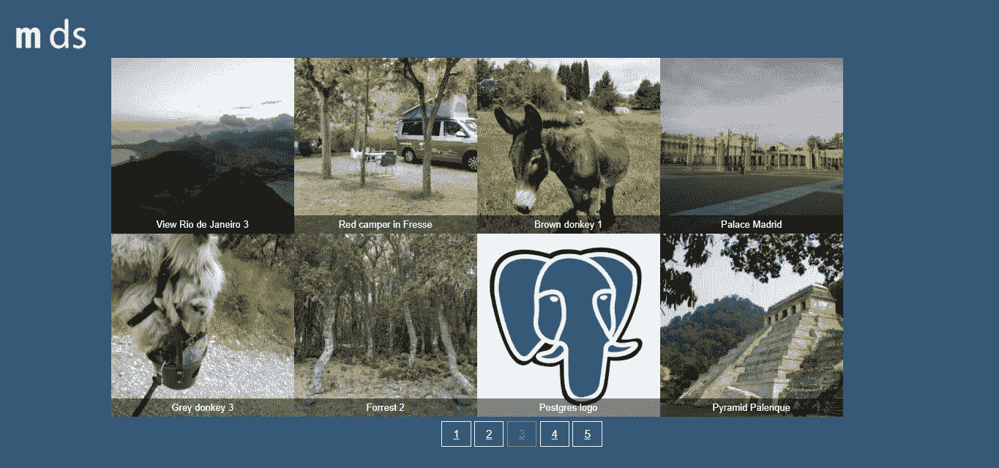
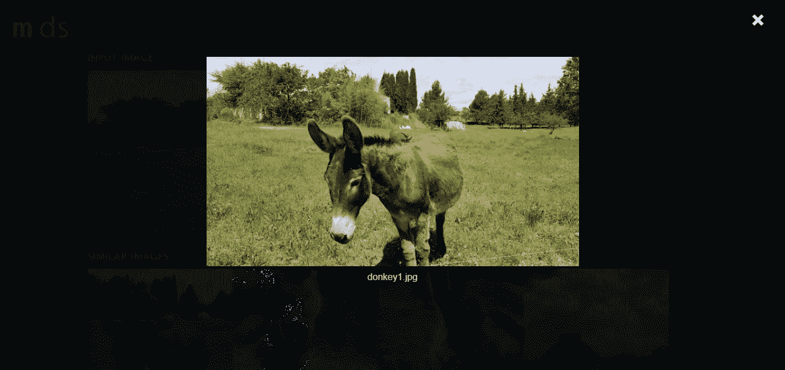
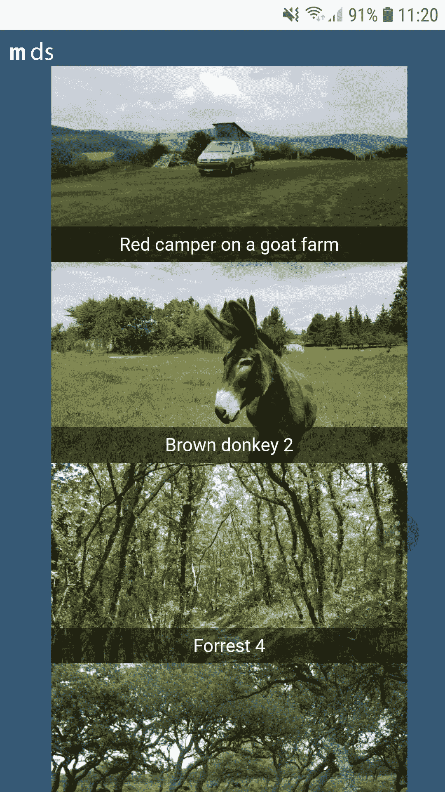
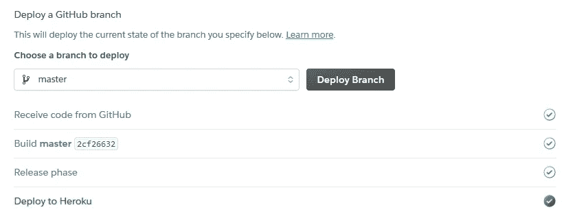

# py torch+Flask+PostgreSQL+Heroku 部署的映像建议

> 原文：<https://towardsdatascience.com/image-recommendations-with-pytorch-flask-postgresql-heroku-deployment-206682d06c6b?source=collection_archive---------20----------------------->

## **用 Flask 封装一个基于 PostgreSQL/ PyTorch 的图像推荐系统，导入数据并在 Heroku 云应用平台上运行。**


标识的选定图像和用于图像推荐应用的其他技术的自动检测的标识(来源:M. D. Korzec[烧瓶标志许可证](https://flask.palletsprojects.com/en/1.1.x/license/#artwork-license)；Python 标志 [PSF 商标使用政策](https://www.python.org/psf/trademarks/)； [html logo cc by 3.0](https://www.w3.org/html/logo/)

在过去的几周里，我实现了一个项目到项目的图像推荐系统，该系统使用 PyTorch 预先训练的 Resnet18 卷积神经网络，通过特征向量、管理图像和 top-k 列表的数据库以及用户界面来生成可比性。

本文介绍了开发的解决方案和在 Heroku 上部署的步骤，代码可从 GitHub 获得。

我已经 ***为该项目设定并满足*** 以下 ***要求***

**1。该网络应用程序可在互联网上访问。**

**2。该应用程序有一个带有分页的图库，只加载页面的相关数据。**

**3。图库和推荐的数据是从数据库中提取的。**

**4。这些推荐是来自可能很大的图像集中的最相似的图像。他们必须立即出现；这意味着相似性计算离线进行。**

**5。画廊有回应。**

6。Flask 应用程序被适当地打包，以便将来扩展/重用。

在我的上一篇文章中，部分需求已经实现为原型，尤其是第 2 和第 4 部分。[GitHub](https://github.com/MathMagicx/JupyterNotebooks/tree/master/ImageRecommenderResnet18)为 Resnet18 PyTorch 推荐器提供了一个 Jupyter 笔记本，它将图像作为输入，并从同一图像集中给出最相似的图像。要使用 Flask 应用程序，该笔记本应该用于生成存储为 pickle 文件的 Pandas 数据帧。这些在应用程序中用作静态内容。

在这篇文章中，我们将展示如何实现所有其他需求，如何在本地使用 SQLite 数据库，如何在 Heroku 上使用 PostgreSQL，如何使用它进行分页，如何清理工作并将其部署到 Heroku，以便通过 PC 或智能手机上的浏览器在互联网上使用。

您可以通过以下链接在 Heroku 上使用一些图片访问和测试演示应用程序:

[](https://image-recommender-demo.herokuapp.com/)

这篇文章由以下几个部分组成:

**1。应用程序的功能描述**

**2。重新讨论图像间相似性的计算**

**3。描述了应用程序的封装结构**

**4。SQL 模型呈现**

**5。后台应用逻辑介绍**

**6。模板介绍**

**7。解释 Heroku 部署的所有步骤**

**8。得出结论**

*注意，对于这篇文章，我使用的是 Windows 10 机器和 Python 3.5.4。我没有提到任何异常处理。*

# **1。应用程序的特性**

为了更好地理解实现的目的，让我简单解释一下应用程序的特性。

**图片集:**

用户可以在自己编写的图库中浏览一组图像，显示来自初始输入集(从我的私有图像存储库中生成的一个小型测试集)的所有图像，如下所示:



分页图片库(来源:M. D. Korzec)

图库有一个用样式表创建的自定义设计。它定义了标题、鼠标反应、图像、文本覆盖和页码外观的大小。

**分页**:

您可以在图库中的图片下方看到数字。这些允许选择带有图像的页面。为了不一次加载所有数据，我放弃了基于 JavaScript 的方法，这种方法会导致隐藏更多信息，但它仍然会加载所有图像。对于给出的实现，只加载相关的数据。

**图片推荐:**

对于可能较大的图像集中的每个图像，具有相似性值的相似图像被取出并以第二路线呈现。为此，使用一对多关系来显示与所选输入最相似的图像。该方法允许改变所寻求的推荐的数量。我们使用四个，由于小，人工图像集。


里约热内卢，来自《阿德邮报》,应用程序找到的类似图片(来源:M. D. Korzec)

由于图像被截断，您可以在一个模式中进一步单击并放大它们，以查看完整的图像，该模式使用一些基本的 JavaScript。



放大图像(来源:M. D. Korzec)

**响应度**:

画廊和建议是有反应的，这意味着你可以在智能手机上使用它，图像选择和建议在这样的设备上是用户友好的。



智能手机上的画廊(来源:M. D. Korzec)

**数据库命令:**

我准备了一些测试数据，并使用字典在一个[早期原型](/a-flask-app-for-image-recommendations-a865e1496a0d?source=your_stories_page---------------------------)中使用。这将在导入命令中重复使用。用户可以使用控制台创建或清除数据库，并导入这种字典中描述的数据。这不仅适用于 SQLite，也适用于 Heroku 的 PostgreSQL 数据库。这些命令包含在蓝图模块中。

# **2。离线计算建议**

在之前的一篇文章中，我详细解释了如何容易地生成相似性矩阵和前 k 个列表(对于每张图片，k 个最相似的其他图片)。在另一篇文章中[介绍了一个实现。因此，检查这些职位的细节。](/recommending-similar-images-using-pytorch-da019282770c?source=post_stats_page---------------------------)

简而言之，我们要做的是:

*   预处理图像输入文件夹中的图像
*   用 PyTorch 的 Resnet18 为每个图像创建特征向量
*   比较特征向量并存储 top-k 列表

这是在一个 [Jupyter 笔记本](https://github.com/MathMagicx/JupyterNotebooks/blob/master/ImageRecommenderResnet18/Recommending%20Similar%20Images.ipynb)中完成的，我现在在其中添加了两行来存储与 pickle 文件具有相似图像名称和相似值的数据帧。这些被用作推荐应用程序的静态内容。您可以使用测试图像来检查存储库，它应该可以轻松运行。

我们需要添加的是将这些结果——实际的建议——导入到 SQL 数据库中。

对于在线处理，后端进程只查询最相似的图像来呈现正确的 html。

# **3。打包应用程序**

使用了以下应用程序结构:

```
~/imageRecommender             
     |-- requirements.txt         # All packages to run the app
     |-- Procfile                 # file needed to use gunicorn
     |-- run.py                   # starts the application   
     |-- .flaskenv                # sets environment variables   
     |__ env                      # virtual environment – not in vc
     |__ /imageRecommender        # The application package
          |-- __init__.py         # Application factory method
          |-- config.py           # Configuration file for dev/prod     
          |-- models.py           # Database models 
          |__ /commands           # For import to database
              |-- __init__.py     # Application factory
              |-- commands.py     # Commands for DB creation/import
          |__ /main               # For routes
              |-- __init__.py     # Application factory
              |-- routes.py       # Business logic, fctns for routes   
          |__ /static             # All static data
              |__ /css            # Stlyesheets
              |__ /javascript     # Java Script code for modal
              |__ /pickles        # The top-k lists in pickle format
              |__ /site_imgs      # The images for the app
              |-- favicon.ico     # The favicon
          |__ /templates          # All templates
              |-- home.html       # Home route
              |-- layout.html     # General layout
              |-- recommend.html  # Recommend route
```

**__init__。py** 文件使它们包含在模块中的文件夹。这些模块可以注册为蓝图。只有 **__init__。在此应用程序中，imageRecommender 级别上的 py** 文件为非空。

# **4。数据模型**

我们将图像信息存储在 SQL 数据库中。因此，我们使用 *Flask-SQLAlchemy* ，这是一个帮助使用 Flask 和 SQLAlchemy 的库——它也是一个 Flask SQL 工具包，让您可以使用 SQL 和 Flask。

**3.1。开始使用 SQL for Flask**

支持 SQL 数据库的包是 **flask-sqlalchemy** ，版本 2.4.4 在 **requiremets.txt** 文件中。这样，我们可以将它导入到 imageRecommender 应用程序工厂 **__init__ 的工厂应用程序中。py** 。

我们在本地为 Flask 应用程序配置 SQLite 数据库，并在 **config.py** 文件中为 Heroku 配置 Postgres 数据库(所有内容都存储在一个文件中)

根据用例(在 Heroku 上开发或生产)选择正确的配置。为了安全起见，生产中的密钥需要是唯一的，并且需要设置数据库的 URL。

**3.2。数据模型**

我们为图库的图像创建一个类，并为要推荐的图像创建一个相关的类。

对该模型的一些说明:

*   两个表的 *id* 标识符被自动且唯一地设置为默认值
*   *imageName* 和 *imageDescription* 是图像元数据的字符串
*   *imageRecs* 是与推荐的关系，这些是推荐路线所需要的
*   *Imagerecommendations* 类包含来自查询图像的相关 ID、推荐图像的名称及其相似性值。它将图像名称的范式反规范化

我们现在可以创建数据库并导入数据。

**3.3 数据库命令**

有三个简单的命令:

1.  删除数据库
2.  来创造它
3.  要导入数据

该应用程序如上所述进行了打包，以便 **commands.py** 脚本可以访问该应用程序——我们将在稍后讨论蓝图时看到这一点。

在运行导入之后，用户已经有了可以测试的数据库，例如通过创建查询。

# **5。后端应用逻辑**

在我的上一篇文章中已经描述了什么是烧瓶以及如何设置它。

该解决方案被打包到 imageRecommender 包中，我们用 **run.py** 脚本调用它

*createApp* 方法在 **__init__ 中。py** 应用程序工厂，在扩展应用程序时使用它变得很有用，例如，通过需要应用程序的几个实例的测试。

*   对于加载配置的导入，这些在前面已经描述过了。需要在此 **__init__ 中创建应用程序。py** 文件 via app = Flask(__name__)。
*   创建对象后，将验证环境变量是否适用于正确的用例，并加载合适的配置。
*   创建了数据库对象，并为主应用程序和数据库命令注册了两个蓝图。cli_group=None 将命令合并到应用程序级别，这样它们就可以在 Heroku 控制台中被 flask <command name=""></command>调用。

*主*蓝图在 **routes.py** 文件中包含主要的后端应用程序逻辑。让我们一步一步地浏览这个文件:

```
from flask import render_template, request, Blueprint
from imageRecommender.models import Galleryimages
```

*   我们通过 *render_template* 包使用用于 html 页面生成的模板。
*   通过请求，我们得到所选图像的名称和我们在图库中的页面。
*   当我们使用蓝图来模块化应用程序时，蓝图是导入的。
*   对于查询的图像，我们通过 Imagerecommendations 相关类获得相似的图像，因此我们使用我们的 *Galleryimages* 类。

```
main = Blueprint('Fmain', __name__)
```

*   蓝图*主*已注册。

```
@main.route("/")
@main.route("/home")
def home():
    page = request.args.get('page', 1, type=int)
    gImages = Galleryimages.query.paginate(page=page, per_page=8)
    return render_template('home.html', images = gImages)
```

*   主路和回家的路通向画廊。
*   通过*home.html*模板，我们渲染 *render_template* 调用中给出的图像。
*   它将来自 *gImages* 的图像作为输入。这里使用了分页特性。使用 *per_page* 可以设置图库的一页上显示多少幅图像，page 是打开的默认页面，在这种情况下是图库的第一页，包含前八幅图像。

```
@main.route("/recommend")
def recommend():
    selectedImage = request.args.get('selectedImage')
    imageEntry = Galleryimages.query.filter_by(imageName=selectedImage)
    images = []
    values = []
    for image in imageEntry:
         for recommendation in image.imageRecs:
             images.append(recommendation.recommendedName)
             values.append(recommendation.similarityValue) return render_template('recommend.html', title='Recommendations', customstyle='recommend.css', inputImage=selectedImage, similarImages=images, similarityValues = values)if __name__ == '__main__':
    app.run(debug=True)
```

*   使用请求用户所选图像的相应推荐函数来调用推荐路线。
*   它是从我们的数据库中查询的，我们迭代相关类中的所有推荐。
*   图像和值数组填充有相应的信息。
*   传递所有必需的信息来呈现 recommend.html 页面。

# **6。模板**

我们看到了两个从模板呈现 html 页面的调用:

```
render_template('home.html', images = gImages)render_template('recommend.html', title='Recommendations', customstyle='recommend.css', inputImage=selectedImage, similarImages=images, similarityValues = values)
```

让我们看看 home.html 文件**和 recommend.html 文件**的相关部分

应用程序使用布局模板**layout.html**来最大化 html 代码的重用。重要的部分是模板的主体有一个在另外两个 html 文件中指定的块内容。

```
<body>
…
 
</body>
```

**home.html**文件用于图库

它主要由两部分组成:

1.通过*{ % for images . items % }*迭代的图库中的图像以及

2.分页 div 部分中的分页元素。这里最有趣的部分是 *iter_pages* 方法，它允许设置在数字块的左右边缘和中间显示多少数字

*{ % for page _ num in images . ITER _ pages(left _ edge = 2，right_edge=2，left_current=1，right_current=2) %}*

recommend.html 模板用于显示查询和最相似的图像:

结尾的模态和这个应用程序中唯一的 JavaScript 代码是为弹出窗口准备的，如果需要，可以放大类似的图像。

**响应度:**

为了在智能手机上正确显示图库，一些设计元素需要不同的大小，图库应该只有一列。这都可以通过样式表添加相应的部分来实现

```
*@media only screen and (max-device-width : 640px) {*
```

例如，对于图库内容，我们在此部分将列计数设置为 1

```
.gallery .galleryContent .item{
    float: left;
    width: 100%;
    height: 100%;
    position: relative;
    cursor: pointer;
    column-count: 1;
}
```

# **7。Heroku 部署**

**。flaskenv** 文件包含两个条目，它在安装了 *python-dotenv* 时工作

```
FLASK_APP=run.py
FLASK_ENV=development
```

因此，flask run 允许您在本地测试应用程序(在 http://localhost:5000/ 上)

现在是时候部署这个包并使它可以通过互联网访问了。

[](http://heroku.com)

Heroku 是一个允许轻松部署和托管应用程序的平台。它不遗余力，没有通常的系统管理，网络服务器，防火墙设置任务等。都是需要的。免费层允许简单的测试，所展示的演示在这样一个免费的主机上运行。我们希望将该应用程序部署到 Heroku，因为它提供免费的云虚拟主机服务，非常适合像这样的演示。

以下步骤于 2020 年 8 月在 Heroku.com 进行了测试和工作。

对于 Heroku 的简单部署，将您的代码推送到 GitHub。创建存储库。使用您收到的 URL 将存储库推送到 GitHub。

因此，你需要访问[https://www.heroku.com/](https://www.heroku.com/)并用主要开发语言 Python 创建一个账户。

按照 https://devcenter.heroku.com/articles/heroku-cli 上的说明安装 Heroku CLI。

您可以使用 Heroku CLI 执行以下许多步骤，但是，如果可能的话，我将介绍基于 UI 的配置步骤。

在 Heroku 点击“创建一个新的应用程序”。它要求你给它一个名字，让我们在这里设置*图像推荐演示*和欧洲地区。

确认后，您将进入下一个屏幕，在这里您可以选择您的部署方法


当我们将代码推送到 GitHub 时，我们选择 GitHub 选项，之后我们需要“连接到 GitHub”并授权 Heroku 访问您的 GitHub 存储库。

接下来，我们输入相应存储库的名称 *image-recommender-demo* ，搜索它并连接到它。

您可以选择自动部署每个变更，例如，到您的主分支，这对于这样的演示用例来说非常方便，


开始时，我们手动部署一次(为此需要按另一个按钮)。现在，您可以看到您的解决方案正在构建中，并且处于成功状态



在网站的顶部，你可以找到一个按钮


这使我们在这种情况下，我们的推荐系统

https://image-recommender-demo.herokuapp.com/

到目前为止，日志将显示没有 web 进程正在运行，因此需要创建一个 **Procfile** ，Heroku 使用它来了解如何运行应用程序。它只包含一行

```
web: gunicorn run:app
```

*web* 指定使用 web worker。需要一个应用服务器，因此使用 gunicorn 并需要安装它——版本 20.0.4 在 **requirements.txt** 文件中引用。 *gunicorn* 是运行 web 进程所需的命令，以便 python 代码可以与 web 服务器通信。 *run* 是指包含应用对象的 **run.py** 文件， *app* 是指应用对象的名称。

提交之后，需要设置 FLASK_ENV。如上所述，我使用了**。本地保存文件。在生产中，通过 Heroku CLI 手动设置配置**

```
heroku config:set FLASK_ENV=production --app image-recommender-demo
```

如果您尚未登录，Heroku 将首先请求登录。

现在运行应用程序仍然会给你留下一个内部服务器错误，因为数据库还没有设置好。

我们希望使用 PostgreSQL。在 Heroku UI 中点击“概览”，选择“配置附加组件”，搜索“Postgres”；选择“Heroku Postgres”。这个演示我用的是免费版。

现在这个数据库已经连接到应用程序*图像推荐演示*！你现在可以在“设置”、“配置变量”下看到它的网址。

如果 *psycopg2* 尚未安装，Heroku 将再次告诉我们一个错误，日志显示“psycopg2”模块未找到。因此， **requirements.txt** 文件中的 psycopg2==2.8.5 得到正确的包。

这些表仍然不存在，所以在 Heroku 上进行调整后，我们仍然会看到一个错误。

为了创建缺失的表格并导入一些数据，我们使用前面解释过的 **command.py** 文件中的命令。

我们将设置 *FLASK_APP* 变量，以便在 Heroku con 中识别命令

```
heroku config:set FLASK_APP=run.py --app image-recommender-demo
```

现在我们可以在 Heroku 中调用控制台，并使用前面给出的命令

```
flask createDB
flask importDB
```

就这样，应用程序部署完毕，上线，数据库包含相关数据！

# **8。结论**

有了这个和 [PyTorch 推荐人的帖子](/recommending-similar-images-using-pytorch-da019282770c?source=post_stats_page---------------------------)，你手头就有了一切

*   离线运行机器学习代码并存储结果
*   创建一个基于 Flask 的 web 应用程序
*   在 web 应用程序中使用机器学习结果
*   使用带有 Flask 的 PostgreSQL 数据库
*   将您的应用程序部署到 Heroku

你不一定要在这个特定的演示应用程序中使用这些编程见解，一旦你理解了所有的步骤，你可以用其他的想法变得有创造性。

正如我在[的上一篇文章](/a-flask-app-for-image-recommendations-a865e1496a0d)中所描述的，还有更多方面需要考虑，以实现生产目标。

我们可以投入更多的工作，使推荐本身成为一个 API 服务，具有合适的端点来添加、删除和更新条目。

这种服务可以是生产系统的一部分，比如大型的网上商店。注意，在这种情况下，图像应该从静态文件夹移动到例如某个对象存储器。

# 感谢阅读！喜欢这个话题吗？

如果你觉得这本书很有趣，你可能想补上我以前的文章，这篇文章的主题是:

[](/effortlessly-recommending-similar-images-b65aff6aabfb) [## 轻松推荐相似图片

### 使用来自训练的卷积神经网络的特征来产生可比性

towardsdatascience.com](/effortlessly-recommending-similar-images-b65aff6aabfb) [](/recommending-similar-images-using-pytorch-da019282770c) [## 使用 PyTorch 推荐相似图片

### 使用 Resnet18 实现完全迁移学习

towardsdatascience.com](/recommending-similar-images-using-pytorch-da019282770c) [](/a-flask-app-for-image-recommendations-a865e1496a0d) [## 一个推荐图片的 Flask 应用程序

### PyTorch 中基于卷积神经网络的相似图像推荐网站原型

towardsdatascience.com](/a-flask-app-for-image-recommendations-a865e1496a0d)