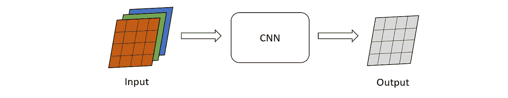
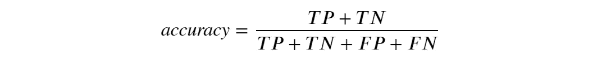
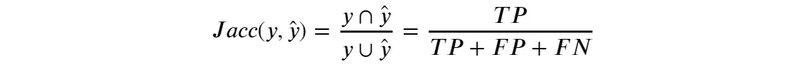
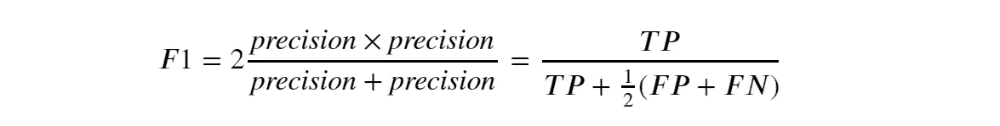
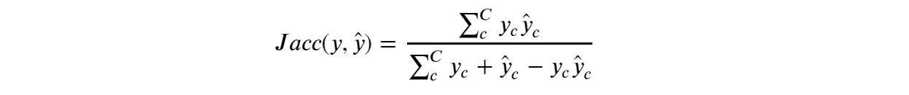
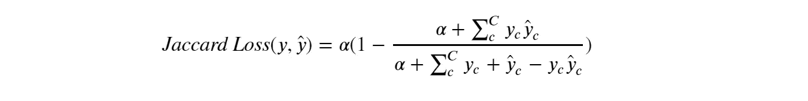
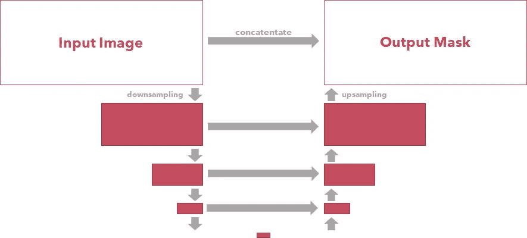
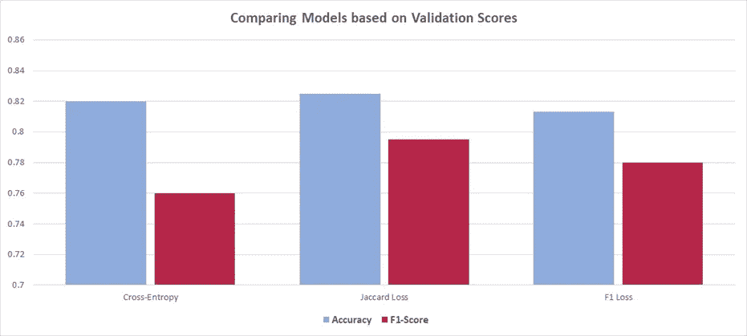

# 图像分割——选择正确的指标

> 原文：<https://towardsdatascience.com/image-segmentation-choosing-the-correct-metric-aa21fd5751af?source=collection_archive---------8----------------------->

[Adrian Williams](https://unsplash.com/@nairdasemaj) 在 [Unsplash](https://unsplash.com?utm_source=medium&utm_medium=referral) 上的原始照片

## 比较图像分割任务的度量和损失函数作为不平衡数据问题的例子。

从机器人到自动驾驶，图像分割任务有各种应用，这使其成为计算机视觉和机器学习的当前研究领域。由于其在架构上的灵活性，卷积神经网络(CNN)已被证明是该领域中最先进的算法。与普通分类相比，监督图像分割具有一些基于数据中不平衡类别分布的特殊特征。本文说明了重新审视一下模型评估所使用的评分标准可能是有用的，并介绍了 Jaccard 指数和 F1 分数作为最常用的准确性分数的替代。此外，它将显示如何开发损失函数，直接优化这些分数。最后，我们将基于引入的度量将开发的损失函数的结果与交叉熵进行比较。

# 图象分割法

基本上，图像分割就是分类。但是，不是给定的输入图像只有一个标签，而是该图像中的每个像素都有一个标签。因此，分类器需要输出与输入图像维数相同的矩阵。

在通常的分类任务中，应该由分类器分离的类通常均匀地分布在训练集中。如果不是这种情况，很容易减少一个类别的样本，或者收集/生成另一个类别的更多样本，从而使这些类别均匀分布。这在使用 CNN 的图像分类任务中是不可能的。在这里，为了减少一个类的频率，像素必须被丢弃，这导致了不完整的图像。

# 准确性有什么问题？

想象一幅包含繁华城市场景的图像。分类器的目标是识别显示街道标志的所有像素。在这张图片中，可能有许多其他物体，如汽车、人、房子等。因此，与整个图片大小相比，街道标志的总面积可能非常小。如果我们将除街道标志之外的所有其他对象标记为“背景”,那么我们只剩下两个标记,“背景”类的像素数量将比“街道标志”类的像素数量大得多。

[Adrian Williams](https://unsplash.com/@nairdasemaj) 在 [Unsplash](https://unsplash.com?utm_source=medium&utm_medium=referral) 上的原始照片

现在让街道标志的面积只占整个图像面积的 10%,考虑一个简单的分类器，它总是预测整个图像中每个像素的“背景”。因此，这个分类器根本不能识别任何街道标志像素。

对于这个二元问题，精度定义为

因此，该分类器的最终准确度为 90%。这听起来是一个很好的分数，尽管从直觉上来看，这绝对不是描述分类结果的理想值。

因此，准确性似乎与正确标记物体的目标并不一致。至少，如果这些物体与图像尺寸相比非常小。这意味着我们必须考虑其他得分指标。

# 替代指标

作为准确性的替代，Jaccard 指数或 F1 分数可用作评分标准:

**Jaccard index，**也称为 IoU score(交集除以并集)，定义为由并集定义的两个集合的交集。

基本思想是将图像遮罩视为集合。这些集合可以在图片中重叠。如果两个遮罩完全相同，则两个集合具有完全相同的大小，并且 100%重叠，因此交集等于并集。在这种情况下，IoU 得分为 1，为最佳值。另一方面，如果与原始掩码相比，预测掩码的大小发生了移动或变化，则并集将大于交集。IoU 分数降低。

再次以街道标志为例，图像的 10%显示街道标志，剩余区域只是背景。对于这个二元示例，主要目标是正确分类街道标志。因此，让街道标志像素为正值，背景为负值。因为分类器将图像中的每个像素标记为“背景”，所以真阳性的总和( *TP* )必须为 0。因此，得到的 Jaccard 指数也是 0。

相对于准确率分数，即 90%，这个分数表示分类结果是完全错误的。关于分类器没有正确分类街道标志的任何像素的事实，Jaccard 指数的分数比 accuracy 更直观地描述了该分类器的结果。

**F1 分数**，也称为骰子分数，与 Jaccard 指数相关，定义为

F1 分数是精确度和召回率的调和平均值，顾名思义非常适合不平衡数据集。关于该公式，可以看出，对于给定的示例，F1 分数的结果也必须是 0。

有关 F1 分数和其他不平衡数据评分指标的更多信息，请参见[https://towardsdatascience . com/handling-unbalanced-datasets-in-machine-learning-7a0e 84220 f 28](/handling-imbalanced-datasets-in-machine-learning-7a0e84220f28)

# 开发成本函数

上一节介绍了图像分割任务的两种可能的度量。在本节中，我们将展示如何开发成本函数，直接优化这些分数。此处，显示了 Jaccard 指数的过程，但对于基于 F1 得分的成本函数，步骤是相同的。

如果我们将 Jaccard 指数引入反向传播所需的可微分形式，并且让𝑦、𝑦̂是一个热编码向量，其中类的数量 *C* 是它们的长度，我们得到公式

遗憾的是，由此产生的梯度并没有交叉熵产生的梯度那么简单，而且容易出现“梯度爆炸”。因此，在等式中添加额外的平滑因子以获得更稳定的训练结果是有用的。此外，我们希望有一个应该最小化的成本函数。因此，因为 Jaccard 指数自然地从 0 扩展到 1，所以我们从 1 中减去结果。这导致以下损失函数:

在 Python 和 TensorFlow 中实现，这会产生以下函数:

# 实验——损失函数的比较

下面，我们将训练 3 个相同的 CNN 模型。一个将使用交叉熵来训练，而另一个使用 Jaccard 损失和骰子损失来训练。之后，我们将使用准确性分数和 F1 分数作为评估指标来查看结果。

这里使用的神经网络架构基本上来自 https://www.tensorflow.org/tutorials/images/segmentation 的，略有改动。基本架构称为 U-Net，这是一个基于编码器-解码器的网络，在各个层之间有额外的快捷方式。主要思想是首先压缩图像信息，然后结合像素特定知识应用该压缩信息来创建输出掩模。

我们将在这个实验中使用的数据集是[牛津-IIIT Pets 数据集](https://www.robots.ox.ac.uk/~vgg/data/pets/)。它由 7349 张图片组成，展示了不同种类的宠物。对于每个图像，都有一个给定的遮罩，将每个像素分类为宠物、背景或边界。所以，总共有 3 节课。

在完全相同的情况下训练 CNN 20 个时期后，我们可以看到以下结果:

看一下条形图可以看出，考虑哪个指标真的很重要。如果仅使用准确度分数来比较模型，基于 F1 损失的模型将被判断为所有 3 个变量中最差的。相反，使用 F1 分数，F1 损失模型比用交叉熵训练的模型取得了明显更好的结果。

# 结论

我们已经看到，对于有用的模型评估，评分标准的选择可能是至关重要的，尤其是在处理不平衡的数据集时。因此，在开始调优超参数和优化给定指标的结果之前，质疑这个指标并考虑它是因为它是最适合的还是因为它是默认选项而被使用可能是有用的。

此外，我们还看到了如何创建自己的成本函数来直接优化特定的指标。对于合适的问题和数据集，这可能比交叉熵获得更好的结果。

包含全部代码的 Jupyter 笔记本可以在这里找到:[https://gist . github . com/LaurenzReitsam/05 E3 bb 42024 ff 76955 adbf 92356d 79 f 2](https://gist.github.com/LaurenzReitsam/05e3bb42024ff76955adbf92356d79f2)

你可能会觉得这很有趣:

*   图像数据中不同不平衡问题的极好概述:https://Neptune . ai/blog/unbalanced-data-in-object-detection-computer-vision

# 参考

*   范·比尔斯，f .和林德斯特伦，阿维德和奥卡弗，艾曼纽和威林，马尔科，用于二值图像分割的交集超过联合损失的深度神经网络，2019 年。
*   https://www.tensorflow.org/tutorials/images/segmentation
*   https://www.robots.ox.ac.uk/~vgg/data/pets/