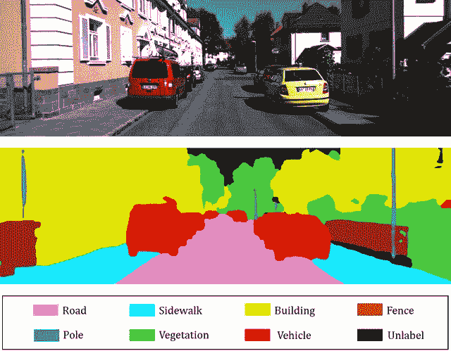
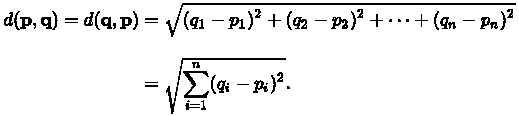
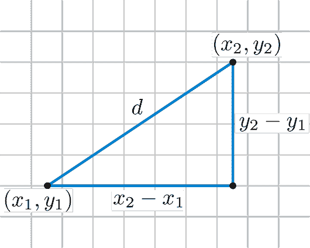
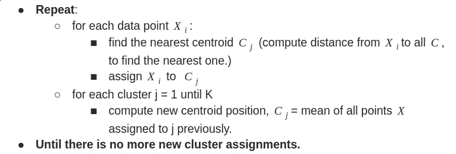
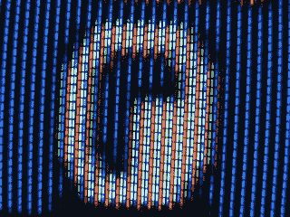
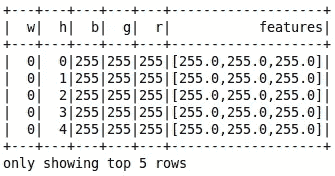
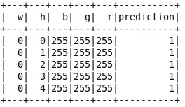
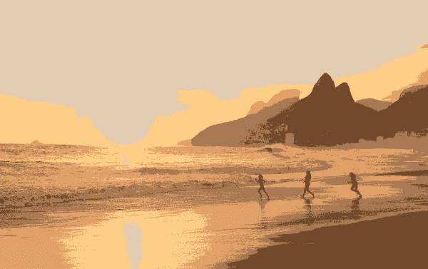
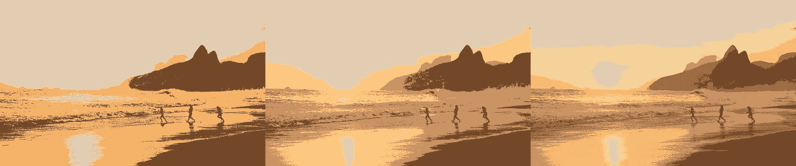
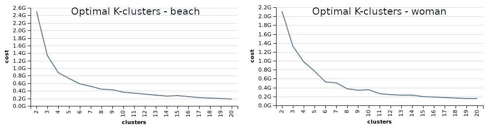

# Apache Spark 上的图像分割

> 原文：<https://towardsdatascience.com/image-segmentation-on-apache-spark-46164dd53c73?source=collection_archive---------18----------------------->

## **基于 Apache Spark 和 Scala 的 K-means 图像分割**


资料来源:联合国人类住区规划署

计算机视觉是数据科学中最令人兴奋的分支之一。应用机器学习算法和技术有许多可能的应用，图像分割是其中的第一步。

图像分割是计算机视觉处理的主要发展方向之一。许多计算机视觉任务需要对图像进行分割，以理解每个部分并更容易整体理解。每一段包含一组像素，可能代表一些东西。分割是图像分析的两个重要应用的基础:

*   **物体检测:**识别图像中的物体、汽车、人或动物等。这里的目标是仅仅识别在该组像素中有一个对象，而不是正确地分类它是哪个对象。
*   **分类**:目标检测后，目标是将每个检测到的目标归为一类。下图说明了这个应用程序，其中每个对象都被检测和分类。



图像来源:使用 3D 激光雷达和相机制作有意义的 3D 地图。[https://www . researchgate . net/publication/326875064 _ forward _ a _ 隽永 _ 3D _ Map _ Using _ a _ 3D _ Lidar _ and _ a _ Camera](https://www.researchgate.net/publication/326875064_Towards_a_Meaningful_3D_Map_Using_a_3D_Lidar_and_a_Camera)

**分割技术**

通过深度学习、基于区域的方法(其将尝试检测对象的边界)、通过聚类算法的应用等等，有许多方式来实现图像的分割。每种技术都有其优点和缺点。深度学习技术已经证明了迄今为止最好的结果，但实现往往很复杂，需要大量数据来训练模型。当然，可以使用预先训练好的可用模型，但是对于在特定应用上的使用，将需要训练，这可能是费时和费工的。另一种可能的方法是应用聚类算法。目标是识别数据中的组，分配来自每个像素的所需信息(x 和 y 位置，颜色信息)，根据特征相似性将它们分类到其中一个组中。与深度学习相比，它的效率较低，因为聚类不是分析预定义的组，而是迭代地工作以有机地形成组，这将需要更多的人类干预。然而，由于聚类是**无监督的**，所以它不需要太多的数据来进行训练，与深度学习的同行相比，这可以减少开发时间并节省处理时间。

**K 均值聚类**

在将数据组织成组之前，我们需要理解解析几何中两个数据点之间距离的概念。计算距离的方法有很多种，这里我将重点介绍一种最常用的方法:**欧氏距离**。根据[百科](https://en.wikipedia.org/wiki/Euclidean_distance)，两点 **p** 和 **q** 之间的**欧氏距离**就是连接它们的[线段](https://en.wikipedia.org/wiki/Line_segment)的长度。如果 **p** = ( *p* 1、 *p* 2、…、 *pn* )和 **q** = ( *q* 1、 *q* 2、…、 *qn* )是[欧几里德*n*-空间](https://en.wikipedia.org/wiki/Euclidean_space)中的两点，则可以利用勾股定理



让我们用一个实际的例子。给定两点 **p** 和 **q** ，其中 **p=(5，3)** 和 **q = (4，2)。**以下图为例， *x1* = 5， *y1* =3， *x2* = 4， *y2* = 2。应用该公式，我们得到 d( **p** ，**q**)=(4–5)2+(2–3)2 = 2。



现在我们已经了解了距离，我们可以继续进行 K-Means 计算。首先，首先定义簇的最终数量 **K** 。应该考虑每种情况的应用环境来定义集群的数量。之后，有必要为集群定义**质心**。**质心**被定义为给定聚类中所有数据点的平均值。所以，如果一个数据点 ***P*** 更靠近质心 K1 而不是 K2，我们可以说这个点属于组 K1。有很多方法可以初始化质心。以下是当时的一些情况:

*   **RP** — *随机选取点*。随机选择 k 个不同的数据案例作为初始中心。
*   **KMPP**——*随机最远点数，或 k-means++。*从数据集中随机选择第一个中心。第二个中心也是随机选择的，但是案例选择的概率与它到第一个中心的距离(平方欧几里德距离)成比例。第三个中心也是随机选择的，选择的概率与病例到这两个中心中最近的中心的距离成比例，等等。
*   **SIMFP** — *最远点(简单选择)。*从数据集中随机选择第一个中心。第二个中心被选为离该中心最远的情况。第三个中心被选为离这两个中心最远的中心(离这两个中心最近的中心)，依此类推。
*   **RUNFP** — *最远点(运行选择)。*首先将 k 个病例作为中心，然后在运行数据集的其余病例期间，在中心之间进行渐进替换；替换的目的是最终获得变量空间中彼此相距最远的 k 个点。这些在数据云中占据外围位置的点(例)就是产生的初始中心。
*   **GREP** — *小组代表点*。方法思路——以 k 个最具代表性的“代表”案例为中心进行收集。第一个中心被认为是最接近一般数据中心的情况。然后，以这样的方式从数据点中选择其余的中心，即考虑每个点是否比每个点更接近一组点(以及根据平方欧几里德距离的多少)到任何已经存在的中心。即，每个点被作为候选点来检查，以代表由已经收集的中心还不够好地代表的某一组点。在这方面最有代表性的点被选为下一个中心。

现在我们已经巩固了距离和质心的初始化，让我们看看 K-Means 算法是如何工作的:



如果你对任何一步仍有疑问，我强烈推荐由[桑奈纳](http://https//www.linkedin.com/in/sunaina-shashikumar/)在 [datasciencecentral](https://www.datasciencecentral.com/profiles/blogs/steps-to-calculate-centroids-in-cluster-using-k-means-clustering) 上撰写的这一步一步计算。同样，这个[视频](https://www.youtube.com/watch?v=nXY6PxAaOk0&t=1s)展示了每一步的可视化。

# **利用火花上的 K 均值实现图像分割**

好了，是时候开始用 scala 的 apache spark 上的 k-means 聚类算法解决图像分割问题了。等等，但是为什么是 scala 呢？Python 是目前数据科学家最喜欢的语言，不仅因为它容易学习和实现，还因为它丰富的库和框架。在数据科学和机器学习项目中，它包括大量有用的库 SciPy、NumPy、Matplolib、Pandas 等，而对于深度学习中更复杂的项目，Python 提供了 Keras、Pytorch 和 TensorFlow 等库。有了这些优势，为什么还要选择 scala 呢？Spark 是用 Scala 编写的，因为它可以非常快，因为它是静态类型的，并且以 JVM 已知的方式编译。我来自 Java 世界，其中一个优势是使用 Java 的全部遗产，比如库和框架。

我不会深究语言之间的差异，因为这不是这篇文章的重点(有数百个优点和缺点，google 是你的朋友)，但正如之前所说，一个事实是 Python 社区非常庞大，提供了许多库和框架来与 Spark 一起使用，还有许多可用的教程。正因为如此，我写这篇文章的主要动机是为 scala 社区做贡献。

## 将图像载入 Spark 数据框

从 2.4 版本开始，Spark 内置了一个新的数据源，可以读取压缩格式(jpg、png 等)。将使用 ImageIO Java 库读取图像，它有一个特殊的[数据帧](https://spark.apache.org/docs/latest/sql-programming-guide.html#datasets-and-dataframes)模式。读取一个图像文件(或几个，只是指向一个只包含图像的目录)可以通过以下方式完成:

该模式包含一个 [**StructType**](https://spark.apache.org/docs/latest/api/scala/index.html#org.apache.spark.sql.types.StructType) 列“Image”，其中包含所有关于读取数据的信息。在 StructType 中，可以找到以下列:

*   原点:`StringType`(代表图像的文件路径)
*   高度:`IntegerType`(图像的高度)
*   宽度:`IntegerType`(图像的宽度)
*   n 通道:`IntegerType`(图像通道数)
*   模式:`IntegerType` (OpenCV 兼容型)
*   数据:`BinaryType`(OpenCV 兼容顺序的图像字节:大多数情况下是按行排列的 BGR)

对我们来说，重要的数据是 spark 为我们生成的字节数组，代表原始图像数据。该数组包含我们可以用于聚类的所有功能。

数字图像由像素组成，每个像素由颜色组合组成，用代码表示。例如，一幅灰度图像只有一个颜色通道。对于计算机显示器，最常用的标准是 **RGB。**RGB 图像有三个通道，每个通道表示相应颜色的亮度:红色、绿色和蓝色。因此，基本上，一个 RGB 图像是三个图像的组合(每个通道一个)，每个图像包含各自颜色的信息。



你有没有尝试过近距离观察老式 CRT 电视的屏幕？如果是这样，你可能记得你可以看到三个颜色通道。ideia 在这里是相同的，如图像所示。

**火花如何解码图像**

为了构建我们的特征图，我们需要了解 spark 如何读取和解码图像。潜入 spark 代码，我们有**[**image schema . Scala**](https://github.com/apache/spark/blob/master/mllib/src/main/scala/org/apache/spark/ml/image/ImageSchema.scala#L131-L190)**对象，更确切地说，是**解码**方法。****

****该方法主要检查图像的通道数，并根据该数量进行解码。让我们举一个例子:考虑一个 640 x 480 的图像，它将有 307200 个像素。如果图像是灰度的(只有一个通道)，最终的数组大小将是 307200。但是，如果是 RGB 图像，最终的数组将有 307200 * 3 = 921600。通道顺序被定义为 BGR(也有用于定义透明度的 alpha 通道的空间)。对于相同的 640 x 480 RGB 图像示例，数组的前三个位置将包含来自高度= 0 且宽度= 0 的像素的颜色信息(蓝色、绿色和红色)。接下来的三个位置将包含来自高度= 0 和宽度= 1 的像素的信息，依此类推。****

******创建特征数据框******

****现在我们知道了 spark 如何存储图像信息，我们可以读取数据数组来构建我们的特征数据框，该数据框将用于 K-Means 算法。对于每个像素，我们应该有 w 位置，h 位置和每一个颜色通道。****

****为了开始这个任务，我们将使用两个图像，如下所示，一个风景和一个人(我模糊了女人的脸，只是为了防止任何问题)。****

********

****全尺寸图片可在:[https://ibb.co/d4xWxvw](https://ibb.co/d4xWxvw)找到****

********

****全尺寸图片可在:[https://ibb.co/d4xWxvw](https://ibb.co/d4xWxvw)找到****

****提取信息的逻辑是按照 decode 方法上的逻辑读取数组，然后将其转置到数据帧列中。让我们一步一步来:****

****我们首先读取图像，提取字节数组，并为其创建一个新的 RDD，应用 flatMap 转换，将每个数组位置作为 RDD 上的一个条目返回。我们可以直接在图像数组上工作，但是我们会失去使用 spark 的一个优势:分布式数据结构。通过始终使用 RDD 结构，我们可以确保我们的代码始终是分布式的。****

****下一步是提取有关渠道，高度，宽度和启动累加器的信息。累加器是集合所有 spark 执行器值的变量。因为我们使用的是 RDD 的，所以我们不能使用常规的聚合变量，因为当 Spark 将这些代码发送给每个执行器时，这些变量就变成了这个执行器的本地变量，并且它的更新值不会传回给驱动程序。因此，如果我们想要我们的计数器正确工作(对于 h 和 w 位置和颜色偏移)，我们需要使用累加器。****

****最后的处理从**ziptwithindex**转换开始，它将返回一个新的 RDD 对，一个包含元素和索引的元组，这对字节偏移量很有用。**ziptwithindex**将有助于为 RDD 上的每个条目分配一个索引，该索引将用于偏移量。最终，RDD 将被转换成一个有三列的**数据帧**，代表颜色信息以及 x 和 y 位置。需要注意的是，每个像素都有模式中描述的通道数。因此，将某个像素的所有颜色信息压缩到数据集的一个条目中是很重要的。为此，在数据框上使用聚合，按像素的 X 和 Y 位置分组。接下来，应用**org . Apache . spark . SQL . functions . collect _ list**函数，该函数将从 color 列中获取所有聚合值，并返回包含这些值的列表。最后，返回一个带有 X 和 Y 位置以及蓝、绿、红颜色信息的数据帧。****

****上面的实现只考虑了具有三个通道(RGB)的图像，因为它是图像中最常见的。具有 4 个通道的图像(RGBa)将第四个通道用于透明度信息，并且几乎不需要调整像素的偏移位置。****

******Spark 上的机器学习流水线******

****一般来说，大多数机器学习模型的实现都可以设计为一些算法的有序序列，如下所示:****

*   ****特征提取、变换和选择。****
*   ****基于这些向量和标签训练预测模型。****
*   ****使用生成的模型进行预测。****
*   ****评估模型(性能和准确性)。****

****Spark MLib 提供了两个顶级抽象来促进该管道的开发:**变压器**和**估算器**。转换器实现了一个方法 transform()，该方法将一个数据帧转换成另一个数据帧，通常追加一个或多个新列。例如，转换器将获取数据框中每个条目的所有列要素，并将其映射到新列(要素向量)。估计器将负责应用适合或训练数据的学习算法。它实现了 fit()方法，该方法接受一个数据帧并生成一个模型，该模型是一个转换器。作为一个例子，学习算法如**决策树**是一个估计器，调用 fit()训练一个**决策树分类模型**，它是一个模型，因此是一个转换器。****

****准备好带有特性列(b，g，r，w，h)的数据框架后，我们可以通过应用 transformer**vector assembler**来启动我们的管道。这个转换器将给定的列列表组合成一个向量列。我们使用方法 **setInputCols** 来传递一个数组，指向我们想要组合的列。方法 **setOutputCol** 用于指向将包含组合向量的列。****

****最初，只有颜色信息将被用作我们模型的特征。我们可以稍后测试和讨论 x 和 y 位置的包含。这将是生成的数据帧:****

********

****现在，我们可以创建 Kmeans 估计器并训练我们的模型。变量 K 将定义将要使用的簇的数量。 **setSeed** 方法用于随机初始化集群。如果您不提供种子，spark 将在内部生成一个种子，这会影响测试比较，因为每次运行的性能都不同，因为每次运行的集群初始点都不同。方法 **setFeaturesCol** 接收包含特征向量的列。****

****通过调用 fit()方法并传递由 Vector Assembler 转换的 DataFrame 来创建模型。该模型将通过调用 transform()方法给出结果，返回包含新列 prediction 的 DataFrame。****

****最后，生成的数据帧将如下所示:****

********

****预测列将告知条目属于哪个组。注意集群编号总是从零开始。****

******写入分割图像。******

****Spark 没有提供写图像的方法，所以我们需要实现一个。此外，决定如何在新的渲染图像上表示聚类颜色也很重要。在这种情况下，我决定使用从每个聚类中找到的第一种颜色来表示它自己。****

****这个想法很简单。对于每个聚类，我们使用聚类编号过滤数据集，并获得找到的第一个条目，我们将聚类编号作为键添加到映射中，并将颜色通道作为值添加到 Scala 元组([https://docs.scala-lang.org/tour/tuples.html](https://docs.scala-lang.org/tour/tuples.html))中。****

****现在终于可以写出最终的图像了。为此，我们将使用类 **javax.imageio.ImageIO** 。首先，我们选择 w、h 和 prediction 列，并使用 collect()函数将数据帧转换成一个数组。然后，我们创建一个缓冲图像，传递宽度、高度和图像类型。最后，只需迭代数组，将像素位置和相应的彩色图像写入缓冲图像。注意，BufferedImage 类只有 **setRGB** 方法，所以我们必须在使用类 **java.awt.Color** 时改变颜色的顺序。****

******测试实施******

****好了，现在我们可以用之前展示的图片来测试这个解决方案了。但是首先，我们必须决定我们需要多少个集群来进行细分？看下面的图片，我将使用 K =5，基于我肉眼可以观察到的不同部分的数量(红色的裙子，皮肤，海洋，天空和地面)。****

********

****这是 K = 5 时的结果:****

********

****我们可以看到衣服和皮肤被分割得几乎完美。有些部分被放进了同样颜色的岩石中，因为它们的光谱更接近。天空也几乎是一个独特的部分。在下一张图中，我也考虑 K = 5。****

********

****这是结果:****

********

****海滩上的三个人被归类在同一群山上和海滩的一部分，因为由于阴影，他们的色谱是相似的。****

****这是其他不同 K 的跑步记录。注意，通过增加 K，我们更接近原始图像。这对压缩图像很有用。试着用 K = 128 和 K = 256 运行。****

********

****K=3、K=4 和 K=6****

********

****K=3、K=4 和 K=6****

******寻找 K 的最佳值******

****对于某一幅图像，如何才能确定 K 的最佳值？之前我说我用自己的感知来用一个数字，但是我们不能依赖人类的感知，这是数据科学！****

****这是我们将如何进行的:我们将为 K 定义一个范围，比如从 2 到 20。然后，对于每个 K 值，我们将计算 K 均值函数的成本，并将成本绘制在图上。最小化后获得很少
回报的值将是最佳选择。为了绘图，我将使用 scala 的 vegas-viz 绘图库([https://github.com/vegas-viz/Vegas](https://github.com/vegas-viz/Vegas))。让我们在 pom.xml 中包含以下依赖项:****

```
**<dependency> <groupId>org.vegas-viz</groupId> <artifactId>vegas_2.11</artifactId> <version>0.3.11</version></dependency><dependency> <groupId>org.vegas-viz</groupId> <artifactId>vegas-spark_2.11</artifactId> <version>0.3.11</version></dependency>**
```

****我们将在包含我们的特征向量的 Spark 数据帧中使用 eMLlib 的 KMeans()估计器，在范围(2，20)中迭代 k 的值。然后我们在一个 html 页面上绘制结果(您可以在一个弹出窗口上绘制，查看 vegas-viz 文档，但是您需要 javafx 包，它不包含在 openjdk 中)。注意，我们不需要在整个数据帧中运行估计器，只需抽取 10%的样本，以节省运行时间。****

********

****因此，正如我们在结果中看到的，在海滩图像的 K=14 和女人图像的 K=12 之后，成本不会改变太多。新渲染的图像如下****

********

****K = 12****

********

****K = 14****

****我们可以看到，女人的皮肤和衣服仍然在一个集群中，这对检测图片上的人非常有用。然而，天空不仅仅是一个独特的星团。在海滩图像中，我们可以从沙滩上的倒影清楚地辨认出这三个人。****

******结论******

****希望对你学习 K-Means 算法，Apache Spark，ML 有所贡献。Spark 是一个为批处理设计的框架。它扩展了 MapReduce 模型，以有效地将其用于更多类型的计算，包括交互式查询和流处理。****

****尽管 Spark 有许多现成的 ML 算法实现，但除了 ImageSchema 之外，它与计算机视觉没有任何关系，image schema 使得将图像加载到数据帧成为可能。虽然 Python 开发人员可以找到大量关于不同问题的不同方法和混合框架的库和文档，但我感觉 Scala/Java 社区需要更多关于数据科学的内容。这是我这次开发的动机。****

****你可以在这里查看完整代码:【https://github.com/gsjunior86/SIS[。如果你有任何疑问，请写信给我。](https://github.com/gsjunior86/SIS.git)****