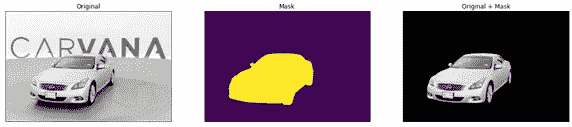
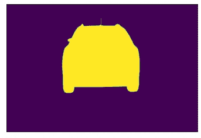
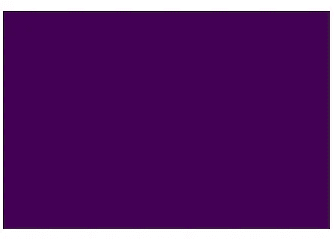
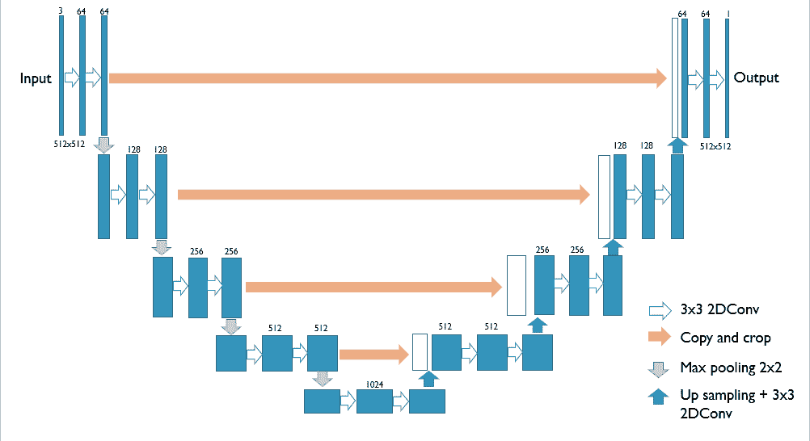
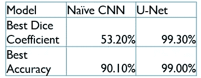
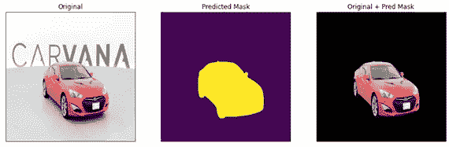
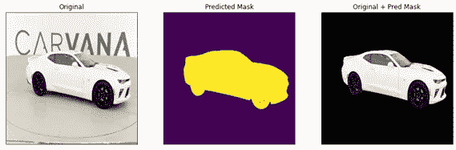
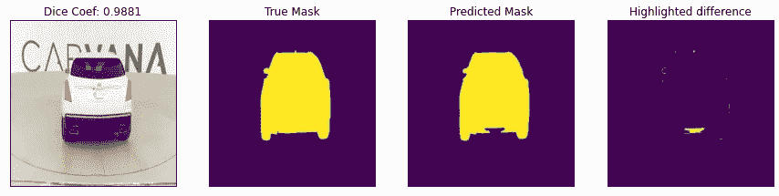
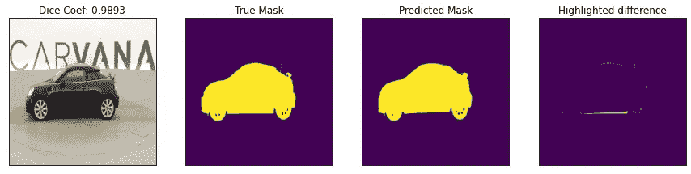

# 图像分割:用 Carvana 数据预测图像掩模

> 原文：<https://towardsdatascience.com/image-segmentation-predicting-image-mask-with-carvana-data-32829ca826a0?source=collection_archive---------25----------------------->

## 本文使用 CNN 和 U-Net 模型演示了使用 Carvana 数据进行图像分割的任务。

信用:[@自省 dsgn](https://unsplash.com/@introspectivedsgn)

在[我之前的博客](https://medium.com/analytics-vidhya/beginners-guide-on-image-classification-vgg-19-resnet-50-and-inceptionresnetv2-with-tensorflow-4909c6478941)中，我们冒险进入了图像分类领域，任务是为输入图像识别标签或类别。在我们之前的上下文中，我们对狗的照片进行了分类，人们可以了解算法识别的是哪种类型的狗。然而，假设一个人想知道狗是否由它的主人陪伴，或者在这些物体的图像和位置中是否有两只狗等等。在这种情况下，需要使用图像分割来代替。

想象一下，图像的每个像素都被赋予了特定的类别。以汽车图片为例，可以有三个类别:汽车、道路和背景的其余部分。这些类“告诉”计算机哪个像素属于哪个类。图像分割的任务是训练神经网络，该神经网络能够预测输入图像的逐像素类别。预测的输出被称为图像的“掩模”。该技术在物体识别、人脸识别、医学图像分析和卫星图像分析等方面都有应用。

在这个项目中，我们将使用两种不同的方法训练神经网络来预测 Carvana 数据的图像掩模，代码库可以在这里找到。

**#数据**

[数据集](https://www.kaggle.com/c/carvana-image-masking-challenge/overview)来自 Carvana 的 Kaggle 上举办的图像屏蔽挑战。

来自数据集的样本图片。左图是原始照片，中间显示面具，右图显示原始减去背景，只保留汽车。

目前只有两个班级:

*   类别 0:背景
*   类别 1:前景，汽车

每辆车都有 16 张不同位置的 1918*1280 像素的高质量照片。在列车组中，有 318 节车厢，总共 5088 幅图像；和 6254 辆汽车，总共 100，064 幅图像。我们将使用训练集来分割训练和验证数据，而模型将完全看不到测试集。

对于数据预处理，我们选择使用 Keras 图像处理简单地水平翻转图像。

**#引入骰子系数**

在制定任务时，我们认识到生成图像掩模类似于一个分类任务，因为模型为每个像素预测一个类别标签。因此，用于分类任务的评估度量，例如准确性，似乎是该任务的自然选择，不是吗？然而，情况并非如此，我们需要为此任务引入一个新的指标。在这里，我将使用数据集举例说明。

真实面具

掩模预测

左边的图像是从训练集中随机选择的真实遮罩。黄色区域是汽车，紫色是背景。我们还观察到前景占总像素的 18%，而背景占 82%。一般来说，汽车(前景)只占图像总尺寸的不到 20%。

假设我们有一个完全紫色的遮罩预测，换句话说，它预测只有背景出现在图像中，而没有检测到前景。

如果我们评估准确，它给我们一个体面的 82%的分数，因为背景是正确预测的。听起来很棒？

然而，图像分割不仅学习图像中的内容，还学习图像中的位置。准确性作为一种衡量标准将无法捕捉“在哪里”的信息。在这种情况下，我们引入骰子系数来同时捕捉“什么”和“哪里”。

Dice 系数逐类地度量两幅图像之间的相似性。1 分表示两幅图像完全相同，0 分表示完全不同。如果我们拿上面同样的例子，dice coefficient 给出的分数是 41%。

计算如下:

> 两幅图像的总像素数合计= 200(为简单起见，我们假设每张图片是 100 个像素，而不是实际的像素数)
> 
> 前景(汽车):重叠区域= 0
> 
> *(2 *重叠面积)/(总像素组合)= 0/200 = 0*
> 
> 背景:重叠面积= 82
> 
> *(2 *重叠面积)/(总像素组合)= 82*2/200 = 0.82*
> 
> *骰子=(前景+背景)/2 =(0%+82%)/2 =****41*%**

我们将使用 dice 系数作为主要指标来评估我们的模型性能，并将准确性作为一个指标进行监控。下面的代码片段定义了项目使用的 dice 系数。骰子系数可用于骰子损失，即(1-骰子系数)。平滑变量用于通过不使项接近零来帮助反向传播，并防止过拟合相对较大的值。

**#型号:CNN**

我们的第一个模型是一个简单的三层卷积模型，作为一个简单的基线。输入图片是具有 3 个通道的原始图片，并且为了更快的训练而调整为较小的尺寸。

使用的损失函数是二元交叉熵，监控的度量是 dice 系数和准确度。

**#型号:U-Net**

然后，经过一些研究，我们转向了一种叫做 U-Net 的模型结构。它是一种有效的图像分割模型结构。U-Net 网络有两部分:编码器(下采样器)和解码器(上采样器)。它看起来像原始符号上的 U 形。

U-Net 架构

左侧是编码器，数据被压缩成一个更小但更深的矩阵。然后，右侧使用编码器的输出以及编码器各自的输入进行解码(跳过连接)。你可以在这里了解更多关于[优信网的信息。](https://lmb.informatik.uni-freiburg.de/people/ronneber/u-net/)

使用的损失函数是二元交叉熵，监控的度量是 dice 系数和准确度。

**#结果**

来自训练 40 个验证时期的结果

结果表明，U-Net 模型远远优于朴素模型，这是意料之中的。

这个模型对于看不见的数据也有很好的推广。下面是一些看不见的图像和它的预测遮罩。

具有来自 U-Net 模型的预测掩码的测试集图像

**#讨论**

这个项目在两周内完成了，还有改进的余地。

选择损失函数(二元交叉熵)是为了简单和方便。它不一定是这类任务的最佳损失函数。可以考虑混合使用骰子损失和二元交叉熵或骰子损失。

当我们可视化来自训练集的具有最高误差的图像时，我们意识到发现的常见问题是缺少边界线、缺少靠近阴影的部分以及缺少天线等精细细节。

汽车的黑色部分与地板上的阴影混为一谈；顶部的天线丢失

车的边缘线没抓拍到

我希望你喜欢阅读它！呆在家里，注意安全。