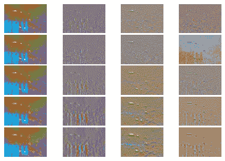
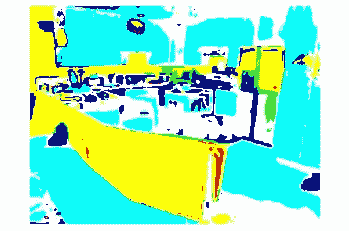
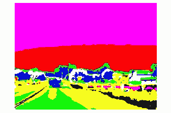

# 基于 K-均值的图像分割

> 原文：<https://towardsdatascience.com/image-segmentation-using-k-means-6b450c029208?source=collection_archive---------30----------------------->

## 使用 NumPy/SciPy 从头开始图像分割

虽然预先存在的库(如 OpenCV)节省了时间和精力，但从头开始实现基本算法是另一种乐趣。

在这篇文章中，我将展示在 python 中使用 k-means 一步步实现图像分割。我们在从[太阳数据库](https://groups.csail.mit.edu/vision/SUN/)中采样的 8 个类别的 1100 幅图像上训练管道。图像分割是将相似类型的像素组合在一起。流水线可以进一步扩展以对图像进行分类。例如，公园的图像将比高速公路的图像具有更多数量的绿色像素。我们将在以后的文章中讨论分类。

我们发现一个公园的图像会有更多的绿色像素。虽然颜色是区分像素的好方法，但它有时会产生问题(例如，水和天空具有相同的颜色)。因此，我们需要其他方法来表征像素。换句话说，我们需要从图像中提取有用的特征。深度学习算法，如 CNN 的自动为我们找到有用的功能，但这超出了本文的范围。

为了提取特征，我们将使用四种具有多尺度的图像滤波器-高斯、高斯在 x 方向上的导数、高斯在 y 方向上的导数以及高斯的拉普拉斯算子。每个滤波器从图像中提取不同的特征集。较小的比例拾取较窄的要素，较大的比例拾取较宽的要素(想想森林和树木)。我们将不同尺度的滤波器集合称为“滤波器组”。



对滤波器组的图像响应(作者)

上图中的每一行代表一个特定的刻度，每一列代表一种不同类型的过滤器。高斯滤波器(第一列)模糊了图像并忽略了较高的频率。X 方向的高斯导数(第二列)拾取垂直边缘。Y 方向上的高斯导数(第三列)拾取水平边缘。高斯的拉普拉斯算子(第四列)检测快速强度变化的区域。

我们在图像上运行滤波器组(这是一个大小为 H*W*3 的数组，其中 H 和 W 分别是图像的高度和宽度，3 是通道的数量)。我们输出一个大小为(H*W*3F)的数组，其中 F 是滤波器组的大小。如果我们在 5 个不同的比例下使用 4 个滤波器，F 就是 4*5=20

从 T 个训练图像中，我们得到大小为 T*H*W*3F 的滤波器响应向量。为了节省计算资源，我们从每个图像中选择阿尔法随机滤波器响应。因此，滤波器响应向量的最终大小是* T * F。

我们将使用这个滤波器响应向量作为 k-means 算法的输入。它将输出 K 个(超参数)聚类中心。然后，测试图像的每个像素将被映射到最近的聚类中心，并涂上相应的颜色以形成“视觉图”。产生的“视觉地图”将具有相似的像素组合在一起，并且将是我们的“图像分割”算法的最终输出。

太棒了，让我们看看整个管道的运作。我们将从定义超参数的值开始，这些值可以在以后进行调整以提高性能。

```
filter_scales=[1,1.5,2]
K=10
alpha=25
```

我们现在定义函数 extract_fiter_responses，它为大小为 H*W*3 和滤波器组大小为 f 的图像返回大小为 H*W*3F 的向量。我们使用 scipy 中的内置函数来生成 filter_responses。

```
def extract_filter_responses(filter_scales, img):

    if len(img.shape)==2:     #convert image into 3 channel
        img=np.dstack((img,img,img))

    modified_img=skimage.color.rgb2lab(img) r_channel=modified_img[:,:,0]
    g_channel=modified_img[:, :,1]
    b_channel=modified_img[:, : ,2] g=[]
    for i in range(len(filter_scales)):
        modified_r_channel=scipy.ndimage.gaussian_filter(r_channel,      filter_scales[i])
        modified_g_channel=scipy.ndimage.gaussian_filter(g_channel, filter_scales[i])
        modified_b_channel=scipy.ndimage.gaussian_filter(b_channel, filter_scales[i])

        modified_r_dog_X=scipy.ndimage.gaussian_filter(r_channel, filter_scales[i],(0,1))
        modified_g_dog_X=scipy.ndimage.gaussian_filter(g_channel, filter_scales[i], (0,1))
        modified_b_dog_X=scipy.ndimage.gaussian_filter(b_channel, filter_scales[i], (0,1))

        modified_r_dog_Y=scipy.ndimage.gaussian_filter(r_channel, filter_scales[i],(1,0))
        modified_g_dog_Y=scipy.ndimage.gaussian_filter(g_channel, filter_scales[i], (1,0))
        modified_b_dog_Y=scipy.ndimage.gaussian_filter(b_channel, filter_scales[i], (1,0))

        modified_r_log=scipy.ndimage.gaussian_laplace(r_channel, filter_scales[i])
        modified_g_log=scipy.ndimage.gaussian_laplace(g_channel, filter_scales[i])
        modified_b_log=scipy.ndimage.gaussian_laplace(b_channel, filter_scales[i])

        a=np.dstack((modified_r_channel, modified_g_channel, modified_b_channel))
        b=np.dstack((modified_r_dog_X, modified_g_dog_X, modified_b_dog_X))
        c=np.dstack((modified_r_dog_Y, modified_g_dog_Y, modified_b_dog_Y))
        d=np.dstack((modified_r_log, modified_g_log, modified_b_log))
        filter_response=np.dstack((a,b,c,d))
        g.append(filter_response)

    filter_responses=np.dstack(g)

    return filter_responses
```

下一个函数将从 extract_filter_responses 返回的向量中提取 alpha 随机过滤器响应

```
def compute_dictionary_one_image(alpha, img):

    response=extract_filter_responses(filter_scales, img)

    d=response.shape[0]*response.shape[1]
    response=response.reshape((d,-1)) 
    alphas=np.random.choice(d, alpha) alphaed_response=response[alphas]

    return alphaed_response
```

下一个函数将来自每个图像的 alpha 响应汇集到一个向量中，并应用来自 scipy 的 k-means 函数。该函数将训练文件路径作为参数。

```
def compute_dictionary(K, alpha, train_files):

    m=[]
    for i in range(len(train_files)):       
        img_path = train_files[i]
        img = Image.open(img_path)
        img = np.array(img).astype(np.float32)/255
        re=compute_dictionary_one_image(alpha, img)
        m.append(re)

    m=np.array(m)
    n=m.shape[0]*m.shape[1]
    final_response=m.reshape((n,-1))

    kmeans=KMeans(n_clusters=K).fit(final_response) dictionary=kmeans.cluster_centers_
    return dictionary
```

酷毙了。所以现在我们有 K 个聚类中心。对于一个测试图像，我们需要用最近的聚类中心映射图像的每个像素，并绘制结果可视化。我们使用 scipy.spatial.distance.cdist 来查找最近的聚类中心的索引。下面的 get_visual_maps()函数说明了这一点

```
def get_visual_words(filter_scales, img, dictionary):

   response=extract_filter_responses(filter_scales, img)
   response=response.reshape(response.shape[0]*response.shape[1],-1)

   dist=scipy.spatial.distance.cdist(response, dictionary)

   visual_words=np.argmin(dist, axis=1)
   visual_words=visual_words.reshape(img.shape[0],img.shape[1])

   return visual_words
```

## 把所有的加在一起

我们现在将使用这些函数来创建一个管道，该管道在 1177 个图像的训练集上运行 k-means，并在一个测试图像上检查性能。

```
#compute cluster centers
compute_dictionary(K, alpha, train_files)#test on a image 

img_path = 'image path'
img = Image.open(img_path)
img = np.array(img).astype(np.float32)/255
wordmap = visual_words.get_visual_words(filter_scales, img, dictionary)plt.imshow(wordmap)
```

# 结果

以下是该算法的一些可视化示例。我用的滤镜尺度=[1，1.5，2]，K=25，alpha=10。我们能够识别图像的不同区域。在(厨房的)第一张图片中，我们可以识别不同的区域，桌子、炉子等等。请随意调整这些参数，看看您是否能获得更好的结果！

在下一篇文章中，我们将扩展按类型分类图像的管道(第一个是厨房的图像，第二个是高速公路的图像，等等..)



k-means 后的输出(由作者提供)