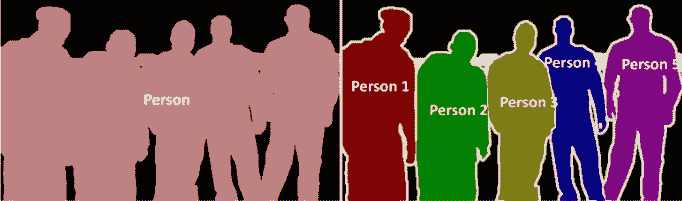
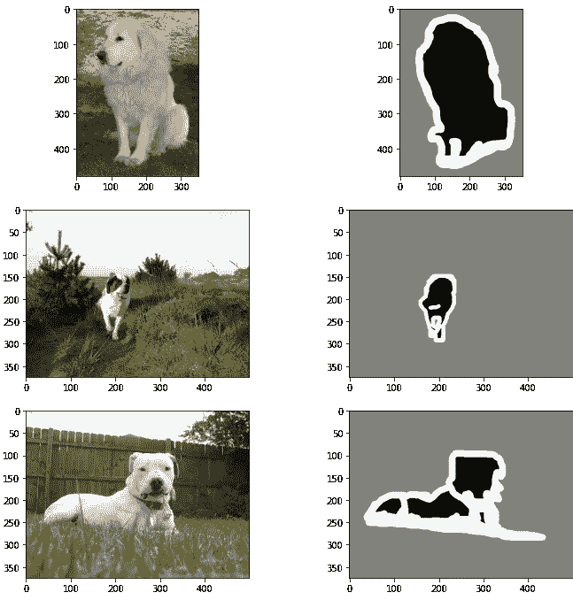
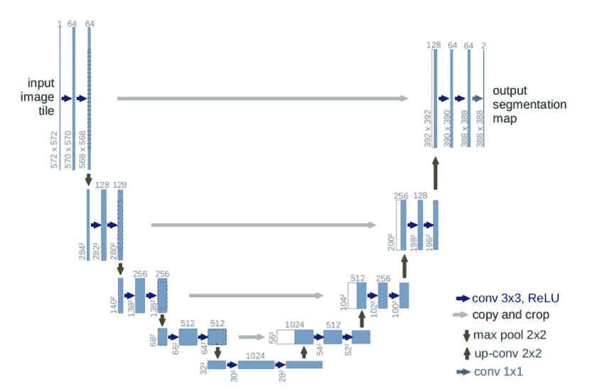
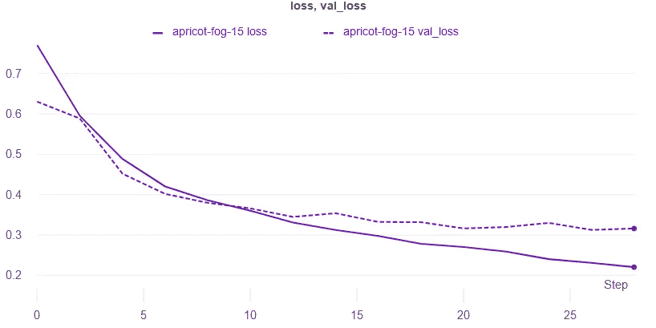

# 基于 Keras 和 W&B 的图像分割

> 原文：<https://towardsdatascience.com/image-segmentation-using-keras-and-w-b-98223c38e4d4?source=collection_archive---------28----------------------->

## **该报告利用 Keras 中类似 UNET 的架构探索语义分割，并交互式可视化模型对权重偏差的预测&。**

## 点击查看互动报道[。这里有](https://wandb.ai/ayush-thakur/image-segmentation/reports/Image-Segmentation-Using-Keras-and-W-B--VmlldzoyNTE1Njc)[的 Colab 笔记本](https://colab.research.google.com/drive/1rXV31gdyqEiXCtmSgff-H-VRuOSzv7IH?usp=sharing)。

# 介绍

您是否有兴趣了解图像中某个对象的位置？这个物体的形状是什么？哪些像素属于对象？为了实现这一点，我们需要分割图像，即将图像的每个像素分类到它所属的对象，或者给图像的每个像素一个标签，而不是给图像一个标签。

**因此，图像分割是为图像中的每个对象学习逐像素掩模的任务。**与为图像中出现的每个对象给出边界框坐标的对象检测不同，图像分割对图像中的对象给出了更精细的理解。



**图 1** :语义切分和实例切分。([来源](https://www.researchgate.net/figure/Semantic-segmentation-left-and-Instance-segmentation-right-8_fig1_339616270))

图像分割可以大致分为两种类型:

*   **语义分割:**这里，每个像素属于一个特定的类。图 1 中的左图是语义分割的一个例子。像素或者属于人(一个类别)，或者属于背景(另一个类别)。
*   **实例分割:**这里，每个像素属于一个特定的类。但是，属于离散对象的像素用不同的颜色(蒙版值)标记。图 1 中的右图是一个实例分割的例子。属于该人物类别的像素被不同地着色。

该报告将**建立一个语义分割模型**，并在[牛津-IIIT Pet 数据集](https://www.robots.ox.ac.uk/%7Evgg/data/pets/)上对其进行训练。我们将**交互可视化我们模型的预测**权重&偏差。

# 数据集

我们将使用[牛津-IIIT Pet 数据集](https://www.robots.ox.ac.uk/%7Evgg/data/pets/)来训练我们的类 UNET 语义分割模型。

数据集由图像及其像素式掩膜组成。逐像素遮罩是每个像素的标签。

*   第 1 类:属于宠物的像素。
*   第 2 类:属于宠物轮廓的像素。
*   第三类:属于背景的像素。



**图 2** :宠物和它们的像素式遮罩。

## 下载数据集

```
!curl -O [http://www.robots.ox.ac.uk/~vgg/data/pets/data/images.tar.gz](http://www.robots.ox.ac.uk/~vgg/data/pets/data/images.tar.gz)!curl -O [http://www.robots.ox.ac.uk/~vgg/data/pets/data/annotations.tar.gz](http://www.robots.ox.ac.uk/~vgg/data/pets/data/annotations.tar.gz)!tar -xf images.tar.gz
!tar -xf annotations.tar.gz
```

## 数据集准备

`images/`和`annotations/trimaps`目录包含提取的图像及其注释(按像素的遮罩)。所需图像为`.jpg`格式，而注释为`.png`格式。但是，在这些目录中有一些我们不需要的文件。因此，我们将准备两个列表- `input_img_paths`和`annotation_img_paths`，其中包含所需图像和注释的路径。

```
IMG_PATH = 'images/'
ANNOTATION_PATH = 'annotations/trimaps/'

input_img_paths = sorted(
    [
        os.path.join(IMG_PATH, fname)
        for fname in os.listdir(IMG_PATH)
        if fname.endswith(".jpg")
    ]
)
annotation_img_paths = sorted(
    [
        os.path.join(ANNOTATION_PATH, fname)
        for fname in os.listdir(ANNOTATION_PATH)
        if fname.endswith(".png") and not fname.startswith(".")
    ]
)

print(len(input_img_paths), len(annotation_img_paths))
```

总共有 7390 张图片和注释。我们将使用 1000 幅图像及其注释作为验证集。

## 使用`tf.data`的数据加载器

我们将使用`tf.data.Dataset`构建我们的输入管道。

```
IMG_SHAPE = 128
AUTO = tf.data.experimental.AUTOTUNE
BATCH_SIZE = 32

def scale_down(image, mask):
  # apply scaling to image and mask
  image = tf.cast(image, tf.float32) / 255.0
  mask -= 1
  return image, mask

def load_and_preprocess(img_filepath, mask_filepath):
   # load the image and resize it
    img = tf.io.read_file(img_filepath)
    img = tf.io.decode_jpeg(img, channels=3)
    img = tf.image.resize(img, [IMG_SHAPE, IMG_SHAPE])

    mask = tf.io.read_file(mask_filepath)
    mask = tf.io.decode_png(mask, channels=1)
    mask = tf.image.resize(mask, [IMG_SHAPE, IMG_SHAPE])

    img, mask = scale_down(img, mask)

    return img, mask

# shuffle the paths and prepare train-test split
input_img_paths, annotation_img_paths = shuffle(input_img_paths, annotation_img_paths, random_state=42)
input_img_paths_train, annotation_img_paths_train = input_img_paths[: -1000], annotation_img_paths[: -1000]
input_img_paths_test, annotation_img_paths_test = input_img_paths[-1000:], annotation_img_paths[-1000:]

trainloader = tf.data.Dataset.from_tensor_slices((input_img_paths_train, annotation_img_paths_train))
testloader = tf.data.Dataset.from_tensor_slices((input_img_paths_test, annotation_img_paths_test))

trainloader = (
    trainloader
    .shuffle(1024)
    .map(load_and_preprocess, num_parallel_calls=AUTO)
    .batch(BATCH_SIZE)
    .prefetch(AUTO)
)

testloader = (
    testloader
    .map(load_and_preprocess, num_parallel_calls=AUTO)
    .batch(BATCH_SIZE)
    .prefetch(AUTO)
)
```

# 模型

这里使用的模型是香草 [UNET 建筑](https://arxiv.org/abs/1505.04597)。它由编码器和解码器网络组成。这个架构的输入是图像，而输出是逐像素的贴图。您可以通过 W & B 报告在[深度生成建模中了解更多关于编码器-解码器(Autoencoder)网络的信息。](https://wandb.ai/ayush-thakur/keras-gan/reports/Towards-Deep-Generative-Modeling-with-W-B--Vmlldzo4MDI4Mw)

类似 UNET 的架构在自我监督的深度学习任务中很常见，如[图像修复](https://www.wandb.com/articles/introduction-to-image-inpainting-with-deep-learning)。

你可以在这个[逐行解释](/unet-line-by-line-explanation-9b191c76baf5)中了解更多关于 UNET 建筑的信息。



图 3 :典型的 UNET 建筑。([来源](/unet-line-by-line-explanation-9b191c76baf5))

下面显示的代码片段构建了我们的语义分割模型架构。

```
class SegmentationModel:
  '''
  Build UNET like model for image inpaining task.
  '''
  def prepare_model(self, OUTPUT_CHANNEL, input_size=(IMG_SHAPE,IMG_SHAPE,3)):
    inputs = Input(input_size)

    # Encoder 
    conv1, pool1 = self.__ConvBlock(32, (3,3), (2,2), 'relu', 'same', inputs) 
    conv2, pool2 = self.__ConvBlock(64, (3,3), (2,2), 'relu', 'same', pool1)
    conv3, pool3 = self.__ConvBlock(128, (3,3), (2,2), 'relu', 'same', pool2) 
    conv4, pool4 = self.__ConvBlock(256, (3,3), (2,2), 'relu', 'same', pool3) 

    # Decoder
    conv5, up6 = self.__UpConvBlock(512, 256, (3,3), (2,2), (2,2), 'relu', 'same', pool4, conv4)
    conv6, up7 = self.__UpConvBlock(256, 128, (3,3), (2,2), (2,2), 'relu', 'same', up6, conv3)
    conv7, up8 = self.__UpConvBlock(128, 64, (3,3), (2,2), (2,2), 'relu', 'same', up7, conv2)
    conv8, up9 = self.__UpConvBlock(64, 32, (3,3), (2,2), (2,2), 'relu', 'same', up8, conv1)

    conv9 = self.__ConvBlock(32, (3,3), (2,2), 'relu', 'same', up9, False)

    # Notice OUTPUT_CHANNEL and activation
    outputs = Conv2D(OUTPUT_CHANNEL, (3, 3), activation='softmax', padding='same')(conv9)

    return Model(inputs=[inputs], outputs=[outputs])  

  def __ConvBlock(self, filters, kernel_size, pool_size, activation, padding, connecting_layer, pool_layer=True):
    conv = Conv2D(filters=filters, kernel_size=kernel_size, activation=activation, padding=padding)(connecting_layer)
    conv = Conv2D(filters=filters, kernel_size=kernel_size, activation=activation, padding=padding)(conv)
    if pool_layer:
      pool = MaxPooling2D(pool_size)(conv)
      return conv, pool
    else:
      return conv

  def __UpConvBlock(self, filters, up_filters, kernel_size, up_kernel, up_stride, activation, padding, connecting_layer, shared_layer):
    conv = Conv2D(filters=filters, kernel_size=kernel_size, activation=activation, padding=padding)(connecting_layer)
    conv = Conv2D(filters=filters, kernel_size=kernel_size, activation=activation, padding=padding)(conv)
    up = Conv2DTranspose(filters=up_filters, kernel_size=up_kernel, strides=up_stride, padding=padding)(conv)
    up = concatenate([up, shared_layer], axis=3)

    return conv, up
```

**注意**对于我们的数据集来说`OUTPUT_CHANNEL`是 3。这是因为有三类像素，如数据集部分所述。考虑我们正在进行多类分类，其中每个像素可以属于三类中的任何一类。

还有，**注意**由于是每像素多类分类问题，所以输出激活函数是`softmax`。

```
OUTPUT_CHANNEL = 3

model = SegmentationModel().prepare_model(OUTPUT_CHANNEL)
model.compile(optimizer="adam", loss="sparse_categorical_crossentropy")
```

最后用`sparse_categorical_crossentropy`编译模型。稀疏，因为按像素的遮罩/注释是整数。

# `SemanticLogger`回调-预测的交互式可视化

在进行语义分割时，您可以在权重和偏差中交互式地可视化模型的预测。如果您的图像带有用于语义分段的遮罩，您可以记录遮罩并在 UI 中打开和关闭它们。点击查看官方文档[。](https://docs.wandb.com/library/log#images-and-overlays)

Stacey Svetlichnaya[的报告](https://wandb.ai/stacey)[语义分割的图像遮罩](https://wandb.ai/stacey/deep-drive/reports/Image-Masks-for-Semantic-Segmentation--Vmlldzo4MTUwMw)将带您了解该工具的交互控件。它涵盖了日志图像和遮罩的各种麻烦。

下面显示的代码片段是我们的`SemanticLogger`回调的助手函数。函数`labels`返回一个字典，其中`key`是类值，`value`是标签。函数`wandb_mask`以所需的格式返回图像、预测掩码和基本事实掩码。

```
segmentation_classes = ['pet', 'pet_outline', 'background']

# returns a dictionary of labels
def labels():
  l = {}
  for i, label in enumerate(segmentation_classes):
    l[i] = label
  return l

# util function for generating interactive image mask from components
def wandb_mask(bg_img, pred_mask, true_mask):
  return wandb.Image(bg_img, masks={
      "prediction" : {
          "mask_data" : pred_mask, 
          "class_labels" : labels()
      },
      "ground truth" : {
          "mask_data" : true_mask, 
          "class_labels" : labels()
      }
    }
  )
```

我们的`SemanticLogger`是一个定制的 Keras 回调函数。我们可以将它传递给`model.fit`来记录我们的模型在一个小型验证集上的预测。权重和偏差将自动覆盖图像上的蒙版。

```
class SemanticLogger(tf.keras.callbacks.Callback):
    def __init__(self):
        super(SemanticLogger, self).__init__()
        self.val_images, self.val_masks = next(iter(testloader))

    def on_epoch_end(self, logs, epoch):
        pred_masks = self.model.predict(self.val_images)
        pred_masks = np.argmax(pred_masks, axis=-1)
        # pred_masks = np.expand_dims(pred_masks, axis=-1)

        val_images = tf.image.convert_image_dtype(self.val_images, tf.uint8)
        val_masks = tf.image.convert_image_dtype(self.val_masks, tf.uint8)
        val_masks = tf.squeeze(val_masks, axis=-1)

        pred_masks = tf.image.convert_image_dtype(pred_masks, tf.uint8)

        mask_list = []
        for i in range(len(self.val_images)):
          mask_list.append(wandb_mask(val_images[i].numpy(), 
                                      pred_masks[i].numpy(), 
                                      val_masks[i].numpy()))

        wandb.log({"predictions" : mask_list})
```

我们很快就会看到结果。

# 结果

现在到了激动人心的部分。我已经训练了 15 个纪元的模型。损失和验证损失指标如下图所示。*随意训练更长时期的模型，并使用其他超参数。*

[](https://colab.research.google.com/drive/1rXV31gdyqEiXCtmSgff-H-VRuOSzv7IH?usp=sharing) [## 谷歌联合实验室

### 编辑描述

colab.research.google.com](https://colab.research.google.com/drive/1rXV31gdyqEiXCtmSgff-H-VRuOSzv7IH?usp=sharing) 

培训和验证损失如图**图 3** 所示。经过一些时期后，模型开始过度拟合。



**图 4** :培训和验证损失指标。([点击这里查看互动报道。](https://wandb.ai/ayush-thakur/image-segmentation/reports/Image-Segmentation-Using-Keras-and-W-B--VmlldzoyNTE1Njc))

`SemanticLogger`的结果如下所示。**点击下面** [**媒体面板**](https://wandb.ai/ayush-thakur/image-segmentation/reports/Image-Segmentation-Using-Keras-and-W-B--VmlldzoyNTE1Njc#Results-7) **中的⚙️图标(SemanticLogger 的结果)查看交互控件**。您可以分别可视化图像和遮罩，并可以选择要可视化的语义类。

# 观察

*   该模型学习很好地预测`pet`和`background`类。
*   我们可以看到模型很难细分`pet_outline`类。这是因为高等级的不平衡，并且模型没有被正则化以对抗这种不平衡。


**图 5** :语义记录器回调结果。([点击此处查看互动报道。](https://wandb.ai/ayush-thakur/image-segmentation/reports/Image-Segmentation-Using-Keras-and-W-B--VmlldzoyNTE1Njc))

# 结论和最终想法

我希望你喜欢这篇关于语义分割的报告。这份报告有两个目的:

*   让感兴趣的人更容易使用语义分割技术。
*   展示权重和偏差如何帮助交互式地可视化模型的预测和度量。此外，展示人们可以从这些可视化中得到的观察结果。

最后，以下是一些值得一读的资源:

*   [语义图像分割概述](https://www.jeremyjordan.me/semantic-segmentation/)
*   [图像分割](https://www.tensorflow.org/tutorials/images/segmentation)
*   [驾驶座上的视野](https://wandb.ai/stacey/deep-drive/reports/The-View-from-the-Driver-s-Seat--Vmlldzo1MTg5NQ)

我很想在评论区得到你的反馈。😄