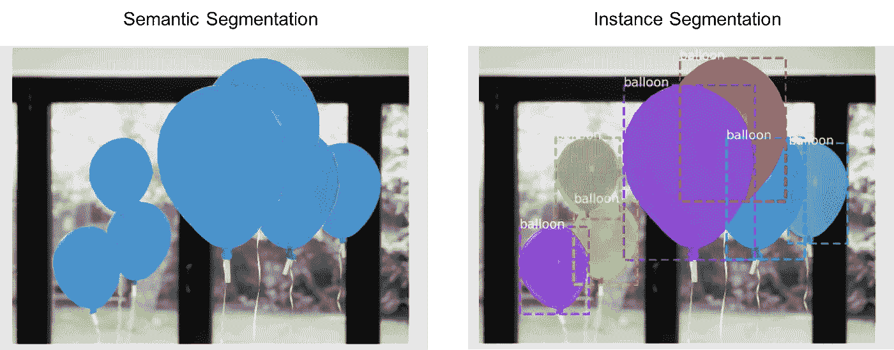
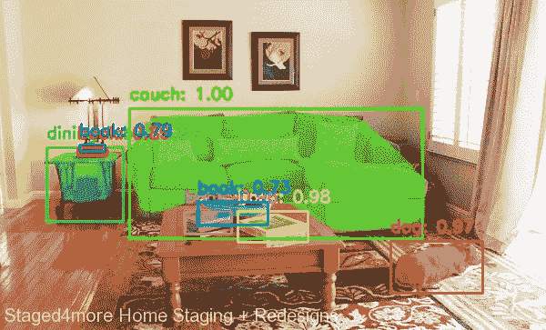
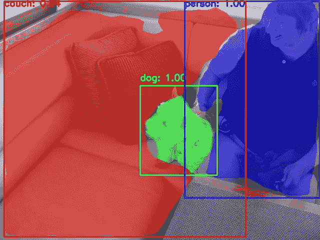

# 基于掩模 R-CNN 的图像分割

> 原文：<https://towardsdatascience.com/image-segmentation-using-mask-r-cnn-8067560ed773?source=collection_archive---------10----------------------->

## 使用 Python 和 OpenCV 执行实例分割的简单教程

计算机视觉作为一个研究领域，近年来有了很大的发展。自从引入卷积神经网络以来，在诸如分类、对象检测、图像分割等领域中的技术发展水平。不断受到挑战。在提供非常高计算能力的复杂硬件的帮助下，这些神经网络模型正被实时应用于新兴领域，如自主导航。

我们今天关注的主题是计算机视觉的一个子领域，称为图像分割。更准确地说，我们将对图像或视频执行实例分割。好吧，那是一大堆技术术语。让我们倒回去一点，理解这些术语的意思。每一个都需要一个帖子，我们现在不会深入讨论。在不久的将来，我可能会分别就它们写一些文章。现在，让我们以一种简化的方式来理解什么是图像分割。此外，如果你不知道什么是对象检测，我建议你仔细阅读它，因为它会使你更容易理解即将到来的概念。我还写过一篇关于实现对象检测算法的简明文章。如果你对它感兴趣，你可以在我的个人资料中找到它。

## **什么是图像分割？**

图像分割是将图像中的每个像素分类为属于特定类别的过程。虽然有几种类型的图像分割方法，但在深度学习领域，两种类型的分割占主导地位:

*   语义分割
*   实例分割

让我对两者做一个简明的比较。在语义分割中，属于特定类别的对象的每个像素被赋予相同的标签/颜色值。另一方面，在实例分割中，一个类的每个对象的每个像素被给予单独的标签/颜色值。看看下面的图片，把前面的句子再读一遍，就能理解清楚了。希望现在有意义:)

来源— [物质港](https://engineering.matterport.com/splash-of-color-instance-segmentation-with-mask-r-cnn-and-tensorflow-7c761e238b46)

## 实施！

Mask R-CNN(区域卷积神经网络)是一个实例分割模型。在本教程中，我们将看到如何在 OpenCV 库的帮助下用 python 实现这一点。如果你有兴趣了解更多关于这个模型的内部工作原理，我在下面的参考部分给出了一些链接。这将帮助您更详细地理解这些模型的功能。

我们首先克隆(或下载)给定的存储库:-

 [## matterport/Mask_RCNN

### 这是 Mask R-CNN 在 Python 3、Keras 和 TensorFlow 上的实现。该模型生成边界框和…

github.com](https://github.com/matterport/Mask_RCNN) 

确保在 python 环境中安装了`**requirements.txt**` 中列出的所有依赖项。之后，不要忘记运行命令`**python setup.py install**`。我们将使用在 coco 数据集上预先训练的模型。权重可以从这里的[下载，类名可以从我的](https://github.com/matterport/Mask_RCNN/releases/download/v2.0/mask_rcnn_coco.h5)[库](https://github.com/GSNCodes/Instance_Segmentation_Mask_RCNN)的`**coco_classes.txt**`文件中获得。现在让我们开始在克隆或下载的存储库中创建一个名为`**mask.py**`的文件，并导入所需的库。

我们将使用自己的自定义类，因此将继承现有的`**CocoConfig**`类并覆盖其变量值。请注意，您可以根据您的 GPU 的能力来设置这些值。

现在我们将创建一个名为`**prepare_mrcnn_model()**`的函数，它负责读取类标签，并根据我们的自定义配置初始化模型对象。我们还指定了颜色到对象的映射来实现语义分割(如果需要的话)。我们稍后会谈到这一点。我们模型的模式应该设置为“推理”,因为我们将直接使用它进行测试。提供预训练权重的路径，以便可以将其加载到模型中。

下一个函数将是本教程最关键的部分。不要被它的长度吓到，它是迄今为止最简单的一个！我们现在将测试图像传递给模型对象的 detect 函数。这将为我们执行所有的对象检测和分割。我们现在有两个选择——我们可以选择为该类的每个对象分配相同的颜色，或者为每个对象分配不同的颜色，而不管其属于哪个类。因为这篇文章坚持实现实例分段，所以我选择了后者。我给了你灵活性去做这两件事，这样你可以加强你对同一件事的理解。这可以通过切换`instance_segmentation`参数来完成。

上面的代码绘制了对象的边界框，同时也在像素级别对其进行了分割。它还提供了对象所属的类以及分数。我还为您提供了使用 Matterport 的 MRCNN 实现中的内部可视化功能来可视化输出的选项。这可以使用上面显示的`mrcnn_visualize`布尔参数来访问。

既然我们已经有了模型和代码来处理它产生的输出，我们只需要读取并传入输入图像。这是通过下面给出的`perform_inference_image()`函数完成的。`save_enable`参数允许我们保存对象被分割的处理过的图像。

这现在也可以很容易地扩展到视频和网络直播，如这里的`perform_inference_video()`函数所示。

基础图像源— [可可女士数据集](https://cocodataset.org/#explore?id=444207)

正如你在上面的图片中看到的，每个物体都被分割了。该模型检测类别 book 的多个实例，因此为每个实例分配一种单独的颜色。

这是另一个对象被分割的例子。基础图片来源:[可可女士 D](https://cocodataset.org/#explore?id=377983) ataset

就是这样，伙计们！您现在有了一个可以使用的实例分段管道。这个项目的全部代码以及一个干净易用的界面可以在我的知识库中找到。还可以在那里找到使用它的其他步骤。我确实意识到你们中的一些人可能没有兼容 CUDA 的 GPU，或者根本没有 GPU。所以，我还提供了一个可以用来运行代码的 Colab 笔记本。在 Colab 中集成网络摄像头的使用仍然困扰着我，因此目前只能对图像和视频文件进行推断。 **Matterport 的 Mask R-CNN 代码默认支持 Tensorflow 1.x。如果你正在使用 TF2.x，你最好直接派生/克隆我的库，因为我已经移植了代码来支持 TF2.x**

我建议您阅读 R-CNN 架构(尤其是更快的 R-CNN ),以完全理解 Mask R-CNN 的工作原理。我在下面的参考资料部分给出了一些好的资源的链接。此外，对对象检测如何工作有一个良好的理解将使理解图像分割的关键变得容易。

*~ ~**SowmiyaNarayanan G*

**心灵字节:-**

“取得成功的秘诀在于开始行动。” —马克·吐温。

## PS:-

如果你有任何疑问，请随时联系我，我会帮助你的。我乐于接受各种批评，以改进我的工作，这样我就能更好地满足未来像你这样的探险家的需求。不要犹豫，让我知道你的想法。也可以在 [LinkedIn](https://www.linkedin.com/in/sowmiyanarayanan-g/) 上和我联系。

## 参考资料:-

*   最初的“面具 R-CNN”论文——【https://arxiv.org/pdf/1703.06870.pdf 
*   马特波特的面具 R-CNN [资源库](https://github.com/matterport/Mask_RCNN)<——“超级重要😃"
*   [R-CNN，快速 R-CNN，更快 R-CNN，YOLO——目标检测算法](/r-cnn-fast-r-cnn-faster-r-cnn-yolo-object-detection-algorithms-36d53571365e)
*   我的代码 [YOLOv3 实现](https://github.com/GSNCodes/YOLOv3_Object_Detection_OpenCV)