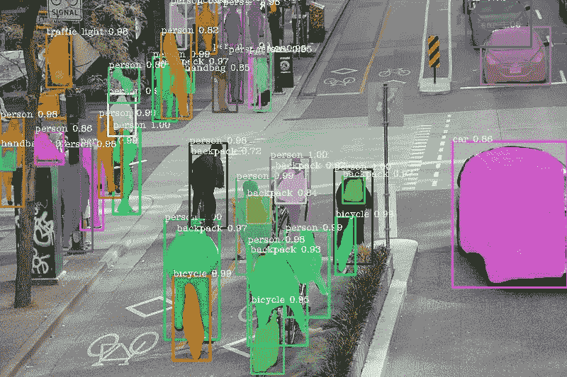
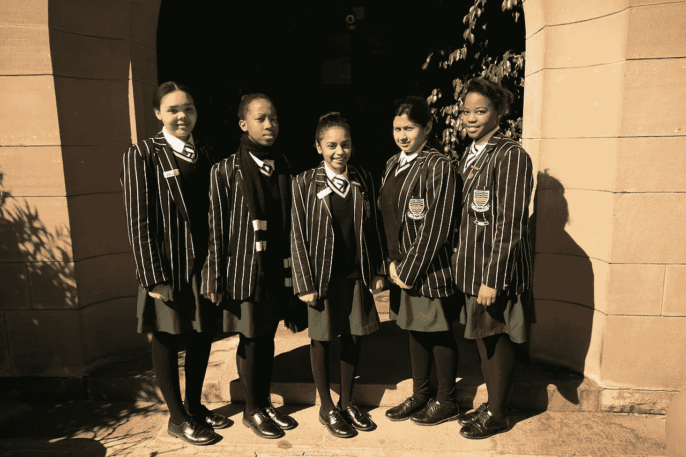
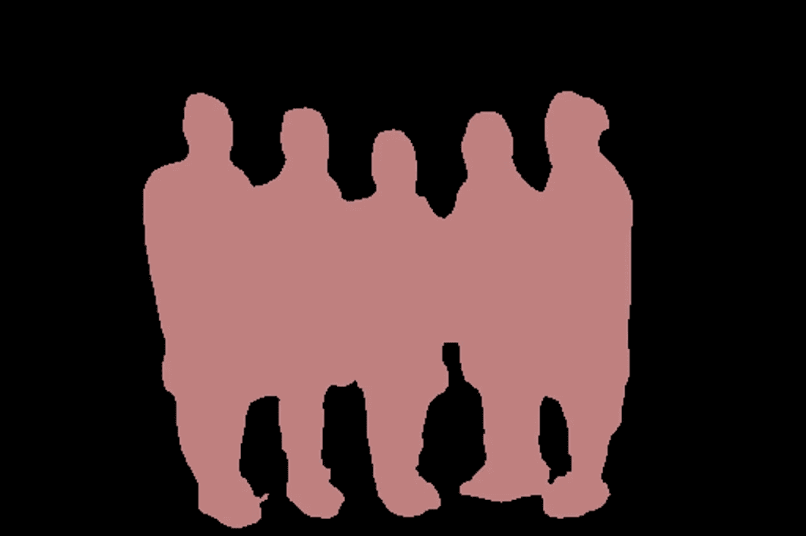
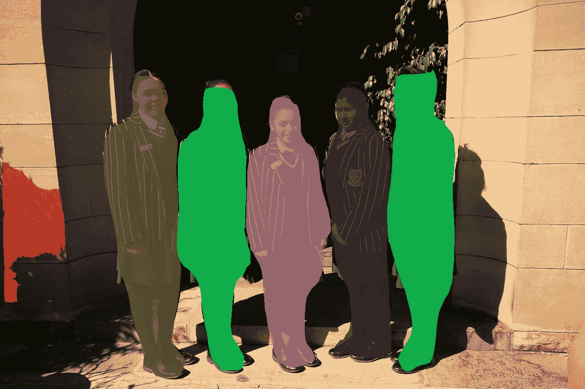
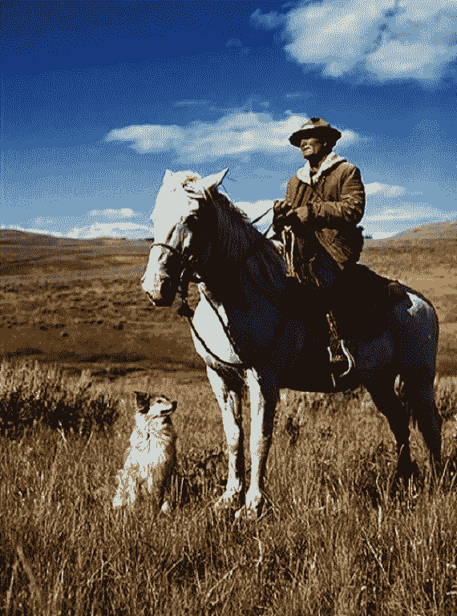
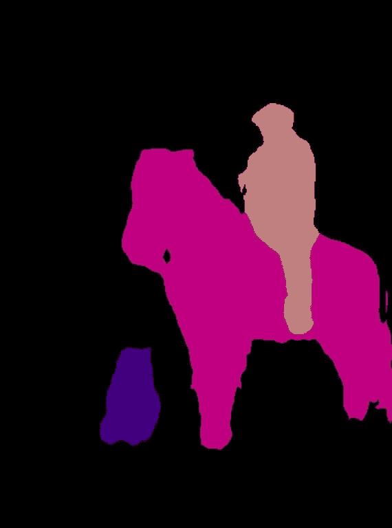
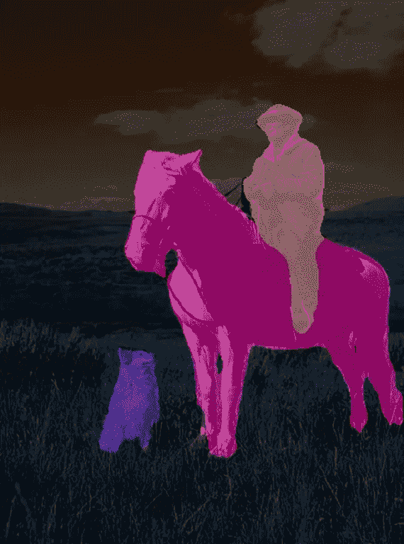
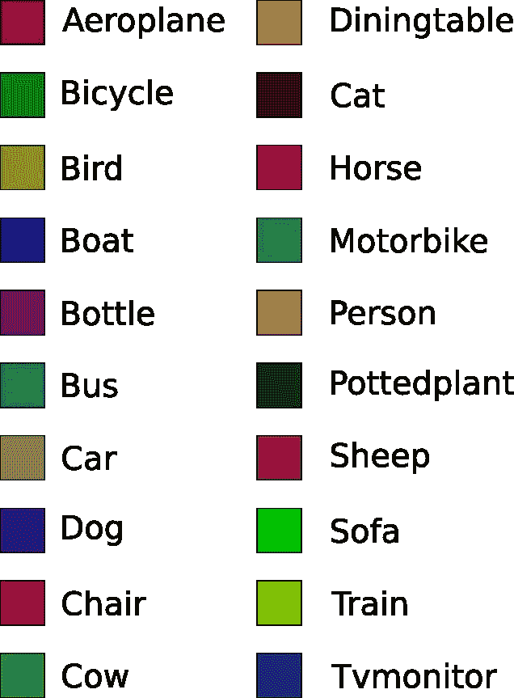
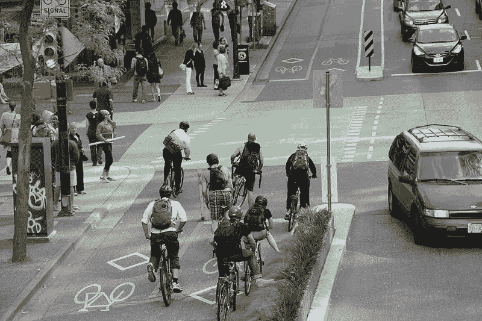
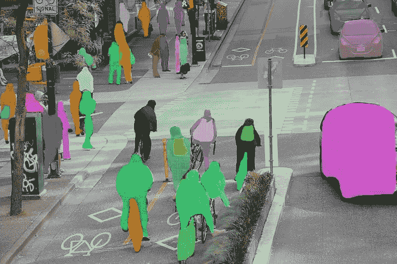

# 用 5 行代码实现图像分割

> 原文：<https://towardsdatascience.com/image-segmentation-with-six-lines-0f-code-acb870a462e8?source=collection_archive---------4----------------------->

## 用 PixelLib 进行语义和实例分割。



计算机视觉每天都在发展。图像分类和目标检测等流行的计算机视觉技术已被广泛用于解决许多计算机视觉问题。在图像分类中，对整个图像进行分类。对象检测通过检测图像中存在的单个对象的位置来扩展图像分类。

**图像分割:**

一些计算机视觉问题需要更深入地理解图像中的内容。分类和对象检测可能不适合解决这些问题。对解决一些关键的计算机视觉问题的有效技术的需求导致了图像分割的发明。

每个图像都由一组像素值组成。图像分割是在像素级别对图像进行分类的任务。通过根据分配给图像中存在的每个像素值的类别将图像分成不同的片段，机器能够更有效地分析图像。

图像分割中采用的独特技术使其适用于解决关键的计算机视觉问题。这些问题需要关于图像中存在的对象的详细信息，这些细节不能通过对整个图像进行分类或为图像中存在的对象提供边界框来提供。图像分割的一些主要贡献包括:

-无人驾驶汽车的高效视觉系统，用于有效理解道路场景。

-医学图像分割为执行诊断测试提供身体部分的分割。

*   卫星图像分析。

有两种主要类型的图像分割:

**语义分割:**用相同的像素值分类的对象用相同的颜色图分割。

**实例分割:**它不同于语义分割，因为同一对象的不同实例是用不同的颜色图分割的。



来源:[Wikicommons.com](https://commons.wikimedia.org/wiki/File:Jeppe_high_for_girls.jpg)(CC0)



语义分割



实例分割

**PixelLib:** 是一个为在现实生活问题中轻松实现图像分割而构建的库。PixelLib 是一个灵活的库，可以集成到需要应用图像分割的软件解决方案中。

**用五行代码就可以实现语义和实例分割。**

安装 PixelLib 及其依赖项:

安装最新版本的 tensorflow(tensorflow 2.0)和:

*   *pip3 安装张量流*

安装 opencv-python 与:

*   *pip3 安装 opencv-python*

使用以下内容安装 scikit-image:

*   *pip3 安装 scikit-image*

安装枕头，包括:

*   *pip3 安装枕头*

安装 Pixellib:

*   *pip3 安装 pixellib*

***用 PixelLib 实现语义分割:***

用 deeplabv3+模型实现语义切分的代码在 pascal voc 数据集上进行训练。

我们将观察每一行代码:

```
import pixellib
from pixellib.semantic import semantic_segmentation segment_image = semantic_segmentation()
```

执行语义分割的类是从 pixelLib 导入的，我们创建了该类的一个实例。

```
segment_image.load_pascalvoc_model(“deeplabv3_xception_tf_dim_ordering_tf_kernels.h5”)
```

在上面的代码中，我们加载了在 pascal voc 上训练的用于分割对象的 xception 模型。模型可以从[这里](https://github.com/ayoolaolafenwa/PixelLib/releases/download/1.1/deeplabv3_xception_tf_dim_ordering_tf_kernels.h5)下载。

```
segment_image.segmentAsPascalvoc(“path_to_image”, output_image_name = “path_to_output_image)
```

我们加载了该函数来对图像执行分割。该函数有两个参数…

*   *路径至图像:-* 这是待分割图像的路径。
*   *输出图像名称:-* 这是保存分割图像的路径。它将保存在您当前的工作目录中。

**sample1.jpg**



来源:[pxhere.com](https://pxhere.com/en/photo/623701)(CCO)



分割后保存的图像，图像中的物体被分割。如果您愿意，可以在图像上应用分段覆盖。

```
segment_image.segmentAsPascalvoc("sample1.jpg", output_image_name = "image_new.jpg", overlay = True)
```



我们添加了额外的参数**叠加**并将其设置为**真**，我们获得了一个在物体上有分段叠加的图像。

这个异常模型是在 pascal voc 数据集上训练的，这个数据集有 20 个对象类别。

对象及其相应的颜色映射



**PixelLib 的特殊用途可能需要您返回分段输出的数组:**

*使用代码*获得分段输出的数组

```
output, segmap = segment_image.segmentAsPascalvoc()
```

您可以测试获取数组的代码，并通过修改下面的语义分段代码打印出输出的形状。

*使用代码*获得输出和分割覆盖图的数组

```
segmap, segoverlay = segment_image.segmentAsPascalvoc(overlay = True)
```

# 使用 PIXELLIB 进行实例分割:

使用 PixelLib 的实例分割基于 Mask R-CNN 框架。

# 实现实例分段的代码:

# 观察每一行代码

```
import pixellibfrom pixellib.instance import instance_segmentationsegment_image = instance_segmentation()
```

执行实例分段的类被导入，我们创建了该类的一个实例。

```
segment_image.load_model("mask_rcnn_coco.h5")
```

这是加载 mask r-cnn 模型以执行实例分割的代码。从[这里](https://github.com/ayoolaolafenwa/PixelLib/releases/download/1.2/mask_rcnn_coco.h5)下载面具 r-cnn 模型。

```
segment_image.segmentImage("path_to_image", output_image_name = "output_image_path")
```

这是对图像执行实例分割的代码，它有两个参数:

*   *path_to_image:* 模型预测的图像的路径。
*   *输出图像名称:*保存分割结果的路径。它将保存在您当前的工作目录中。

sample2.jpg

****

**来源:wikicommons.com(CC0)**

****

**这是保存在当前工作目录中的图像。**

**您可以使用边界框实现分段。这可以通过修改代码来实现。**

```
segment_image.segmentImage("path_to_image", output_image_name = "output_image_path", show_bboxes = True)
```

****

**我们添加了一个额外的参数 **show_bboxes** 并将其设置为 **true** ，使用边界框生成分割蒙版。**

**Mask R_CNN 模型是在微软 Coco 数据集上训练的，这个数据集有 80 个常见的对象类别。该模型可以对这些对象类别执行实例分割。**

****Coco 数据集中存在的对象类别列表:****

**['BG '，'人'，'自行车'，'汽车'，'摩托车'，'飞机'，'公共汽车'，'火车'，'卡车'，'船'，'交通灯'，'消防栓'，'停车计时器'，'长凳'，'鸟'，'猫'，'狗'，'马'，'羊'，'牛'，'大象'，'熊'，'斑马'，'长颈鹿'，'背包'，'雨伞'，'手提包'，'领带'，'手提箱'，'飞盘'，'滑雪板'，'运动球'，'风筝'，'棒球棍'，'棒球手套'，'滑板'，'冲浪板'，'网球拍'，'瓶子'，'酒杯'，'杯子'，'**

****PixelLib 用于实例分割的特殊用途。****

**获取以下数组:**

***-检测到的物体阵列***

***-对象'对应 class _ ids '数组***

***-分段屏蔽阵列***

***-输出的数组***

***通过使用此代码***

```
segmask, output = segment_image.segmentImage()
```

**您可以通过修改下面的实例分段代码来测试获取数组的代码并打印出输出的形状。**

**通过包含参数*show _ bbox，获得带有边界框的分段数组。***

```
segmask, output = segment_image.segmentImage(show_bboxes = True)
```

> **安装 PixelLib，并使用您想要的任意数量的图像进行测试。**
> 
> **访问 PixelLib 的官方 github 库。**
> 
> **访问 PixelLib 的官方文档**

**通过以下方式联系我:**

**电子邮件:[olafenwaayoola@gmail.com](https://mail.google.com/mail/u/0/#inbox)**

**推特: [@AyoolaOlafenwa](https://twitter.com/AyoolaOlafenwa)**

**脸书:[阿尤拉·奥拉芬娃](https://web.facebook.com/ayofen)**

**领英:[阿尤拉·奥拉芬娃](https://www.linkedin.com/in/ayoola-olafenwa-003b901a9/)**