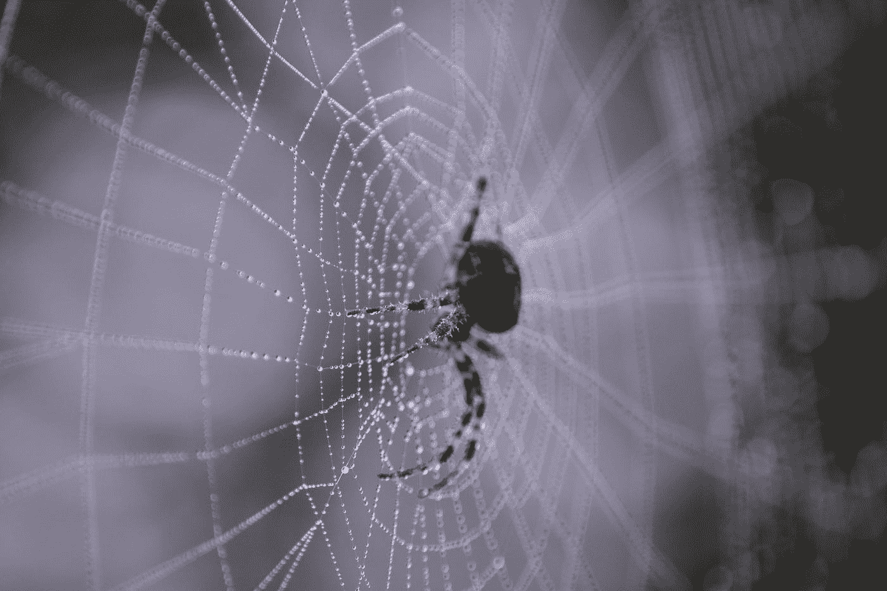
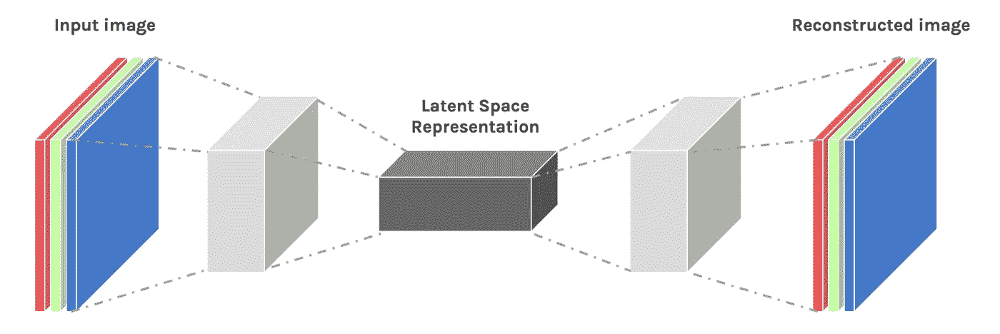
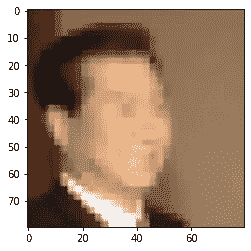
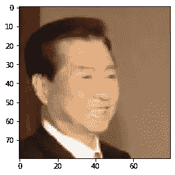
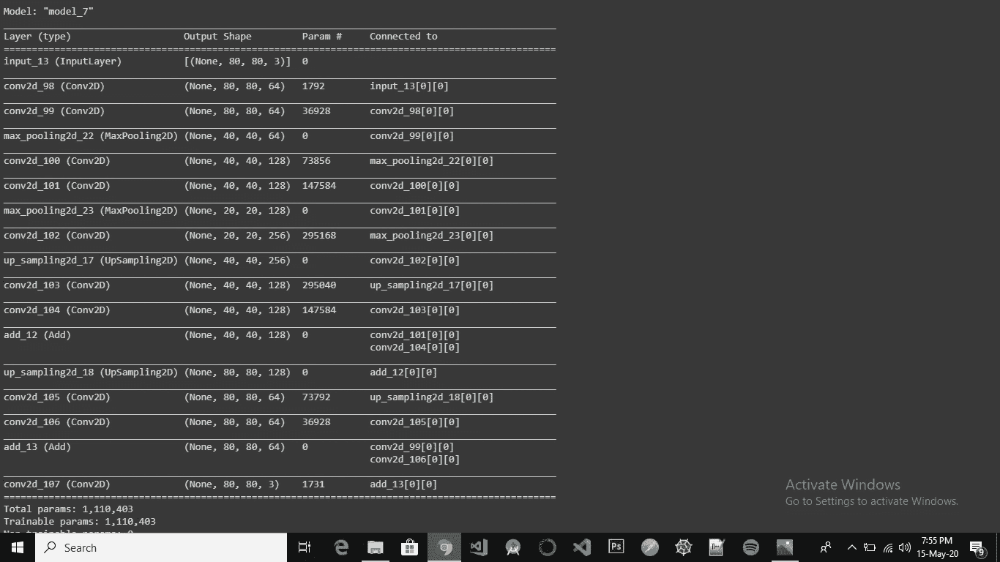
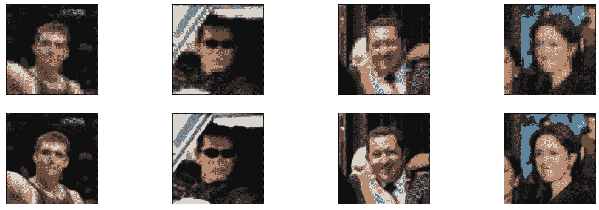

# 基于卷积神经网络和自动编码器的图像超分辨率

> 原文：<https://towardsdatascience.com/image-super-resolution-using-convolution-neural-networks-and-auto-encoders-28c9eceadf90?source=collection_archive---------8----------------------->

## 深度学习提升图像质量指南！



[(来源)](https://unsplash.com/@jeroenbosch?utm_source=medium&utm_medium=referral)

问题陈述挺熟悉的。你们可能都在某个时候遇到过图像失真的问题，因此会试图提高图像质量。嗯，由于深度学习技术的进步，我们将尝试通过训练卷积神经网络和使用自动编码器来提高图像的分辨率！

## **先决条件**

1.  基本了解[卷积神经网络](/a-comprehensive-guide-to-convolutional-neural-networks-the-eli5-way-3bd2b1164a53)(CNN)
2.  TensorFlow、Keras 和其他一些强制性 python 库的工作。

## 什么是自动编码器？

自动编码器是一种用于无监督学习的生成模型。

> 通俗地说，可以说这些模型获取一些输入 ***x*** ，试图学习一些潜在特征，然后在这些学习到的特征的帮助下重构输入 ***x*** 以给出一些期望的输出 ***X***



在这里，图像输入被重建[(源)](https://ars.els-cdn.com/content/image/1-s2.0-S235291481830176X-egi10PTKWBT6NG.jpg)

我们将使用自动编码器模型的概念来增加图像的分辨率。关于自动编码器的详细了解，点击 [*这里*](/applied-deep-learning-part-3-autoencoders-1c083af4d798) 。

## 实施:

**库导入**

让我们打开 Jupyter 笔记本，导入一些需要的库。

```
import numpy as np
import cv2
import glob
import tensorflow as tf
from tensorflow.keras import Model, Input, regularizers
from tensorflow.keras.layers import Dense, Conv2D, MaxPool2D, UpSampling2D, Add, Dropout
from tensorflow.keras.callbacks import EarlyStopping, ModelCheckpoint
from keras.preprocessing import image
import matplotlib.pyplot as plt
from sklearn.model_selection import train_test_split 
import pickle
```

**下载数据集**

我们将在野生家园 数据集中对 ***标记的人脸进行处理。该数据集包含标记人脸的数据库，通常用于人脸识别和检测。然而，我们的目的不是检测人脸，而是建立一个模型来提高图像分辨率。***

> 点击此处 *下载数据集。*

数据集由多个子目录组成，这些子目录包含该人的各种图像。因此，从这些目录中捕获图像路径非常重要。

```
face_images = glob.glob('lfw/lfw/**/*.jpg') #returns path of images
print(len(face_images)) #contains 13243 images
```

**加载并预处理图像**

原始图像的尺寸为 250 x 250 像素。然而，在普通计算机上处理这些图像需要很大的计算能力。因此，我们将把所有图像的尺寸缩小到 80 x 80 像素。

> 由于大约有 13，000 张图像，如果我们单独处理它们，将会花费很多时间。因此，我们利用 python 中提供的 [**多处理**](https://docs.python.org/2/library/multiprocessing.html) 库来简化执行。
> 
> [**tqdm**](https://pypi.org/project/tqdm/) 是一个进度库，我们用它来获得工作完成的进度条。

```
from tqdm import tqdm
from multiprocessing import Poolprogress = tqdm(total= len(face_images), position=0)
def read(path):
  img = image.load_img(path, target_size=(80,80,3))
  img = image.img_to_array(img)
  img = img/255.
  progress.update(1)
  return imgp = Pool(10)
img_array = p.map(read, face_images)
```

为了将来节省时间，让我们在 pickle 库的帮助下存储我们的 *img_array* (包含图像):

```
with open('img_array.pickle','wb') as f:
  pickle.dump(img_array, f)print(len(img_array))
```

**模型训练的数据准备**

现在，我们将把数据集分成训练集和验证集。我们将使用训练数据来训练我们的模型，验证数据将用于评估模型。

```
all_images = np.array(img_array)#Split test and train data. all_images will be our output images
train_x, val_x = train_test_split(all_images, random_state = 32, test_size=0.2)
```

由于这是一个图像分辨率增强任务，我们将扭曲我们的图像，并把它作为一个输入图像。原始图像将被添加为我们的输出图像。

```
#now we will make input images by lowering resolution without changing the size
def pixalate_image(image, scale_percent = 40):
  width = int(image.shape[1] * scale_percent / 100)
  height = int(image.shape[0] * scale_percent / 100)
  dim = (width, height) small_image = cv2.resize(image, dim, interpolation = cv2.INTER_AREA)

  # scale back to original size
  width = int(small_image.shape[1] * 100 / scale_percent)
  height = int(small_image.shape[0] * 100 / scale_percent)
  dim = (width, height) low_res_image = cv2.resize(small_image, dim, interpolation =  cv2.INTER_AREA) return low_res_image
```

> 我们的想法是将这些扭曲的图像输入到我们的模型中，让模型学会恢复原始图像。

```
train_x_px = []for i in range(train_x.shape[0]):
  temp = pixalate_image(train_x[i,:,:,:])
  train_x_px.append(temp)train_x_px = np.array(train_x_px)   #Distorted images# get low resolution images for the validation set
val_x_px = []for i in range(val_x.shape[0]):
  temp = pixalate_image(val_x[i,:,:,:])
  val_x_px.append(temp)val_x_px = np.array(val_x_px)     #Distorted images
```



输入图像



原象

**模型构建**

让我们定义模型的结构。此外，为了克服过度拟合的可能性，我们在卷积层中使用了 **l1 正则化**技术。

```
Input_img = Input(shape=(80, 80, 3))  

#encoding architecture
x1 = Conv2D(64, (3, 3), activation='relu', padding='same', kernel_regularizer=regularizers.l1(10e-10))(Input_img)
x2 = Conv2D(64, (3, 3), activation='relu', padding='same', kernel_regularizer=regularizers.l1(10e-10))(x1)
x3 = MaxPool2D(padding='same')(x2)x4 = Conv2D(128, (3, 3), activation='relu', padding='same', kernel_regularizer=regularizers.l1(10e-10))(x3)
x5 = Conv2D(128, (3, 3), activation='relu', padding='same', kernel_regularizer=regularizers.l1(10e-10))(x4)
x6 = MaxPool2D(padding='same')(x5)encoded = Conv2D(256, (3, 3), activation='relu', padding='same', kernel_regularizer=regularizers.l1(10e-10))(x6)
#encoded = Conv2D(64, (3, 3), activation='relu', padding='same')(x2)# decoding architecture
x7 = UpSampling2D()(encoded)
x8 = Conv2D(128, (3, 3), activation='relu', padding='same', kernel_regularizer=regularizers.l1(10e-10))(x7)
x9 = Conv2D(128, (3, 3), activation='relu', padding='same', kernel_regularizer=regularizers.l1(10e-10))(x8)
x10 = Add()([x5, x9])x11 = UpSampling2D()(x10)
x12 = Conv2D(64, (3, 3), activation='relu', padding='same', kernel_regularizer=regularizers.l1(10e-10))(x11)
x13 = Conv2D(64, (3, 3), activation='relu', padding='same', kernel_regularizer=regularizers.l1(10e-10))(x12)
x14 = Add()([x2, x13])# x3 = UpSampling2D((2, 2))(x3)
# x2 = Conv2D(128, (3, 3), activation='relu', padding='same')(x3)
# x1 = Conv2D(256, (3, 3), activation='relu', padding='same')(x2)
decoded = Conv2D(3, (3, 3), padding='same',activation='relu', kernel_regularizer=regularizers.l1(10e-10))(x14)autoencoder = Model(Input_img, decoded)
autoencoder.compile(optimizer='adam', loss='mse', metrics=['accuracy'])
```

您可以根据自己的选择和要求修改该模型，以获得更好的结果。你也可以改变层数、单位数或一些正则化技术。暂时先往前走，看看我们的模型是什么样子的！

```
autoencoder.summary()
```



模型摘要的屏幕截图

**模特培训**

我们将首先定义一些回调，以便将来模型可视化和评估变得容易。

```
early_stopper = EarlyStopping(monitor='val_loss', min_delta=0.01, patience=50, verbose=1, mode='min')model_checkpoint =  ModelCheckpoint('superResolution_checkpoint3.h5', save_best_only = True)
```

让我们训练我们的模型:

```
history = autoencoder.fit(train_x_px,train_x,
            epochs=500,
            validation_data=(val_x_px, val_x),
            callbacks=[early_stopper, model_checkpoint])
```

> 在 12GB**NVIDIA**Tesla K80**GPU 上，每个纪元的执行时间约为 21 秒。**65 世达到早期停止。

现在，让我们在测试数据集上评估我们的模型:

```
results = autoencoder.evaluate(val_x_px, val_x)
print('val_loss, val_accuracy', results)
```

> val_loss，val _ accuracy[0.002111185426451，0.265356767

我们从我们的模型中得到了一些非常好的结果，大约 93%的验证准确性和 0.0021 的验证损失。

**做出预测**

```
predictions = autoencoder.predict(val_x_px)n = 4
plt.figure(figsize= (20,10))for i in range(n):
  ax = plt.subplot(3, n, i+1)
  plt.imshow(val_x_px[i+20])
  ax.get_xaxis().set_visible(False)
  ax.get_yaxis().set_visible(False) ax = plt.subplot(3, n, i+1+n)
  plt.imshow(predictions[i+20])
  ax.get_xaxis().set_visible(False)
  ax.get_yaxis().set_visible(False)plt.show()
```



第一行—输入图像，第二行—输出图像

## 结尾注释

在这个故事中，我们学习了自动编码器的基本功能，并实现了一个图像超分辨率增强任务。这项任务在日常生活中可能有多个用例。例如，我们也可以使用这种技术来提高低分辨率视频的质量。因此，即使没有标签，我们也可以利用图像数据解决一些现实世界的问题。

如果您有任何其他使用案例或技术来处理图像数据，并且如果您发现了更多改进的图像增强模型，请在下面的响应块中分享！

这篇文章的全部代码可以在 [*这里*](https://github.com/harshilpatel99/image_superResolution) 找到。

## 参考

1.  Snehan Kekre 在 [*Coursera*](http://www.coursera.org/projects/image-super-resolution-autoencoders-keras?edocomorp=freegpmay2020) 上的一门课程。