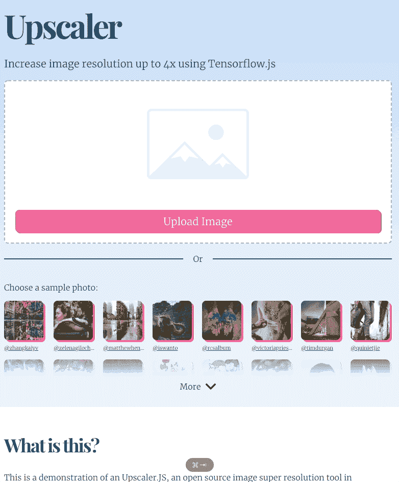
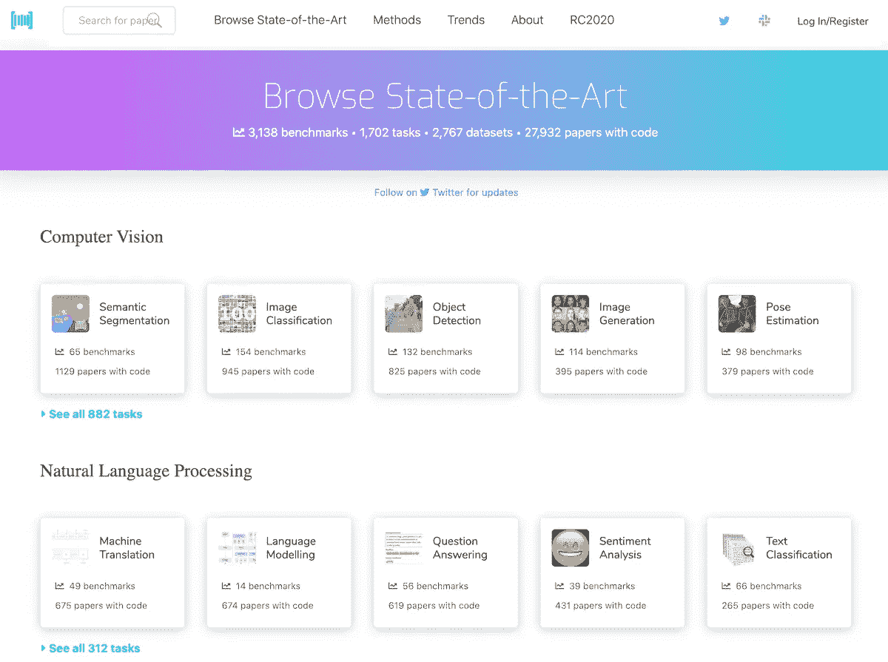
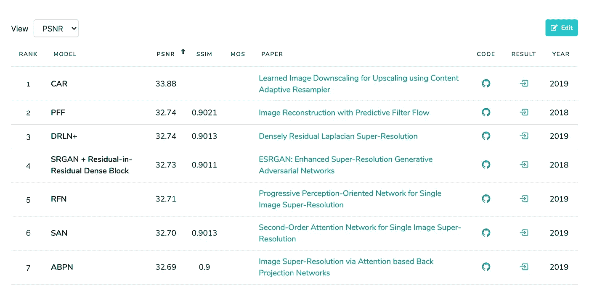
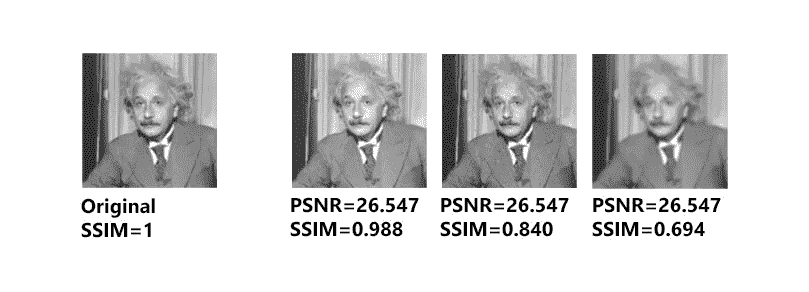
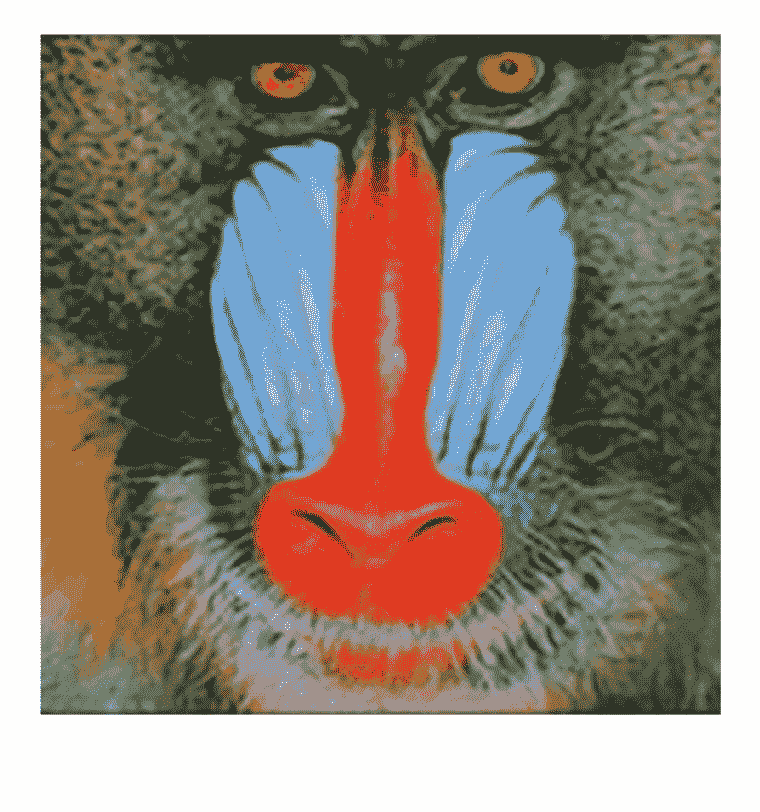
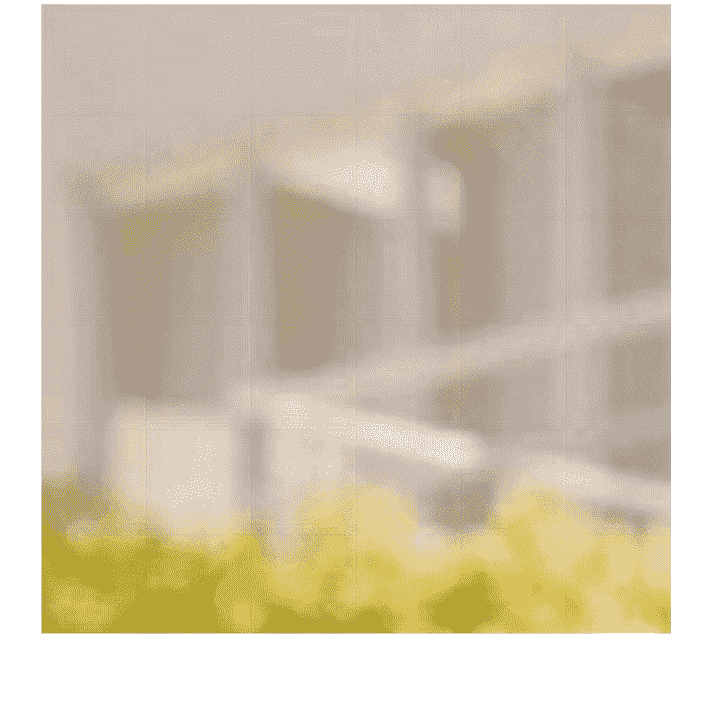
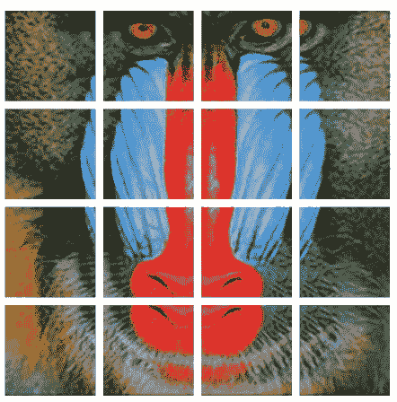
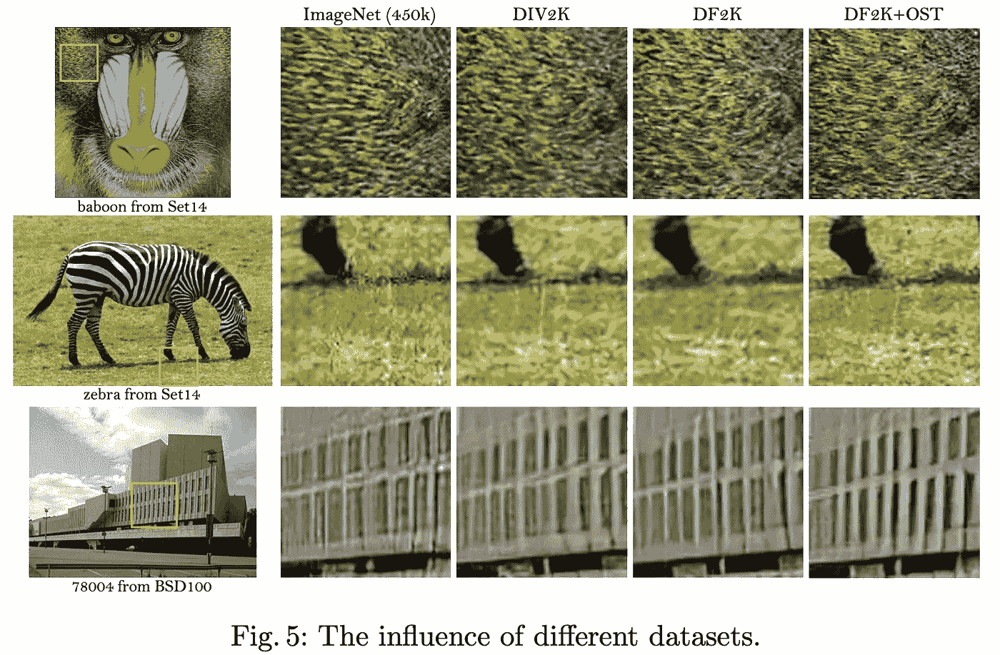

# 使用 Javascript 进行图像放大

> 原文：<https://towardsdatascience.com/image-upscaling-with-javascript-836445267496?source=collection_archive---------48----------------------->

## [实践教程](https://towardsdatascience.com/tagged/hands-on-tutorials)

*我最近发布了一个工具，*[*upscaler js*](https://github.com/thekevinscott/UpscalerJS)*，它可以用 Javascript 在你的浏览器中放大图片，并将图片尺寸缩小 1/16。它的设计是与模型无关的——你可以即插即用任何可以转换为 Tensorflow.js 的训练过的模型*

*在这篇文章中，我想展示我认为的浏览器中神经网络的一个杀手级用例，以及我如何发现这项研究，将其转换为 Javascript，以及未来改进它的方法。*



[https://upscaler.ai](https://upscaler.ai) //作者动画

假设你在做一个电子商务平台。你的用户上传产品照片来销售。

你设计了一个看起来很棒的网站，用来突出你的用户手工制作的美丽和奇妙的产品。只有一个问题——一旦你启动，你发现你的用户正在上传小的像素化的图片，突然之间你美丽的网站看起来不那么漂亮了。

(我是从经验中得出的结论——这种情况在我身上发生过不止一次。)

你可以回头向用户唠叨要更好的图像——有时这是可行的。但通常情况下，他们所能得到的只有他们提供的图片。也许图像是从 pdf 截屏的，或者也许图像是旧的，用户没有更好的。即使他们有更好的图像，让你的用户回去帮你修改他们的图像也是一件费力的事情，即使这是为了他们的利益。

有没有我们可以探索的技术解决方案？当然有，它叫做**超分辨率**。

## 你所说的“超级分辨率”是什么？

假设有人上传了一张 150 像素的照片到我们的电子商务网站:


merec0 的快乐狗

我们想在我们的主页上展示这张图片，因为它是一只漂亮的狗，但我们的设计要求图片为 300 像素。我们能做什么？如果我们将每个像素加倍，我们会得到看起来像素化的更大图像:


通过复制像素放大图像

你必须努力在浏览器中实现像素化的外观;默认情况下，大多数浏览器会对图像应用某种缩放算法，通常是[双三次插值](https://en.wikipedia.org/wiki/Bicubic_interpolation)，如下所示:


使用双三次插值放大图像。

使用双三次插值放大的图像看起来肯定没有第一幅图像像素化，我敢打赌大多数人会觉得它更有美感，但它很模糊，没有人会误认为是高分辨率图像。

**超分辨率是一种机器学习技术，用于从较低分辨率的图像重建较高分辨率的图像。**你可以把这个过程想象成在图像中绘制新像素，实现比双三次插值算法更高的保真度。


使用 GAN 放大图像。

有[许多不同的方法](https://arxiv.org/abs/1902.06068)可以用来实现超分辨率，也有一些很棒的博客文章描述了基本的理论[这里](/an-evolution-in-single-image-super-resolution-using-deep-learning-66f0adfb2d6b)和[这里](https://medium.com/beyondminds/an-introduction-to-super-resolution-using-deep-learning-f60aff9a499d)。

超分辨率[通常使用 Python](https://letsenhance.io/) 在后端实现。以这种方式建造它有很好的理由。在后台运行它可以让你接触到强大的硬件，而这些硬件可以让你使用最新、最精确的模型。如果获得最高分辨率的图像很重要，后端部署是一个不错的选择。此外，许多用例是“一次缩放，经常显示”——如果放大一幅图像需要更长的时间，没什么大不了的。

另一方面，在后端实现这一点也有缺点。一个是即时反馈——你需要将图像上传到服务器，进行处理，然后发送回来，这可能需要一段时间，取决于你的用户连接和你的模型大小。这可能不是小事，特别是因为如此多的前沿实现处于最前沿，具有不稳定的依赖性和不断变化的需求。而且，如果您的部署需要 GPU，这可能会成为一个昂贵的提议，并且难以扩展。

事实证明，我们可以在浏览器中运行，这样做有一些明显的好处。

第一，部署问题？完全消失了。用 Javascript 运行神经网络意味着不需要安装任何东西，不需要配置任何 GPU——tensor flow . js 会处理所有这些事情。模型直接在用户的浏览器中运行。

其次，你的用户会看到更多即时反馈。特别是对于带宽可能较慢的连接，如电话，直接在设备上执行推理可以省去昂贵的往返步骤。

第三，也是我认为最有说服力的论点——你可以提供更小的图片。有时候，*小得多*的图像。例如，上面的那些图片？300px 是 724kb。150px 版本？是 *9kb* 。这是一张原始文件大小的百分之六的图像*。这是一个巨大的减少！*

当然，在浏览器中运行有一些明显的缺点。最大的问题是你受到用户硬件的限制。这体现在两个方面。一个是，如果你想部署最新最棒的型号，你可能就要倒霉了。特别是如果他们是 GPU 饥饿，他们只是可能无法在浏览器中运行。近年来，包括苹果和谷歌[在内的硬件制造商已经投入了巨额资金来提高他们的设备上芯片的性能](https://heartbeat.fritz.ai/hardware-acceleration-for-machine-learning-on-apple-and-android-f3e6ca85bda6)，特别关注提高在设备上运行神经网络的能力。好消息是，年复一年，这项技术的性能会越来越好；坏消息是，对于使用旧设备的用户来说，性能差异将变得更加显著。如果您想要跨平台的一致体验，服务器端解决方案可能是更好的选择。

最终，尽管精确的权衡将取决于用例，但 Javascript 绝对是考虑该技术应用的一个有价值的竞争者。让我们看看如何评估那里有什么，看看什么对我们的目的有用。

## 通过小道消息听到的

如果你来自 Javascript 世界，你脑海中的一个问题是——你最初是怎么听说这项研究的？

大多数前沿的机器学习研究都张贴在 arxiv.org 的网站上，在那里可以免费搜索和下载 PDF 格式的研究成果。这是学术研究，论文可能倾向于理论和数学，很难理解。这可以吓跑很多人——一开始当然是把我吓跑了。

我不想低估充分理解研究的重要性——深入理解理论通常可以带来与你的领域相关的新见解和发展——但你不一定需要对使用它的技术有深刻的理解。特别是如果你专注于推理，就像我们在这种情况下，你可以依靠他人来评估研究，以及实现训练代码，在某些情况下，提供训练模型。

有一个网站就是这么做的，叫做[论文，代码](https://paperswithcode.com/):



[https://paperswithcode.com](https://paperswithcode.com)截图

研究按主题领域分类，并根据其相对于公认指标的表现进行排名。[甚至有一个专门针对这个领域的特定类别](https://paperswithcode.com/task/image-super-resolution)。



https://paperswithcode.com 的[截图](https://paperswithcode.com)

您可以根据标准数据集查看每个实现的性能，并查看如何根据不同的指标对它们进行测量。PSNR 和 SSIM 是测量超分辨率任务性能的两种常用方法； [PSNR](https://en.wikipedia.org/wiki/Peak_signal-to-noise_ratio) 可以测量噪声， [SSIM](https://en.wikipedia.org/wiki/Structural_similarity) 测量两幅图像的相似度。



[来自“图像间相似性度量方法快速概述”](https://medium.com/@datamonsters/a-quick-overview-of-methods-to-measure-the-similarity-between-images-f907166694ee)

指标可能有点棘手。你可以在上面的图像中看到，相同的 PSNR 分数可以有完全不同的 SSIM 分数，具有相应不同的视觉表现。

PSNR 和 SSIM 都是衡量一幅图像彼此差异的标准，但都不能代替人类的评价。作为人类，我们感知图像的方式与计算机不同。比如说，饱和度不同但也更清晰的一组像素可能导致较低的度量分数，但从人的角度来看更美观的分数。

> SR 算法通常由几种广泛使用的失真度量来评估，例如 PSNR 和 SSIM。然而，这些度量从根本上与人类观察者的主观评价不一致。感知质量评估采用非参考指标，包括马评分和 NIQE，两者均用于计算 SR 挑战赛中的感知指数。在最近的一项研究中，Blau 等人发现失真和感知质量是相互矛盾的。— [王等](https://arxiv.org/pdf/1809.00219v2.pdf)

除了判断模型准确性的主观性，准确性不是我们最关心的还有其他原因。记住，我们的最终目标是一个用 Javascript 运行的模型。考虑以下因素也很重要:

*   **一篇好论文**。我们想要一个健康的建筑。我们可能需要对基础理论有所了解，所以论文清晰易懂、严谨是很重要的；一篇论文被引用的频率也可以很好地反映其整体质量。
*   **性能良好**。速度和准确性一样重要。运行一分钟的模型不适合浏览器。
*   **可保存，可转换**。实现的模型必须与 Javascript 兼容。我们将很快触及细节，但最重要的是坚持 Tensorflow 实现，因为 Tensorflow.js 是在浏览器中进行机器学习的主要方式，所以 Pytorch 实现是不可能的。

我最终选择了 [ESRGAN](https://paperswithcode.com/paper/esrgan-enhanced-super-resolution-generative) 。

我开始看按分数排序的论文。一些得分较高的实现要么没有链接的代码实现，要么代码实现完全在 Pytorch 中。(并不是所有的代码实现都会在 paperswithcode.com 上展示，所以自己去谷歌一下是个好主意。)

ESRGAN 在指标上排名很高，并在 Tensorflow 中实现了很多。这篇论文本身相当清晰易懂。ESRGAN 基于以前的架构， [SRGAN](https://arxiv.org/pdf/1609.04802.pdf) ，它本身是一个健壮的架构，但 ESRGAN 进行了许多改进，包括改进了生成器的构建模块，改进了预测图像显示逼真程度的鉴别器，以及更有效的感知损失。

在我能找到的实现中，我觉得有三个满足了我的标准，看起来代码质量不错，文档也不错。

*   [idealo/图像超分辨率](https://github.com/idealo/image-super-resolution)
*   [krasserm/超分辨率](https://github.com/krasserm/super-resolution)
*   [peteryuX/esrgan-tf2](https://github.com/peteryuX/esrgan-tf2)

如果不下载并运行代码，很难确定一个实现是否适合。如果你习惯于安装一个`npm`库并直接进入，请做好准备:使用机器学习代码通常是一种沮丧的练习。解决依赖性挑战、环境问题和内存瓶颈可能会将评估变成一件多天的事情。

出于这个原因，包含`Dockerfile` s 或 Google Colab 链接的回购通常是一个非常好的迹象。这也是一个好迹象，当作者包括预训练的重量，以及这些重量是如何训练的文件。如果您能够直接跳到推论，它有助于更快地评估模型；同样，关于如何训练这些权重的信息使您能够测试自己的实现，这为您提供了一个坚实的基准。在回购中忽略这些不会破坏交易，但会让你的日子更难过。

不管作者是否提供 Dockerfile，我通常会建立自己的*docker file，因为当我探索 repo 时，我会安装自己的依赖项并编写探索性代码，我希望能够以可复制的方式运行这些代码。几乎在每一种情况下，当我玩了几个星期的机器学习代码后，当我回来时，我会遇到一些深奥的错误，这些错误是由一些包过时或升级引起的。固定您的版本，从一开始就获得一个可复制的环境！*

我最终选定了由 [idealo](https://github.com/idealo/image-super-resolution) 实现。代码易于阅读，提供了预先训练的模型，作者[提供了他们探索太空之旅的精彩记录](https://medium.com/idealo-tech-blog/a-deep-learning-based-magnifying-glass-dae1f565c359)。然而，真正的关键是我只需要做一些修改就可以将 RDN 模型转换成 Javascript。转换 RRDN 模型有点棘手——稍后会详细介绍。

## 转换为 Javascript

Tensorflow.js 提供了一个方便的命令行工具，用于将模型转换为 Javascript，称为 TFJS converter。您可以使用类似下面的内容来转换模型:

```
tensorflowjs_converter --input_format=keras --output_format=tfjs_layers_model ./rdn-model.h5 rdn-tfjs
```

[我已经整合了一个谷歌实验室来证明这一点。](https://colab.research.google.com/drive/1WmTHfcNiEWVta5B5AJ5V0dnrQg-JXH06#scrollTo=oMMODAFu05Rc)

为了将模型干净地转换成 Javascript，需要注意一些事情:

1.  模型必须以 Keras 或与 Tensorflow 转换器兼容的其他格式保存。此外，确保将*模型*转换成 Javascript，而不仅仅是权重。如果是后者，您可能会收到一个含糊不清的错误，没有任何关于正在发生什么的指导。
2.  变量不能引用`self`——这让我对 idealo 的实现产生了误解。([参考本 Github 问题](https://github.com/idealo/image-super-resolution/issues/114#issuecomment-605067405)、[或我的 PR](https://github.com/idealo/image-super-resolution/pull/137) ，寻求解决方案)
3.  所有张量运算都必须用 Javascript 实现。除了试错法，我不知道还有什么更好的方法来检查这个问题(也就是转换模型，看看它是否能运行)。
4.  如果实现了自定义层，则必须用 Javascript 重新实现。例如，[RRDN 模型的定制层必须重新实现，以便干净地保存](https://github.com/idealo/image-super-resolution/pull/137/files#diff-33e903d44b1c48dec8eabcca53955976R191)。在这篇文章的后面，我将讨论如何处理自定义层。
5.  在 Tensorflow.js 转换器的输出中，我必须手动将模型的`class_name`从`Functional`更改为`Model`。([在 Google Colab 中，这是实现这个](https://colab.research.google.com/drive/1WmTHfcNiEWVta5B5AJ5V0dnrQg-JXH06#scrollTo=oMMODAFu05Rc&line=4&uniqifier=1)的单元格。)不知道为什么会这样，也不知道是不是 bug 欢迎评论！
6.  图像的任何预处理和后处理都需要用 Javascript 再现。

## 拉你的体重，好神经元

性能是基于浏览器的应用程序的关键。更瘦的模特表现更好。

有两种方法可以提高 Javascript 的性能。

首先，我们可以**量化**我们的模型。[量化模型意味着降低模型权重的精度](https://github.com/tensorflow/tfjs-examples/tree/master/quantization)。这可能会导致较低的准确性，但是可以显著减小模型的大小(并且具有使模型比 gzip 更可压缩的附带好处)。

我们可以在 tensorflow js 转换器中直接量化:

```
tensorflowjs_converter \
   --input_format tfjs_layers_model \
   --output_format tfjs_layers_model \
   --quantize_uint8 \
   original_model/model.json
   quantized_model/
```

在这种特定情况下，最大量化量`uint8`，对最终模型的性能没有显著影响。

第二，我们可以**修剪**我们的模型。修剪是我们在训练中剔除表现不佳的权重的过程。我还没有亲自探索过这条途径，但是如果你感兴趣的话[你可以在这里阅读更多相关内容](https://www.tensorflow.org/model_optimization/guide/pruning)。对于在前端挤出额外的性能来说，这无疑是一个很有前途的策略。

## 浏览器中的推理—给我看看代码！

我们已经转换并量化了 RDN 模型。成功！现在，我们如何让它在浏览器中运行？我们可以用以下内容加载我们的模型:

```
import * as tf from "@tensorflow/tfjs";
tf.loadLayersModel("./rdn-tfjs/model.json");
```

确保你加载的是`model.json`、*而不是*、`bin`文件。

然后，我们可以得到作为张量*的图像*:

```
const img = new Image();
img.crossOrigin = "anonymous";
img.src = "your-image";
img.onload = () => {
  const tensor = tf.browser.fromPixels(img).expandDims(0);
};
```

张量是几乎所有神经网络中使用的一种数字数据结构，你可以在这里阅读更多关于它们的内容。

在上面的代码中需要注意两件事:

1.  如果你正在处理来自其他领域的图像，你可能会遇到 CORS 问题。将`crossOrigin`设置为`anonymous`会有所帮助。
2.  你需要调用`expandDims`从你的图像中获取的张量。你需要给你的模型传递一个四维张量；要了解更多原因，你可以点击这里查看我关于图像分类的文章。

现在我们有了一个张量，我们可以在模型中运行它:

```
import tensorAsBase64 from 'tensor-as-base64';
const prediction = model.predict(tensor).squeeze();
```

还有维奥拉。你有一个升级的张量，准备在你的浏览器中显示！

[下面是 CodeSandbox](https://codesandbox.io/s/upscaling-1-0xmbx?file=/src/index.js) 上所有代码实现:

这仍然需要一段时间——在我的例子中，大约 2.5 秒——这对于生产来说是不可接受的。此外，它还有一个令人讨厌的副作用，就是在工作时冻结了用户界面。让我们来看一些不同的提高性能的策略。

## 热身

Tensorflow.js 中神经网络的初始调用将花费很长时间，但是随后的*调用将会快得多。*

> TensorFlow.js 通过运行 WebGL 着色器程序在 GPU 上执行操作。当用户要求执行操作时，这些着色器被缓慢地组装和编译。着色器的编译发生在 CPU 的主线程上，可能会很慢。TensorFlow.js 将自动缓存已编译的着色器，从而使第二次调用具有相同形状的输入和输出张量的相同操作的速度快得多。— [Tensorflow.js 文档](https://www.tensorflow.org/js/guide/platform_environment#shader_compilation_texture_uploads)

我们可以利用这一点，通过传递一个虚拟张量来“预热”我们的模型。这里有一些你可以使用的代码([查看 CodeSandbox](https://codesandbox.io/s/upscaling-2-warm-up-vjllx?file=/src/index.js) 上的代码):

```
const dummyTensor = tf.zeros([1, img.height, img.width, 3]);
model.predict(dummyTensor);
```

在这种情况下，我的推理时间下降到 150 毫秒。好多了！然而，这只有在张量大小完全匹配的情况下才有效。我们显然不能依赖这个——用户可以上传任何大小和比例的照片。此外，当模型运行其预测时，用户界面上仍有明显的滞后。

让我们先试着解决第二个问题。如果我们把计算从主线程转移到一个网络工作者身上会怎么样？

## 网络工作者

[这里有一个 CodeSandbox 链接，演示了 Web Workers](https://codesandbox.io/s/github/thekevinscott/upscalerjs/tree/master/examples/webworker) 的使用。(这个例子使用了 UpscalerJS，而不是手工写出 TFJS 代码，但是概念是一样的。)

将代码转移到 web worker 可以让我们将处理从主线程中转移出来，从而让我们以更流畅的速度运行动画。然而，它不是万灵药；动画中仍有一些起伏。我相信这种波动来自 GPU 本身锁定线程，这在旧设备上比新设备上表现得更糟。网络工作者绝对有帮助，但他们不能完全解决问题。

## 将图像分割成块

如果我们不是一次处理完整的图像，而是将图像细分为多个部分分别处理，会怎么样？



作者制作的动画

如果我们将图像细分成几个部分，我们可以将一个长任务分成 4 个任务，每个任务之后我们可以释放 UI 线程:

```
const tensor = tf.browser.fromPixels(img);
const [height, width] = tensor.shape;
for (let i = 0; i < 2; i++) {
  for (let j = 0; j < 2; j++) {
    const slicedTensor = tensor.slice(
      [(i * height) / 2, (j * width) / 2],
      [height / 2, width / 2]
    );
    const prediction = model.predict(slicedTensor.expandDims(0)).squeeze();
  }
}
```

[这里有一个 CodeSandbox 链接演示这个](https://codesandbox.io/s/upscaling-patch-size-demonstration-pdki6?file=/src/index.js)。

这极大地提高了我们代码的响应能力，但现在又出现了一个新问题:



作者制作的动画

这些放大的图像往往在边缘有伪像。这是许多放大算法中固有的一个相当常见的问题，但它通常不是一个问题，除非你密切关注放大图像的边缘。然而，在这种情况下——因为我们将许多图像拼接成一幅图像——问题就更加明显了。

修复方法是给我们的每个图像切片添加*填充*——类似这样:



作者制作的动画

然后我们可以切掉多余的像素，组合成一幅没有任何伪像的图像。[这里有一个代码沙箱，演示了端到端的](https://codesandbox.io/s/upscaling-3-patch-sizes-8h6pt?file=/src/utils.ts)。

最好的一点是，只要你把补丁的大小设置得足够小——比你期望得到的最小图像小——你就能得到大小一致的图像。还记得我们在预热部分提到的要求图像大小一致以获得速度提升的好处吗？这个解决方案双管齐下！

## RRDN 和寻找定制层

到目前为止，我们一直在处理 RDN 模型。RRDN 模型是更强大的版本，它依赖于定制层，需要用 Javascript 重新实现。

我在 Tensorflow.js 中没有找到大量关于自定义图层的文档。[有官方文档](https://www.tensorflow.org/js/guide/models_and_layers#custom_layers)，还有蔡的[这个要点](https://gist.github.com/caisq/33ed021e0c7b9d0e728cb1dce399527d)，这是我能找到的大部分内容。

[Python 中的两个自定义层定义为](https://github.com/idealo/image-super-resolution/blob/master/ISR/models/rrdn.py#L191):

```
class PixelShuffle(tf.keras.layers.Layer):
    def __init__(self, scale, *args, **kwargs):
        super(PixelShuffle, self).__init__(*args, **kwargs)
        self.scale = scale

    def call(self, x):
        return tf.nn.depth_to_space(x, block_size=self.scale, data_format='NHWC')

    def get_config(self):
        config = super().get_config().copy()
        config.update({
            'scale': self.scale,
        })
        return config

class MultiplyBeta(tf.keras.layers.Layer):
    def __init__(self, beta, *args, **kwargs):
        super(MultiplyBeta, self).__init__(*args, **kwargs)
        self.beta = beta

    def call(self, x, **kwargs):
        return x * self.beta

    def get_config(self):
        config = super().get_config().copy()
        config.update({
            'beta': self.beta,
        })
        return config
```

在 Javascript 中，这些看起来像:

```
class MultiplyBeta extends tf.layers.Layer {
  beta: number;

  constructor() {
    super({});
    this.beta = BETA;
  }

  call(inputs: Inputs) {
    return tf.mul(getInput(inputs), this.beta);
  }

  static className = 'MultiplyBeta';
}

class PixelShuffle extends tf.layers.Layer {
  scale: number;

  constructor() {
    super({});
    this.scale = SCALE;
  }

  computeOutputShape(inputShape: number[]) {
    return [inputShape[0], inputShape[1], inputShape[2], 3];
  }

  call(inputs: Inputs) {
    return tf.depthToSpace(getInput(inputs), this.scale, 'NHWC');
  }

  static className = 'PixelShuffle';
}
```

您还需要显式注册每个自定义层:

```
tf.serialization.registerClass(MultiplyBeta);
tf.serialization.registerClass(PixelShuffle);
```

这里需要指出一些事情:

*   确保您在层上定义了一个静态的`className`，它与层的名称完全匹配
*   `call`是您进行大量计算的地方。
*   `computeOutputShape`我*相信*你只需要定义它是否不同，这个函数被调用来告诉 TFJS 你的输出张量的形状
*   你可能需要把函数调用从 Python 翻译成 Javascript 例如，Python 中的`tf.nn.depth_to_space`变成了 Javascript 中的`tf.depthToSpace`

## 训练您的模型

超分辨率技术的一个挑战是它们的规模是固定的。

这意味着，一个经过训练可以将图像放大 2 倍的模型，将无法放大 3 倍或 4 倍。它只能将图像放大到 2 倍。

要改变规模，你需要从头开始训练一个模型。你可以想象，支持不同的规模可以大大增加你必须做的训练量。

此外，有一些迹象表明，针对特定数据集的进一步培训会产生与您的领域相关的特定益处。

> 首先，我们表明，较大的数据集导致更好的面向 PSNR 的方法的性能。我们使用一个大模型，其中 23 个残差中残差块(RRDB)放置在上采样层之前，随后是两个卷积层用于重建…一个广泛使用的训练数据集是 DIV2K，包含 800 个图像。我们还探索了其他具有更多样化场景的数据集——Flickr 2K 数据集，由 Flickr 网站上收集的 2650 张 2K 高分辨率图像组成。据观察，具有 DIV2K 和 Flickr2K 的合并数据集，即 DF2K 数据集，提高了 PSNR 性能。



[图片来自 ESRGAN paper](https://arxiv.org/pdf/1809.00219v2.pdf)

针对特定领域的数据集进行训练可能会提高准确性。

去年，我花了一些时间和 [RAISR](https://ai.googleblog.com/2016/11/enhance-raisr-sharp-images-with-machine.html) 一起工作。该论文中的一个关键见解是，压缩低分辨率图像会产生一个更具弹性的模型，能够更好地处理伪像，而锐化高分辨率图像会产生更具美感的放大图像(代价是相对于度量标准而言性能更差)。我怀疑——虽然我不确定——类似的技术可能在这里的训练中产生类似的好处，我目前正在试验寻找答案。

## 升级。射流研究…

我已经将所有这些打包成一个名为 [Upscaler.js](https://github.com/thekevinscott/UpscalerJS) 的 npm 模型。

它不知道正在使用的升级模型，这意味着在未来，我将能够改进模型，并可能引入适应各种用例(人脸、插图)的模型。我目前通过 JS CDNs 服务模型，并期待在未来增加更多的模型。


作者制作的动画

我认为有很多改进的机会，特别是在性能方面，但坦白地说，我很高兴这是可能的。

想象一下能够将此应用于视频流。想象一下，如果您能以普通视频流的形式提供文件大小为 6%的视频，会怎么样？我们还没有到那一步——我们必须将工作速度提高 10 倍才能处理实时视频——但是离*已经不远了。想想真的很令人兴奋！*