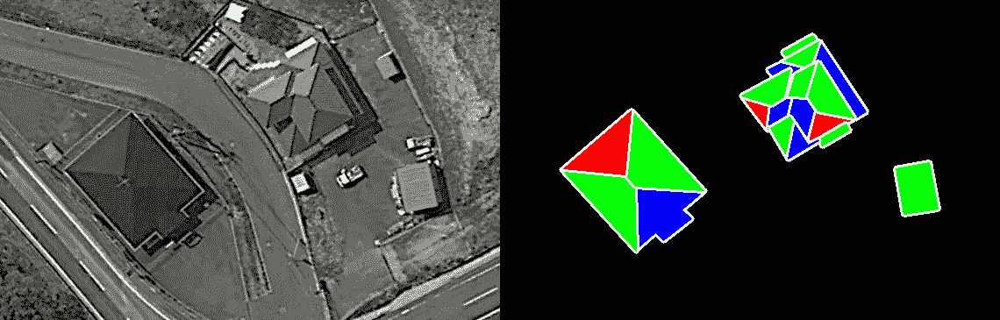
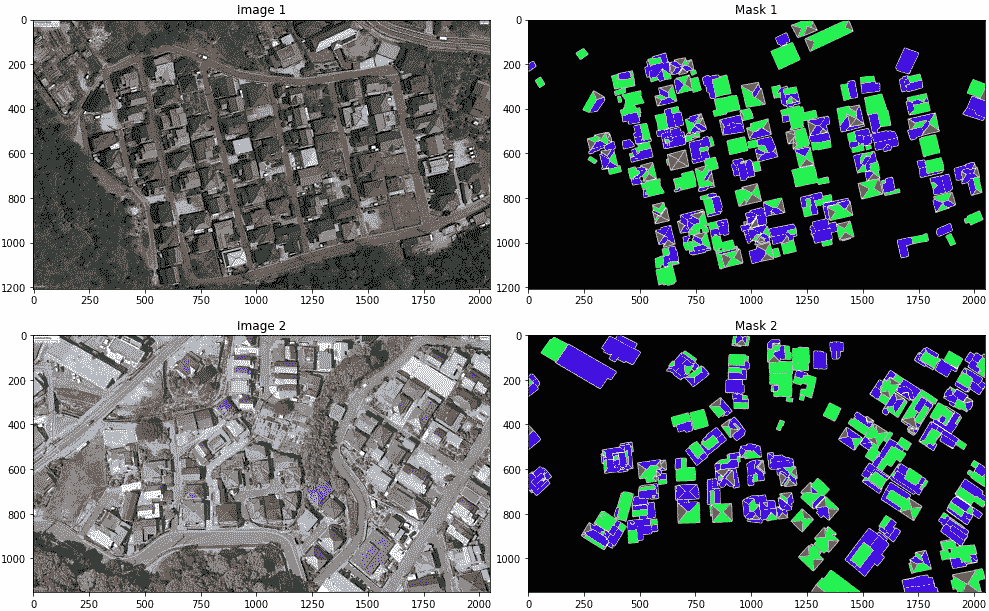
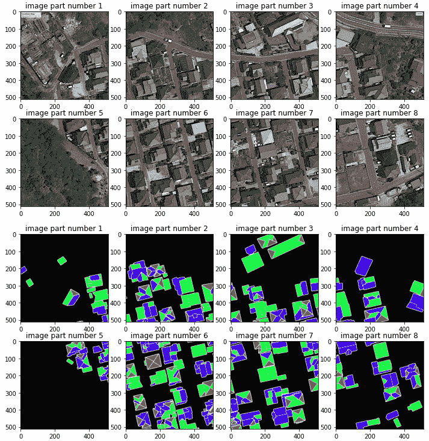
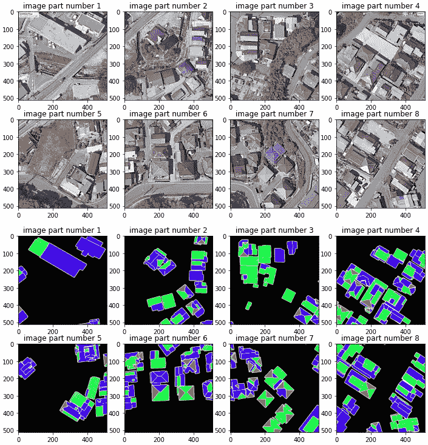

# 使用 Google Colab 在 Python 中将图像和蒙版分割成多个部分

> 原文：<https://towardsdatascience.com/images-and-masks-splitting-into-multiple-pieces-in-python-with-google-colab-2f6b2ddcb322?source=collection_archive---------10----------------------->

## 图像和蒙版分割成更小部分的实际例子

数据标注者使用特殊的标注工具来标注对象。例如，[计算机视觉标注工具(CVAT)](https://github.com/opencv/cvat) 在计算机视觉领域广为人知。自然，贴标机使用高分辨率图像会更方便。当您需要标记大量对象时尤其如此。

在我参与的一个屋顶分割任务中，需要突出屋顶的三角形段、四边形段、其他段和边缘。下图显示了此类标记的一个示例(白色表示边，红色表示三角形，绿色表示四边形，蓝色表示其他多边形):



图像由 Oleksii Sheremet 使用 [matplotlib](https://matplotlib.org/) 模块创建

原始图像是从谷歌地球获得的，像素为 2048x1208。数据标签员用 CVAT 以同样的分辨率对掩膜进行了标注。为了训练模型，图像和蒙版应该采用较低的分辨率(从 128x128 到 512x512 像素)。众所周知，图像分割是一种最常用于将大图像分割成较小部分的技术。因此，合理的解决方案是将图像及其对应的蒙版分割成具有相同分辨率的部分。

所有用于拆分的代码都是在 Google Colab 中实现的。让我们仔细看看。导入库:

```
import os
import sys
import shutil
import glob
import matplotlib.pyplot as plt
import matplotlib.image as mpimg
from PIL import Image
```

将 Google Drive(包含图片和蒙版)安装到 Google Colab:

```
from google.colab import drive
drive.mount('/content/gdrive')
%cd "gdrive/My Drive/File Folder"
```

一个用于创建新目录和递归删除现有目录内容的有用函数:

```
def dir_create(path):
    if (os.path.exists(path)) and (os.listdir(path) != []):
        shutil.rmtree(path)
        os.makedirs(path)
    if not os.path.exists(path):
        os.makedirs(path)
```

覆盖原始图像的裁剪功能被调整到原始图像限制，并包含原始像素:

```
def crop(input_file, height, width):
    img = Image.open(input_file)
    img_width, img_height = img.size
    for i in range(img_height//height):
        for j in range(img_width//width):
            box = (j*width, i*height, (j+1)*width, (i+1)*height)
            yield img.crop(box)
```

将图像和蒙版分割成较小部分的功能(裁剪窗口的高度和宽度以及起始数字作为输入参数):

```
def split(inp_img_dir, inp_msk_dir, out_dir, height, width, 
          start_num):
    image_dir = os.path.join(out_dir, 'images')
    mask_dir = os.path.join(out_dir, 'masks')
    dir_create(out_dir)
    dir_create(image_dir)
    dir_create(mask_dir)
    img_list = [f for f in
                os.listdir(inp_img_dir)
                if os.path.isfile(os.path.join(inp_img_dir, f))]
    file_num = 0
    for infile in img_list:
        infile_path = os.path.join(inp_img_dir, infile)
        for k, piece in enumerate(crop(infile_path,
                                       height, width), start_num):
            img = Image.new('RGB', (height, width), 255)
            img.paste(piece)
            img_path = os.path.join(image_dir, 
                                    infile.split('.')[0]+ '_'
                                    + str(k).zfill(5) + '.png')
            img.save(img_path)
        infile_path = os.path.join(inp_msk_dir,
                                   infile.split('.')[0] + '.png')
        for k, piece in enumerate(crop(infile_path,
                                       height, width), start_num):
            msk = Image.new('RGB', (height, width), 255)
            msk.paste(piece)
            msk_path = os.path.join(mask_dir,
                                    infile.split('.')[0] + '_'
                                    + str(k).zfill(5) + '.png')
            msk.save(msk_path)
        file_num += 1
        sys.stdout.write("\rFile %s was processed." % file_num)
        sys.stdout.flush()
```

让我们设置必要的变量:

```
inp_img_dir = ‘./input_dir/images’
inp_msk_dir = ‘./input_dir/masks’
out_dir = ‘./output_dir’
height = 512
width = 512
start_num = 1
```

让我们用原始图像和蒙版组成一个文件列表，并对它们进行拆分:

```
input_images_list = glob.glob(inp_img_dir + ‘/*.jpg’)
input_masks_list = glob.glob(inp_msk_dir + ‘/*.png’)
split(inp_img_dir, inp_msk_dir, out_dir, height, width, start_num)
```

例如，使用以下代码显示了两个原始图像和遮罩:

```
for i, (image_path, mask_path) in enumerate(zip(input_images_list,
                                                input_masks_list)):
    fig, [ax1, ax2] = plt.subplots(1, 2, figsize=(18, 9))
    image = mpimg.imread(image_path)
    mask = mpimg.imread(mask_path)
    ax1.set_title(‘Image ‘ + str(i+1))
    ax1.imshow(image)
    ax2.imshow(mask)
    ax2.set_title(‘Mask ‘ + str(i+1))
```



图像由 Oleksii Sheremet 使用 [matplotlib](https://matplotlib.org/) 模块创建

使用以下功能，您可以显示分割图像的所有部分(分为 8 个部分):

```
def image_part_plotter(images_list, offset):
    fig = plt.figure(figsize=(12, 6))
    columns = 4
    rows = 2
    # ax enables access to manipulate each of subplots
    ax = []
    for i in range(columns*rows):
        # create subplot and append to ax
        img = mpimg.imread(images_list[i+offset])
        ax.append(fig.add_subplot(rows, columns, i+1))
        ax[-1].set_title(“image part number “ + str(i+1))
        plt.imshow(img)
    plt.show() # Render the plot
```

让我们看看我们得到了什么作为图像和面具分裂的结果。对于第一幅图像:

```
image_part_plotter(output_images_list, 0)
image_part_plotter(output_masks_list, 0)
```



图像由 Oleksii Sheremet 使用 [matplotlib](https://matplotlib.org/) 模块创建

```
image_part_plotter(output_images_list, 8)
image_part_plotter(output_masks_list, 8)
```



图像由 Oleksii Sheremet 使用 [matplotlib](https://matplotlib.org/) 模块创建

**结论**

使用所提出的方法分割的图像和掩模以相同的文件名保存在不同的目录中，即，如果文件*’。/output _ dir/images/1 _ 00001 . png '*在有图像的文件夹中，然后是文件*。/output _ dir/masks/1 _ 00001 . png '*会在带有掩码的目录中对应它。分割图像和遮罩后，您可以对其每个部分应用增强(例如，更改亮度、对比度、旋转或翻转)。为此，只需添加增强功能。

**参考文献**

[枕头(PIL 叉)](https://pillow.readthedocs.io/en/stable/)

[计算机视觉标注工具(CVAT)](https://github.com/opencv/cvat)

[本笔记本提供从外部来源加载和保存数据的方法](https://colab.research.google.com/notebooks/io.ipynb)