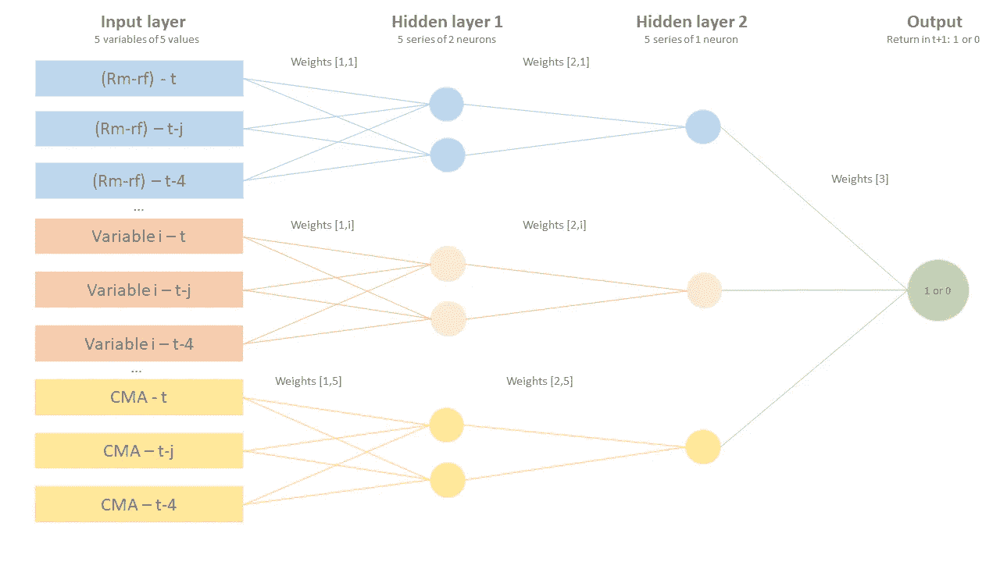
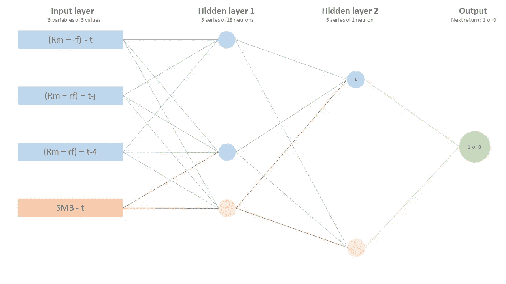
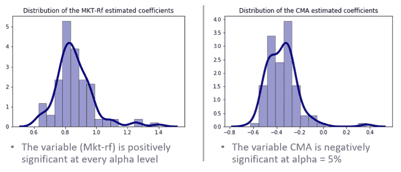

# 想象一个结合了深度学习能力和统计可解释性的单一模型

> 原文：<https://towardsdatascience.com/imagine-a-single-model-combining-the-power-of-deep-learning-and-the-interpretability-of-statistics-d4f0c964b0d1?source=collection_archive---------40----------------------->

在 [Unsplash](https://unsplash.com?utm_source=medium&utm_medium=referral) 上由[duanghorn Wiriya](https://unsplash.com/@ph_an_tom?utm_source=medium&utm_medium=referral)拍摄的照片

回归或分类问题通常用两种模型中的一种来分析:简单的统计模型或机器学习。尽管相对简单，但前者具有明显的可解释性优势(如所用变量的重要性)。相比之下，后者往往更强大，但由于其不透明性，通常被称为“黑盒模型”。

任何给定模型的性能都与其模块化程度直接相关。模块化程度越高，通常意味着整体精度越高(暂且忽略过度拟合)。然而，模块性越高也意味着我们越不知道一个给定的变量是如何解释目标的。换句话说，性能和可解释性似乎与它们的本质是对立的。但是如果事实并非总是如此呢？

在这篇文章中，我将首先从头构建一个强大的深度学习模型，其次，以一种允许我们解释某些解释变量是否可以说对目标变量产生了显著(积极或消极)影响的方式来调整它。在本文的其余部分，这个模型将被称为“SDL 模型”(用于重要的深度学习)。将使用前馈信息和反向传播误差(通过梯度下降)等概念，如果你还不熟悉这些概念，解释神经网络和深度学习的文章可能会帮助你理解文章。

# 加载用于训练 SDL 模型的数据

该模型将使用一些公开可用的数据进行训练。选择一个分类问题，IBM 股票(公开信息)的月对数收益的符号被选为目标变量。Fama & French 五因素将被用作解释变量。这些变量是 Rm-rf(市场相对于无风险利率的收益率差)、SMB(最大和最小公司之间的业绩差异)、HML(绝对股票最高和最低公司之间的业绩差异)、RMW(最赚钱和最不赚钱公司之间的业绩差异)和 CMA(保守投资公司和激进投资公司之间的业绩差异)。这些不同的数据集可以在[我的 Github](https://github.com/Colbiche19/TDS_model) 上找到。首先导入包 Pandas 和 Numpy，然后运行以下代码以正确的格式加载所有数据。

用于加载数据的 Python 代码

# 理解 SDL 模型的大致结构

现在让我们仔细看看 SDL 模型的逻辑结构。一个好的起点是将其视为各种人工神经网络的组合，或者视为某些权重被约束为零的单个人工神经网络。为了说明一些可能的自相关性，我们对上述每个变量使用 t 时刻的回归值及其四个第一滞后值。然后，具有一个隐藏层的第一个人工神经网络可以应用于与同一变量相关的每组五个输入(在下图中用蓝色、橙色和黄色表示)。优化后(见下文)，每个系统都给出一维输出。然后，五个获得的输出的系列可以用作没有隐藏层(即简单的逻辑回归)的最后一个人工神经网络(用绿色表示)的输入层，并且其 y 标签等于 1 或 0，这取决于 IBM 股票回报的符号。

逻辑结构的示意图(I =中小企业、HML、RMW 和 j=1，2，3)

然而，仅仅通过组合这些不同的子模型来构建最终模型是不可能的。开始时，与五个神经元的最佳值相关的信息，即前五个 ANN 的各自输出，是未知的。因此，不可能调整权重来最大程度地降低成本函数，因为该函数本身是使用输出层的实际值和这些未知最优值之间的差来计算的。为了克服这个问题，我们将建立 SDL 模型作为一个单一的监督模型，具有五乘五个特征(Fama 和 French 五个因子的滞后值)和一个输出(IBM 股票回报的符号)。与此同时，必须对模型的大多数权重添加一些约束，以符合上述逻辑。在下图中，虚线表示约束为零的权重。

模型权重的图示-显示了约束和非约束

# 用 Python 实现 SDL 模型

## 步骤 1:初始化

现在让我们转到 Python 实现。在初始化下面介绍的 NeuralNetwork 类之前，已经执行了一些必要的步骤(训练测试分割和一些数据预处理，以确保数据格式是正确的)。也可以在我的 Github 上查看这段代码。我们用四个不同的特征初始化一个新的模型。x 和 y 分别表示输入训练矩阵和目标训练向量。Lamb1 是正则化参数，类似于线性回归中的 Ridge，learningr 是模型的学习速率(反向传播误差时校正权重的力度)。然后用-15 和 15 之间的一些随机数初始化所有非约束权重。这个宽范围用于引入显著的可变性。这里值得一提的最后一点是，输出向量(用零值初始化)旨在包含在整个模型中“前馈”输入后获得的结果。误差向量将被构建为该向量和 y 向量之间的差。

用于模型类初始化的 Python 代码

## 第二步:前馈

推理的下一步包括通过各层前馈输入。首先，输入矩阵(大小为 n * 25-n 是数据集的长度)乘以第一个权重矩阵(大小为 25*10)。每个第一隐藏层的神经元值最终等于 sigmoid 函数的输出，以矩阵乘法的相关边际结果作为变量。使用相同的方法来处理下面的层。一切都用数学方法总结如下。

前馈过程背后的数学。

在 Python 中，我们的 NeuralNetwork 类中的前馈方法可以通过以下方式实现。

前馈的 Python 代码

## 步骤 3:错误反向传播

一旦获得了输出层，就可以计算成本函数。这用于衡量预测输出与实际目标的差距。推理的下一步在于计算该成本函数相对于不同权重的导数(从权重 3 开始，然后是权重 2，最后是权重 1)。这旨在理解成本函数的哪个部分与哪个权重相关联。然后有可能以最小化成本函数的方式更新权重(根据所选择的学习速率，只有一部分导数被减去到当前权重)。下面总结了最初的数学步骤——计算基于链式法则原理和符号”。*”用于表示逐元素的矩阵乘法。注意，从第二个隐藏层开始，我们再次从误差向量的边缘元素开始推理。

误差反向传播第一步背后的数学

最相关的代码行如下所示。请再次注意，许多不太重要的行在这里没有显示，但是可以在 [my Github](https://github.com/Colbiche19/TDS_model) 上找到。

反向传播的 Python 代码-仅最相关

## 步骤 4:优化和选择λ和学习率参数的最佳值

推理的最后一步包括重复步骤 2 和步骤 3(即，具有不断发展的权重和反向传播误差的前馈信息)。当成本函数不再降低时，该过程最终停止。我们使用简化的交叉验证来选择 lambda 和学习率参数的最佳值(即，针对测试的所有 lambda 学习率对，计算给定测试集的分类准确度，然后保留模型表现最佳的对)。在前面介绍的金融数据上，使用等于(0.15，0.3)的元组(lambda，学习率)可以获得测试集上的最佳分类精度(大约 70% —可以添加一些 IBM 特质变量来增加这个数字)。

“交叉验证”选择最佳参数值

## 步骤 5:变量的重要性

现在证明，SDL 模式运行良好。在大多数情况下，它能够根据市场相关变量的当前和过去的值，正确地对 IBM 收益的符号进行分类。工作完成了一半！

下面的方法将解释所选择的变量如何帮助解释 IBM 收益为正的概率。你可能已经注意到，我们的 SDL 本质上是两种模式的结合。第一种是五个神经网络与一个隐藏层的组合。优化 SDL 模型的方式确保了这些子模型中的每一个的最终神经元处的值是相同外生变量的五个时间输入的最优变换的结果(显然可能不是每个单个数据行的情况，而它在考虑所有数据时检查出来)。然后，这些经过优化转换的变量被用作第二个模型组件(最后一个没有隐藏层的神经网络，基本上是逻辑回归)的输入。从第二个模型中可以得出一定的意义。—对于每个外部变量，通过将相关子模型的最后一个神经元值(向量)乘以应用于该最后一个神经元的权重(标量)获得的向量平均值将用于该目的。这给出了插入 sigmoid 函数的平均绝对数字的概念，以最终估计 IBM 股票收益为正的概率。这一估计应该是准确的，而不仅仅是 SDL 模型幸运收敛的结果。因此导出了该估计量的非参数分布。该分布建立在运行相同代码 100 次所获得的一组值的基础上。如果这个分布的 2.5%和 97.5%的分位数要么都是正的，要么都是负的，那么就可以断定这个外生变量是显著的(α=5%)，分别是正的或负的！

如下图所示，变量(Mkt-rf)与 IBM 收益的符号正相关。换句话说，市场价差越大，IBM 的回报率越有可能为正，这似乎是合乎逻辑的。类似地，CMA 变量似乎对 IBM 收益为正数的概率产生了负面影响。换句话说，保守投资公司和激进投资公司之间的业绩差异越大，IBM 取得正回报的可能性就越低。由于长的右尾，这种关系是显著的，但仅在任何置信水平 1-α-α> 1%时。

这一部分的代码可以在下面找到。

Python 代码推导出一些变量的意义

# 模型的结论和已知限制

总之，在运行 SDL 模型的 Python 实现时获得的结果表明，性能和可解释性在一定程度上是可以结合的。绩效与适当的 IBM 股票回报分类相关联，可解释性与所使用的外生变量的正或负显著性相关联。

然而，这种方法并不完美。例如，同一个模型必须运行多次才能获得最终估计值的分布，这一事实耗费时间和 CPU。从方法学的角度来看，选择最佳参数值的交叉验证只在一个样本上进行。最后，可以认为，在输入可以取正值和负值的情况下，上一步中得出的重要性可能不再准确，但这可以通过对输入值进行适当的初始标准化来避免。

这只是我对这种创新的意义重大的深度学习模型研究的起点。我期待着关于如何使这项研究更上一层楼的反馈和想法，我很乐意讨论你可能有的任何想法，关于本文中解释的模型或其他可以调和性能和可解释性的逻辑结构。