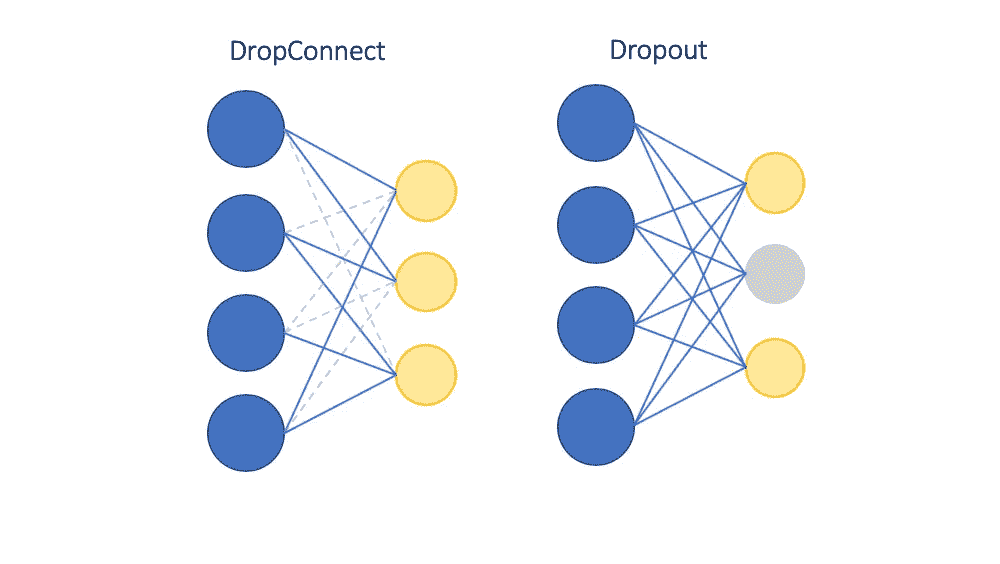
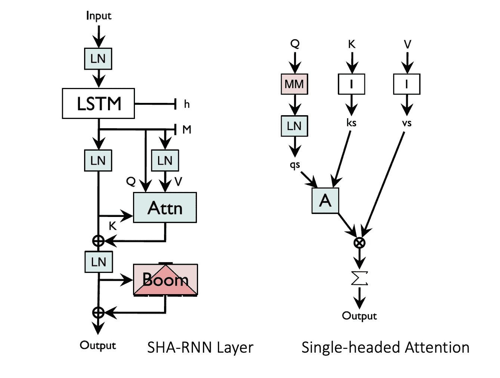

# 想象一个没有变形金刚的世界——单头关注 RNN

> 原文：<https://towardsdatascience.com/imagining-a-world-without-transformers-single-headed-attention-rnn-844cca2580f9?source=collection_archive---------18----------------------->

## 从一篇最有趣的 NLP 论文中提取关键思想，描绘一个没有伯特模型家族的世界

# TL；速度三角形定位法(dead reckoning)

2019 年是变革之年——在不同领域完成了大量工作(超过 5000 次引用),并解决了扩展和应用 BERT 的 NLP 问题。2019 年 11 月发表的一篇论文带回了不久前 RNNs 统治几乎所有 NLP 任务的旧记忆。这篇博文总结了《单头注意力 RNN:停止用你的头脑思考》一文的主要观点，作者是 T2。作者分享了一些非常有趣的想法——这篇论文以讽刺的方式写成，通篇引用了许多微妙的内容，读起来很有趣。另一方面，对于一些人来说，持续地跟随和吸收变得有点困难(我读了几遍以完全理解)。我将尽力总结论文传达的要点。我还会试着为那些可能不太了解必要背景的读者设置一些背景，以使这篇文章对所有人都有用。以下是我们将深入探讨的要点:

1.  **背景**:赫特奖和理解为什么语言建模在 NLP 领域仍然是一个有趣的任务。
2.  **模型架构:**仔细观察具有基于指针的注意机制和某个“boom”前馈层的 SHA-RNN 模型架构，两者都伴随着层规范化。
3.  **标记化攻击&教师强制:**变化的标记化方案如何影响模型训练和评估行为。
4.  **资源节约**:构建可以在单个 GPU 机器上实际训练的模型，并且不严重依赖大量的超参数调优。
5.  **想象一个没有变形金刚的世界:**单向研究追求的后果，以及为什么采取反向立场可能是推动研究和工程领域整体发展的关键。

# 背景

**语言建模**是在给定之前出现过的单词的情况下，预测序列中的下一个单词的任务。包括机器翻译、语音识别等许多自然语言处理任务的核心都是语言模型。作者有趣地引用了[通用近似定理](https://en.wikipedia.org/wiki/Universal_approximation_theorem)，该定理指出，一个神经网络，当配备了足够的参数时，能够处理手头任何任务的所有更精细的复杂性。从理论上讲，语言模型仅仅是人类语言书写方式的反映，本身没有任何重要的原始智能。

赫特奖鼓励压缩自然语言文本的任务，以尽可能最有效的方式学习和再现文本序列，具体来说，就是来自维基百科的 100 MB 文本文件(enwik8)可以压缩多少。在本文中，作者演示了一个简单的基于 LSTM 的模型(经过一些修改),具有单个注意力头，与许多高级的基于 transformer 的模型相比，尽管内存和资源消耗较低，但性能非常接近。

# 模型架构

作者将沙-RNN 模型的架构描述为梅里蒂等人(2018a)介绍的 AWD-LSTM 模型的升级版。值得一提的是，快速回顾一下 AWD-LSTM 模型，以便更好地理解沙-RNN 模型可能是个好主意。ASGD 权重下降 LSTM 模型对 lstm 应用了几种正则化技术，使其成为强大的语言建模标准，但这里有两个最突出的:

1.  **drop connect**:drop connect 是一种正则化技术，由 Yann LeCunn 在 NYU 的团队于 2013 年首次推出，基于辍学正则化策略的思想。在 DropConnect 设置中，随机选择的权重子集为零，这与 dropout 相反，dropout 在给定的训练迭代中随机关闭一些隐藏单元激活。请看下图，它使这一解释更加直观:

丢弃和丢弃连接正则化技术的比较

2. **NT-ASGD** :顾名思义，非单调触发平均随机梯度下降在两个意义上是传统 SGD 的变体。首先，它通过将来自先前迭代的权重与反向传递期间返回的当前训练步长权重进行平均来考虑这些权重。第二，只有当模型的主要评估度量在一定的训练迭代周期内没有改善时，才执行这种平均。

在此背景下，我们可以看看沙-RNN 模型架构的一些主要组件:

如图所示， ***每个 SHA-RNN 层只包含一个注意力头，通过消除更新和维护多个矩阵*** 的需要，帮助保持模型的内存消耗最小。另一方面，多头注意力需要融合每个头的计算，以产生变压器层的最终输出。SHA-RNN 还主要利用文本中的顺序性，而不是变压器，变压器仅通过时间和位置编码信号微妙地跟踪序列的概念，这可能会引入更多的参数供模型跟踪。

SHA-RNN 图层在多个点加载了图层归一化步骤，以在每个要素维度上对要素进行归一化，这在之前已被证明可减少训练时间并提高稳定性。有一个被称为“boom”层的前馈层，它基本上使用 GeLU(高斯误差线性单位)激活来创建最终输出向量。尽管 AWD-LSTM 使用了 NT-ASGD 优化器，但作者报告的结果与之前使用 LAMB 优化器(用于批量训练的分层自适应矩优化器)的实验一致，该优化器提高了较大批量的收敛性。在这种情况下，深入 LAMB 优化器的细节可能会很棘手，但我喜欢[这篇博文](/an-intuitive-understanding-of-the-lamb-optimizer-46f8c0ae4866)，如果你有兴趣了解更多，这篇博文很好地解释了它。

# 标记化攻击和教师强迫

作者指出，不同的标记化方案在我们如何训练、评估和比较不同的语言模型中起着重要作用。特别是，比较单词和子单词级别模型之间的困惑分数可能不是很简单。单词块标记化器通常将单词分割成更小的复合子词，这样可以得到更紧凑的词汇表和更好的模型参数利用率——这很好。此外，在训练过程中，目标令牌作为下一个输入(教师强制)被传递到该层，使得该模型在单词的初始部分严重影响给定单词的后续部分的情况下获得轻微优势。在实践中说明这一点的一个很好的例子是，当模型必须预测“邓布利多”时，从单词 pieces**【D】**【umble】【dore】中的第一个标记“D”可以获得大量信息，而单词标记化模型只能预测一次。如果你想知道这些单词块标记化算法是如何工作的，我的上一篇博客文章是关于将[字节对编码](/byte-pair-encoding-the-dark-horse-of-modern-nlp-eb36c7df4f10)重新用于子单词标记化。

# 资源节约

在过去的几年里，我们在深度学习领域取得了巨大的突破，这主要归功于大规模计算资源(GPU/TPU 集群)的可用性以及我们高效利用这些资源的能力(分布式机器学习)。虽然大多数大型组织都有无限的计算能力，但独立研究人员很难重现结果。例如，对 BERT 进行预训练需要 4 天时间，16 个 Google cloud TPUs 很容易就花费了几万美元——不确定你的，但那肯定会在我的口袋里烧一个大洞。

> "无论如何，我所有最好的作品似乎都来自相对较少的资源和创造性."

值得称赞的是，作者能够在不到 24 小时的时间内，在单个 GPU 机器上训练沙-RNN 模型，并且没有进行大量的超参数调优。

# 想象一个没有变形金刚的世界

> "为什么要像飞蛾扑向灯泡一样，只向一个方向推进呢？"

自从引入 transformer 层以来，研究界在去年取得了惊人的进步。作者在沙-RNN 论文中所做的许多工作也受到了这项工作和过去许多聪明的工作的启发。但是，作者提出了在研究人员的工具包中具有多样性和竞争性的模型架构的重要性，以便能够为手头的给定任务选择合适的模型，而不是仅仅依赖于一种类型的模型。这也需要更好的工具和效率的提高，而不仅仅是选择几个架构，而是共同推进研究流的所有方面。但是最后，很难说会发生什么，但是永远不要忘记你从哪里来，因为有一天你可能不得不回去！

# 参考

1.  梅里蒂，S. (2019)。单头注意力 RNN:停止用你的头脑思考。 *arXiv 预印本 arXiv:1911.11423* 。
2.  梅里蒂，s .，凯斯卡尔，N. S .，&索彻，R. (2017)。规范和优化 LSTM 语言模型。 *arXiv 预印本 arXiv:1708.02182* 。
3.  万，李，，米，张，s，乐存，y，&弗格斯，R. (2013 年 2 月)。使用 dropconnect 正则化神经网络。在*机器学习国际会议*(第 1058–1066 页)。
4.  Vaswani，a .、Shazeer，n .、Parmar，n .、Uszkoreit，j .、Jones，l .、Gomez，A. N .、… & Polosukhin，I. (2017)。你需要的只是关注。在*神经信息处理系统的进展*(第 5998–6008 页)。
5.  Smerity/sha-rnn 代码库—[https://github.com/Smerity/sha-rnn](https://github.com/Smerity/sha-rnn)
6.  TWIML AI 播客—[https://soundcloud.com/twiml/single-headed-attention-rnn](https://soundcloud.com/twiml/single-headed-attention-rnn)