# 分类中的不平衡数据:一般解决方案和案例研究

> 原文：<https://towardsdatascience.com/imbalanced-data-in-classification-general-solution-case-study-169f2e18b017?source=collection_archive---------20----------------------->

## 在错误分类一个二进制类比另一个二进制类代价更高的情况下，找到最佳分类器和重采样技术来处理不平衡数据

*作者:哈德尔·哈马德&* [*闵周*](https://medium.com/u/e596798cce69?source=post_page-----169f2e18b017--------------------------------) *，博士*


图片启发:[https://www . vector stock . com/royalty-free-vector/balance-scale-isolated-icon-design-vector-9656446](https://www.vectorstock.com/royalty-free-vector/balance-scale-isolated-icon-design-vector-9656446)

在处理分类问题时，如何处理一个数据集，该数据集的一个二进制类中的数据点比另一个二进制类中的数据点多得多？这样的数据集被称为*不平衡*。简单地在不平衡的数据上实现一个分类模型并期望最好的结果是明智的吗？有许多重采样技术可以“平衡”不平衡的数据集和大量的分类模型。我们如何为我们的问题选择一个最优的呢？

*本文旨在为数据科学领域的非技术从业者*[[https://arxiv.org/abs/2002.04592](https://arxiv.org/abs/2002.04592)]总结以下学术研究“不平衡分类:面向目标的综述”。这篇文章对于至少具备机器学习基础知识的读者来说是容易理解的。

# **一、简介**

不平衡的数据集在所有行业中都非常普遍。假设您为一家银行工作，并且您有一份带有欺诈标签的信用卡交易数据。您发现欺诈类别非常不平衡(0.17%的数据是欺诈=0，99.83%的数据是非欺诈=1)。在这种不平衡的数据上天真地实现分类模型可能会导致非常低的预测准确性。在分类问题中，几乎不可能完美地同时预测两个类别(欺诈和非欺诈)。这是因为分类模型带有两种类型的错误，类型 I 和类型 II，并且本质上在这两者之间存在权衡。第一类错误表示将欺诈交易误归类为非欺诈交易的可能性。第二类错误的意思正好相反:将非欺诈交易误归类为欺诈的概率。通常情况下，第一类错误比第二类错误的代价更高。我们的案例就是一个例子，因为你可能会因为错误地将客户的交易标记为欺诈而激怒他们，从而有可能失去他们。然而，一般来说，根据问题的性质，您可以选择不同地对待类型 I 和类型 II 错误的权重，这相应地决定了操作的分类范例。

我们将简要概述分类范例和重采样技术。然后，我们将使用上面的信用卡欺诈数据的例子，这是一个真实的案例，将每种重采样技术与不同分类范例下的分类模型配对。目标是为每个范例找到重采样技术与分类模型的最佳组合。在本文的最后，我们提供了应用分类范例和重采样技术编写 R 代码的例子。

# **二。三种分类范式**

每种分类模式对第一类和第二类错误的权重处理不同:

1.*经典分类(CC)范式*将总体分类误差降至最低，这意味着 I 类和 II 类误差的权重相等。在第一类错误可能比第二类错误更严重的情况下，或者相反的情况下，它不能很好地服务。因此，我们接下来将介绍另外两个解决不对称错误重要性问题的范例。

2.*成本敏感(CS)学习范式*为第一类和第二类错误分配不同的成本，然后最小化它们的总量。它有多种方法，但是我们将把*后处理方法*应用到我们的案例研究中。CS 学习的缺点是为 I 型和 II 型错误分配成本值，因为它们通常是未知的。另一个缺点是，即使我们将经验 I 型误差调整到等于预先指定的水平(α),真实的总体水平 I 型误差仍然有超过α的一些可能性。然而，尼曼-皮尔逊处理这个问题。

3. *Neyman-Pearson 范式*是一种新兴的统计框架，通过旨在将第二类误差最小化，同时将第一类误差控制在理想水平之下，来控制不对称误差。要了解更多，请阅读以下论文:*尼曼-皮尔逊分类算法和 NP 接收机操作特性*

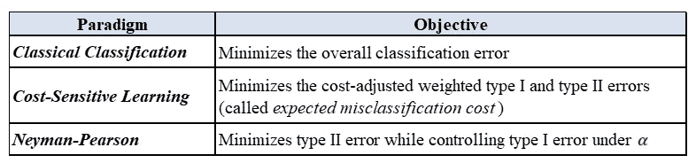

**表 1:每个分类范式的学习目标**

# **三。重采样技术**

我们利用重采样技术来减轻不平衡的类大小对分类模型预测能力的影响。重采样技术通过平衡少数类和多数类中的数据点数量来创建新的训练数据集。我们将讨论三种不同的技术:欠采样、过采样和混合技术。

1.*欠采样*方法使用两种通用方法消除多数类中数据点的子集。第一个是*随机欠采样，*随机丢弃多数类的数据点，以平衡其大小与少数类的大小。虽然这是一种简单省时的方法，但它可能会产生数据偏差，因为它会抛出一些信息，使数据样本不太能代表真实的总体。第二种技术，*基于聚类的欠采样，*可以减弱这种偏差问题。它对多数类应用聚类算法，以便获得与少数类的大小相平衡的几个聚类。如果多数类的规模很大，这种技术可能会很慢。欠采样的一个普遍缺点是，如果大多数类的大部分数据被丢弃，它可能会导致关键信息丢失。

2.*过采样*增加少数类中数据点的数量，以平衡多数类的大小。*随机过采样*通过随机复制少数类中的数据点来实现这一点，直到它们与多数类的大小成同等比例。*合成少数过采样技术* (SMOTE)利用 *k* 最近邻为少数类生成新的数据点，这些数据点与多数类的大小成正比。过采样方法可能导致过拟合，并且相对于欠采样，它通常需要更长的训练时间。

3.混合技术仅仅是欠采样和过采样技术的结合。它同时应用过采样来增加少数类中数据点的数量，同时应用欠采样来减少多数类中数据点的数量。

# **四。真实案例分析:信用卡欺诈数据**

## ***数据集描述***

*   *数据集来源:*卡格尔【https://www.kaggle.com/mlg-ulb/creditcardfraud】T2
*   *预测值个数:* 30
*   *记录/交易笔数:*284807 笔
*   *响应变量:*“Class”，在欺诈的情况下取值 1，否则取值 0。在我们的数据处理中，我们在研究中颠倒了标签，所以如果欺诈，0 类；否则 1。
*   *不平衡率:*0.17%(284，807，492 ÷ 284807 中的 492 笔欺诈交易)

## ***数据处理***

由于我们的计算能力有限，我们从上述大型数据集中提取了一个子样本。我们指定不平衡比(IR)为 100；即 IR=100。我们为类别 0(欺诈)随机选择 n0=300 个数据点，为类别 1 选择 n1=n0*IR=30，000。这创建了我们的训练集。测试集由剩余的 0 级 m0=192，[492–300]和 1 级 m1=m0*IR=19，200 组成。这种分割机制保证训练集和测试集的 IR 相等。

下面是我们使用的重采样技术

*   *无重采样*:使用训练集，不对原始数据进行任何修改(在图表中，我们称之为“原始数据”)
*   *随机欠采样*(我们称之为“欠采样”)
*   *过采样*(“SMOTE”):我们使用 R 包 smotefamliy，v1.3.1，Siriseriwan 2019，默认选择最近邻
*   *混合*:结合随机欠采样和 SMOTE

以下是我们应用的分类模型，后面是 R 包(注意:我们使用包的默认参数):

*   逻辑回归(以 R 为基数的 glm 函数)
*   支持向量机(R 包 e1071，v1.7.2，Meyer 等人 2019)
*   XGBoost (R 包 XGBoost，v0.90.0.2，陈等 2019)

对于分类范例，我们指定以下参数:

*   CS 学习范式:我们指定成本 C0=IR=100，C1 = 1；阈值=C0/(C0+C1)=100/101
*   NP 范式:我们指定α = 0.05，违反率δ = 0.05

表示|S|为集合 S 的基数，设 O = {CC，CS，NP}，T = {Original，Under，SMOTE，Hybrid}，C = {LR，SVM，XGB}。因此，它需要|O=3| × |T=4| × |C=3| = 36 个元素，如下面的图 1 所示，我们将在后面进行研究。

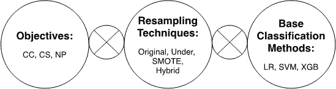

**图 1:在我们的案例研究**中检查了上述所有要素

# **五、评价指标**

在评估我们的结果之前，我们需要首先通过回顾几个用于评估模型性能的评估指标来奠定基础。请注意，我们将少数类(欺诈)标记为 0，多数类(无欺诈)标记为 1。我们称 0 类(负面类，欺诈)和 1 类(正面类，欺诈)。

分类模型通常总结在一个叫做混淆矩阵的表格中，如下图所示。它被称为“混淆”，因为分类模型在从负面类别中识别正面类别时从来都不是完美的(也就是说，它们混淆了它们)。右边的对角线代表被*错误地*预测的标签，而左边的对角线代表被*正确地*预测的标签。

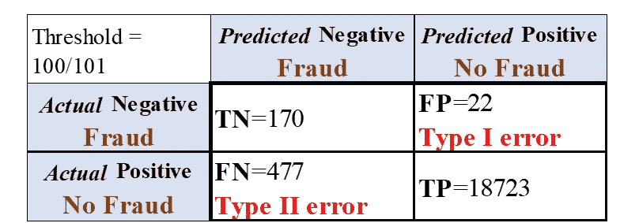

**表 2:混淆矩阵** — *来源于 CS 范式下对原始数据的逻辑回归*

混淆矩阵包括以下内容:

*   ***真阴性(TN):*** 被*正确*预测为*阴性*(欺诈)的数据点数
*   ***假阴性(FN):*** 被*错误*预测为*阴性*的数据点数
*   ***真阳性(TP):*** 正确*预测为阳性(无欺诈)的数据点数*
*   ****假阳性(FP):*** 被*错误地*预测为*阳性*的数据点数*

***—第一类错误:**将欺诈交易误归类为非欺诈交易的比例:
= FP/(TN+FP)
= 22/(170+22)= 0.1146*

***—第二类错误:**将非欺诈交易误归类为欺诈交易的比例:
= FN/(FN+TP)
= 477(477+18723)= 0.0248*

*下面我们计算每一类在计算经验风险和分类成本时使用该信息的比例。接下来:*

*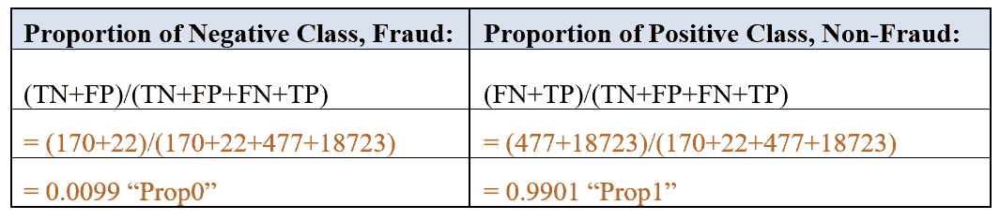*

***—总体分类误差(或“经验风险”):**两个类别中错误分类数据点的百分比。表示如下:
= prop 0 * Type I+prop 1 * Type II
=(FP+FN)/(TP+FP+TN+FN)
= 0.0257*

***—** 在将成本分配给第一类和第二类错误(C0 分别=100 和 C1=1)的情况下，**经验分类成本**将计算如下:
= C0 * prop 0 * type 1+C1 * type II
= 100 * 0.0099 * 0.1146+1 * 0.9901 * 0.0248
= 0.1380*

***— F-score** 是处理不平衡分类问题时的常用指标。它来源于测量精度和召回率；他们的计算见下表 3。如果相应的精度或召回率未定义或等于 0，则 F-score 被设置为 0。*

*o ***Precision:*** 测量您的模型根据其*预测的*标识(即正确和不正确的预测)对每个类做出正确预测的次数。*

*o ***回忆:*** 测量你的模型在每一类的*真*识别中做出正确预测的次数。*

*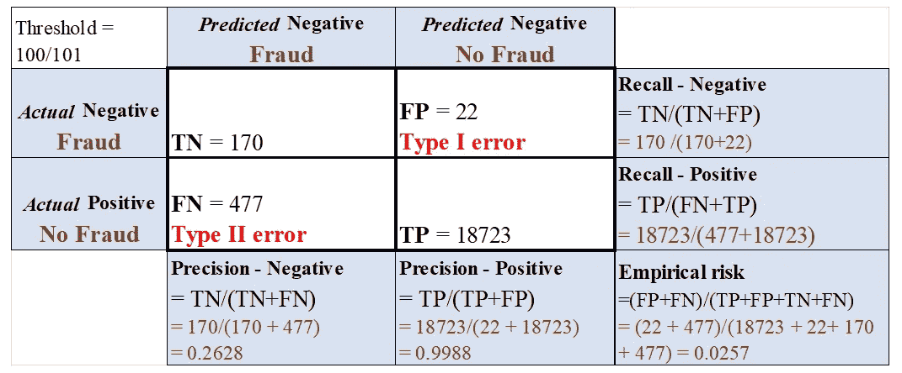*

***表 3:混淆矩阵**–*与表 2 相同，只是它显示了如何计算精确度、召回率、&风险**

*使用上述精度和召回率的计算，我们计算每个类的 F 分数:*

*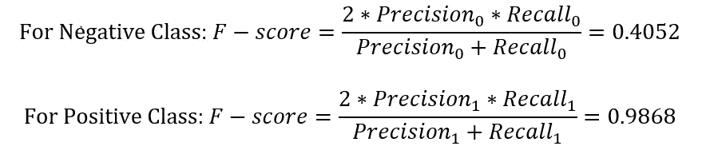*

***接收器工作特性(ROC)曲线**是分类模型在区分阈值变化时识别阳性和阴性类别的性能的图示(见下图 2)。此外，它反映了第一类和第二类误差之间的权衡。随着我们成功地在数据中识别出更多的真阴性(欺诈)，代价是将非欺诈记录误识别为欺诈(犯假阳性)。ROC 曲线下面积(AUC)是一个单一数字的汇总，它量化了模型在区分阳性和阴性类别方面的表现。它通常介于 0 和 1 之间。该值越大，模型的性能越好。值 0.5 并不比随机猜测更好。如下图 2 所示，ROC-AUC 为 0.9734907，这表明该模型在识别欺诈交易和非欺诈交易方面做得很好。*

*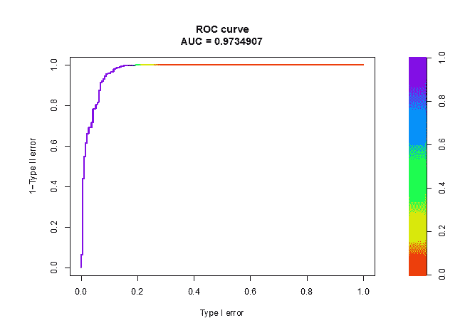*

***图 2:CS 范式下对原始数据进行逻辑回归得到的 ROC**-【LR+原始】-*

****精确召回(PR)** 曲线及其 AUC(**PR-AUC**)是处理不平衡数据时的替代指标。在图 3 中，欺诈类的 PR-AUC 为 0.857943，非欺诈类的 PR-AUC 为 0.9995953。**

**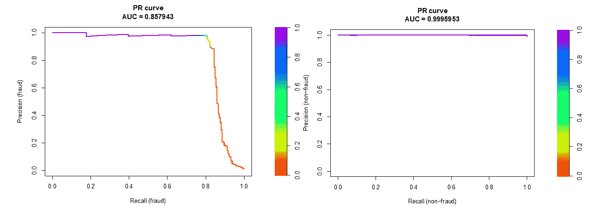**

****图 3: PR 曲线-**“LR+原始”- *源自 CS 范式下对原始数据的逻辑回归***

**总之，对于第一类和第二类错误、经验风险和经验分类成本，较小的值表明分类模型的性能较好。然而，对于 F-score、ROC-AUC 和 PR-AUC，较大的值表明性能较好。**

# ****六。结果和解释****

**为了稳定我们的结果，该过程重复 50 次，并报告三种分类范例下所有分类器的平均性能(评估度量的平均值)。结果总结在图 4 至 7 和表 4 至 6 中。**

## *****经典分类(CC)范式*****

**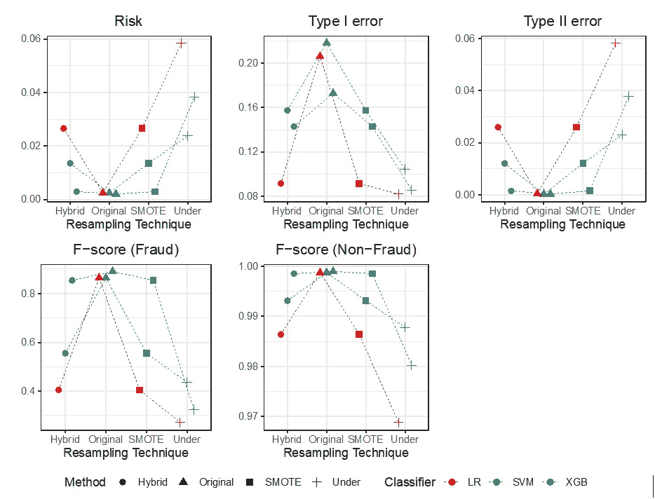**

****图 4:经典分类范式下的度量结果****

**图 4(上图)展示了在 CC 范式下将每种重采样技术与分类模型配对的结果。我们观察到，没有重采样的所有分类器的经验风险比所有重采样技术的风险更小(更好)。此外，对于没有重采样技术的所有分类器，F 分数也更好(更高)。因此，我们得出结论，如果我们的学习目标是最小化风险(在 CC 范式下操作)，则对原始数据应用 XGBoost 分类模型而不执行重采样技术是最佳选择(“XG b+原始”)。**

**值得注意的是，最小化不平衡数据上的总体分类误差可能会导致大的 I 类误差，这在上面清楚地示出了。然而，通过利用重采样技术，我们可以更好地控制 I 型误差。**

**为了方便读者，我们根据几个评估指标总结了 CC 范式下重采样技术与分类模型的最佳组合:**

**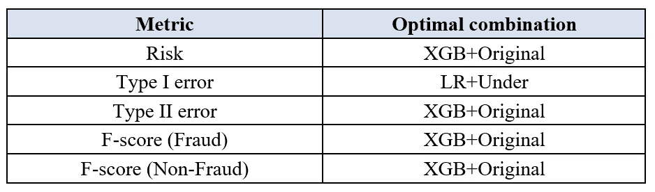**

****表 4:CC 范式下的最佳组合****

**图 5(下图)中的 ROC-AUC 和 PR-AUC 测量了整体模型的性能，无需指定分类范例。这些指标表明 XGBoost 在所有重采样技术中效果最好。然而，根据 ROC-AUC，重采样技术不能改善逻辑回归的性能。然而，在 ROC-AUC 和 PR-AUC(非欺诈类)下，它们可以显著地有益于支持向量机。最后，以 ROC-AUC 和 PR-AUC(非欺诈类)为标准，“XGB+Hybrid”为最优组合，以 PR-AUC(欺诈类)为评估标准，“XGB+SMOTE”为最佳组合。**

**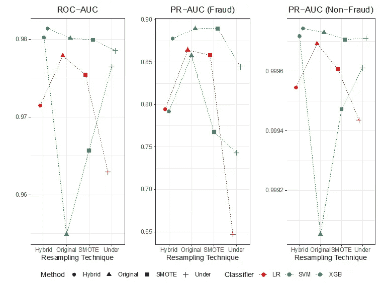**

****图 5: ROC-AUC、PR-AUC(欺诈)和 PR-AUC(非欺诈)****

## *****成本敏感(CS)学习范式*****

****

****图 6:CS 学习范式下的指标结果****

**如果我们的目标是最小化总的错误分类成本，那么我们应该在 CS 学习范式下操作。从上面的图 6 中，我们发现，通过使用 I 型误差作为评估指标，所有模型都显著受益于重采样技术。下表通过对不同指标的评估，总结了 CS 学习范式下重采样技术与分类模型的最佳组合。**

**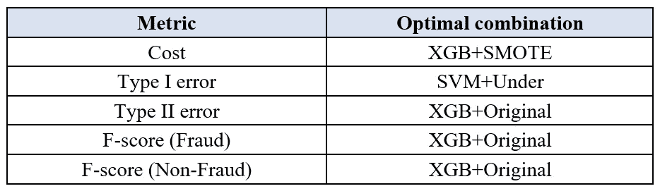**

****表 5:CS 学习范式下的最优组合****

## *****尼曼-皮尔逊范式*****

**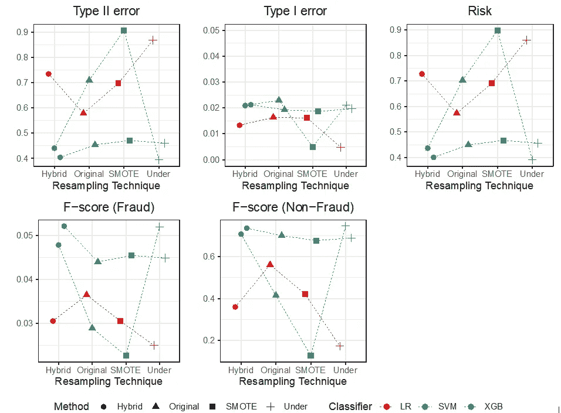**

****图 7:尼曼-皮尔逊范式下的指标结果****

**如果我们的目标是最小化第二类错误，同时将第一类错误控制在目标水平之下，那么我们应该在 NP 范式下操作。其结果如图 7 所示。我们观察到，在重采样技术与分类模型的所有组合中，I 型误差在α下得到很好的控制。最后，我们在下表中总结了 NP 范式的最佳组合。**

**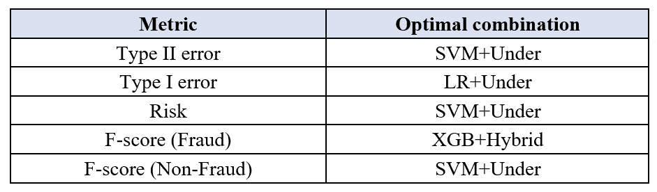**

****表 6:NP 范式下的最优组合****

# ****七世。最后备注&案例研究的局限性****

**当处理不平衡数据时，关键是要先问自己，在你的问题中，哪种错误的代价更大:第一类还是第二类？这个问题将帮助您确定合适的分类模式。一旦您确定了合适的范例，请从这里给出的图表中选择重采样技术和分类模型的最佳组合以应用于您的数据集。您的选择应该基于您想要用来评估分类器性能的评估度量。有几个可用的评估指标；选择一个你认为代价相对较高的错误。尽管如此，请记住，在我们的案例研究中，我们仅考虑了重采样技术和三种分类模型的选择性列表。还有很多其他的组合值得探索。另外请注意，在我们的案例研究中，我们随机选择了非欺诈类的子样本来构建我们的分类器，这对于我们的问题来说可能不具有代表性。**

# ****技术教程— R 代码****

****应用分类范例和重采样技术:** *我们应用逻辑回归仅仅作为一个例子。***

## ****分类范例****

****1。经典分类范式****

```
**## Training set
data_trainxy <- data.frame(train_x,train_y)## Testing set
data_testxy <- data.frame(test_x,test_y) ## Fit the model on the training set
model_cc = glm(train_y~.,family = “binomial”,data=data_trainxy)## Generate predictions on the testing set
prep_cc = predict(model_cc,test_x)
p_cc = 1/(1+exp(-prep_cc))## probability of Y=1 given X=x under testing set## Calculate the overall classification error (risk) on the testing set; set threshold=0.5threshold <- 0.5
pred_class <- ifelse(p_cc>threshold,”1",”0")
risk <- 1-mean(pred_class==test_y)**
```

****2。** **代价敏感学习范式(后处理方法)****

```
**## Fit the model on the training set
model_cs = glm(train_y~.,family = “binomial”,data=data_trainxy)
prep_cs = predict(model_cs,test_x)
p_cs = 1/(1+exp(-prep_cs)) ## the probability of Y=1 given X=x under the testing set## Generate predictions on the testing set
threshold_cs = IR/(IR+1) ## IR is the imbalance ratio
pred_cs = ifelse(p_cs>threshold_cs,”1",”0")## Type I error on the testing set
ind0 = which(test_y == 0)
typeI = mean(pred_cs[ind0] != test_y[ind0])## Type II error on the testing set
ind1 = which(test_y == 1)
typeII = mean(pred_cs[ind1] != test_y[ind1]) ##Empirical misclassification cost on the testing set
m0 = length(which(test_y==0)) # samples size of Class 0 in test data
m1 = length(which(test_y==1)) # sample size of Class 1 in test data
cost = IR*(m0/(m0+m1))*typeI+1*(m1/(m0+m1))*typeII**
```

****3。** **Neyman-Pearson 范式(NP 伞状算法)** 值得注意的是，在构造 NP 分类器时，我们只能对训练集的部分样本应用重采样技术。是因为背后的算法(NP 伞)把训练集的 0 类分成两部分:一部分拟合模型，一部分选择阈值。NP 伞状算法的细节可以在下面的论文“Neyman-Pearson 分类算法和 NP 接收器操作特征”中找到**

```
**## Install library “nproc” package
install.packages(“nproc”, repos = “http://cran.us.r-project.org")
library(nproc)## Fit the model on the training set
fit = npc(train_x, train_y, method = “logistic”)## Generate predictions on the testing set
pred_np = predict(fit, test_x)## Compute type I error on the testing set
ind0 = which(test_y == 0)
typeI = mean(pred_np[ind0] != test_y[ind0])## Compute type II error on the testing set
ind1 = which(test_y == 1)
typeII = mean(pred_np[ind1] != test_y[ind1])**
```

## ****重采样技术****

****1。** **随机欠采样(“欠采样”)****

```
**id0_train = which(train_y==0) ## index of class 0 in the training set
id1_train = which(train_y==1) ## index of class 1 in the training set
n0_train = length(id0_train) ## sample size of class 0 in the training set## Randomly sample observations without replacement from class 1
indexMaj = sample(id1_train,n0_train)## Obtain new training set
newtrain_under = data.frame(rbind(train_x[id0_train,],train_x[indexMaj,]), y=c(rep(0,n0_train),rep(1,n0_train)))**
```

****2。** **【过采样(SMOTE)】****

```
**## Install library “smote” package
install.packages(“smote”)
library(smote)## Use SMOTE function to construct a new training set
geneData = SMOTE(train_x,train_y)## Obtain the new training set
newtrain_smote = geneData$data**
```

****3。** **混合:** 这里它结合了“欠采样”和 SMOTE 重采样技术，最终训练集由以下内容组成:**

**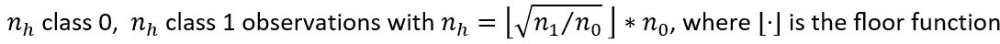**

```
**## Calculate the new sample size of the new training set
n0_train = length(id0_train) ## sample size of class 0 in the training set
n1_train = length(id1_train) ## sample size of class 0 in the training set
n_h = floor(n1_train/n0_train)*n0_train## Use SMOTE function to generate new data for class 0
M = n_h/n0_train-1
geneData_h = SMOTE(train_x,train_y,dup_size = M)
newtrain_hybrid0 = geneData_h$data[which(geneData_h$data$class==”0"),]
d=dim(newtrain_hybrid0)[2]## Randomly sample observations without replacement from class 1
indexMaj_h = sample(id1_train, n_h)## Obtain the new training set with hybrid method
newtrain_hybrid =
data.frame(rbind(newtrain_hybrid0[1:d,],train_x[indexMaj_hybrid,]),
y=c(rep(0,n_h),rep(1,n_h))) #the final training set consisting of n_h class 0 and n_h class 1 observations**
```

**最后请注意，ROC-AUC 和 PR-AUC 可以分别通过“PRROC”包中的“roc.curve”和“pr.curve”函数计算。对于其他评估指标，您可以简单地使用这里包含的公式来计算它们。**

***非常感谢辛彤博士教授的友好和持续支持！***