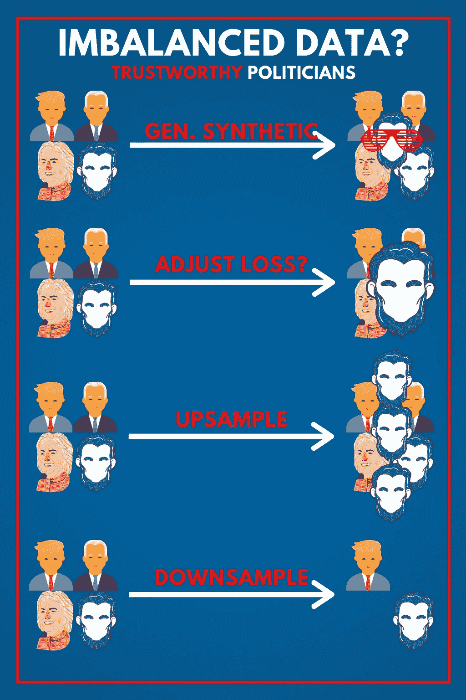
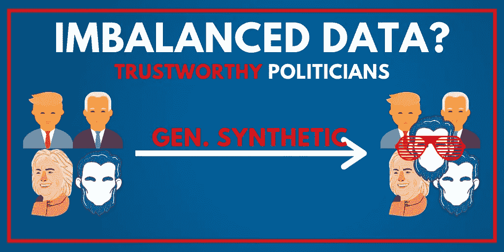
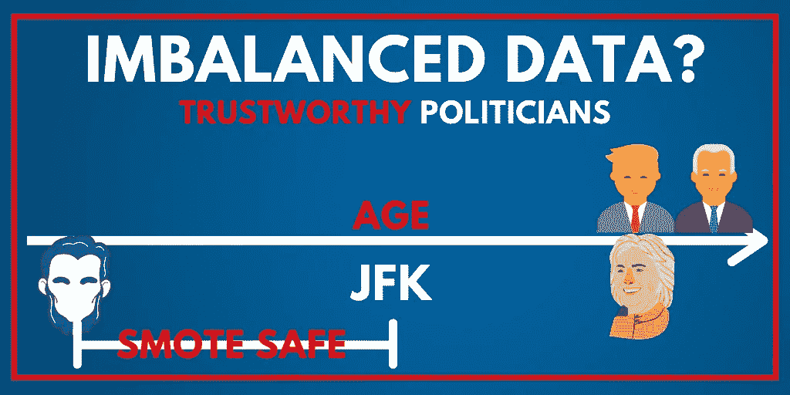

# 当细节很重要时，不平衡的数据

> 原文：<https://towardsdatascience.com/imbalanced-data-when-details-matter-16bd3ec7ef74?source=collection_archive---------51----------------------->

## 当在你的数据集中找到一个值得信赖的政治家就像大海捞针一样困难时，你可以这么做。



标准技术的插图，作者提供的图像

# 定义不平衡数据

当我们谈到不平衡的数据时，我们的意思是至少有**个** **级** **被低估**。例如，在考虑构建分类器的问题时，我们称之为 idealistic-Voter。我们给它的任务是找出美国公众认为值得信任的政治家。当查看数据集时，我们意识到几乎每个样本都非常不受欢迎。

> 在术语分类中，我们称样本很少的类为**少数类**，样本很多的类为**多数类**。

## 那么问题是什么呢？

让我们假设有 100 个政治家，其中只有一个被广大公众认为是值得信任的；我们就叫他亚伯拉罕吧。我们现在可以迅速建立一个理想的选民。通过简单地说“所有的政客都是骗子”，即把所有的政客都归类为不可信的，这就达到了 99%的准确率。损失会很低，我们可以做一个很好的演示，展示我们的理想主义者在最常见的指标上的得分有多高。

```
PRECISION = TP / (TP+FP) = 99%
ACCURACY = TP / (TP + FN) = 99 %
F1 = (2*PRECISION*RECALL)/(PRECISION+RECALL) = 99.5 %
```

但这不是目标！我们想要的是把好的和坏的分开，我们真的没有分开任何东西。那么我们如何发现我们有问题呢？我们对亚伯拉罕不公，我们都知道他不喜欢不公…

## 平衡指标

每当您处理不平衡的数据时，也要养成查看平衡指标的习惯。他们做的和你熟悉的那些一样，但是另外，他们取所有**类的平均值。**

```
BALANCED_PRECISION=(P_TRUSTWORTHY + P_UNTRUSTWORTHY)/2=50%
```

在这种情况下，另一个非常有效的指标是与真阳性率相比的假阳性率。在多标签的情况下，你通常会选择一些宏观平均分数。

我们意识到我们有一个问题，我们如何解决它？

# 上采样和下采样

让理想主义选民自己解决问题的最简单的方法可能就是给他提供更合理的选择。这意味着要么收集更多的数据，要么使用可爱的上采样技术。

这项技术的工作原理是，我们克隆我们敬爱的亚伯拉罕，这意味着我们复制了**少数民族**的成员。一旦我们将数据集平衡到一个足够的程度，我们会注意到我们的模型实际上必须学习一些东西来获得一个好的分数！

## 向下采样

与上采样相反的是下采样，也称为欠采样。如果您有足够多的数据来完成您的工作，这种技术是非常棒的(这从未发生在我身上，但我假设这个世界的大数据收集者有时可能处于这种位置)。

在这种情况下，您可以消除一些**多数类的实例。**你不必对半分，但足以让理想主义者有动力去学习一些东西。这同样适用于我们今天讨论的所有技术。

# 生成合成样本



生成合成示例，图片由作者提供

好了，现在我们开始讨论一些很酷的事情。我们凭空生成数据怎么样？我们加点亚伯拉罕和酷酷的电子眼镜怎么样？他肯定会同样值得信赖，而且还会赢得年轻人的选票！

## 加入一点ϵps

假设我们的数据集具有特征年龄。我们可以清楚地看到，唯一值得信赖的政治家是**2020–1809 = 211**岁，1809 年是亚伯拉罕的出生年份。但是那些有着同样成就但年龄分别为 211.001 岁和 210.999 岁的政治家呢？

**大概**一样吧！但是使用这种技术时要非常小心，因为你实际上是在伪造数据。这种技巧很容易适得其反，只有当你非常确信这是正确的选择时，才应该使用它。但是这给我们带来了一个稍微复杂一点的自动化技术。

## 重击

SMOTE 代表合成少数过采样技术。它通过仔细观察所有样本的属性来构造新样本。然后，它继续修改这些值，使它们保持在我们的**少数类**中观察到的范围内。听起来很复杂，我们来看一个简单的例子，它应该会变得像你的鼠标点击拍手一样清晰。让我们假设把 JFK 加入到数据集中，再来看看值得信赖的政治家的时代。



SMOTE 插图，作者图片

如我们所见，标示为 **SMOTE SAFE** 的区域是我们可以自由生成新合成样本的区域！你可以在这里找到更深入的解释[。这很吸引人，但我认为最重要的是知道这种方法的存在。](https://rikunert.com/SMOTE_explained)

## 发挥创造力

我们可以在自动驾驶场景中找到一些令人难以置信的这种技术的例子。虽然该领域的所有主要竞争对手都已经收集了数 Pb 的数据，但像孩子跑在汽车前面这样的情况应该在实际遇到之前进行测试。这些情况也可能很少发生，以至于你永远找不到足够的训练数据。

必须生成合成数据，以便在许多不同的光照和天气条件下测试此类和各种其他边缘情况。人们经常使用 GAN 或类似的网络将已经存在的样本转换成各种其他形式，例如在冬天或下雨时。有多种方法可以做到这一点。可以在这里看一个说明这一点的短视频(我不隶属于他们也不知道他们有多好，但是他们有一个很优秀的短视频；)

演示合成数据生成的视频

# 改变损失函数

但是我们还有一样东西！如果我告诉你，我们可以在算法的核心——损失函数——处理问题，而不是在数据层面。

多年来，人们提出了许多方法，但没有一种方法是放之四海而皆准的。这通常很大程度上取决于识别**少数类、**的重要性，以及当你将样本错误分类为多数类时会产生什么样的成本。

**加权损失函数，自己定义**

混合这种损失的一种方法是简单地将发生**少数类**的项乘以常数> 1。这实际上是鼓励模型更多地关注少数民族的实例。在 Keras 中，这是内置的，可以轻松应用

```
class_weights = {0: 1.,
                1: 50.}
model.fit(X_train, Y_train,class_weights=class_weights)
```

在这个特殊的例子中，它告诉 Keras，应该将类 1 的一个实例视为类 0 的 50 个实例。在一些简单的 python 伪代码中，我们可以把它想成这样

```
def loss_weighted(x,y_true):y_pred=model.forward(x)
    if y_true==1:
        return 50*loss(y_pred,y_true)
    elif y_true==0:
        return 1*loss(y_pred,y_true)
```

## 类别平衡损失

随着类的数量变得越来越大，显式地定义东西就变得很乏味，就像我们上面做的那样。为此，提出了多种解决方案，其中最著名的是“[基于有效样本数的类平衡损失](https://openaccess.thecvf.com/content_CVPR_2019/html/Cui_Class-Balanced_Loss_Based_on_Effective_Number_of_Samples_CVPR_2019_paper.html)”

他们实际上提出的是重新加权损失函数。作者这样做是为了考虑每类样本的有效数量。为了控制损失在平衡的哪一侧结束，可以另外用超参数来调整它。

虽然这是对他们过程的一个非常简单的看法，但我觉得它抓住了最重要的方面，值得你记住。如果您曾经遇到过这样的情况，您有许多类，并且这些类之间存在明显的不平衡，那么一定要尝试一下这种方法。

# 结论

恭喜你，你现在知道当你遇到不平衡的数据时你能做什么了。有几种方法，为您的问题选择正确的方法并不总是一件容易的事情。这将在很大程度上取决于你的业务需求，以决定你想要投入多少时间和资源来更公平地平衡事情。意识到潜在的解决方案是解决它们的第一步！

如果你喜欢这篇文章，我会很高兴在 Twitter 或 LinkedIn 上联系你。

一定要看看我的 [YouTube](https://www.youtube.com/channel/UCHD5o0P16usdF00-ZQVcFog?view_as=subscriber) 频道，我每周都会在那里发布新视频。