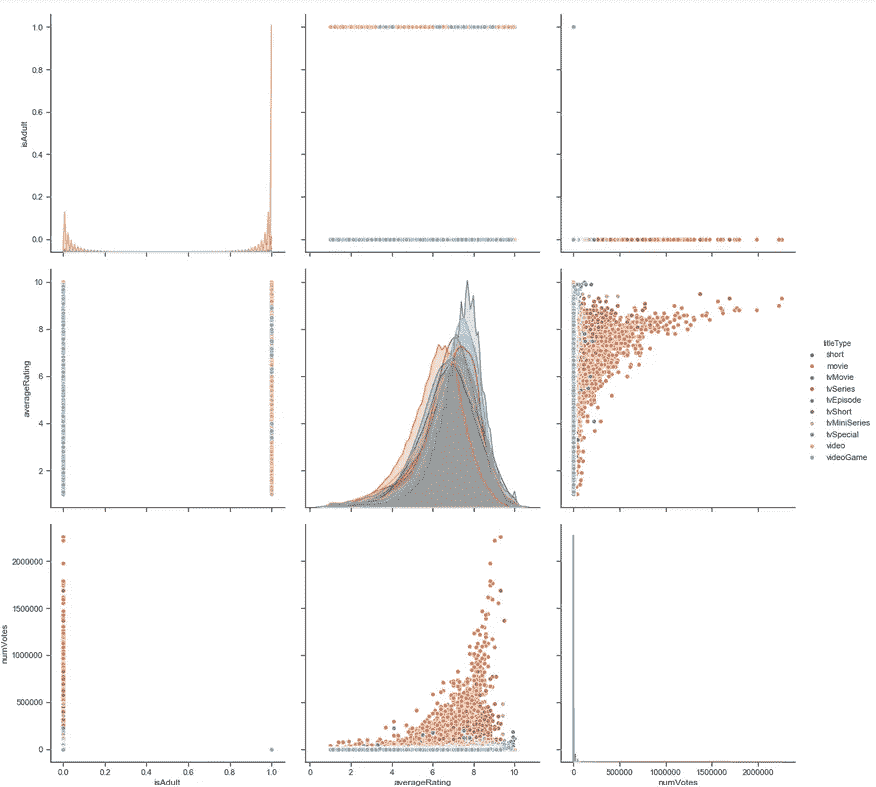
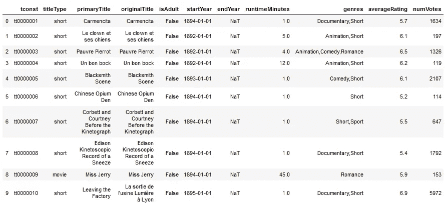
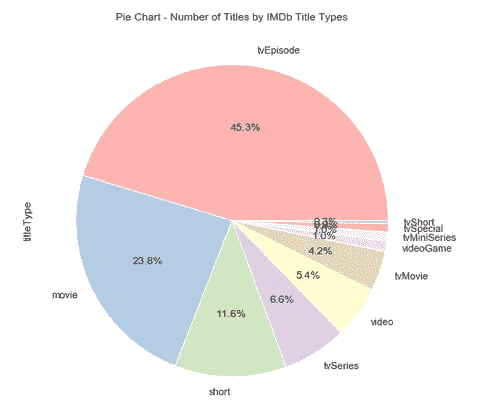
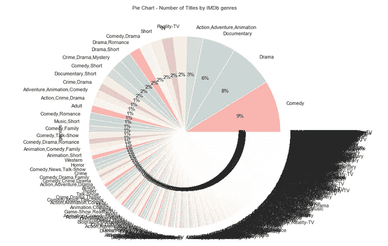
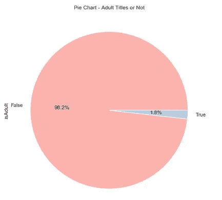
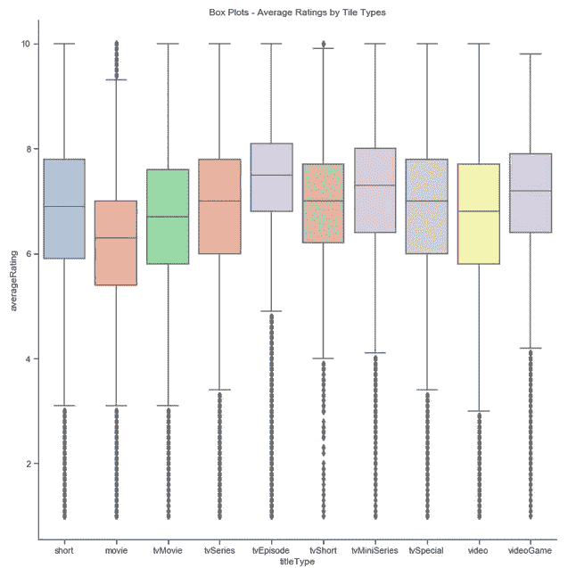

# 电影数据科学-使用 Python 提取和分析 IMDb 数据

> 原文：<https://towardsdatascience.com/imdb-data-science-pull-analyze-movies-data-using-python-b59dc8511157?source=collection_archive---------14----------------------->


雅各布·欧文斯的电影来自 [Unsplash](https://unsplash.com/)

**IMDb** (互联网电影数据库)是最被认可的名字之一，因为其全面的在线数据库收集了电影、电影、电视剧等。截至今天(2020 年 7 月)，你将通过以下数据看到 IMDb 数据库拥有大约*700 万*本图书。在本文中，我将使用 ***Jupyter 笔记本*** 中的 **Python** 来演示从哪里拉数据，如何快速解读数据，并回答一些有趣的问题，包括

> kind 数据库涵盖哪类数据？
> 
> -一般情况下人们会给出什么样的评分？真的是正态分布吗？哪些电影收视率最高？
> 
> -根据我喜欢的电影，我还应该检查哪些电影？



一些主要的 IMDb 维度

# 加载 IMDb 数据库

IMDb 已经在 IMDb [网站](https://datasets.imdbws.com/)上向公众及其客户提供了其数据库的基本子集供非商业使用，在那里你也可以找到相应的 [IMDb 数据字典](https://www.imdb.com/interfaces/)中描述的所有相关细节。在这个分析中，我主要关注 2 个数据集( **title.basics** 和 **title.ratings** )，它们分别提供了 9 个和 3 个特征，包括标题 ID、名称、类型、成人电影标志、类型、评级和标题获得的投票数。

```
basics_tsv_file =”C:\\Users\....\Downloads\\basics.tsv”
basics = pd.read_csv(basics_tsv_file, sep=’\t’,low_memory=False)ratings_tsv_file = "C:\\Users\....\Downloads\\ratings.tsv"
ratings = pd.read_csv(ratings_tsv_file, sep='\t',low_memory=False)data = pd.merge(basics, ratings, on ="tconst")
```

当您通过唯一的 IMDb 头衔 id(*t const*)提取这两个数据集时，您会注意到这两个数据集的大小相差 7 倍:

*   **title.basics** 有**700 万**个头衔，但是
*   **片酬**只有**100 万**片酬

但是当你合并这两个数据集时，你会发现合并后标题的数量并没有减少。这意味着 **title.ratings** 中包含的所有标题实际上都是 **title.basics** 中标题的 ***子集****；这是一个好消息，因为这意味着所有带有评级的图书都有基本信息。在这里，我不会进入细节，但我正在进行另一项工作，我将应用*主成分分析*，这是最有用的无监督机器学习技术之一，以深入了解什么样的电影往往没有评级数据。*

*这样，如下所示的合并数据集有**100 万个标题和 11 个维度**，可以应用各种分析工具:*

**

*按标题合并基本数据和评级数据集*

# *标题的类型和流派*

**

*IMDb 瓷砖类型的饼图分布*

> *顶级类型(电视剧、电影和短片)的帕累托 80/20 法则*

*对于**瓷砖类型**，**帕累托 80/20 法则**在这里绝对成立。总共有 *10* 种不同的标题类型，其中标题数量最多的是电视剧集(几乎占标题的一半)，其次是电影和短片。这三种类型合计占总标题数的 80%以上。另一方面，总片头数最少的后 3 种类型(电视短片、电视特辑和电视迷你剧)占片头总数的比例不到 10%。*

**

*IMDb 流派的饼图分布*

> *在过于复杂的分类中，顶级类型是喜剧、戏剧和纪录片*

*对于 T21 的瓷砖种类，IMDb 有一个长长的单子，上面有将近 2000 种不同的种类。正如你所看到的，类型的分布有一条**长尾**，其中只有前三种类型(喜剧、戏剧和纪录片)的份额超过 5%，但所有其他类型的份额都不超过 3%。*

****注意*** 长尾可能是由于**在不同流派中过于复杂的分类**造成的。例如，虽然“喜剧”占 9%，但有许多相似但略有不同的类型，如“喜剧，戏剧”(2%)，“喜剧，短片”(2%)，甚至“冒险，动画，喜剧”(1%)等，每个都占据了一些可以被归类为“喜剧”的份额。更不用说一部电影如何能被严格归类为“冒险、动画、喜剧”，而不是简单的“动作、冒险、动画”或“喜剧”*

# *x 级电影*

**

*成人电影与否的饼状图分布*

> *IMDb 数据库里没有多少 X 级电影*

*IMDb 有一个“成人”因子，它是基本数据集中的一个布尔(0/1)变量，标记出 18 岁以上的成人电影。从上面的饼状图来看，IMDb 数据库中的成人电影数量最少，仅占总数量的 1.8%。*

*(*注意在进行分析之前将 ***dtype*** 从**对象**转换为**布尔**作为默认 dtype 可能会误导进一步的分析)*

# *等级*

**

*按瓷砖类型划分的平均 IMDb 评级分布*

> *平均评分是 7 分左右。人家在给评分方面很大方！*

*下面的方框图有助于描述每种**标题类型**之间和内部**评级**分布的差异。首先，有趣的是，我们看到的不是正态的高斯分布，而是总体上非常向右倾斜。典型的中等平均评级是 7 左右，而不是 5 的中等评级。*

> *电视剧的收视率比电影高得多*

*此外，在十个标题类型中，与电影相比，**电视剧**的收视率总体较高，变化较小，这带来了一个有趣的问题:这真的是因为电视剧的质量明显优于电影吗？人们倾向于对电影持更高的标准和更挑剔的态度吗？这些都有待回答，但可以肯定的是，如果你看到一集收视率为 7，它可能只是一个平均系列。另一方面，一定要去看一部评分为 7 的电影！*

**

*来自 [Unsplash](https://unsplash.com/) 的 [Florian Olivo](https://unsplash.com/s/photos/florian-olivo) 的 HTML 代码*

*我对 IMDb 数据的初步探索到此结束，它涵盖了我在开始分析时想到的大多数问题。下一步，我会做进一步的分析，看看我上一个关于哪些电影会让我更感兴趣的问题，一旦有了，我会和你分享。*

*你可以在 Python Jupyter 笔记本的 GitHub 上的这里找到完整的代码[。](https://github.com/liujean/IMDb-analysis)*

*我希望你喜欢这篇文章，并从中学到一些有趣的东西。如果你有任何问题或想法，关于什么可能是有趣的进一步挖掘，请随时鼓掌和评论。谢谢！*

**

*照片由[Courtney hedge](https://unsplash.com/@cmhedger?utm_source=medium&utm_medium=referral)在 [Unsplash](https://unsplash.com?utm_source=medium&utm_medium=referral) 上拍摄*