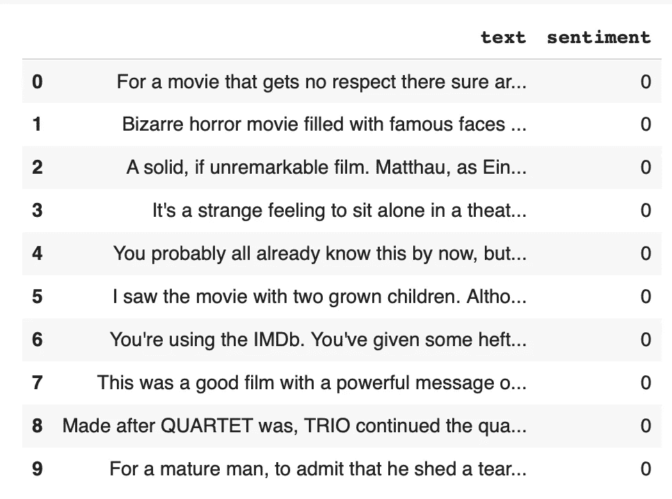
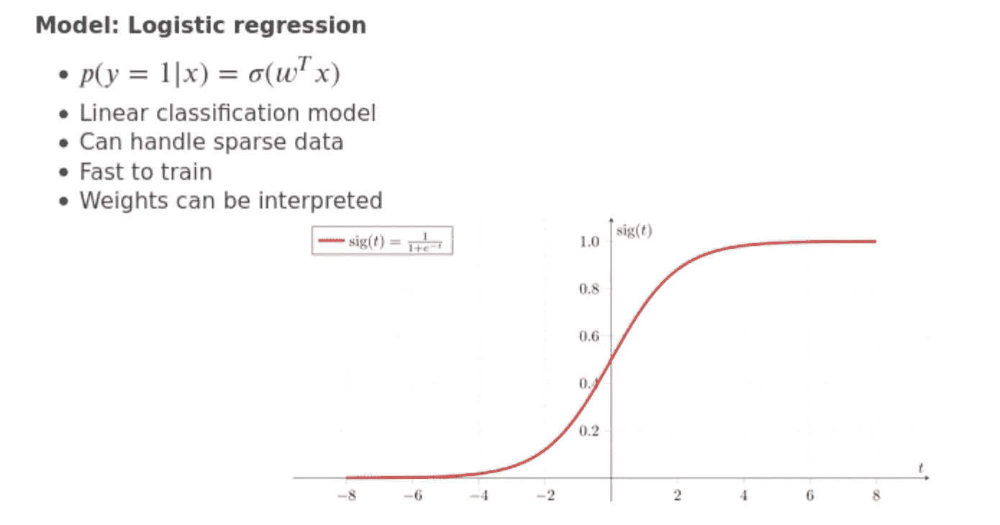
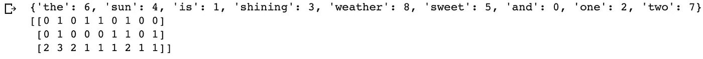
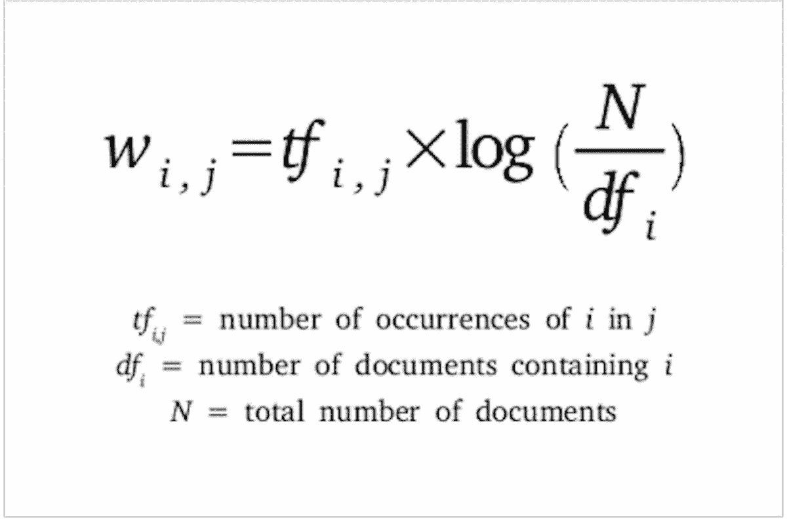
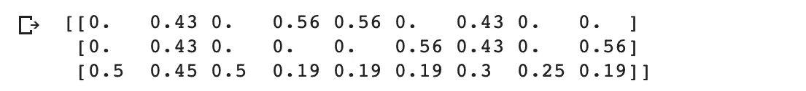
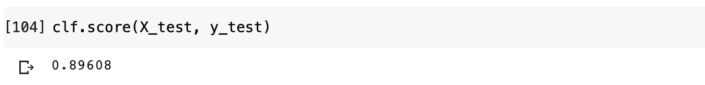
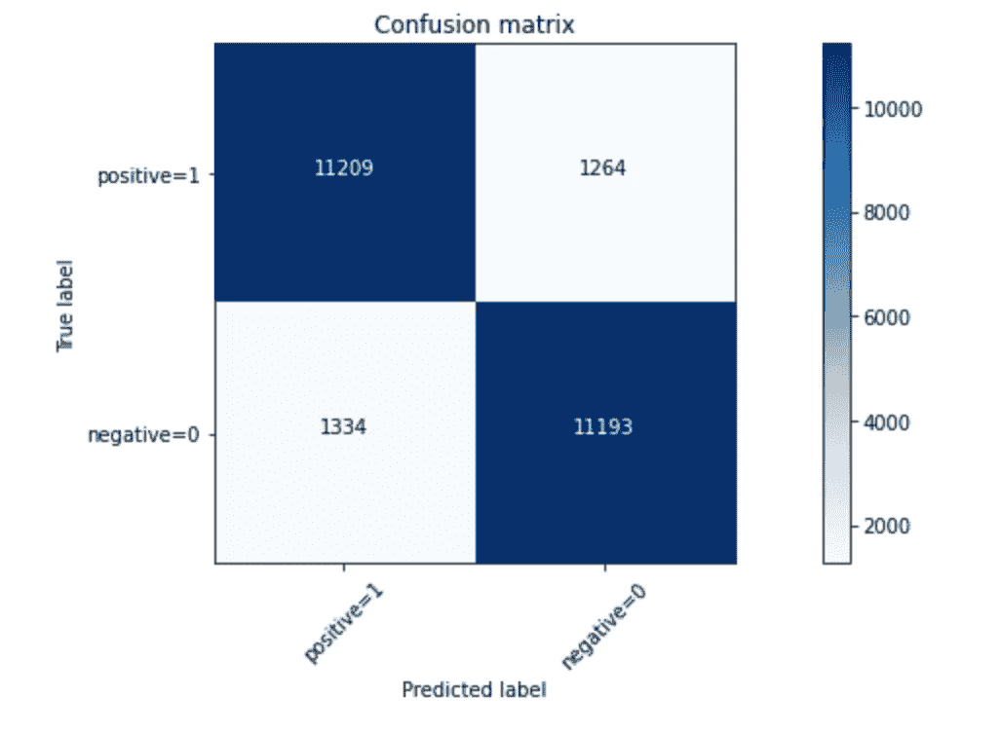

# 对电影评论进行情感分析

> 原文：<https://towardsdatascience.com/imdb-reviews-or-8143fe57c825?source=collection_archive---------10----------------------->

## TD-IDF 和 scikit 令牌化的要点-学习


照片由[杰克·希尔斯](https://unsplash.com/@jakehills?utm_source=unsplash&utm_medium=referral&utm_content=creditCopyText)在 [Unsplash](https://unsplash.com/s/photos/movie-review?utm_source=unsplash&utm_medium=referral&utm_content=creditCopyText) 拍摄


**IMDb:****一个与电影、电视节目、家庭视频、视频游戏和在线流媒体内容相关的在线数据库，包括演员、制作人员和个人传记、情节摘要、琐事、粉丝和评论以及评级。**

# **1.简介和导入数据**

**在本文中，我将使用 IMDB 电影评论数据集进行研究。该数据集包含 50，000 条评论，其中包括 25，000 条正面评论和 25，000 条负面评论。在图 1 的*、*中可以看到评论的示例，其中用户给奥斯卡获奖电影《寄生虫》(2020)给出了 10/10 的评分和书面评论。**

**星星的数量可以很好地代表情感分类。例如，我们可以预先分配以下内容:**

*   **10 颗星中至少有 7 颗= >阳性(标签=1)**
*   **10 颗星中最多 4 颗= >阴性(标签=0)**

****

**IMDB 用户评论对电影《寄生虫》( 2020)给予了积极评价**

**对我们来说幸运的是，斯坦福大学的研究人员已经完成了对评论数据集进行情感分类的“繁重”工作(详情请参考*引文&参考文献*)。这是数据集外观的剪贴画:**

****

**包含“文本”和“情感”列的数据集**

**为了训练，我们的特征矩阵非常稀疏，这意味着在这个矩阵中有许多零，因为有 25，000 行和大约 75，000 列。因此，我们要做的是找出每个特征的权重，并将其乘以相应的 TD-IDF 值；将所有的值相加，通过一个 sigmoid 激活函数，这就是我们最终得到逻辑回归模型的方法。在这种情况下应用逻辑函数的优点是:该模型可以很好地处理稀疏矩阵，并且权重可以被解释为情感的概率。**

****

**[逻辑回归模型的 Sigmoid 函数](/derivative-of-the-sigmoid-function-536880cf918e)**

# **2.将文档转换成特征向量**

**下面，我们将调用 CountVectorizer 上的`fit_transform`方法。这将构建单词袋模型的词汇，并将下面的示例句子转换为稀疏特征向量。**

```
import numpy as npfrom sklearn.feature_extraction.text import CountVectorizercount = CountVectorizer()docs = ([‘The sun is shining’,‘The weather is sweet’,‘The sun is shining, the weather is sweet, and one and one is two’])bag = count.fit_transform(docs)print(count.vocabulary_)print(bag.toarray())
```

****

**请注意词汇表现在是如何存储在 Python 字典中的，每个惟一的单词都映射到惟一的整数索引。该数组显示每个唯一单词的词频。**

# **3.使用术语频率-逆文档频率的单词相关性(TD-IDF)**

**TD-IDF 可用于降低特征向量中频繁出现的单词的权重，例如，上面示例句子中的单词“is”。TD-IDF 可以通过术语频率与逆文档频率的乘积来计算。计算 TD-IDF 的公式:**

****

**来源于 [hackernoon](https://hackernoon.com/what-is-tf-idf-and-how-can-it-be-used-to-optimize-seo-content-4h1dh32f2)**

**我们现在将通过实例化`TdidfTransformer` 方法*来转换上一节的原始频率输入，以获得我们的 TD-IDF 值。***

```
from sklearn.feature_extraction.text import TfidfTransformernp.set_printoptions(precision=2)tfidf = TfidfTransformer(use_idf=True, norm=’l2', smooth_idf=True)print(tfidf.fit_transform(bag).toarray())
```

****

**显然，从示例句子来看，单词“is”在文档的第三个句子中出现频率最高。在该值被转换为 TD-IDF 值后，您会注意到，现在不是夸大的值 3，而是 0.45。这是因为‘is’这个词也包含在文档的句子 1 和 2 中；因此不太可能包含任何对我们的模型有用的或歧视性的信息。**

**这就是 TD-IDF 值的核心思想——它们将文本数据转换为数值，并根据文本数据语料库中单词的频率对单词进行适当加权。**

# **4.数据准备:预处理**

**在本节中，我们将定义一个助手函数来预处理文本数据，因为我们的评论文本可能包含特殊字符— html 标签、表情符号—我们希望在训练模型时考虑这些字符。**

```
import redef preprocessor(text):text =re.sub(‘<[^>]*>’, ‘’, text)emoticons = re.findall(‘(?::|;|=)(?:-)?(?:\)|\(|D|P)’, text)text = re.sub(‘[\W]+’, ‘ ‘, text.lower()) + ‘ ‘.join(emoticons).replace(‘-’, ‘’)return textpreprocessor(“This is a :) test :-( !”)
```

****

**如上图*、*所示，在应用了定义好的`preprocessor`函数后，*、*示例语句被去除了特殊字符；表情符号也被移到了句子的末尾。这是为了让我们的模型可以利用文本的顺序，还可以确定句子结尾的表情符号的情感。**

# **5.文档的标记化**

**在本节中，我们将把我们的数据表示为单词或*标记的集合；*我们还将执行单词级预处理任务，如*词干提取。*为了实现这一点，我们将利用自然语言工具包，或 *nltk。***

**词干分析是一种将一个普通单词的屈折形式，有时是派生相关形式，简化为基本形式的技术。例如，单词“organizer”和“organizing”源于基本单词“organize”。因此，词干提取通常被称为一种粗略的启发式过程，即“砍掉”词尾，希望在大多数情况下正确实现目标——这通常包括去除派生词缀。**

```
from nltk.stem.porter import PorterStemmerporter = PorterStemmer()def tokenizer(text):return text.split()tokenizer('runners like running thus they run')
```

****

**`tokenizer`函数将文本转换成令牌**

```
def tokenizer_stemmer(text):return[porter.stem(word) for word in text.split()]tokenizer_stemmer(‘runners like running thus they run’)
```

****

**`tokenizer_stemmer`功能去掉了派生词缀**

# **6.将文本数据转换为 TD-IDF 向量**

**我们已经在之前的示例文档中完成了这种 TD-IDF 转换，但是现在我们将`fit_transform` 我们的电影评论数据集填充到 TD-IDF 值中。然而，我们没有将这个过程分成几个步骤——将文档分成词频，然后将它们转换成 TD-IDF 值——而是实现了一个方法`TfidfVectorizer` ,该方法在一个单独的步骤中执行上述所有步骤。**

```
from sklearn.feature_extraction.text import TfidfVectorizertfidf = TfidfVectorizer(strip_accents=None,lowercase=True,preprocessor=preprocessor, # defined preprocessor in Data Cleaningtokenizer=tokenizer_stemmer,use_idf=True,norm=’l2',smooth_idf=True)y = df.sentiment.valuesX = tfidf.fit_transform(df.review)
```

# **7.使用逻辑回归的文档分类**

**使用 X 和 y 分别作为我们的 TD-IDF 值的特征矩阵和情感值的目标向量，我们准备将我们的数据集分成训练集和测试集。然后，我们将把我们的训练集放入逻辑回归模型中。**

**请注意，我们不是手动调整我们的模型的超参数，而是使用`LogisticRegressionCV`来指定我们想要调整超参数的交叉验证折叠数——即 5 重交叉验证。**

```
from sklearn.model_selection import train_test_splitimport picklefrom sklearn.linear_model import LogisticRegressionCVX_train, X_test, y_train, y_test = train_test_split(X, y, random_state=1, test_size=0.5, shuffle=False)clf = LogisticRegressionCV(cv=5,scoring=’accuracy’,random_state=0,n_jobs=-1,verbose=3,max_iter=300).fit(X_train, y_train)
```

# **8.模型评估**

**最后，我们将传递我们的测试数据——我们的模型以前没有见过的数据——来推断我们的模型做得有多好。**

****

**准确度分数**

**89.6% —考虑到我们在研究中使用了一个相对简单的模型，这已经很不错了！**

****

**混淆矩阵**

**另一种观察我们的分类器准确性的方法是通过**混淆矩阵**。**

**观察第一排。第一行是测试集中实际情感值为 1 的评论。你可以计算出，在 25000 条评论中，12473 条评论的情感值是 1；在这 12，473 个中，分类器正确地预测了其中的 11，209 个为 1。**

**这意味着，对于 11，209 条评论，测试集中的实际情感值为 1，分类器也正确地预测了这些值为 1。然而，虽然 1264 条评论的实际标签是 1，但分类器预测它们是 0，这相当不错。**

**情感值为 0 的评论怎么办？让我们看看第二排。看起来总共有 12，527 条评论的实际情感值为 0。**

**分类器将其中的 11，193 个正确预测为 0，将其中的 1，334 个错误预测为 1。因此，它在预测情感值为 0 的评论方面做得很好。**

**混淆矩阵的一个好处是它显示了模型正确预测或区分类别的能力。在二元分类器的特定情况下，比如这个例子，我们可以将这些数字解释为真阳性、假阳性、真阴性和假阴性的计数。**

# **9.结论**

**在这项研究中，我们涵盖了以下主题:**

*   **清理和预处理文本数据**
*   **使用计数矢量化、术语频率和逆向文档频率、自然语言工具包等方法执行特征提取**
*   **使用 scikit-learn 构建并采用了一个逻辑回归模型**
*   **使用 Javan 的准确度分数和混淆矩阵进行模型评估**

# **10.引用和参考文献**

**[1]安德鲁·马斯、雷蒙德·戴利、彼得·范、黄丹、安德鲁·吴和克里斯托弗·波茨。(2011).[学习用于情感分析的词向量。](https://ai.stanford.edu/~amaas/papers/wvSent_acl2011.pdf) *计算语言学协会第 49 届年会(ACL 2011)。***

**[2]用于 CSV 文件和笔记本的 Github 库:【https://github.com/TheClub4/IMDB_Sentiment_Analysis】T5**