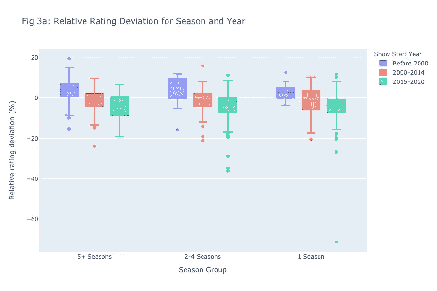
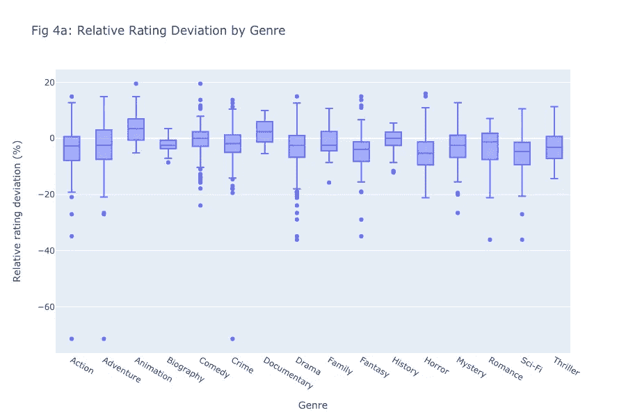
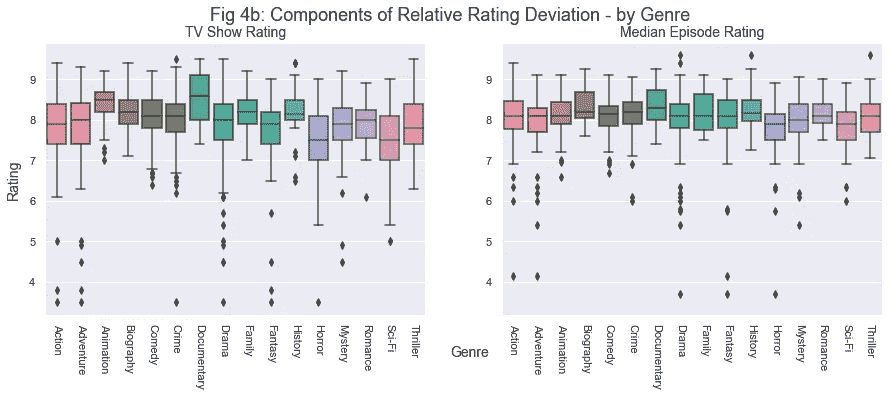
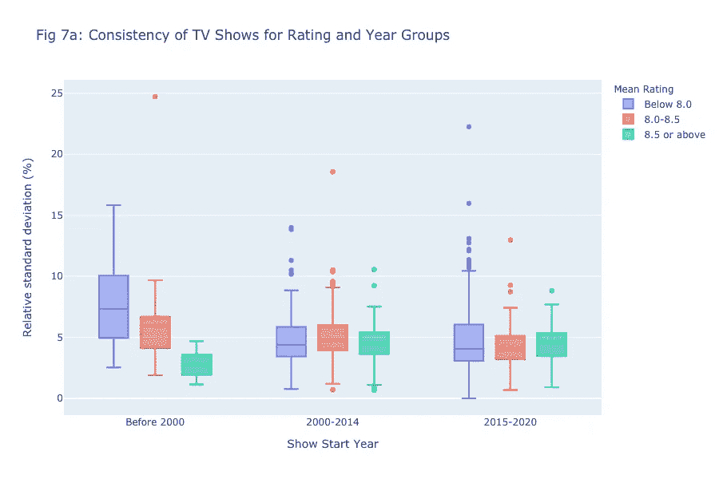
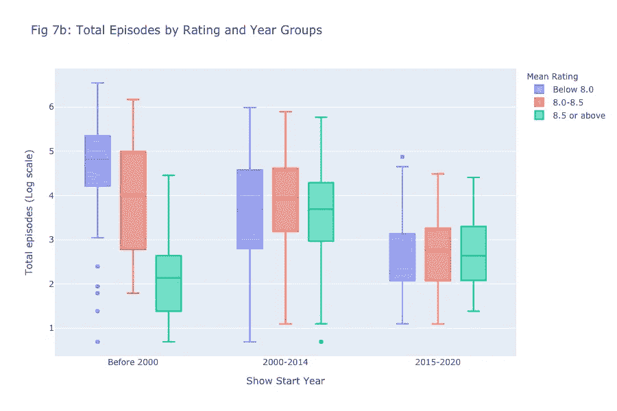

# IMDB 电视节目数据分析:第 1 部分

> 原文：<https://towardsdatascience.com/imdb-tv-show-data-analysis-4961ef39d174?source=collection_archive---------57----------------------->

## IMDB 电视收视率分析。哪些节目评价过高/过低，并且始终如一？哪部电视连续剧提前停播或播出时间过长？

这篇文章已被修改，以更好地适应中等。要查看故事的原始版本，请点击[此处](https://sabnanih.github.io/blog/2020/05/25/IMDB-TV-Show-Analysis)。

在这篇文章中，我展示了使用 [IMDB 数据](https://datasets.imdbws.com)对电视节目进行分析的结果。IMDB 是一个关于电影、电视节目、视频游戏等内容的大型在线数据库。对于这个分析，我主要关注电视连续剧、电视迷你剧和剧集的收视率。数据下载于 2020 年 5 月 14 日。完整的数据集文档可以在[这里](https://www.imdb.com/interfaces/)找到。在这篇文章的其余部分，我主要讨论 3 个问题——某些电视节目是被高估了还是被低估了，哪些电视节目是最一致或最不一致的，哪些电视连续剧取消得太早，哪些放得太久。

这是分析的第一部分。对于第二部分，其中包括对各种变量的分析，如流派、新剧集、年龄歧视和性别歧视的证据测试(男主角和女主角的节目)，请点击[此处](https://medium.com/@hiteshsabnani3/imdb-television-show-data-analysis-part-2-39ebf47977ff)。

# 介绍

我首先看一些关于收视率分布的探索性图表。在下面的图 1 中，通过评级直方图可以看出，它们有些负偏，但大多数都在 6 到 9 之间。在受欢迎的电视节目(至少有 5000 票)中，分布更集中在 6-9 范围。

# 某些电视节目被高估/低估了吗？

首先，我想比较节目收视率和剧集之间的差异。除了看节目收视率，我们还可以看他们剧集的收视率中值。理论上，这两个评级应该是接近的。因此，在下面的图 2 中，我创建了一个电视节目评分与剧集评分中位数的互动图，这些节目的投票数至少为 5000，剧集投票中位数至少为 250。这允许我们创建被低估和被高估的节目的定义——大部分剧集的评级低于节目评级的节目被高估，类似地，如果大部分剧集的评级高于节目评级，则被低估。在图 2 中，被高估的节目在绿色等价线上，被低估的系列在下面。我定义了一个简单的衡量节目收视率和剧集收视率之间偏差的标准(相对收视率偏差)。

δ (%) =(节目评级-中值剧集评级)/节目评级* 100 %

δ的较高正值意味着更多的高估，较低负值意味着低估。根据这个衡量标准，我们可以看到一些被严重低估的节目——*蝙蝠女侠*(δ=-71.43)*罗斯威尔，新墨西哥*(δ=-36.07)*暗影猎手* (δ = -34.85)。同样，最被高估的剧集还有*《辛普森一家》*(δ= 19.54)*《恐怖大师》*(δ= 16)*《暮光之城》* (δ = 15)。

**注意:对于所有交互式图，将鼠标悬停在各点上以查看更多信息(如果在移动设备上，则点击)。框选允许放大，双击可将缩放重置为默认值。**

从图 2 中还可以看出，2000 年之前的电视节目具有更高的δ。在下面的图 3a 中，我观察了不同季节和年份组的δ变化。可以看出，在 2000 年之前开始的节目往往比最近的系列有更高的正偏差，而在几个季节中没有明显的偏差差异。2000 年之前，更高比例的节目被高估，2015 年之后，更高比例的节目被低估，而 2000-2014 年组似乎在δ = 0 左右对称。

有趣的是，较老的节目往往显示更高的δ值。尚不清楚为什么会出现这种情况，但为了更仔细地观察，我在图 3b 中分别绘制了δ的两个分量。此外，由于在上面的图 3a 中没有明显的季数偏差，我将重点放在节目开始年份的偏差上。我们可以看到，在 2000-2014 年 post 2015 年后组中，电视节目收视率和中值剧集收视率都略高。然而，与其他年龄组相比，2000 年以前的节目具有最高的电视节目收视率和最低的剧集收视率中值。此外，多年来，剧集收视率中值似乎比电视剧收视率更稳定(总体变化较小)。也许老节目收视率更高的一个原因可能是怀旧——人们会更积极地记得以前看过的节目吗？IMDB 成立于 1993 年，互联网在 20 世纪 90 年代变得更加普及，因此一些老系列的投票者可能不会在投票时重新观看它。另一方面，剧集投票不会受到这种影响，因为人们通常不会像记住电视节目那样记住单个剧集。然而，这只是一种推测，基于现有的数据，它不是一个可检验的假设。

我还观察了不同类型的δ变化。IMDB 数据集中的每个标题最多可以与 3 个流派相关联。在下面的图 4a 中，我们可以看到*动画*和*纪录片*节目与其他类型相比往往具有更高的δ，因此被高估了。请注意，由于每个电视节目可以有 3 种类型，异常电视节目在该图上最多可以用 3 个点来表示。

同样，不清楚为什么这两种类型的节目被高估了。所以，我想按流派来看看δ的成分。在图 4b 中，可以看出，跨流派的中值剧集评级相当相似，但是电视节目评级对于*动画*和*纪录片*更高。因此，他们被高估的原因更多的是较高的电视节目收视率，而不是较低的剧集收视率中值。

最后，我创建了一个交互式的情节，通过[图 5](https://sabnanih.github.io/proj_files/fig5.html) 中的流派和电视节目开始年份来可视化δ。该图应用了抖动。我们可以将鼠标悬停在这些点上来查看有关电视节目的信息。类似于上面的图 4a，电视节目可以由该图上的最多 3 个点来表示。

# 哪些节目是最一致/最不一致的？

接下来，我看电视剧集的收视率一致性。为了衡量评级的一致性，我定义了一个相对标准差的简单度量。

η (%) =标准偏差事件评级/平均事件评级* 100 %

η值越高，意味着一致性越差。从下面的图 6 可以看出，剧集越多，η越高。除了迷你剧，最不一致的剧集还有*《你怕黑吗？*(η= 24.72)*《纸牌屋》*(η= 18.56)*《芝加哥医学》* (η = 15.97)。最符合的电视剧是像*宇宙* (η = 1.14)和*吉普赛* (η = 1.24)这样的较短的剧集。在至少 100 集的剧集中，*交战规则* (η = 2.34)和 *2 破财少女* (η = 2.66)最为一致。绿线具有回归斜率(总集数的η v/s 对数)，而白线忽略倾向于具有较少集数的类型，如*传记*、*纪录片*和*历史*。我们可以看到，即使没有这些体裁，积极的关系仍然存在。这并不完全令人惊讶，更长的系列将有更多的机会出现异常事件(无论是积极的还是消极的)，这往往会降低节目的一致性。

在下面的图 7a 中，我们可以看到根据评级和年份组的η变化。2000 年至 2014 年似乎与 2015 年至 2020 年非常相似。在 2000 年以前的群体中，我们看到更高的评级显示相对更一致。跨年度组比较，中低评级显示 2000 年前和 2000 年后的一致性较差。

2000 年前群体的模式看起来与其他群体不同。所以，我想检查一下剧集数量的差异是否能解释这种差异。在下面的图 7b 中，我们可以看到，图 7a 中具有较高η的这些组往往也具有较高的总发作值。

跨流派比较η，我们没有看到非常显著的变化，但是*动画*确实比其他流派有更高的η中值，并且*传记*、*纪录片*和*历史*更趋于一致。

一些类型更加一致的原因之一可能是这些系列通常比其他系列更短。因此，我通过类型和集数来观察电视节目的一致性。[图 8b](https://sabnanih.github.io/proj_files/fig8b.html) 是一个交互图，其中圆圈的大小与总集数成比例。我们可以看到*传记*、*纪录片*、*历史*往往也是集数较少。

# 这个系列是提前取消了还是持续了太久？

在这一部分，我通过电视连续剧来过滤标题，排除了只有一季的迷你剧。为了查看哪些剧集取消了早期 v/s 那些走得太远的剧集，我首先根据至少有 250 票的剧集的季数绘制了剧集评级。在下面的图 9 中，我们可以看到中值评级在 2-4 季左右最高，之后开始下降。第八季之后，降幅逐渐加大。基于此，一般来说，第二季和第四季之间的任何地方都是一部电视剧的理想长度。该图与基于 2013 年数据的[图非常相似。](https://letstalkdata.com/2013/02/imdb-television-series-data/)

我们也可以分别查看它们的峰值，而不是为所有系列定义一个共同的峰值。在下面的图 10 中，我创建了一个最终赛季中值收视率与旺季之前所有赛季中值收视率之间的互动图。一个系列的高峰被定义为具有最高中值收视率的季节。根据定义，因此所有一个赛季的系列都将位于绿色直线上，这表示最终赛季收视率和之前的最高收视率相等。图表上圆圈的大小与前后峰值额定值之间的绝对差值成比例。所以，持续时间太长的系列，要么有很大的圆圈，要么远远低于等值线。前一类中的一些系列是*你怕黑吗？*、*致命武器*和*坏分子*。来自后一类的有*两个半男人*、 *Scrubs* 和*权力的游戏*。《纸牌屋》属于这两类。《权力的游戏》第四季被热切期待，但最终令人失望。《纸牌屋》在最后一季的糟糕收视率可能与凯文·史派西扮演的角色在最后一季被移除有关——因为他被指控性行为不端。对于《Scrubs》,最后一季摆脱了前几季的大部分全职演员，更适合作为一个独立的衍生系列。关于结束得太早的系列，我们可以把它们算作有 1-2 个季节落在该线上或在峰值前大于 8.5 的范围内的系列。其中一些系列是*宇宙:时空奥德赛*、*福尔蒂塔*、*宇宙(1980)* 和*萤火虫*。*怪胎和极客*也是在这种讨论中经常出现的系列之一。

**注:本情节仅包括之前最高收视率至少为 7 的电视剧**

最后，我查看了 100 个最受欢迎的完整系列的收视率范围。过去曾创建过类似的图[此处](https://github.com/OrganicIrradiation/vistvfinales)的数据最后更新于 2017 年。这也可以让我们看到系列之间的一致性(如这里使用的)以及比较不同的系列和它们的结局如何。红点表示中间值、第一和第三四分位数，而蓝叉表示最终评级。大部分的系列都有很好的结局，但也有一些非常糟糕。中集与大结局收视率相差较大(大结局差于中集收视率)的剧集有*德克斯特*、*权力的游戏*、*纸牌屋*、*真爱如血*、*好汉两个半*。

*绝命毒师*是为数不多的所有剧集评分都在 7.5 以上的剧集，也是唯一一集评分在 10 的剧集！*《权力的游戏》*实际上总体来说相当不错(最大值和第一个四分位数之间的差异非常小)，但在最后一季中有一些非常差的剧集。部分全集都在 8 集以上的剧集有*大谎言*、*宇宙:时空奥德赛*、*萤火虫*、*怪胎和极客*、*憨豆先生*、*意中人*、*罗马*。在这组最受欢迎的节目中，*穹顶之下*是唯一一集收视率不高于 8 的剧集。

IMDB 电视节目分析的第一部分到此结束。用于该分析的代码(和第 2 部分)可以在[这里](https://github.com/sabnanih/imdb-tv-analysis/blob/master/analysis.ipynb)找到。第二部分包括随着时间的推移对各种变量的分析——比如流派、新剧集，以及对年龄歧视和性别分级歧视证据的测试(男主角和女主角的剧集)。

*原载于*[*https://sabnanih . github . io/blog/2020/05/25/IMDB-TV-Show-Analysis*](https://sabnanih.github.io/blog/2020/05/25/IMDB-TV-Show-Analysis)*。*