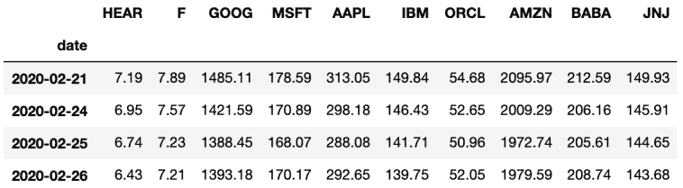
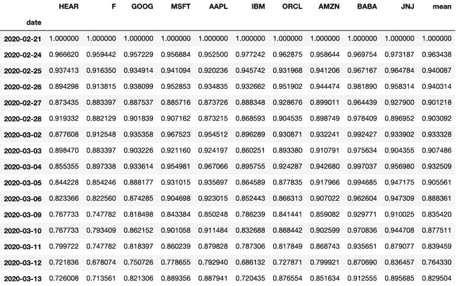
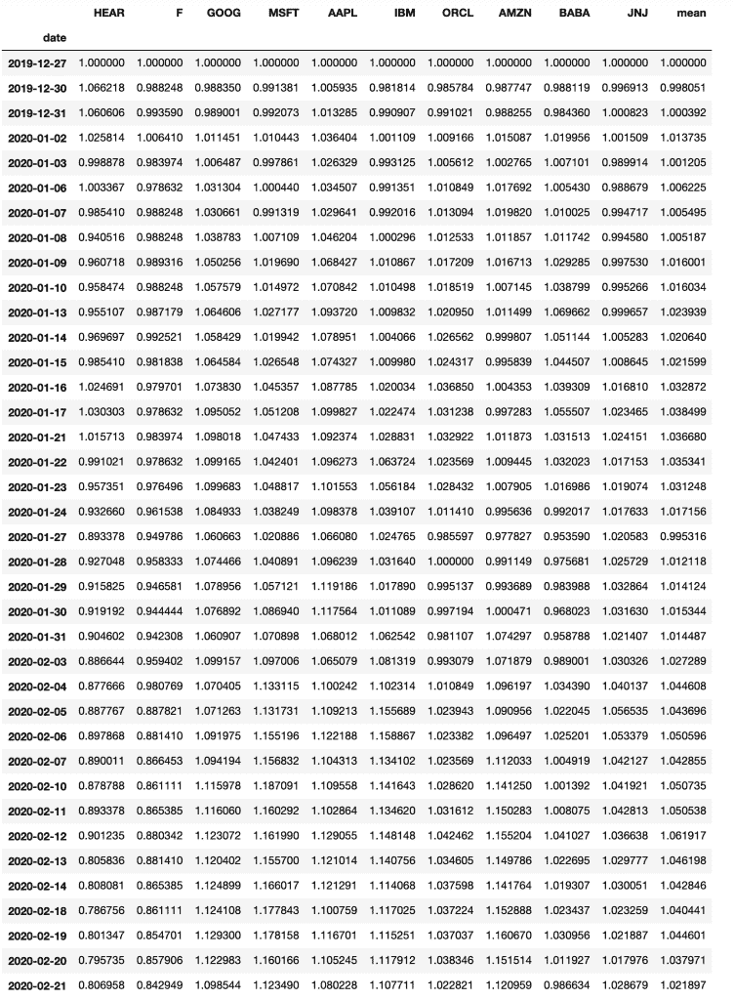

# 冠状病毒对股票价格的影响

> 原文：<https://towardsdatascience.com/impact-of-coronavirus-on-stock-prices-41c108c1ec65?source=collection_archive---------34----------------------->

## 了解一下武汉和欧洲爆发病毒以来，冠状病毒对股价的影响。

在这个故事中，我们将构建一个 Python 脚本来计算冠状病毒对股票价格的影响。我们将把意大利病毒爆发前的股票价格作为参考，并与几周后的相同股票价格进行比较。

我们将通过使用 Python 和 Pandas 计算多只股票的每日价格变化来实现这一点。我们的最终结果将显示在下面的数据框中，该数据框包含了相对于 2 月 21 日的股价百分比变化，2 月 21 日是意大利病毒大爆发的前一天。


Python for Finance —冠状病毒对股票价格的影响

# 冠状病毒对股票市场的影响

我们都知道这种病毒确实起源于 201 年 12 月的武汉。它迅速发展到其他国家，最终[已经成为一个全球性的疫情。](https://www.nytimes.com/2020/03/11/health/coronavirus-pandemic-who.html)

就股市影响而言，我认为股市只是在意大利疫情爆发后才受到病毒的影响。让我们看看我的理解是否正确。

冠状病毒对股票市场的真正影响是什么？让我们构建一个简单的 Python 脚本来找出答案。

首先，我将选择 10 家公司进行分析。我选择了 10 家公司，这些公司是我之前一直在跟踪的潜在未来投资对象。自由地将你自己的公司添加到列表中。

我已经将这 10 只股票添加到一个名为 ***公司*** 的列表中。我们将对每个公司做的是:

1.  ***向[财务 API 发出 http 请求](https://fmpcloud.io/documentation)*** ，下载历史价格数据。API 通过创建一个免费账户提供 500 次免费的每日通话。
2.  提取每家公司的 n 天历史价格，并将它们添加到熊猫数据框架中。注意:检查 [API 历史价格端点](https://fmpcloud.io/api/v3/historical-price-full/AAPL?serietype=line&apikey=demo)以查看 API 响应的结构。
3.  将每个股票数据帧连接成一个 **s *单个数据帧*** 。
4.  以冠状病毒在欧洲爆发的前一天为参考，计算价格变化。

```
import pandas as pd
import requests

#Store your API Key in demo. 500 free daily API calls
demo ='YourAPIKEY'

companies = ['HEAR','F', 'GOOG', 'MSFT', 'AAPL', 'IBM', 'ORCL','AMZN','BABA','JNJ']

#Create a empty list to later add each of the stock prices DataFrame
listofdf = []
# We will extract the latest 16 days of stock prices since it was when the virus outbreak started in Europe (i.e. 21st of February)
days = -16

#(1)
for item in companies:
    histprices = requests.get(f"https://fmpcloud.io/api/v3/historical-price-full/{item}?serietype=line&apikey={demo}")
    histprices = histprices.json()

    #Parse the API response and select only last n days of prices. 16 days in our example
    histprices = histprices['historical'][days:]
```

上面的代码所做的是提取包含在 ***公司*** 列表中的每只股票的历史价格。然后，我们解析 API 响应并提取最近的 16 天。

我们可以很容易地做到这一点，因为历史键中包含的响应是一个列表。因此，我们可以简单地对列表进行切片，以保留最新的 16 个元素，这 16 个元素代表最近的 16 个每日价格。下面是 API 响应的摘录，便于参考。

```
{
"symbol": "AAPL",
"historical": [
{
"date": "1989-09-19",
"close": 1.54
},
{
"date": "1989-09-20",
"close": 1.59
},
{
"date": "1989-09-21",
"close": 1.6
},...
```

***从 API 中提取最近 n 天的*** 。我们可以 ***为每只股票*** *(* 2)创建一个熊猫数据帧。我们使用 pd。DataFrame.from_Dict 方法在我们的字典之外创建一个包含每日价格的 DataFrame。

最后，我们将每个股票数据帧添加到一个列表中。

```
for item in companies:
    histprices = requests.get(f"https://fmpcloud.io/api/v3/historical-price-full/{item}?serietype=line&apikey={demo}")
    histprices = histprices.json()
    histprices = histprices['historical'][days:]  
    #2
    histpricesdf = pd.DataFrame.from_dict(histprices)
     #rename column to the name of the stock
    histpricesdf = histpricesdf.rename({'close': item}, axis=1) 
    #append all dfs to list
    listofdf.append(histpricesdf)
```

# 将所有股票价格放在一起

现在，我们已经将我们的每只股票的价格放入一个熊猫数据框架中。但是，我们希望将所有公司的价格放在一个数据框架中。

我们可以很容易地将它们连接起来。首先，我们将日期*设置为每个数据帧的索引。然后，我们可以使用 pd.concat 方法将它们放在一起:*

```
#set index of each DataFrame by common column before concatinatinghtem
dfs = [df.set_index('date') for df in listofdf]

histpriceconcat = pd.concat(dfs,axis=1)
```

现在，如果我们打印***histpricecontat***，我们就有了一个漂亮的熊猫数据框架，其中包含了所选股票 的所有 ***日价格。***



通过考察个股价格，很难发现冠状病毒对股价的影响是什么。我们看到价格一直在下降，但看看正常化的结果会更有意思。

我们要做的是用第一行数据除每只股票的每日价格。在我们的例子中，这是 2 月 21 日，因为这是所有冠状病毒病例开始在意大利出现的前一天，这将是我们的参考:

```
histpriceconcat = histpriceconcat/histpriceconcat.iloc[0] histpriceconcat['mean'] = histpriceconcat.mean(axis=1) histpriceconcat
```



酷！现在，我们可以很容易地看到**电晕病毒对股票价格的影响百分比。例如，我们看到像苹果这样的公司，在 3 月 13 日的收盘价比 2 月 21 日的价格低 12%**(即 1–0.887941)。

同样，亚马逊的股价有 15%的折让，而中国公司阿里巴巴的股价只有 9%的折让。

# 意大利爆发前冠状病毒对股价的影响

显然，冠状病毒在欧洲的爆发对股票价格产生了影响。但是中间的那段时间呢？那是危机第一次从武汉开始，直到病毒到达欧洲？

我们可以通过重现 12 月 27 日到 2 月 21 日的分析来轻松检查影响。我们可以通过修改下面两行代码来实现这一点:

```
#-53 days is the 27th of December 2019
days = -53 
#-15 days is the 21st of February   
histprices = histprices['historical'][days:-15]
```

对于大多数股票来说，在欧洲几乎没有病例的情况下，病毒的爆发似乎没有对股价产生影响。在此期间，股票价格平均上涨了 2%。



# 包扎

在这篇文章中，我们构建了一个很好的 Python 工具来计算多只股票的价格变化。我们这样做是为了分析冠状病毒对股票价格的影响。

如所选股票所示，似乎只有当病毒爆发到达意大利时，股票价格才开始下跌。然而，我想指出这种分析的一个局限性。我几乎只选择了美国股票。

对亚洲股票重复这一分析，看看结果是否会有所不同，将会很有意思。我把这个任务留给你。

很高兴在我的 Twitter 账户中听到您的回复。参见以下脚本供您参考。

*原载于 2020 年 3 月 15 日*[*【https://codingandfun.com】*](https://codingandfun.com/impact-coronavirus-stock-prices/)*。*

```
#Price change
import pandas as pd
import requests

companies = ['HEAR','F', 'GOOG', 'MSFT', 'AAPL', 'IBM', 'ORCL','AMZN','BABA','JNJ']
listofdf = []
days = -16

for item in companies:
    histprices = requests.get(f"https://fmpcloud.io/api/v3/historical-price-full/{item}?serietype=line&apikey={demo}")
    histprices = histprices.json()

    #Parse the API response and select only last n days of prices
    histprices = histprices['historical'][days:]
    histpricesdf = pd.DataFrame.from_dict(histprices)
    histpricesdf = histpricesdf.rename({'close': item}, axis=1) 
    #append all dfs to list
    listofdf.append(histpricesdf)

#set index of each DataFrame by common column before concatinatinghtem
dfs = [df.set_index('date') for df in listofdf]

histpriceconcat = pd.concat(dfs,axis=1)
#divide all dataframe by first line of data to enable comparison
histpriceconcat = histpriceconcat/histpriceconcat.iloc[0]
histpriceconcat['mean'] = histpriceconcat.mean(axis=1)

histpriceconcat
```