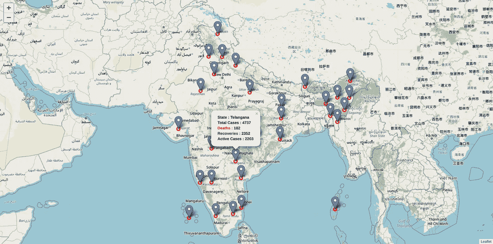
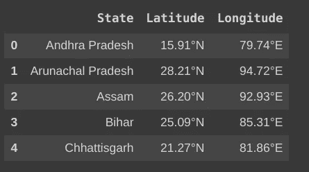
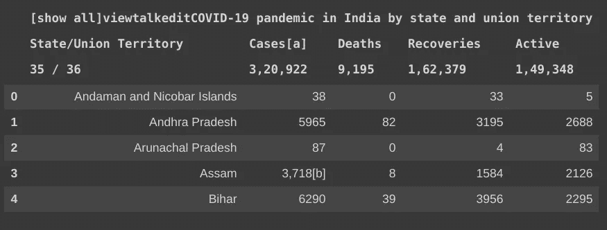
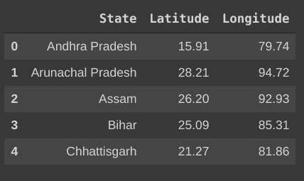
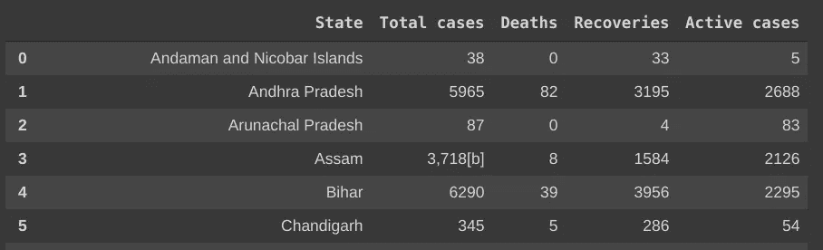
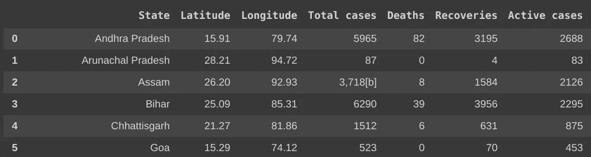
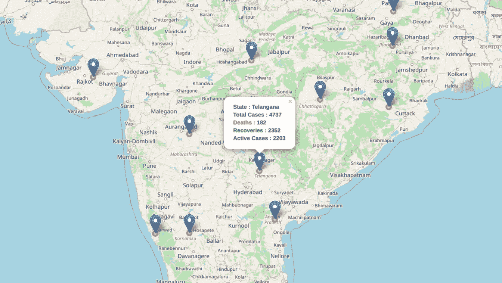

# 新冠肺炎的影响-使用 Python 进行数据可视化

> 原文：<https://towardsdatascience.com/impact-of-covid-19-data-visualization-using-python-6f8e3bdc860b?source=collection_archive---------43----------------------->

## 使用 python 在印度地图上可视化冠状病毒爆发的初级方法。当你读完这篇文章时，你将能够生成一个如下图所示的美丽的地图

印度地图，每个邦都有标记，显示 COVID19 的最新统计数据。(图片由作者提供)

# A.介绍

世界正在与一个看不见的致命敌人搏斗，试图了解如何应对冠状病毒带来的威胁。对于一些作家来说，唯一的出路是动笔，试图概念化和记录在国家被封锁、正常生活似乎已经停止的情况下继续生活的感觉。

> “一幅画胜过千言万语”

正如引用的话所说，**数据可视化**有助于以更好的方式从数据源中获得信息洞察力。因此，通过这篇文章，我想展示一个人如何想象自己国家的地图，以及不同的行政区和社区如何受到这种可怕病毒的影响。

# B.数据描述

为了开发这个应用程序，我们需要一些需要从网站废弃的数据

1.  我们需要印度所有邦的经度和纬度坐标，我们可以使用 python 从 quicksgs.com 的**中删除这些数据。**
2.  *我们需要冠状病毒在该国各州的当前状态，我们可以使用 python 从[维基百科](https://en.wikipedia.org/wiki/COVID-19_pandemic_in_India#covid19-container)中删除这些动态数据。*

# *C.目标*

*显示印度各邦的住院人数、死亡人数、康复人数以及当前活跃病例。*

# *D.建筑模型*

1.  *数据收集*
2.  *数据清理和准备*
3.  *使用 folio(python 库)的数据可视化*

*让我们开始构建我们的应用程序...*

## *D.1 .数据收集*

1.  *导入所有重要的 python 库*

*2.从[quicksgs.com](http://www.quickgs.com/latitudinal-and-longitudinal-extents-of-india-indian-states-and-cities/)刮取经纬度*

**

*上述代码片段的输出(图片由作者提供)*

*3.从维基百科[抓取印度各邦的实时电晕统计数据](https://en.wikipedia.org/wiki/COVID-19_pandemic_in_India#covid19-container)*

**

*上述代码片段的输出(图片由作者提供)*

*如您所见，数据并不干净，不能直接用于构建应用程序，因此需要对其进行清理和格式化，以便与我们将要构建的应用程序兼容。*

***D.2 .数据清理和准备***

*清理坐标和 covid19 表，使其与应用程序兼容。*

**

*已清理的坐标数据表(删除了度数符号)(图片由作者提供)*

**

*清理了 covid19 表(更改了列名并删除了不必要的行)(图片由作者提供)*

*到目前为止，我们有两个表，一个包含纬度和经度坐标，另一个包含印度每个邦的 covid19 状态，所以最后我们在 state 列上创建了一个连接这两个表的表。*

*最终的表格看起来像*

**

*这是在印度地图上绘图所需的数据(图片由作者提供)*

## *D.3 .可视化*

*现在我们开始最后一步，可视化这些数据！*

*我们使用[叶子](https://python-visualization.github.io/folium/modules.html) (python 库)在印度地图上描绘以上所有数据。*

*万岁！我们已经用一种简单得多的方式完成了可视化，所以看一下我们的应用程序的输出。*

**

*作者图片*

> *因为我是印度的居民，我从各种网站上研究了印度各州和冠状病毒的统计数据，如果你不是印度人，你可以用你自己国家的数据替换数据来源。*

# *结论*

*这篇文章给出了最好的和聪明的方法来形象化新冠肺炎是如何影响印度各邦的。由于我们将从维基百科中删除数据，我们将获得实时数据，所以我们的应用程序**不会是静态的**，而是每次维基百科更新他们关于冠状病毒的网站时都会发生变化。*

***参考文献:***

1.  *维基百科(一个基于 wiki 技术的多语言的百科全书协作计划ˌ也是一部用不同语言写成的网络百科全书ˌ 其目标及宗旨是为全人类提供自由的百科全书)ˌ开放性的百科全书*
2.  *quickgs.com*

***你可以在这里** 找到详细的代码*

******编者注:*** [*走向数据科学*](http://towardsdatascience.com) *是一份以数据科学和机器学习研究为主的中型刊物。我们不是健康专家或流行病学家，本文的观点不应被解释为专业建议。想了解更多关于疫情冠状病毒的信息，可以点击* [*这里*](https://www.who.int/emergencies/diseases/novel-coronavirus-2019/situation-reports) *。****

# ***感谢阅读！😄***

*** [## 我附近的热门地点—使用 Python 和 FourSquare API 的数据可视化

### 这篇文章教你如何在规定的范围内，将你附近所有受欢迎的地方形象化

towardsdatascience.com](/popular-places-near-me-data-visualization-using-python-and-foursquare-api-4d1683cd62d1)***