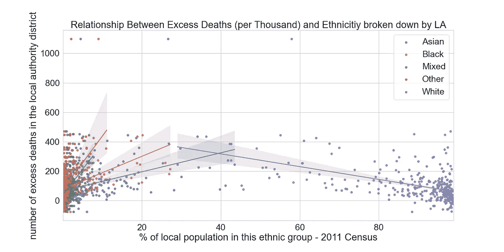
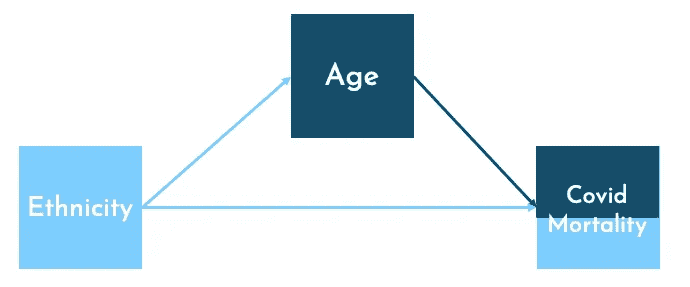
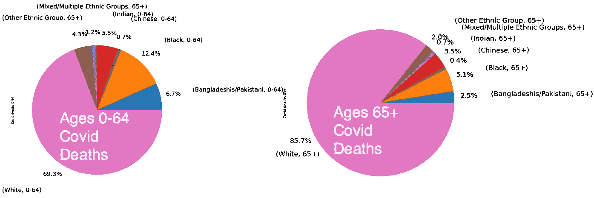
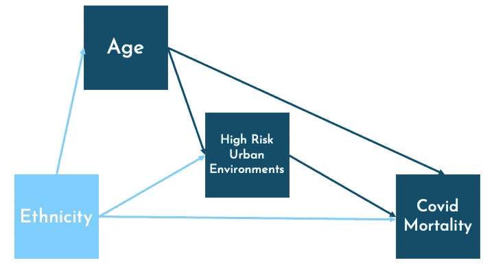
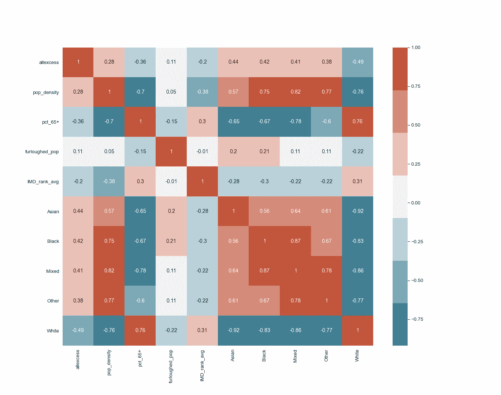
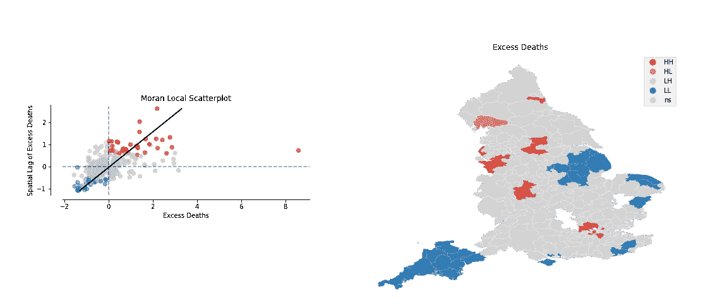

# 新冠肺炎对英国 BAME 人口的影响

> 原文：<https://towardsdatascience.com/impact-of-covid-19-on-the-uk-bame-population-cc09244c5d63?source=collection_archive---------59----------------------->

## 使用公开数据描述新冠肺炎时期影响英国 BAME 人口的社会经济因素

> “…病毒不分种族和国籍；它不能偷看你的驾照或人口普查表来检查你是不是黑人。社会检查它，并代表病毒提供鉴别。——[游戏木——大西洋](https://www.theatlantic.com/ideas/archive/2020/05/we-dont-know-whats-behind-covid-19-racial-disparity/612106/)

照片由[塞缪尔·莱德](https://unsplash.com/@samuelryde?utm_source=unsplash&utm_medium=referral&utm_content=creditCopyText)在 [Unsplash](https://unsplash.com/?utm_source=unsplash&utm_medium=referral&utm_content=creditCopyText) 拍摄

人们越来越担心冠状病毒对少数民族的影响更大。黑人、亚洲人和少数民族(BAME)社区占总人口的 14%,但占医院中重症冠状病毒患者的三分之一。英国公共卫生报告发现，新冠肺炎对所有非白人少数民族的影响不成比例。

这篇文章将超额死亡统计数据与公开的社会经济数据进行了比较，以描述英格兰和威尔士的情况。描述性分析使用 2011 年人口普查数据来确定地方当局的民族构成；一种类似于国家统计局使用的[方法。因此，观察单位将是地方当局。可以在 GitHub 上找到并复制原始数据、转换和分析的完整分类。](https://www.ons.gov.uk/peoplepopulationandcommunity/birthsdeathsandmarriages/deaths/articles/coronavirusrelateddeathsbyethnicgroupenglandandwales/2march2020to10april2020)

> ***编者按:*** [*走向数据科学*](http://towardsdatascience.com/) *是一份以数据科学和机器学习研究为主的中型刊物。我们不是健康专家或流行病学家，本文的观点不应被解释为专业建议。想了解更多关于疫情冠状病毒的信息，可以点击* [*这里*](https://www.who.int/emergencies/diseases/novel-coronavirus-2019/situation-reports) *。*

# 这是怎么回事？

地方当局种族占超额死亡的比例[资料来源](https://github.com/Quotennial/covid_bame/blob/master/notebooks/Excess%20Deaths%20and%20Ethnicity.ipynb)

上图显示了某个地方当局内发生的死亡人数与该地方当局中特定族裔的比例代表人数的对比。从左到右向上倾斜的线条表明，BAME 人口比例较高的地方当局的超额死亡人数较多。而向下倾斜的紫色线表明，种族多样性较低的地方当局看到的超额死亡人数较少。值得注意的是，数据确实聚集在接近 0 的位置，拟合这种聚集数据的回归线本身并不是关系的证据。这不是直接衡量对 BAME 社区的影响，而是比较受病毒负面影响更大的地理区域及其相应的民族构成。

# 年龄

在我们研究影响病毒影响的特定地点因素之前，我们必须考虑患者的年龄，我们认为这是新冠肺炎死亡率的一个促成因素。国家统计局公布的数据包含英格兰和威尔士种族群体冠状病毒相关死亡的统计数据，并显示 88%的冠状病毒相关死亡是 64 岁以上的人。

COVID 死亡人数和总人口[资料来源](https://github.com/Quotennial/covid_bame/blob/master/notebooks/Ethnicity%20And%20Age%20Breakdown.ipynb)

上图显示了所有记录的 covid 死亡的种族分类。有趣的是，这一分类与 2011 年人口普查统计非常相似，该统计显示 14%的人口是 BAME 人，covid 数据显示 16.2%的 COVID 死亡是 BAME 人。对 BAME 人口似乎没有不成比例的影响。

为了解决这个问题，我们可以使用 Dana Mackenzie 的博客帖子，通过辛普森悖论来研究美国的种族和 covid。在提出下面的因果模型时，他假设种族会影响活到 65 岁或更老的几率。

这就形成了一个链条，因果可以通过这个链条。如果我们要问，种族【仅 对 Covid 死亡率有什么影响，那么我们必须保持所有其他变量不变。因此，我们应该控制年龄并按年龄划分，创建两个组“0-64”和“65+”:

不同年龄组按种族划分的 Covid 死亡人数[资料来源](https://github.com/Quotennial/covid_bame/blob/master/notebooks/Ethnicity%20And%20Age%20Breakdown.ipynb)

现在我们按年龄划分 COVID 死亡人数；这显示了 65 岁以上人群的类似分布。按照种族划分的 COVID 死亡人数大致符合 2011 年英国人口普查的种族划分；86%的英国人口是白人，65 岁以上的 Covid 死亡者中 85.7%也是白人。然而，对于 65 岁以下的年龄段，与联合王国人口相比，BAME 人的死亡率更高；64 岁以下的 covid 死亡中，30.7%来自 BAME 社区，相比之下，只有 14%来自人口。

不同年龄组按种族划分的人口[资料来源](https://github.com/Quotennial/covid_bame/blob/master/notebooks/Ethnicity%20And%20Age%20Breakdown.ipynb)

最后，我们按照种族和年龄来划分人口，现在我们可以看到两个年龄段的种族之间的明显差异。现在，65 岁以下的 BAME 人口占了 30.7%的 covid 死亡，但只占总人口的 14.3%。2011 年人口普查显示，BAME 人口仅占 65 岁以上人口的 2.3%，但却占 COVID 死亡人数的 14.3%。这似乎表明对 BAME 人口的影响非常大。如图所示，[不同的数据分组](https://www.youtube.com/watch?v=ebEkn-BiW5k)会导致不同的结果；在做出这些分组决策时，关于因果路径的假设是必不可少的。

# 地点:生活在城市

可能有一些内在/生理条件导致 BAME 人具有更高的风险，但这可能不是全部。多项流行病学研究承认，恶劣的生活环境会导致健康风险。Centric Lab [发布了一份深入研究人类健康和城市环境的报告](https://www.thecentriclab.com/covid-19-poverty-a-london-data-study)。经济观察组织还详细描述了[城市成为冠状病毒热点](https://www.coronavirusandtheeconomy.com/question/why-has-coronavirus-affected-cities-more-rural-areas)的机制，包括职业结构。这些研究支持下面列出的因果结构，其中种族将影响位置决策(移民定居在就业机会增加的密集地区)，并且这些历史位置模式将代代相传。

为了解开“高风险城市环境”的谜团，以下是使用公开可用数据获得的区域特定属性的相关矩阵。使用 Spearman 值和 p 值计算的相关性显示在[这里](https://github.com/Quotennial/covid_bame/blob/master/reports/figures/corr_pvals.csv)。

相关矩阵(Spearman) [来源](https://github.com/Quotennial/covid_bame/blob/master/notebooks/Excess%20Deaths%20and%20Ethnicity.ipynb)

*   超额死亡与 BAME 人口的增加呈正相关，与白人人口的增加呈负相关。和我们在第一张散点图中看到的一样。
*   BAME 种群的同处一地:图右下角的红色聚类表示 BAME 种群的同处一地。在少数民族比例较高的地方当局，其他少数民族的比例也往往较高。
*   人口密度和 BAME 人口:人口密度是使用[国家统计局人口估计值](https://www.ons.gov.uk/peoplepopulationandcommunity/populationandmigration/populationestimates/datasets/populationestimatesforukenglandandwalesscotlandandnorthernireland)和地方当局的规模(然后与 [GLA 人口密度估计值](https://data.gov.uk/dataset/a76f46f9-c10b-4fe7-82f6-aa928471fcd1/land-area-and-population-density-ward-and-borough)交叉引用)计算的。显示 BAME 族裔倾向于居住在人口更密集的地区。当结合政府发现少数民族[居住在拥挤的住房](https://www.ethnicity-facts-figures.service.gov.uk/housing/housing-conditions/overcrowded-households/latest#by-ethnicity)；一幅 BAME 人口密集生活的画面出现了。
*   超额死亡与 65 岁以上的人数较多呈负相关，而 65 岁以上的人往往人口密度较低，种族也较少。
*   休假比例和多重剥夺指数:这两个指标都没有显示任何关系的真实迹象。

到目前为止，我们只看到了可能让我们了解高风险地方当局类型的相关性。到目前为止，没有使用花哨的建模或加权指标，这来自汤姆·福斯写的一篇关于有用的统计数据和误导性指标的文章。他研究了一个邻近的问题——最贫困的地区受到的影响更严重——但没有找到证据。我也发现贫困和过度死亡之间没有很强的联系。但是汤姆也强调了关于社会公正元素的重要一点；BAME 人正在受到影响，但为了揭示真正的潜在因素，我们必须在分析中不带偏见，而不是试图将数据纳入我们的信念，并松散地持有我们的假设。

到目前为止，数据收集已经优先用于监控，当试图“实时”发现因果联系时，这可能是一个问题；2011 年的人口普查数据离正式过时还有一年。收集和发布关于冠状病毒的数据是一个持续的、反复的过程；收集方法和数据质量可以每周改变。比如说；第二支柱测试的[省略向我们展示了“数据”可以发生多么剧烈的变化。英国《金融时报》的克里斯·贾尔斯将新的](https://www.inyourarea.co.uk/news/why-the-coronavirus-figures-you-see-on-inyourarea-increased-so-much/)[快速经济数据比作快餐](https://www.ft.com/content/366653da-fc7b-4f3d-bf2f-ef95dfc18041)——对你来说很诱人，但很糟糕。依赖数据而不了解因果结构可能会产生误导。

# 地理空间分析

不缺少 COVID 地图仪表板；空间分析已经成为试图控制和减少传播的一个重要工具[。下面的地图使用了当地的莫兰统计数据，即:“变量(如超额死亡)与其周围值之间关系的相关系数”。我们用这种方法来比较地方当局和邻近地方当局的超额死亡率。](https://www.wired.co.uk/article/uk-lockdown)

使用当地莫兰统计数据的超额死亡人数[来源](https://github.com/Quotennial/covid_bame/blob/master/notebooks/spatial_analysis.ipynb)

左侧的散点图显示了地方当局及其与邻居的关系，彩色圆点在统计学上显著性 p=0.05。右上角的红色象限显示，超额死亡人数高的 LA 被其他超额死亡人数类似的 LA 包围。而左下角的蓝色象限显示的是低超额死亡，周围是其他低超额死亡的 LA。

在地图上，红色区域表示“covid 热点”，我们看到利物浦和曼彻斯特周围的伦敦地方当局和地区集群被突出显示为与类似高邻居的高超额死亡人数。莱斯特和伯明翰附近也有一个集群，当地已经实施了封锁。

# 结论

相关矩阵显示了 BAME 人口在密集区域的共同位置，空间分析显示了城市地区高超额死亡的相关性-表明了城市在增加 COVID 中的作用以及更多的 BAME 人生活在城市中。然而，这种推理忽略了城市内部的不平等和两极分化。城市是非常不同的社会经济群体共同生活的地方。仅关注地区整体的分析和政策将忽略这些差异，而更精细的数据将有助于这一努力。

在这样的不确定时期，我们经常寻找数据来抓住不放，并提供一些确定性；但是更多关于我们世界的数据并不一定意味着我们更了解我们的世界。复杂的模型和机器学习不会清除数据中的错误和遗漏的测试数据，而是强化它们。这是第一次尝试了解 COVID 对英国 BAME 人口的影响。

在此期间，代码和数据(原始的和干净的)都是在线的。我知道所用的统计方法非常简单，并且相信这将有助于更好地传达信息，而不是隐藏意思(以及我的错误！)复杂建模和警告的背后。有时候简单比复杂的建模方法更清晰，在这个不确定的时代，清晰是供不应求的。