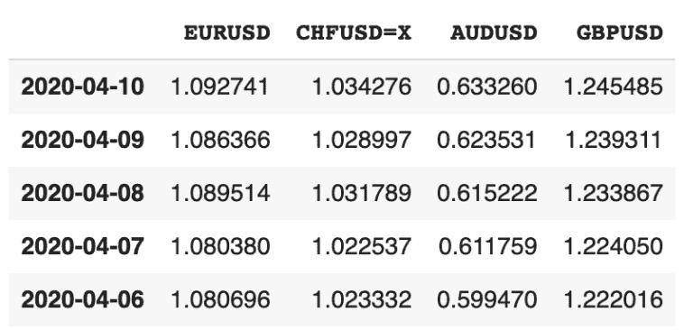
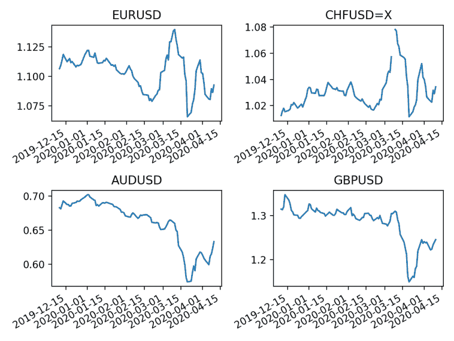

# 汇率对公司的影响

> 原文：<https://towardsdatascience.com/impact-of-exchange-rates-in-companies-93cc151bda4f?source=collection_archive---------40----------------------->

## 汇率风险可能是大公司最头疼的问题之一。

从投资者的角度来看，理解汇率变化对公司财务的影响非常重要。在本帖中，**我们将首先了解汇率如何影响公司利润**。**然后**，我们将**用 Python** 分析并绘制多种货币汇率。


照片由 [**迪莎摄塔**](https://www.pexels.com/@disha-sheta-596631?utm_content=attributionCopyText&utm_medium=referral&utm_source=pexels) 来自 [**像素**](https://www.pexels.com/photo/seven-indian-rupee-banknotes-hanging-from-clothesline-on-clothes-pegs-3521353/?utm_content=attributionCopyText&utm_medium=referral&utm_source=pexels)

# 汇率如何影响公司

在分析一家公司时，汇率是一个需要考虑的重要因素。一家公司可能以美元作为记账本位币(即公司准备财务结果时使用的货币)，但也有业务(如销售、贷款、供应商等。)换一种货币。

在提交财务结果时，公司必须区分货币和非货币资产/负债:

*   **货币性资产/负债**是那些随时可以转换为现金的资产。这些资产在报告日从其他货币重新转换为公司的功能货币。重估的任何收益或损失都会影响公司的利润。**例如，应收账款、应付账款、现金余额和贷款被视为货币资产/负债。**
*   **非货币性资产/负债**是指在报告日没有重新折算的资产/负债。它们在财务报表中使用历史汇率(即购置资产时使用的汇率)列示。例如，存货、PP 和无形资产被视为非货币性资产。

# 汇率对应付账款的影响

[应付账款是公司欠其债权人或供应商的金额](https://www.investopedia.com/terms/a/accountspayable.asp)。为了理解汇率对公司应付账款的影响，让我们以 ABCD 公司为例。

假设 ABCD 公司以美元报告他们的数字:

*   从欧洲供应商处购买 10，000€的材料。
*   交易日的汇率为欧元兑美元= 1.10。这意味着需要 1.10 美元来购买 1€。
*   这笔货款只能在 4 个月后支付

在购买时，ABCD 公司在资产负债表中将 11，000 美元(10，000€ *1，10)显示为应付账款。

假设三个月后，当 ABCD 公司准备财务报表时，欧元兑美元汇率从 1.10 下跌到 0.90。这意味着我们只需要 0.90 美元就可以买到 1€。由于汇率变化，公司 ABCD 底线将受到影响。现在，只需要 9000 美元(10000€* 0.90)就可以偿还最初的 10000€。

因此，ABCD 公司将把资产负债表中的应付账款减少 2，000 美元，并通过未实现收益增加利润 2，000 美元。

# 汇率对贷款的影响

同样，如果一家公司有一笔以外币计价的贷款，并且汇率波动，将会对公司的损益产生影响。

假设 ABCD 公司有 10，000€贷款。当欧元兑美元汇率为 1.10 时，该公司在资产负债表中将 11，000 美元显示为贷款。然而，当欧元兑美元汇率从 1.10 升至 0.90 时，ABCD 公司将在资产负债表中报告一笔仅为 9，000 美元的贷款。与此同时，它将在损益中报告 2000 美元的未实现收益。

一旦贷款偿还给银行，收益就会实现。

# 对销售汇率的影响

很有趣，对吧？根据前两个例子，当美元对其他货币升值时，以美元报告的公司似乎总是会受益。

这并不总是对的。公司向货币贬值(即贬值)的国家销售会降低它们的竞争力。一个公司失去竞争力的影响可能会转化为销售量的显著下降。

想象一下 ABCD 公司在美元对欧元升值的情况下。现在，一家欧洲公司需要支付更高的欧元价格从 ABCD 购买 1 件产品。这可能导致欧洲公司停止从 ABCD 公司购买，并在欧洲寻找替代供应商。

# 使用 Python 的汇率

现在我们明白了为什么在分析一家公司时汇率如此重要。接下来，我们来学习**如何用 Python 计算和绘制汇率。**

我们将构建一个 Python 脚本来检索多种货币的历史外汇数据，并使用 matplotlib 绘制它们。我将使用一个免费的财务 API， [financialmodelingprep](https://financialmodelingprep.com/) ，提供各种各样的免费财务数据。

在下面的[链接](https://financialmodelingprep.com/api/v3/quotes/forex)中，可以找到所有有数据的货币。对于我们的示例，我们将提取以下四种货币的汇率:

首先，我们导入所有 require 包，并向 [API 端点发出 get 请求，返回过去几年的历史汇率](https://financialmodelingprep.com/api/v3/historical-price-full/forex/EURUSD)。请注意，我们遍历了每种货币。在每个循环中，我们得到单一货币对的历史价格。

```
import requests
import pandas as pd
import matplotlib.pyplot as plt

exchange_rates_Python = {}
currencies = ['EURUSD','CHFUSD=X','AUDUSD','GBPUSD']

for currency in currencies:
  forex = requests.get(f'https://financialmodelingprep.com/api/v3/historical-price-full/forex/{currency}')

  forex = forex.json()
  print(forex)

#outcome example of USDGBP: 
{'historical': [{'adjClose': 0.8029,
   'change': -0.00032,
   'changeOverTime': -0.0004,
   'changePercent': -0.04,
   'close': 0.8029,
   'date': '2020-04-10',
   'high': 0.80324,
   'label': 'April 10, 20',
   'low': 0.80076,
   'open': 0.80258},
  {'adjClose': 0.8069,
   'change': 9e-05,
   'changeOverTime': 0.00011,
   'changePercent': 0.011,
...
```

响应包含一个带有历史价格的字典。请注意，关键字 *historical* 包括过去几年所有收盘价的列表。因此，我们可以对其进行循环，以便解析每个货币对的*日期*和*调整关闭*。我们将这些值存储在一个名为 *exchange_rates_Python* 的空字典中:

```
import requests
import pandas as pd
import matplotlib.pyplot as plt

exchange_rates_Python = {}
currencies = ['EURUSD','CHFUSD=X','AUDUSD','USDGBP']

for currency in currencies:
  forex = requests.get(f'https://financialmodelingprep.com/api/v3/historical-price-full/forex/{currency}')

  forex = forex.json()
  exchange_rates_Python[currency] = {}

  for item in forex['historical']:
    adj_close = item['adjClose']
    trade_date = item['date']
    exchange_rates_Python[currency][trade_date] = adj_close
```

最后，我们将字典转换成 Pandas 数据框架，以便使用 *matplotlib* 绘制数据。此外，我们将索引(即日期)转换为日期时间对象:

```
import requests
import pandas as pd
import matplotlib.pyplot as plt

exchange_rates_Python = {}
currencies = ['EURUSD','CHFUSD=X','AUDUSD','GBPUSD']

for currency in currencies:
  forex = requests.get(f'https://financialmodelingprep.com/api/v3/historical-price-full/forex/{currency}')

  forex = forex.json()
  exchange_rates_Python[currency] = {}

  for item in forex['historical']:
    adj_close = item['adjClose']
    trade_date = item['date']
    exchange_rates_Python[currency][trade_date] = adj_close

currencies_df = pd.DataFrame.from_dict(exchange_rates_Python, orient='index')
currencies_df=currencies_df.T
currencies_df.index = pd.to_datetime(currencies_df.index)
```



# 用 Python 绘制汇率

现在我们有了一个漂亮的熊猫数据框架中的汇率，我们准备绘制它们。我们将使用库 [matplotlib](https://matplotlib.org/) 为每种货币创建一个子图。

我们将只绘制最近 90 天的汇率:

```
#List of symbols https://financialmodelingprep.com/api/v3/quotes/forex

import requests
import pandas as pd
import matplotlib.pyplot as plt

exchange_rates_Python = {}
currencies = ['EURUSD','CHFUSD=X','AUDUSD','GBPUSD']

for currency in currencies:
  forex = requests.get(f'https://financialmodelingprep.com/api/v3/historical-price-full/forex/{currency}')

  forex = forex.json()
  exchange_rates_Python[currency] = {}

  for item in forex['historical']:
    adj_close = item['adjClose']
    trade_date = item['date']
    exchange_rates_Python[currency][trade_date] = adj_close

currencies_df = pd.DataFrame.from_dict(exchange_rates_Python, orient='index')
currencies_df=currencies_df.T
currencies_df.index = pd.to_datetime(currencies_df.index)

#take last 30 days
currencies_df = currencies_df.iloc[:90,:]

fig, axes = plt.subplots(nrows=2, ncols=2)

currencies_df[currencies[0]].plot(ax=axes[0,0])
axes[0,0].set_title(currencies[0])

currencies_df[currencies[1]].plot(ax=axes[0,1])
axes[0,1].set_title(currencies[1])

currencies_df[currencies[2]].plot(ax=axes[1,0])
axes[1,0].set_title(currencies[2])

currencies_df[currencies[3]].plot(ax=axes[1,1])
axes[1,1].set_title(currencies[3])

plt.tight_layout()
plt.show()
```



# 包扎

只需几行代码，我们就能够用 Python 检索和绘制汇率。

我们可以看到，在过去的三个月里，美元比英镑要强劲得多。在 2019 年 12 月，我们需要大约 1.33 美元来购买 1，然而，在 2020 年 4 月，我们只需要 1.22 美元来购买 1。

这意味着拥有大量未结应付款项或贷款的公司比 4 个月前更有能力偿还这些款项。然而，如果英国公司由于货币升值而决定不购买美元产品，销售可能会受到影响。

正如我们在这篇文章中看到的，在做出投资决策之前，了解一家公司的货币敞口非常重要。我建议你从货币敞口的角度来分析公司的销售、贷款和应付款。

如果你喜欢这篇文章，可以随意看看我在 [Python for Finance](http://codingandfun.com/) 上的其他帖子。

*原载于 2020 年 4 月 30 日*[*https://codingandfun.com*](https://codingandfun.com/impact-of-exchange-rates-in-companies-python-for-finance/)T22。