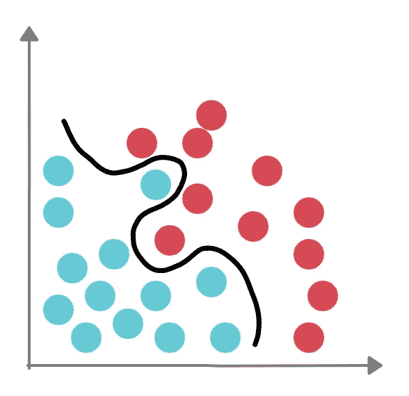
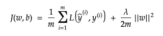
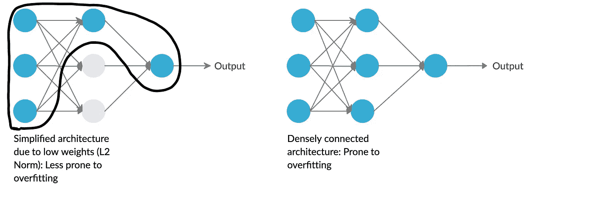
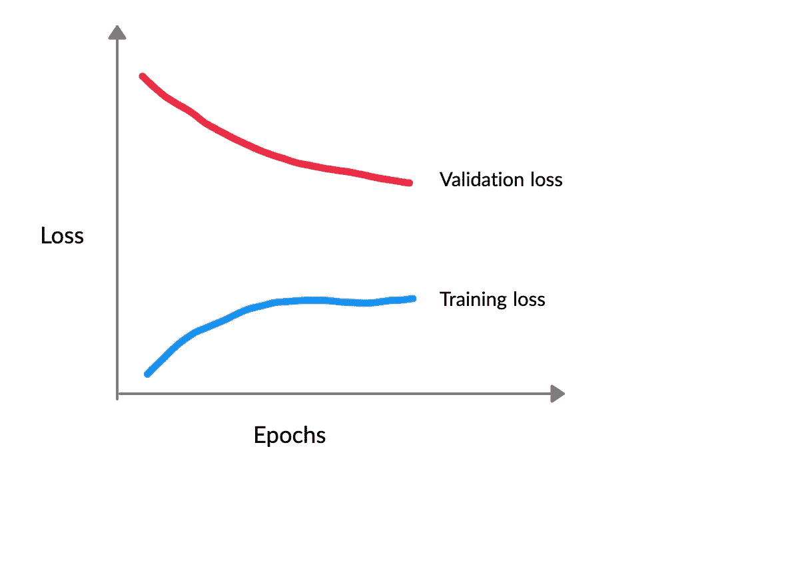
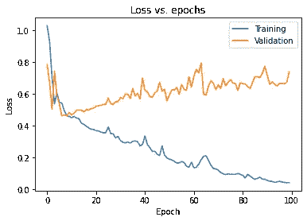
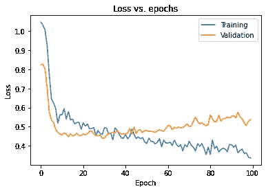

# 正则化对深度神经网络的影响

> 原文：<https://towardsdatascience.com/impact-of-regularization-on-deep-neural-networks-1306c839d923?source=collection_archive---------37----------------------->

## 使用 TensorFlow 2.0 强调重量衰减

一个高方差的模型(图片由作者提供)

# **简介**

在这个信息高速公路的时代，我们周围的世界正在向好的方向变化，可以毫不夸张地说，深度学习是下一次变革。深度学习是一套强大的数学工具，使我们能够表示、解释和控制我们周围的复杂世界。

编程范式正在改变:我们不再给计算机编程，而是教它学习一些东西，它做我们想做的事情。

这个特殊的概念非常吸引人，并驱使机器学习实践者开发模型，以进一步发展这些概念和想法，并将它们应用于现实世界的场景中。

然而，建立复杂的机器学习模型的基本问题是如何使架构不仅在训练数据上，而且在测试数据上，即在以前看不到的特征上做得好。为了克服这个中心问题，我们必须通过应用某些策略来修改模型，以减少测试误差，这可能是以增加训练误差为代价的。这些策略统称为**正则化**技术。然而，只有当模型遭受 ***高方差*** 问题时，正则化才是有用的，在该问题中，网络过度适应训练数据，但是不能概括新特征(验证或测试数据)。

# **L2 范数或重量衰减**

最广泛使用的正则化策略之一是利用 L2 范数。这可以通过向网络的成本函数添加正则化项来实现。

带有正则项的成本函数(作者要点)

等式的第一部分对应于净网络损耗的计算。术语 *w* & *b* 表示模型已经学习的权重和偏差。第二部分对应于计算权重向量的范数( *w* )的正则化项。这个正则项被明确地称为著名的 L2 范数或权重衰减。这样的最终结果是，网络的权重矩阵根据正则化参数 *lambda (λ)* 的值而受到惩罚。因此，正则化参数 *λ* 可以被认为是需要微调的另一个超参数。

# **了解工作**

通过举一个极端的例子，可以理解 L2 规范的规则化影响背后的直觉。让我们将正则化参数 *λ* 的值设置在较高端。这将严重惩罚网络的权重矩阵( *w* )，它们将被赋予接近于零的值。其直接影响是神经网络的净激活减少，前向传递效应减弱。现在，有了简化得多的神经网络体系结构，该模型将无法过度适应训练数据，并将能够对新数据和特征进行更好的概括。

正则网络与非正则网络的分析(图片由作者提供)

这种直觉基于正则化参数 *λ* 的值被设置得非常高的事实。但是，如果选择该参数的中间值，将会提高测试集上的模型性能。

# **什么时候调整你的模型？**

弄清楚正则化概念背后的直觉当然很好，但是，更重要的一点是要知道你的网络是否真的需要正则化。在这里，绘制学习曲线起着至关重要的作用。

绘制出模型在多个时期的训练和验证损失是确定模型是否过度拟合的最广泛使用的方法。该方法背后的概念基于这样一个事实，即**如果模型过度拟合训练数据，那么训练损失和验证损失将相差很大，而且验证损失将总是高于训练损失。**其原因是，如果模型不能很好地概括以前未见过的数据，那么相应的损失或成本价值将不可避免地很高。

过度拟合模型的学习曲线(图片由作者提供)

从上图可以明显看出，训练损失和验证损失之间存在巨大的差距，这表明模型明显过度适合训练样本。

# **使用 TensorFlow 2.0 实现 L2 范数**

L2 规范的实际实施很容易证明。为此，让我们从 sklearn 获取*糖尿病数据集*，首先绘制非正则化模型的学习曲线，然后绘制正则化模型的学习曲线。

该数据集有 442 个实例，并接受 10 个基线变量:*年龄、性别、身体质量指数、平均血压和 6 个血清测量值(S1 到 S6)* 作为其训练特征(称为 x)和一年后疾病进展的*测量值*作为其标签(称为 y)。

## **非规范化模型**

让我们使用 TensorFlow 和 sklearn 导入数据集。

导入数据集(按作者列出要点)

我们现在将数据分成训练集和测试集。测试集将保留 10%的训练数据。这可以使用 sklearn 中的 *train_test_split()* 函数来完成。

将数据集分成训练集和测试集(作者要点)

现在，我们仅使用 Keras 的顺序 API 中的密集层创建一个非规范化模型。这个非正则化模型将有 6 个隐藏层，每个层都有一个 ReLU 激活功能。

非规范化的模型架构(作者要点)

在设计了模型架构之后，我们现在用 ***亚当*** 优化器和 ***均方误差*** 损失函数来编译模型。训练在 **100 个时期**内进行，度量存储在一个变量中，该变量可用于绘制学习曲线。

编译和训练模型(作者要点)

我们现在绘制训练数据和验证数据中观察到的模型损失:

过度拟合的图表(图片由作者提供)

这里的结果是，验证损失在大约 10 个时期后持续上升，而训练损失持续下降。这种相反的趋势在两个损失之间产生了巨大的差距，这表明模型过度拟合了训练数据。

## 用 L2 范数正则化模型

我们已经从前面的学习曲线中得出结论，非正则化模型会遭受过拟合，为了解决这个问题，我们引入了 L2 范数。

密集层和卷积层都有一个可选的***kernel _ regulator***关键字参数。为了加入权重衰减或 L2 正则化，我们设置核正则化参数等于***TF . keras . regulators . L2(参数)*** 。这个参数对象是用一个必需的参数创建的，该参数是乘以权重平方和的系数或正则化参数 *λ。*

我们现在创建一个类似的网络架构，但是这一次，我们包括了*kernel _ regulator*参数。

正则化模型架构(作者要点)

我们使用相同的优化器、损失函数、度量和时期数来编译和训练模型，因为这使得两个模型之间的比较更容易。

训练后，当训练和验证损失相对于时期数作图时，观察到以下学习曲线:

正确匹配(图片由作者提供)

正则化模型的学习曲线更加平滑，训练和验证损失彼此更加接近，这表示网络中的变化更小。现在，训练损失和验证损失都可以相互比较，这表明模型泛化新特征的信心增加了。

# **结论**

在这个启发性的旅程中，我们通过比较两个模型的性能进行了广泛的分析，其中一个模型遭受过拟合，另一个模型解决了前一个模型的缺点。机器学习中的 ***偏差和方差*** 问题不容忽视，必须应用策略来克服这些非平凡的复杂性。我们今天讨论了一个这样的策略，以避免我们的模型出现偏差。

然而，旅程并没有就此停止，因此，我们必须把目光放得更远，必须顺风而行。

这里是作者的 GitHub 库的链接，可以参考完整的代码。

 [## ujjwalkumar 2607/正则化-技术-张量流

### 通过在 GitHub 上创建一个帐户，为 ujjwalkumar 2607/regularization-techniques-tensor flow 开发做出贡献。

github.com](https://github.com/ujjwalkumar2607/Regularisation-techniques-tensorflow)