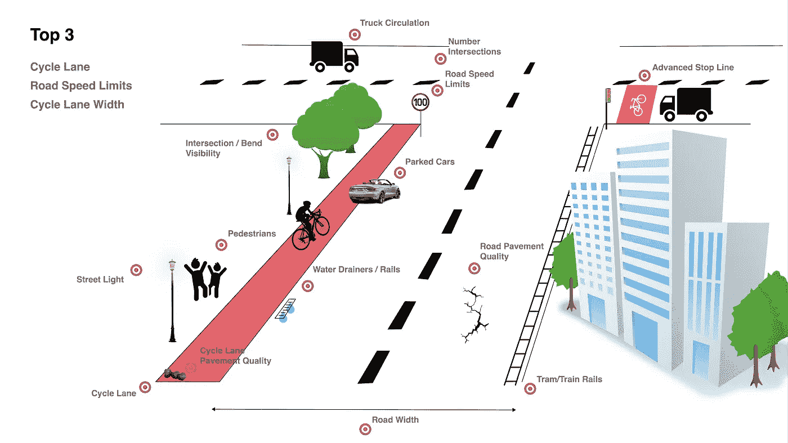

# 道路安全深度学习

> 原文：<https://towardsdatascience.com/imperial-college-london-1c9bb442926?source=collection_archive---------59----------------------->

## 使用 YOLOv5 识别伦敦骑自行车者的危险因素

## 介绍

作为 ICL MRes 生物医学研究(数据科学)学位的一部分，学生将参与两个项目。项目 1 历时 5 个月，2019 年 10 月开工。项目 2 将于 2020 年 8 月完成。

## 第一个项目

一篇关于第一个项目成果的文章可以通过下面的链接查看。

 [## 建立食物推荐系统

### 机器学习通过营养预防和治疗癌症

towardsdatascience.com](/building-a-food-recommendation-system-90788f78691a) 

## 第二个项目

第二个项目的目的是使用谷歌街景图像来估计伦敦所有道路的安全分数(从自行车手的角度)。它将被训练成一个深度学习模型，使用 YOLOv5 来识别图像上的风险因素(狭窄的道路，缺乏自行车道……)。这种模式最终可能会推广到其他城市。并且因此，使得有可能估计谷歌街景可用的所有地理位置的得分。

从道路安全的角度来看，该项目旨在降低伦敦骑自行车者的死亡率和受伤率(最终也将扩展到其他地区)。建议骑自行车的人选择最安全的道路，同时指导政府在有危险信号的地方实施额外的安全措施。

从**环境**的角度来看，通过为人们提供更安全的通勤方式，预计可持续交通方式的采用率将会增加:自行车、踏板车……从而有助于解决我们社会最普遍的问题之一:全球变暖。

人们越来越意识到，公共交通是导致**传染病**(例如——新冠肺炎)传播的主要因素之一。此外，就呼吸系统疾病而言，发现空气污染程度较高的地区对其居民构成额外风险。

谦虚地说，我希望这个项目至少能在这些方向上迈出一小步。

项目的 [GitHub 资源库](https://github.com/warcraft12321/RoadSafety)中提供了所有实现和实现既定目标的路线图。

## 监督人

马吉德·埃扎提 | [里基·纳特瓦尼](https://www.imperial.ac.uk/people/r.nathvani)