# 用 Pytorch 从头开始实现 Canny 边缘检测

> 原文：<https://towardsdatascience.com/implement-canny-edge-detection-from-scratch-with-pytorch-a1cccfa58bed?source=collection_archive---------17----------------------->

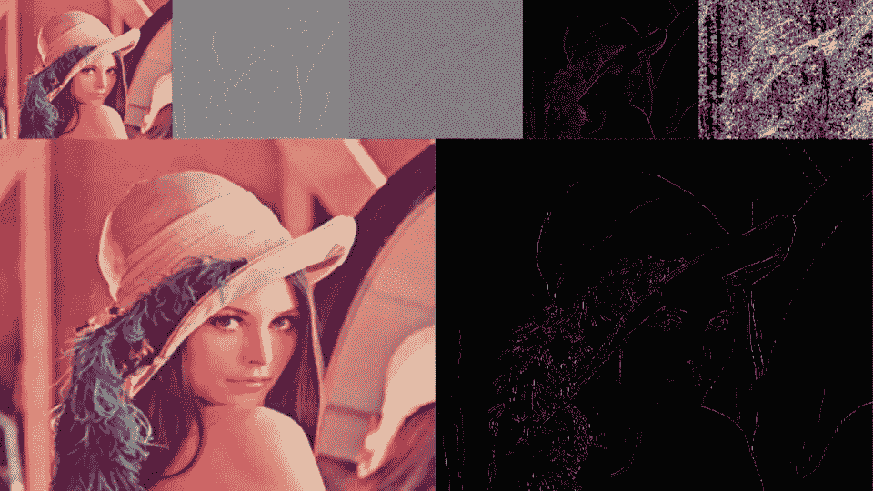

Canny 边缘检测

**Canny 滤波器**无疑是边缘检测中最知名和最常用的滤波器。我将逐步解释用于**轮廓检测**的 canny 滤波器。一步一步因为 canny 滤波器是一个**多级滤波器**。Canny 过滤器很少被集成到深度学习模型中。所以我会描述不同的部分，同时用 **Pytorch** 实现。它几乎可以无限制地定制，我允许自己有一些偏差。

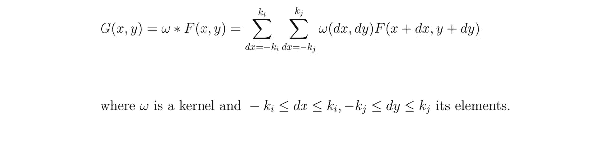

输入图像和内核之间的卷积

我来介绍一下什么是**卷积矩阵**(或者说**内核**)。卷积矩阵描述了我们将要在输入图像上通过的**滤波器**。简单来说，内核将通过应用**卷积乘积**在整个图像上从左到右、从上到下移动。该操作的输出被称为**滤波图像**。

# 高斯滤波

首先，我们通常通过应用**模糊过滤器**来移除输入图像中存在的**噪声**。这个滤镜的选择由你决定，但是我们大多用的是**高斯**滤镜。

高斯核

**可以制作不同大小的高斯核**，或多或少居中或展平。显然，核越大，输出图像越模糊。

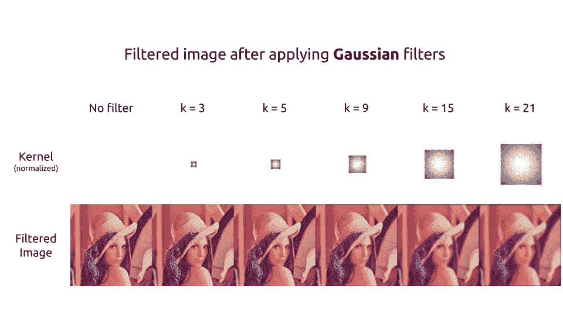

# 索贝尔滤波

为了**检测边缘**，必须对图像应用过滤器**以提取梯度**。

X 上的 Sobel 核

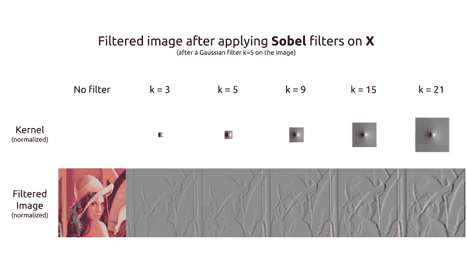

最常用的滤波器是**索贝尔滤波器**。分解成两个滤波器，第一个内核用于水平提取**梯度**。粗略地说，右边的像素与左边的像素相比越亮，过滤图像的结果就越高。反之亦然。这一点在莉娜的帽子左侧可以清晰的看到。

Y 上的 Sobel 核

第二个内核用于垂直提取**梯度**。一个是另一个的转置。这两个核心具有相同的作用，但是在不同的轴上。

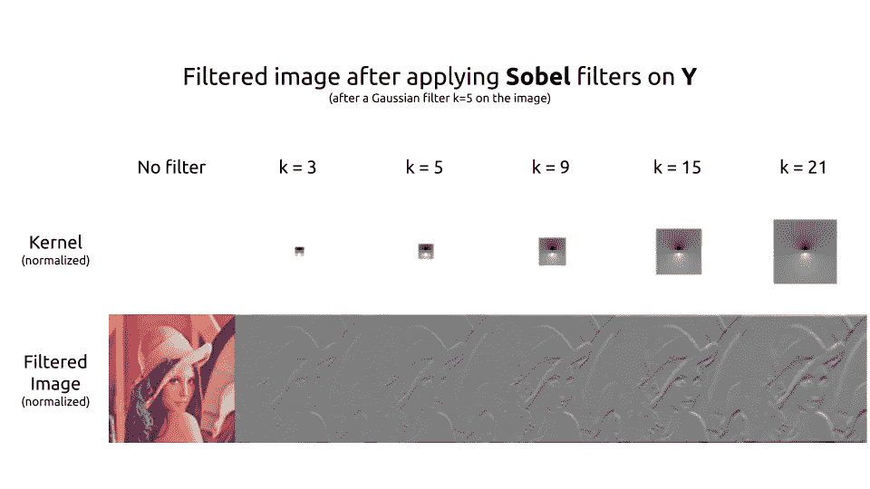

# 计算梯度

嗯，我们在图像的两个轴上都有梯度。为了检测轮廓，我们想要梯度的**大小**。我们可以使用绝对值范数或**欧几里德范数**。

梯度的大小和方向

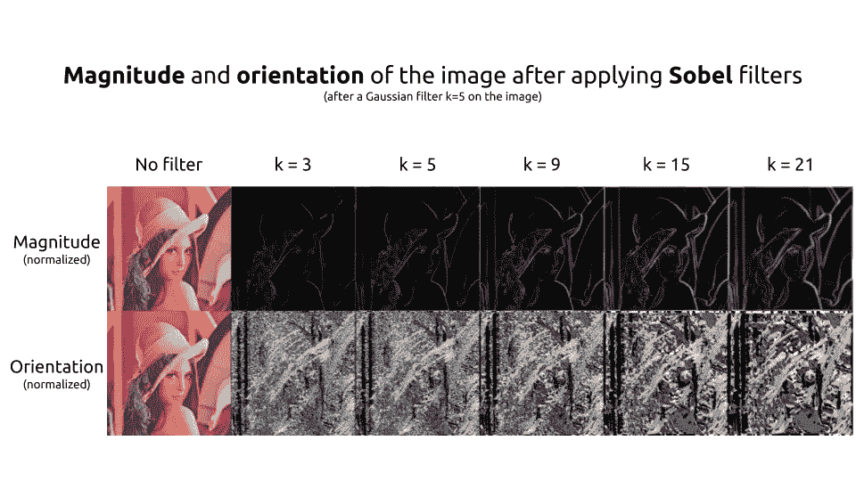

使用我们的梯度的大小，边缘现在被完美地检测到了。但是**他们很粗**。如果能只保留轮廓的细线就太好了。因此，我们同时计算我们的梯度的**方向**，这将被用来只保留这些**细线**。
在 Lena 的图片中，渐变是由强度来象征的，因为渐变的角度很重要。

# 非最大抑制

为了细化边缘，可以使用**非最大抑制**方法。在此之前，我们需要创建 45×45 方向的内核。(可以参考[本帖](/how-to-transform-a-2d-image-into-a-3d-space-5fc2306e3d36)了解旋转矩阵)

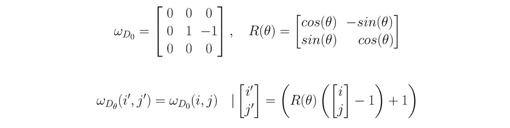

方向核

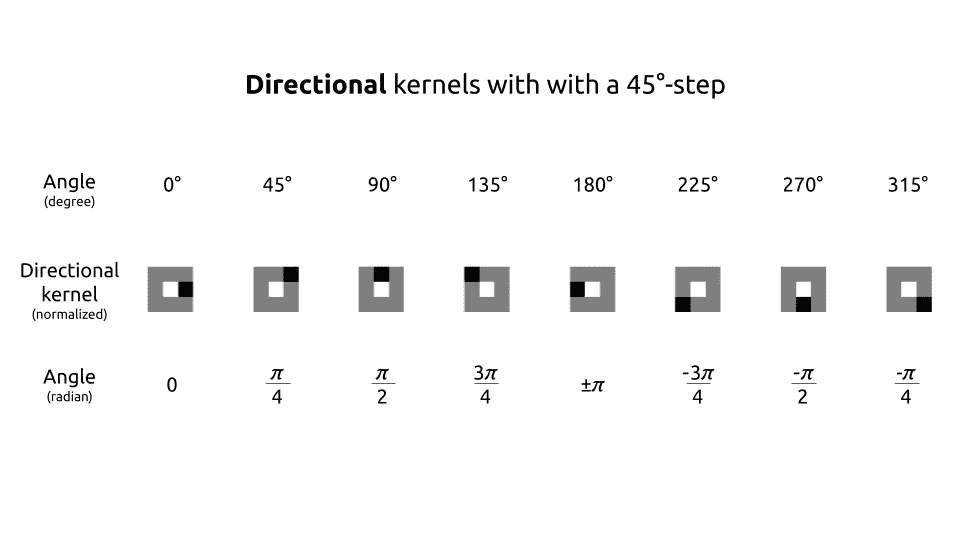

因此，该过程将需要检查**8-邻域**(或称为摩尔邻域)。这个概念很容易理解。对于每个像素，我们将**检查方向**。我们将会看到这个像素是否比它的梯度方向的邻居更强烈。如果是，那么我们将该像素与其相反方向的邻居进行比较。如果该像素与其双向邻居相比具有**最大强度**，则它是**局部最大值**。这个像素将被**保持**。在所有其他情况下，它不是局部最大值，并且像素被**移除**。

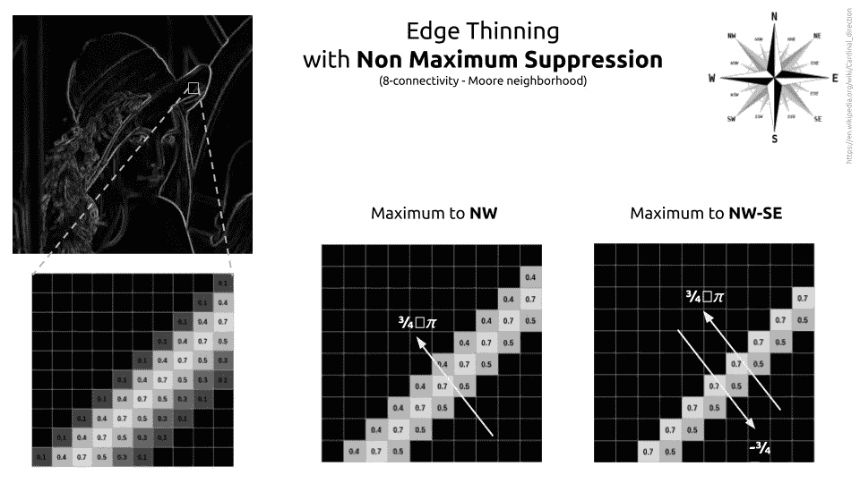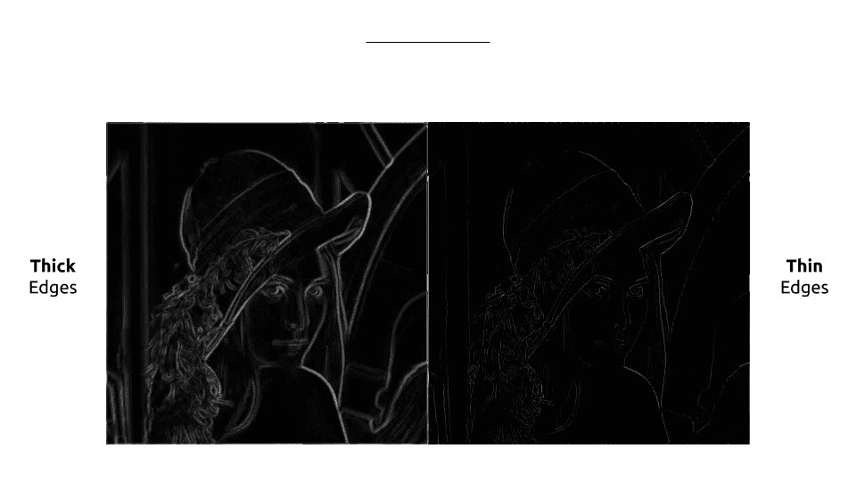

# 阈值和迟滞

最后，只剩下应用**阈值**了。有三种方法可以做到这一点:

*   **低-高**阈值:强度高于阈值的像素设置为 1，其他设置为 0。
*   **低-弱**和**弱-高**阈值:我们将具有高强度的像素设置为 1，将具有低强度的像素设置为 0，并且在两个阈值之间我们将它们设置为 0.5。他们被认为是弱者。
*   **低-弱**和**弱-高**带**滞后**:同上。弱像素通过它们的滞后水平进行评估，并被重新分配为高或低。

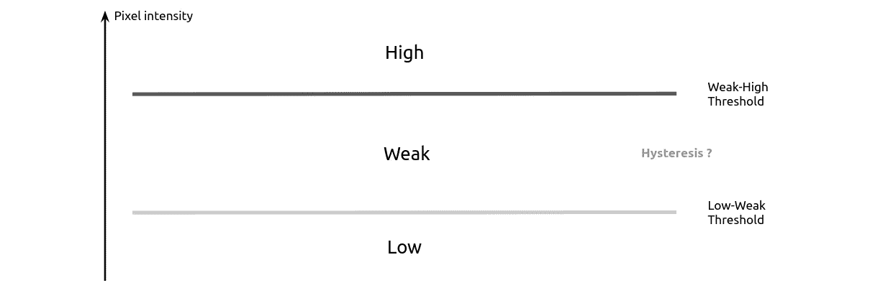

阈值

> 滞后是系统状态对其历史的依赖性。—维基百科

在我们的例子中，滞后可以理解为一个像素对其邻居的**依赖性。在 canny 滤波器的滞后步骤中，我们说，如果弱像素在其 8 个邻居中有一个高邻居，则该弱像素将被分类为高。**

我更喜欢用不同的方法，用最终的卷积滤波器对弱像素进行分类。如果它的卷积乘积**大于 1** ，那么我将其归类为高。高邻比 0.25 分，弱半 0.25。

滞后内核

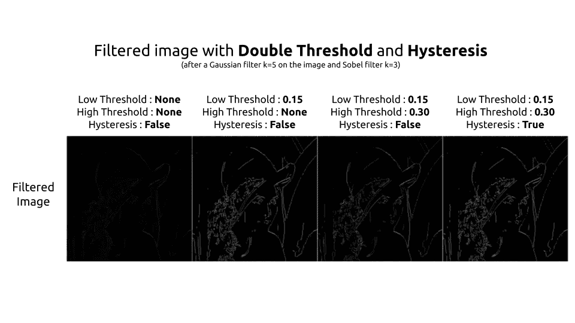

# “你说 Pytorch？”

的确是的，现在是 **Pytorch 代码**的时候了。一切都组合成**一 nn。模块**。我不能保证实现会得到优化。使用 OpenCV 的特性将加快处理速度。但是这种实现方式至少具有以下优点:灵活性**，**可参数化**，并且根据需要容易**改变**。**

****

> ****知识就是分享。**
> **支持**我，一键获取 [**中**我所有文章的**访问**](https://axel-thevenot.medium.com/membership) 。**

****

# **来源**

**[各向同性 3×3 图像梯度算子，I. Sobel](https://www.researchgate.net/publication/239398674_An_Isotropic_3x3_Image_Gradient_Operator)**

**[卷积，ESIEE](https://perso.esiee.fr/~perretb/I5FM/TAI/convolution/index.html)**

**[Canny 边缘检测器，维基百科](https://en.wikipedia.org/wiki/Canny_edge_detector)**

**[Canny 边缘检测，OpenCV](https://docs.opencv.org/trunk/da/d22/tutorial_py_canny.html)**

**所有的图像都是自制的(除了莉娜和指南针)**