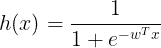
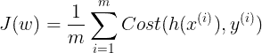
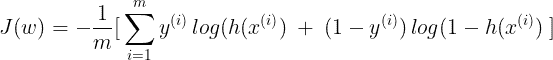
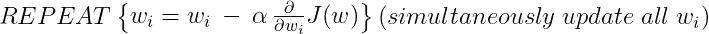
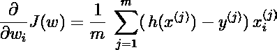
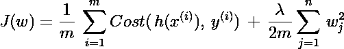
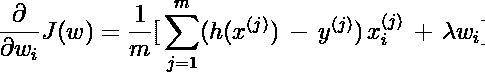
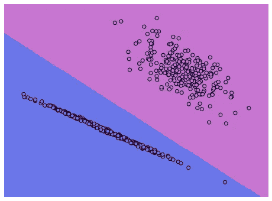

# 在 Python 中从头开始用 L2 正则化实现逻辑回归

> 原文：<https://towardsdatascience.com/implement-logistic-regression-with-l2-regularization-from-scratch-in-python-20bd4ee88a59?source=collection_archive---------2----------------------->

## 构建自己的逻辑回归分类器的分步指南。


由[马库斯·斯皮斯克](https://unsplash.com/@markusspiske?utm_source=medium&utm_medium=referral)在 [Unsplash](https://unsplash.com?utm_source=medium&utm_medium=referral) 拍摄的照片

目录:

1.  [简介](#f22f)
2.  [先决条件](#91d4)
3.  [幕后数学](#c7e8)
4.  [正规化](#4077)
5.  [代码](#6611)
6.  [结果和演示](#976b)
7.  [未来工作和结论](#c25f)
8.  [参考文献](#aee5)

## 1.简介:

逻辑回归是用于*分类*的最常见机器学习算法之一。它是一种统计模型，使用逻辑函数来模拟二元因变量。本质上，它预测了某个观察值属于某个类别或标签的概率。例如，这是一张*猫*的照片还是一张*狗*的照片？

*注意:虽然逻辑回归可以扩展到多类分类，但在本文中我们将只讨论二元分类设置。*

## 2.先决条件:

读者应理解以下内容:

*   什么是数据集？
*   什么是特性？
*   什么是多重共线性？
*   什么是 sigmoid 函数？

## **3。幕后数学**

**假设:**逻辑回归在开始其建模过程之前做出某些关键假设:

1.  标签几乎是线性可分的。
2.  观察结果必须是相互独立的。
3.  独立变量之间的多重共线性很小或没有。
4.  自变量与对数概率呈线性相关。

**假设:**我们希望我们的模型预测某个观察值属于某个类别或标签的概率。因此，我们想要一个假设 ***h*** 满足下面的条件`0 <= h(x) <= 1`，其中 ***x*** 是一个观察值。

我们定义`h(x) = g(w` ᵀ `* x)`，其中 ***g*** 为 sigmoid 函数 ***w*** 为可训练参数。因此，我们有:



**观察的成本:**既然我们可以预测观察的概率，我们希望结果具有最小的误差。如果类标签是 ***y*** ，则与观察值 ***x*** 相关联的成本(误差)由下式给出:


**成本函数:**因此，数据集中所有 ***m*** 个观察值的总成本为:



我们可以将成本函数 ***J*** 改写为:



逻辑回归的目标是找到参数 ***w*** ，使得 ***J*** 最小。但是，我们怎么做呢？

**梯度下降:**

> **梯度下降**是一种优化算法，用于通过在**最陡下降**方向迭代移动来最小化某个函数，该方向由**梯度的负值定义。**

我们将使用以下模板更新每个参数 ***wᵢ*** :



以上步骤将帮助我们找到一组参数***【wᵢ】，*** ，然后这些参数将帮助我们提出***【x】***来解决我们的二元分类任务。

但是也存在与上述梯度下降步骤相关的不期望的结果。在寻找最佳 h(x)的尝试中，会发生以下情况:

```
CASE I: For class label = 0
h(x) will try to produce results as close 0 as possible
As such, wT.x will be as small as possible
=> Wi will tend to -infinityCASE II: For class label = 1
h(x) will try to produce results as close 1 as possible
As such, wT.x will be as large as possible
=> Wi will tend to +infinity
```

这导致了一个称为过度拟合的问题，这意味着，模型将无法很好地概括，即，它将无法正确预测未知观察的类标签。所以，为了避免这种情况，我们需要控制 wᵢ.参数的增长 但是，我们怎么做呢？

## **4。正规化:**

正则化是一种通过惩罚成本函数来解决机器学习算法中*过拟合*问题的技术。这是通过在成本函数中使用附加的惩罚项来实现的。有两种类型的正则化技术:

1.  拉索或 L1 正则化
2.  岭或 L2 正则化(我们将在本文中只讨论这一点)

那么，L2 正则化如何帮助防止过度拟合呢？让我们先来看看我们新的成本函数:



***λ*** 称为正则化参数。它控制两个目标之间的权衡:*很好地拟合训练数据* **vs** *保持参数较小以避免过度拟合。*

于是， ***J(w)*** 的梯度变成:



正则项将严重惩罚大的 ***、wᵢ*** 。对更小的*的影响会更小。这样， ***w*** 的增长受到控制。用这些受控参数 ***w*** 得到的 ***h(x)*** 将更具普适性。*

*注意: ***λ*** 是一个超参数值。我们必须通过交叉验证来找到它。*

*   *较大的值 ***λ*** 会使 ***wᵢ*** 收缩得更接近 0，这可能会导致欠拟合。*
*   ****λ = 0，*** 将没有正则化效果。*

****选择λ时，我们必须妥善处理偏差与方差的权衡。****

*你可以在这里找到更多关于正规化[的信息。](https://en.wikipedia.org/wiki/Regularization_(mathematics)#:~:text=In%20mathematics%2C%20statistics%2C%20and%20computer,problem%20or%20to%20prevent%20overfitting.)*

*我们完成了所有的数学运算。让我们用 Python 实现代码。*

## *5.代码:*

*注意:尽管我们在上面将正则化参数定义为 ***λ*** ，我们在代码中使用了 ***C = (1/λ)*** 以便与 *sklearn* 包相似。*

## *5.结果和演示:*

*让我们在虚拟数据集上安装分类器，并观察结果:*

*决策边界图:*

**

*正如我们所见，我们的模型能够很好地对观察结果进行分类。界限就是决策线。*

*在这里获得模型的沙盒体验:[现场预览](https://play-with-lr.herokuapp.com/)。*

## *6.未来工作和结论:*

*通过实现其他算法，如随机平均梯度、有限记忆 BFGS，来解决优化问题，有提高分类器性能的余地。*

*我们也可以实现套索或 L1 正则化。*

*仅此而已。谢谢你阅读我的博客。如果你有任何想法，请留下评论、反馈和建议。*

*通过我的[作品集](https://arya46.github.io)联系我，或者在 [LinkedIn](http://www.linkedin.com/in/tulrose) 上找到我。*

## *7.参考资料:*

*[1][https://www.coursera.org/learn/machine-learning](https://www.coursera.org/learn/machine-learning)*

*[2][https://sci kit-learn . org/stable/modules/generated/sk learn . linear _ model。LogisticRegression.html](https://scikit-learn.org/stable/modules/generated/sklearn.linear_model.LogisticRegression.html)*

*[3][https://www . geeks forgeeks . org/understanding-logistic-regression](https://www.geeksforgeeks.org/understanding-logistic-regression/)*

*[前往顶级^](#5559)*