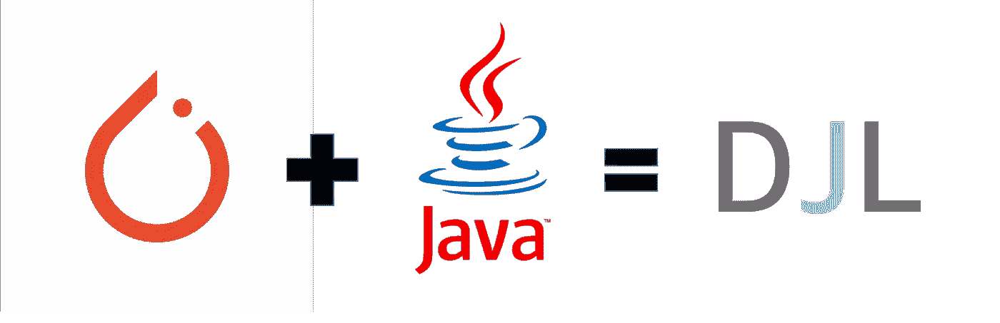
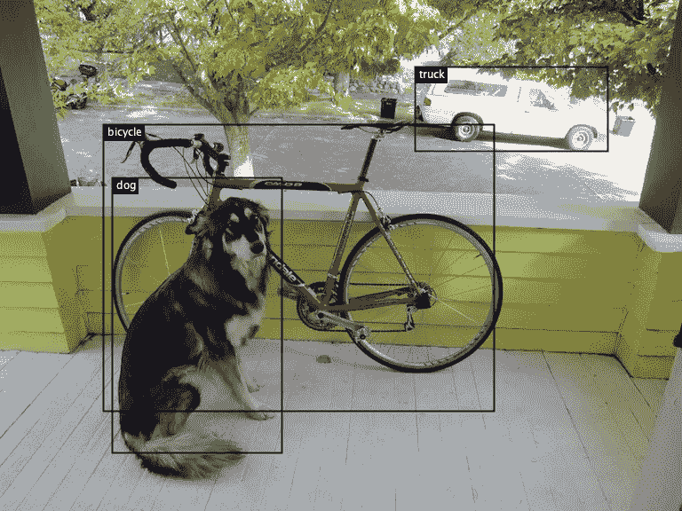
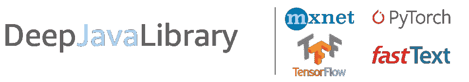

# 用 PyTorch 在 5 分钟内用 Java 实现物体检测

> 原文：<https://towardsdatascience.com/implement-object-detection-with-pytorch-in-java-in-5-minutes-c3ba5769e7aa?source=collection_archive---------15----------------------->

## DJL，一个引擎无关的深度学习库

PyTorch 是最流行的机器学习框架之一。其易于使用的 Pythonic 界面和生产力增强特性，如数据并行性和动态计算图，简化了计算机视觉(CV)和自然语言处理(NLP)中应用的 ML 模型的开发。

虽然有[多种选项](https://pytorch.org/blog/model-serving-in-pyorch/)来为生产中的 PyTorch 模型提供服务，但是在 Java 中本地部署 PyTorch 模型的选项却很少。以前，用户可以围绕 PyTorch C++ API 编写一个 Java 包装器，或者使用[实验性的 PyTorch Java 绑定](https://pytorch.org/blog/pytorch-1-dot-4-released-and-domain-libraries-updated/)。亚马逊的[深度 Java 库](https://djl.ai/) (DJL)现在通过其易于使用的高级 API 为 PyTorch 和 Java 社区提供了一个更简单的选择。通过抽象 ML 中涉及的复杂性和捆绑乏味的数据处理例程，DJL 用 PyTorch 模型将运行预测简化到几行代码。在我们的两部分博客系列中，我们展示了用户如何使用 PyTorch 进行推理。首先是预训练的 PyTorch 模型，然后是用户生成的 PyTorch 模型。在这两篇博客的第一篇中，我们展示了如何在不到 5 分钟的时间内使用预先训练好的 PyTorch 模型实现物体检测。那么，我们开始吧。

# 设置

要开始使用 DJL，请使用命令行或您选择的 IDE 创建一个项目。将以下代码添加到您的`build.gradle`配置文件中。在这个例子中，我们使用 PyTorch 1.4.0 C++发行版。

[https://gist . github . com/lank 520/7787 C2 D2 b5 FB 304 CBE 60360139 e 8760 f # file-build-gradle](https://gist.github.com/lanking520/7787c2d2b5fb304cbe60360139e8760f#file-build-gradle)

# 使用预训练 PyTorch 模型的对象检测

在本节中，我们使用 NVIDIA 的[预训练 PyTorch 跟踪模型来实现对象检测。该任务识别](https://pytorch.org/hub/nvidia_deeplearningexamples_ssd/)下方的[图像中嵌入的物体(狗、自行车、卡车):](https://github.com/awslabs/djl/raw/master/examples/src/test/resources/dog_bike_car.jpg)

使用 DJL，您可以用下面的代码块在几行代码中运行推理:

[https://gist . github . com/lank 520/74 EC 6b 35 ca 6076 fa 3c be 2848869 F7 a1f # file-od-Java](https://gist.github.com/lanking520/74ec6b35ca6076fa3cbe2848869f7a1f#file-od-java)

运行 PyTorch 代码会产生以下输出。输出列出了检测到的对象及其相对概率。

然后你可以使用我们的[图像可视化功能](https://javadoc.djl.ai/api/0.4.0/ai/djl/modality/cv/ImageVisualization.html#drawBoundingBoxes-java.awt.image.BufferedImage-ai.djl.modality.cv.DetectedObjects-)来定义这个图像的边界框。

有关如何加载 PyTorch 模型的更多信息，请查找最新解决方案的[文档](http://docs.djl.ai/jupyter/load_pytorch_model.html)。

# 什么是 DJL？

完成本教程后，你可能想知道 DJL 是什么。深度 Java 库(DJL)是一个开源库，用于在 Java 中构建和部署深度学习。该项目于 2019 年 12 月启动，在亚马逊的团队中广泛使用。这一努力受到了其他 DL 框架的启发，但是是从底层开始开发的，以更好地适应 Java 开发实践。DJL 与框架无关，支持 Apache MXNet、PyTorch、TensorFlow 2.x 和 ONNXRuntime。

# PyTorch 支持范围

[更新]:现在我们在最新的 0.10.0 版本中支持 PyTorch 1.7.1

我们用 PyTorch (1.4.0) C++ API 构建了 DJL PyTorch 引擎，它允许我们运行操作符和推理代码。所有采用 [TorchScript](https://pytorch.org/tutorials/beginner/Intro_to_TorchScript_tutorial.html) 格式的模型都可以导入并在 DJL 上运行。为了实现这一点，我们编写了一个定制的 JNI 层，在 C++和 Java 之间进行交互。目前，DJL 覆盖了 60 多家 PyTorch 运营商。DJL 本身具有以下固有特性:

*   NDManager:高效的垃圾收集系统
*   多线程支持
*   模型动物园:PyTorch 模型动物园支持图像分类和对象检测模型
*   还有更多…

支持的平台:

*   Mac: CPU
*   Linux: CPU 和 GPU (CUDA 9.2 和 CUDA 10.1)
*   Windows: CPU 和 GPU (CUDA 9.2 和 CUDA 10.1)

要了解更多信息，请查看我们的[网站](https://djl.ai/)、 [Github 资源库](https://github.com/deepjavalibrary/djl)和 [Slack channel。](https://join.slack.com/t/deepjavalibrary/shared_invite/zt-ar91gjkz-qbXhr1l~LFGEIEeGBibT7w)请继续关注我们的下一篇博文，我们将展示如何在 Java 中使用自己的 PyTorch 模型运行推理。