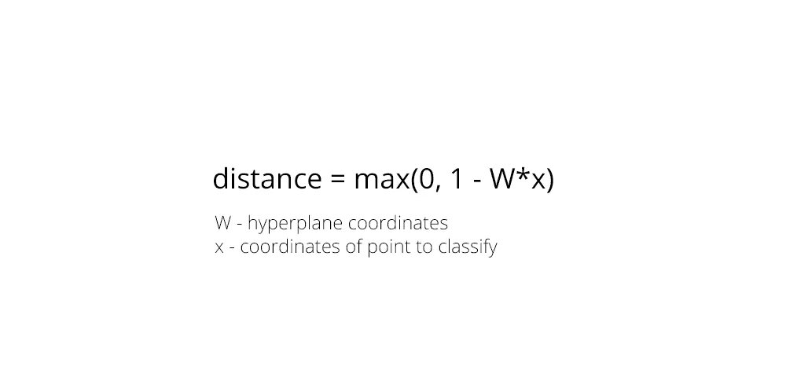
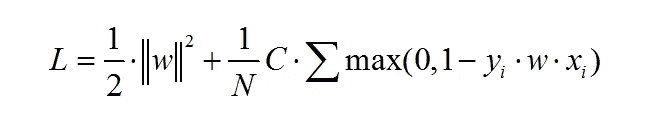
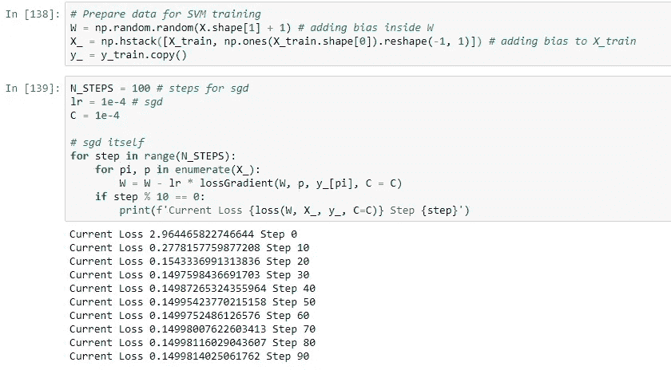
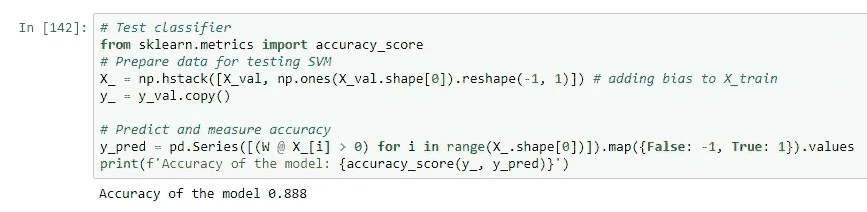
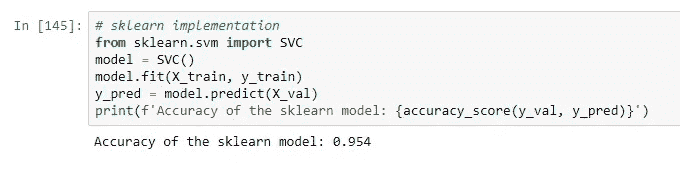

# 用 Python 实现 SVM..两分钟后。

> 原文：<https://towardsdatascience.com/implement-svm-with-python-in-2-minutes-c4deb9650a02?source=collection_archive---------24----------------------->

## 有可能在两分钟内编写一个简单的 SVM 版本吗？

[https://unsplash.com/photos/BXOXnQ26B7o](https://unsplash.com/photos/BXOXnQ26B7o)

在本文中，我将使用 Python 来实现支持向量机分类器，它被认为是最复杂的基本机器学习算法之一。尽管如此，在我的代码中，与[线性回归实现](https://bit.ly/3fgktMH)唯一真正不同的是所使用的损失函数。为了更好地理解 SVM 使用的损失函数，我也推荐你看一下这个很棒的视频和解释。

【https://www.youtube.com/watch?v=VngCRWPrNNc 

从视频中你可以理解，SVM 损失函数的核心是这个公式，它描述了点到超平面的距离。

通过执行梯度下降和减少损失函数，SVM 算法试图最大化决策边界和两类点之间的差距。SVM 损失函数可以写成如下形式:

现在，让我们转到实现本身，只需要几分钟的时间来编码梯度下降，以最小化这个损失函数。

**用 Python 实现 SVM**

1.  首先，我将创建数据集，使用 sklearn.make_classification 方法，我还将做一个训练测试拆分，以衡量模型的质量。

2.现在，我将实现上面描述的损失函数，以在训练模型时意识到损失在下降。

如您所见，我还创建了一个损失计算的小示例，位于函数本身的下方。

3.让我们写一个在随机梯度下降过程中，计算损失梯度的函数。这可以通过简单地将损失函数相对于 W(超平面的坐标)进行微分来实现

4.最后，让我们实现梯度下降本身(注意，我给 X_train 变量增加了一个额外的项，代表模型偏差)。

当训练完成时，可以通过简单地取权重和点坐标之间的点积来执行预测。

为了便于比较，我也将安装一个 sklearn SVM 模型。

如您所见，sklearn 实现的结果更好，但是对于一个非常简单的模型，我们的结果仍然很好。

**你可以在我的** [**网站**](http://artkulakov.com) 上查看其他帖子

## 你可能会对我的其他中型职位感兴趣。

[用 Python 在 2 分钟内实现朴素贝叶斯](https://bit.ly/3bZqqLX)

[在 2 分钟内解释并实施 PCA](https://bit.ly/3c1rejB)

[借助 RapidsAI](https://bit.ly/3bZqStT) ，让您的机器学习速度提高 300 倍

*如果这个故事对你有帮助，也许对别人也有帮助，别忘了分享一下:)*