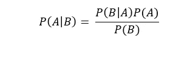

# 使用 Scikit-learn 和 ML 实现朴素贝叶斯分类器。网

> 原文：<https://towardsdatascience.com/implementation-of-naive-bayes-classifier-with-the-use-of-scikit-learn-and-ml-net-d1012e105fbc?source=collection_archive---------28----------------------->


当我们想到机器学习时，首先想到的语言是 Python 或 r，这是可以理解的，因为它们为我们提供了实现这些算法的许多可能性。

然而，我每天都在 C#中工作，我的注意力被一个非常新鲜的库所吸引，这个库就是[ML.NET](https://docs.microsoft.com/en-gb/dotnet/machine-learning/)。在本文中，我将展示如何使用 Scikit-learn 在 Python 语言中实现朴素贝叶斯分类器，以及如何使用前面提到的 ML.NET 在 C#中实现朴素贝叶斯分类器。

**朴素贝叶斯分类器**

朴素贝叶斯分类器是一个简单的概率分类器，它假设独立变量相互独立。它基于贝叶斯定理，其数学表达如下:



**数据集**

我使用了来自 UCI 机器学习知识库的[葡萄酒质量数据集](https://archive.ics.uci.edu/ml/datasets/Wine+Quality)进行实验。所分析的数据集具有 11 个特征和 11 个类别。等级决定了葡萄酒的质量，数值范围为 0-10。

**ML.NET**

第一步是创建一个控制台应用程序项目。然后你必须从 NuGet 包中下载 NuGet 库。现在，您可以创建与数据集中的属性相对应的类。清单中显示了创建的类:

然后，您可以继续加载数据集，并将其分为训练集和测试集。我在这里采用了标准结构，即 80%的数据是训练集，而其余的是测试集。

```
var dataPath = "../../../winequality-red.csv";var ml = new MLContext();var DataView = ml.Data.LoadFromTextFile<Features>(dataPath, hasHeader: true, separatorChar: ';');
```

现在有必要使模型结构适应 model 图书馆采用的标准。这意味着指定类的属性必须称为 Label。其余的属性必须压缩在名称 Features 下。

```
var partitions = ml.Data.TrainTestSplit( DataView, 
testFraction: 0.3);var pipeline = ml.Transforms.Conversion.MapValueToKey(
inputColumnName: "Quality", outputColumnName: "Label")
.Append(ml.Transforms.Concatenate("Features", "FixedAcidity", "VolatileAcidity","CitricAcid", "ResidualSugar", "Chlorides", "FreeSulfurDioxide", "TotalSulfurDioxide","Density", "Ph", "Sulphates", "Alcohol")).AppendCacheCheckpoint(ml);
```

完成上述步骤后，您可以继续创建培训渠道。在这里，您可以选择朴素贝叶斯分类器形式的分类器，并在参数中为其指定标注和要素的列名。您还指示了表示预测标签的属性。

```
var trainingPipeline = pipeline.Append(ml.MulticlassClassification.Trainers.
NaiveBayes("Label","Features"))
.Append(ml.Transforms.Conversion.MapKeyToValue("PredictedLabel"));
```

最后，您可以继续训练和测试模型。一切都在两行代码中结束。

```
var trainedModel = trainingPipeline.Fit(partitions.TrainSet);var testMetrics = ml.MulticlassClassification.
Evaluate(trainedModel.Transform(partitions.TestSet));
```

**Scikit-learn**

在 Python 实现的情况下，我们也从数据集文件的处理开始。为此，我们使用 numpy 和 pandas 库。在清单中，您可以看到用于从文件中检索数据并从中创建 ndarray 的函数，这些函数将用于算法。

```
from sklearn.naive_bayes import GaussianNB
from common.import_data import ImportData
from sklearn.model_selection import train_test_splitif __name__ == "__main__":
data_set = ImportData()
x = data_set.import_all_data()
y = data_set.import_columns(np.array(['quality']))
```

下一步是创建一个训练和测试集。在这种情况下，我们还对测试集使用 20%的划分，对训练集使用 80%的划分。我使用了 train_test_split 函数，它来自库 sklearn。

```
X_train, X_test, y_train, y_test = train_test_split(x, y, test_size=0.2)
```

现在，您可以继续使用朴素贝叶斯分类器了。在这种情况下，训练和测试也在几行代码中完成。

```
NB = GaussianNB()
NB.fit(X_train, y_train.ravel())
predictions = NB.predict(X_test)
print('Scores from each Iteration: ', NB.score(X_test, y_test))
```

**结果和总结**

Scikit-learn 实现的朴素贝叶斯分类器的准确率为 56.5%，而 ML.NET 的准确率为 41.5%。这种差异可能是由于算法实现的其他方式，但仅基于精度，我们不能说哪个更好。然而，我们可以说，机器学习算法的实现的一个有前途的替代方案正在开始出现，这就是 C#和 ML.NET 的使用。