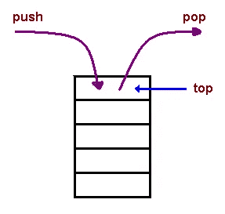
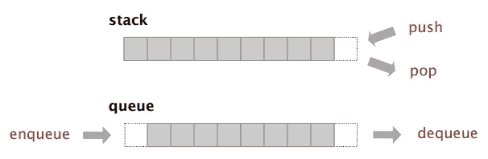

# Python 中两个堆栈队列的实现:数据结构

> 原文：<https://towardsdatascience.com/implementation-of-queue-from-two-stacks-in-python-data-structure-c35da025eaf6?source=collection_archive---------60----------------------->

## 了解堆栈和队列。然后使用两个堆栈实现一个队列。

栈和队列都是列表。但是他们有不同的更严格的规则。本文将讨论堆栈和队列。首先，将有一个堆栈实现，然后是一个带有堆栈的队列。

## 堆

堆栈是具有后进先出(LIFO)规则的列表。最后进去的元素先出来。



来源:作者

你可能会想这有什么用。编辑器中的撤销操作就是一个很好的例子。当我们“撤销”时，它会撤销上一次操作。编译器使用堆栈检查匹配的括号。以下是堆栈所需的功能:

1.  空列表的初始化。
2.  向列表中添加元素。
3.  从列表中弹出元素。
4.  检查列表是否为空。
5.  确定列表的顶部元素。
6.  拿到名单。

以上功能的 Python 实现:

```
class Stack():
    def __init__(self):
        self.elements = []def push(self, element):
        self.elements.append(element)def pop(self):
        return self.elements.pop()def is_empty(self):
        return self.elements == []def peek():
        if not self.elements.is_empty():
            return self.elements[-1]def get_elements(self):
        return self.elements
```

## 长队

队列也是一个列表或容器。它遵循先进先出(FIFO)规则。一个很好的例子是在杂货店排队。先排队的人有机会先付钱后离开。当一个新来的人想排队时，她/他必须排在队伍的后面。队列有两个操作。入队和出队。其中 enqueue 表示添加列表或容器中的元素。出列意味着从列表底部删除一个元素。

下图清楚地显示了堆栈和队列的区别:



我们可以使用两个堆栈来实现一个队列。

1.  将 stack1 中的元素排队。
2.  出列可能很棘手。因为 stack 从顶部移除了一个元素。但是 queue 从底部移除了一个元素。我们需要弹出 stack1 中的所有元素，并不断将它们添加到 stack2 中。因此，stack1 的底部元素将是 stack2 的顶部元素。现在，如果我们从 stack2 中弹出一个元素，我们就弹出了 stack1 的底部元素。这就是我们的出列操作。操作完成后，我们应该再次将元素放回 stack1 中。下面是代码的样子:

```
class Queue:
    def __init__(self):
        self.stack_1 = Stack()
        self.stack_2 = Stack()def enqueue(self, item):
        self.stack_1.push(item)def dequeue(self):
        if not self.stack_1.is_empty():
            while self.stack_1.size()> 0:
                self.stack_2.push(self.stack_1.pop())
            res = self.stack_2.pop()
            while self.stack_2.size()>0:
                self.stack_1.push(self.stack_2.pop())
            return res
```

我想分享这个，因为它是学习算法和数据结构的一个很好的练习材料。

下面是一篇关于使用排序算法解决一些问题的文章:

1.  [求两组坐标的交集，按颜色对桶进行排序。](/find-the-intersection-of-two-sets-of-coordinates-and-sort-by-colors-using-python-oop-7785f47a93b3)