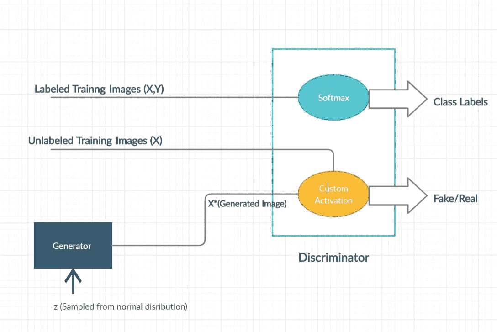
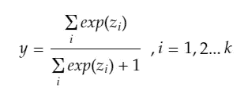
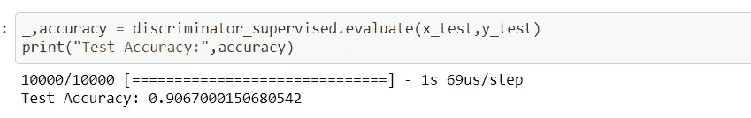
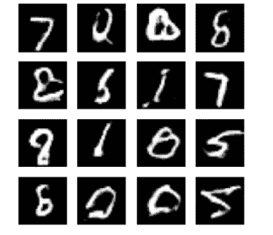

# 半监督生成对抗网络在 Keras 中的实现

> 原文：<https://towardsdatascience.com/implementation-of-semi-supervised-generative-adversarial-networks-in-keras-195a1b2c3ea6?source=collection_archive---------30----------------------->

## 使用半监督学习构建强大的分类器

穆罕默德·阿里扎德在 [Unsplash](https://unsplash.com?utm_source=medium&utm_medium=referral) 上的照片

每个人都听说过监督学习和非监督学习，但在它们之间还有另一套学习技术，称为半监督学习。

监督学习是机器学习中最常用的技术，但它有一个缺点，即它需要大量的标记数据。给数据贴标签需要花费大量的精力和时间。这就是半监督学习发挥作用的地方。

## 什么是半监督学习？

半监督学习是一种技术，我们只使用大量未标记数据中的一小部分标记数据来训练我们的模型。

这似乎是一个有趣的方法，而且标记数据的成本也大大降低了。

## 什么是生成性对抗网络？

**生成对抗网络**(GAN)是由 Ian Goodfellow 及其同事在 2014 年设计的一类生成模型。就生成模型而言，这是一个突破。

在甘的研究中，有两个神经网络试图击败对方(即一个网络的损失是另一个网络的收益)。这两个神经网络被称为生成器和鉴别器。

生成器模型试图生成图像(类似于训练数据)，鉴别器的工作是将图像分类为真实的(来自训练数据)或虚假的(来自生成器)。所以基本上鉴别器试图不被发生器愚弄，而发生器试图愚弄鉴别器，这就是为什么这被称为博弈论方法，因为发生器和鉴别器都在博弈中试图战胜对方。

## 如何使用 GAN 进行半监督学习？

下面是半监督 GAN 的模型

半监督甘，来源:图片由作者提供

让我们来了解一下模型
鉴别器通过三种类型的图像，即有标签的训练图像、无标签的训练图像和生成器生成的假图像。它的工作不仅是区分真实/虚假图像，而且将标记的训练图像分类到它们正确的类别中。

鉴频器有两种不同的输出:

1.  Softmax 激活，用于将标签数据分类到正确的类别，即这是受监督的鉴别器。
2.  自定义激活分类为真或假。我们将在实现中看到自定义激活。

这种方法的强大之处在于，鉴别器不仅要训练有标签的数据，还要训练大量无标签的数据，因为它还必须区分真实/伪造的图像，因此对于这项任务，鉴别器需要学习提取用于将图像分类为真实或伪造的特征。这种对抗性训练将有助于鉴别器更准确地对标记数据进行分类，因为它在学习对真实/伪造图像进行分类的同时，还会识别其他模式，而这通常不会在一小组标记数据上进行。

让我们来看看上述模型在 Keras
中的实现。我将使用的数据集是古老的 MNIST 数据集(每个人的最爱)

# 设置

首先导入所有必需的包

**z_dim** 是我们将传递给生成器的随机正态变量的维数。

# 资料组

我们需要准备如下两个数据集:

1.  监督鉴别器:数据集将是完整训练集的一个小子集。
2.  无监督鉴别器:数据集将是完整的训练集。

这里只需要解释**batch _ label()**函数

**batch_labeled()** 通过选择样本子集及其标签，为监督鉴别器准备数据集。我们将使用 100 个带标签的例子(即每类 10 个例子)来训练我们的分类器。

**batch_unlabeled()** 从数据集中随机抽取图像，图像数量等于给定的 batch_size。

# 发电机网络

发电机网络

使用 Keras 顺序 API 构建我们的生成器模型。这是一个基本的发电机模型，因为我们的任务并不复杂。

**密集的**层用于对我们的尺寸 **z_dim** 进行整形，其形状为 **(batch_size，100)** 到 **(batch_size，7，7，256)** ，这样我们就可以在其上应用 **Conv2DTranspose** 层来生成图像。

# 鉴别器网络

鉴别器网络

这是我们的鉴别器，它输入一个图像(假的或真的)，输出图像是真的还是假的，即“1”或“0”。

这里的输出一直是密集层的输出，没有任何激活，因此这些值也可以是负的。下一步就会明白为什么要这样做了。

## 监督鉴别器

监督鉴别器

**build _ discriminator _ supervised()**将我们在上述步骤中创建的鉴别器模型作为输入，并使用 **softmax** 激活将我们的输入图像分类为 10 个类别之一(针对 MNIST)。

## 无监督鉴别器

**build _ discriminator _ unsupervised()**接受我们之前创建的鉴别器的输入，并对鉴别器的输出应用一个 **custom_activation()** 。

当我们创建 discriminator 时，我们将它的输出保存为一个密集层的输出，该层在没有任何激活的情况下给出值。因此，自定义激活会执行以下操作

自定义激活功能

这里 **z** 是没有任何激活的密集层的输出， **k** 对于我们的情况是 10， **y** 在 0 和 1 之间。

由于图像真实或虚假的概率将是所有类别的概率之和，因此激活函数基本上是所有类别的和，并且在[0，1]之间缩放输出，以获得图像真实或虚假的概率。这个技巧比使用乙状结肠有效得多。

监督和非监督鉴别器使用的权重相同，只是两者使用的输出节点不同。

# 建筑甘

***build_gan()*** 基本上接受生成器和鉴别器的输入，并将它们合并形成一个模型。这样做是为了训练发电机网络。这将被称为**复合模型**。

注意，这里的鉴别器是无监督的鉴别器，因为 GAN 仅用于未标记的图像。

# 训练半监督 GAN

首先，让我们通过编译上面创建的所有模型函数来构建我们的模型。

定义模型

请注意，在构建 GAN ( **复合模型**)时，我们将**Discriminator _ unsupervised**保持为不可训练(第 7 行)，因为 GAN 的训练是在训练鉴别器然后训练生成器的步骤中完成的，所以在训练生成器时，我们不希望我们的鉴别器被更新。

使用的成本函数是用于无监督鉴别器的二元交叉熵和用于有监督鉴别器的分类交叉熵。

现在主要的训练循环

主训练循环

因此，我们通过在一批真实的标记图像上训练监督鉴别器来开始我们的训练，然后我们在真实的未标记图像(标记为“1”)和由生成器生成的假图像(标记为“0”)上训练无监督鉴别器，最后，我们使用我们之前定义的复合模型通过鉴别器来训练我们的生成器。

因此，发电机工作的培训方式如下:

1.  生成器生成一批假图像。
2.  这些生成的假图像通过鉴别器进行分类，鉴别器的目标标签为真，即“1”(第 31 行)。**注意:**鉴别器在此步骤中不会更新。
3.  因此，如果图像看起来不真实，损失会非常高，因此为了最小化损失，生成器将开始生成看起来真实的图像，这是我们的目标。

因此，随着生成器在更多图像上得到训练，它开始生成更好的图像，并且鉴别器也开始变得更好，因为它不希望在对假图像或真图像进行分类时其损失变高。因此，这就是为什么鉴别器和生成器都在相互竞争，如果一个变得更好，另一个也需要改进。

训练后，我们只需使用鉴别器并丢弃生成器，因为我们的主要目的是为 MNIST 构建一个分类器。

# 结果

来源:作者图片

因此，在测试集上获得的准确度约为 90.67 %，这是非常令人印象深刻的，因为我们刚刚使用了 100 幅标记图像(每类 10 幅)来训练我们的鉴别器。因此，这是一个强大的分类器，不需要大量的标记数据。当然，如果我们使用 1000 个标记图像，性能会提高更多，与现代数据集相比，这仍然很低。

由生成器生成的假图像，来源:作者提供的图像

所以，这些是由生成器生成的假图像，除了少数例外，都相当真实。
您还可以尝试在 100 张带标签的图像上训练没有 GAN 的相同鉴别器模型，看看它的表现如何。无疑会比用甘训练出来的鉴频器差。

这是与此实现相关联的 Github Repo

[https://github.com/KunalVaidya99/Semi-Supervised-GAN**T4**](https://github.com/KunalVaidya99/Semi-Supervised-GAN)

如果你想了解更多关于 GAN 的知识，你可以试着阅读这本书**Jakub Langr，Vladimir Bok 所著的《行动中的 GAN 与生成性对抗网络深度学习》。**

这是我第一篇关于 Medium 的文章，如果你喜欢，请告诉我。感谢阅读！。

# 参考

[https://arxiv.org/pdf/1606.01583.pdf](https://arxiv.org/pdf/1606.01583.pdf)