# 用 JavaScript 实现 2D 物理学

> 原文：<https://towardsdatascience.com/implementing-2d-physics-in-javascript-860a7b152785?source=collection_archive---------7----------------------->

## 让我们在实现真实的 2D 物理模拟和可视化的同时享受一下 JavaScript 的乐趣吧！

照片由[莫赫达姆·阿里](https://unsplash.com/@mohdali_31?utm_source=unsplash&utm_medium=referral&utm_content=creditCopyText)在 [Unsplash](https://unsplash.com/s/photos/energy?utm_source=unsplash&utm_medium=referral&utm_content=creditCopyText) 上拍摄

真实动画的物理和实现可能看起来非常复杂和困难，但事实并非如此。这些算法可以非常简单，并可以产生各种物理概念的现实模拟，包括速度，加速度或重力。

所以，让我们看看在用 JavaScript 实现 2D 物理模拟时，这些算法是如何工作的！

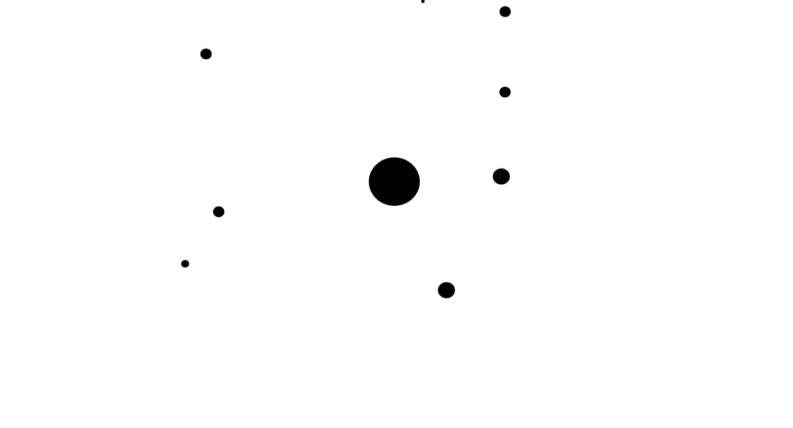

你可以看看这里的动画和例子:[https://martinheinz.github.io/physics-visual/](https://martinheinz.github.io/physics-visual/)

*TL；博士:源代码可以在我这里的知识库中找到:*[*https://github.com/MartinHeinz/physics-visual*](https://github.com/MartinHeinz/physics-visual)

# 匀速和加速运动

让我们从最基本的事情开始——移动东西。

如果我们只想匀速运动，那么我们可以使用这样的代码:

在上面的代码中，`x`和`y`是一个对象的坐标，例如椭圆，接下来的`vx`和`vy`分别是水平轴和垂直轴上的速度，`dt`(时间增量)是定时器的两个滴答之间的时间，在*的情况下，JavaScript* 是对`requestAnimationFrame`的两次调用。

举例来说，如果我们想要移动位于`(150, 50)`的对象并向西南方向移动，那么我们会有如下结果(单次滴答后的移动):

不过匀速运动很无聊，所以让我们加速物体的运动:

在这段代码中，我们添加了`ax`和`ay`，它们分别代表 *x* 和 *y* 轴上的加速度。我们用加速度来计算速度或速率的变化(`vx/vy`)，然后我们用它来像以前一样移动物体。现在，如果我们复制前面的例子，只在 x 轴*上增加加速度*(向西)，我们得到:

# 重力

既然我们可以移动物体，那么把物体向其他物体移动怎么样？嗯，那就叫*引力*。为了实现这一点，我们需要添加什么？

*只是为了让你知道我们想要达到的目的:*

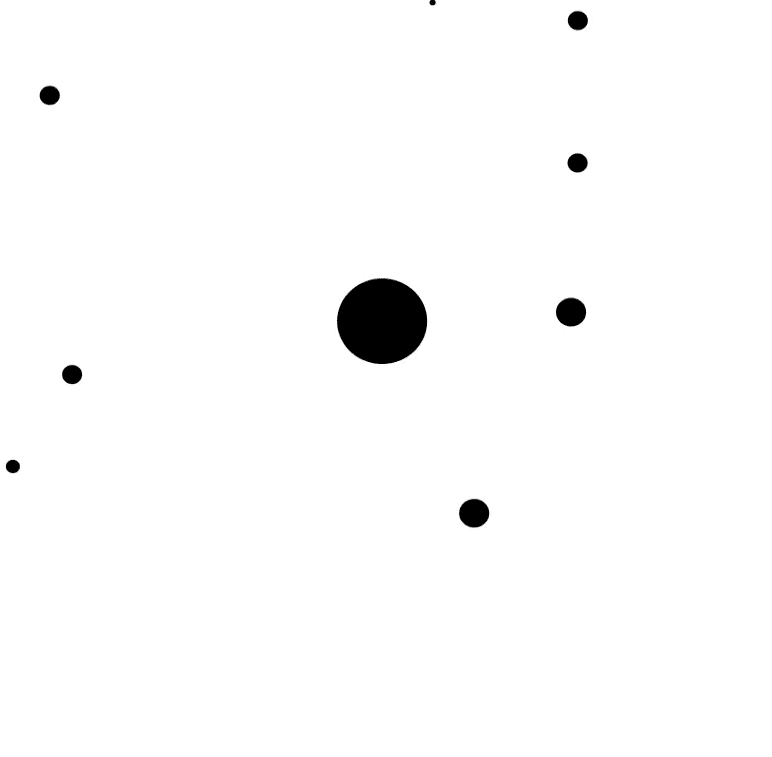

首先，让我们回忆一下高中时的几个等式:

*力的方程式*:

如果我们现在想把它扩展到两个物体相互作用的力，我们得到:

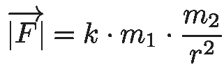

强制均衡器

这变得有点复杂了(至少对我来说)，所以让我们把它分解一下。在这个等式中`|F|`是力的大小，对于两个物体来说是一样的，只是方向相反。这些物体用它们的质量来表示- `m_1`和`m_2`。`k`这里有一个*引力常数*和`r`是这些物体重心的距离。如果还是没有太大意义，那么这里有一张图:

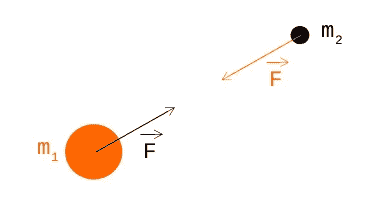

物体拉动

如果我们想创建一些可视化的东西，我们最终会有两个以上的对象，对吗？那么，当我们有更多的物体相互作用时会发生什么呢？

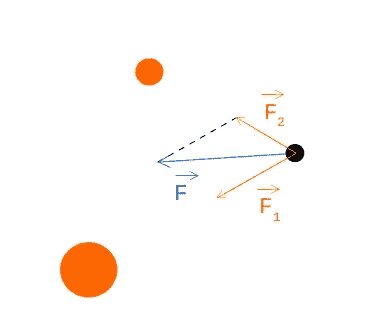

多物体力

看上面的图片，我们可以看到两个橙色物体用力`F_1`和`F_2`拉着一个黑色物体，但我们感兴趣的是最终力`F`，我们可以这样计算:

*   我们首先使用上面的等式计算力`F_1`和`F_2`

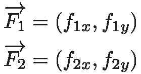

*   然后我们把它分解成向量:

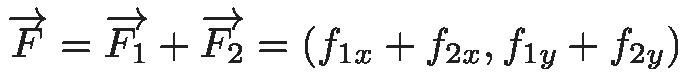

好了，我们有了所有需要的数学知识，现在代码看起来怎么样？我将省去所有的步骤，只给你看带注释的最终代码，如果你需要更多的信息，请随时联系我。🙂

# 碰撞

当物体运动时，它们也会在某一点发生碰撞。我们有两个解决碰撞的选项——将物体推出碰撞或弹开，让我们先看看*推动*的解决方案:

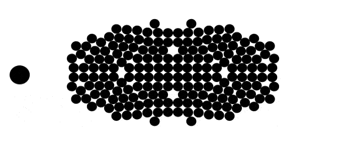

在我们能够解决碰撞之前，我们需要首先检查两个对象是否确实在碰撞:

我们首先声明代表两个碰撞物体的`Collision`类。在`checkCollision`功能中，我们首先计算物体距离的`x`和`y`分量，然后计算它们的实际距离`d`。如果它们的半径之和小于它们的距离`d`，那么它们一定会发生碰撞，所以我们返回新的`Collision`对象。

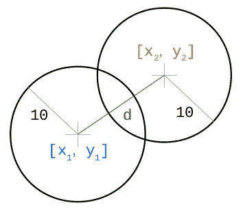

冲突

现在，为了解决它们的碰撞，我们需要知道位移的*方向*和*大小*:

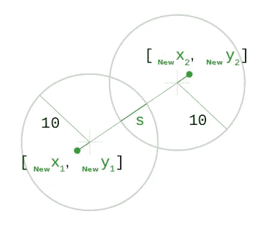

碰撞后的运动

因此，在 JavaScript 代码中应该是:

您可以在[https://martinheinz.github.io/physics-visual/](https://martinheinz.github.io/physics-visual/)查看这种碰撞解决的交互示例(点击*穿过物体*)

# 用力解决碰撞

这个难题的最后一块——通过反弹物体来解决碰撞。在这种情况下，最好省略所有的数学，因为这会使文章变得两倍长，所以我要告诉你的是，我们需要考虑*动量守恒定律*和*能量守恒定律*，这有助于我们建立和解决以下神奇的方程:

那么，这个神奇的`k`如何帮助我们呢？我们知道物体移动的方向(我们可以像之前用`n_x`和`n_y`一样使用*特征向量*来计算)，但是我们不知道移动了多少*，这就是*T3。所以，这就是我们如何计算矢量(`z`，它告诉我们将这些物体移动到哪里:

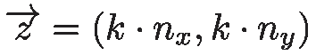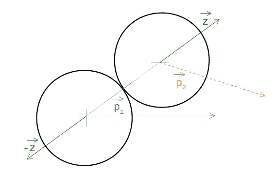

动力

现在是最后的代码:

# 结论

这篇文章包含了很多数学知识，但是大部分都很简单，所以我希望这能帮助你理解和熟悉这些物理概念。如果你想看更多的细节，那么你可以在我的库[这里](https://github.com/MartinHeinz/physics-visual)查看代码，在这里查看交互演示[。](https://martinheinz.github.io/physics-visual/)

*本文最初发布于*[*martinheinz . dev*](https://martinheinz.dev/blog/15)