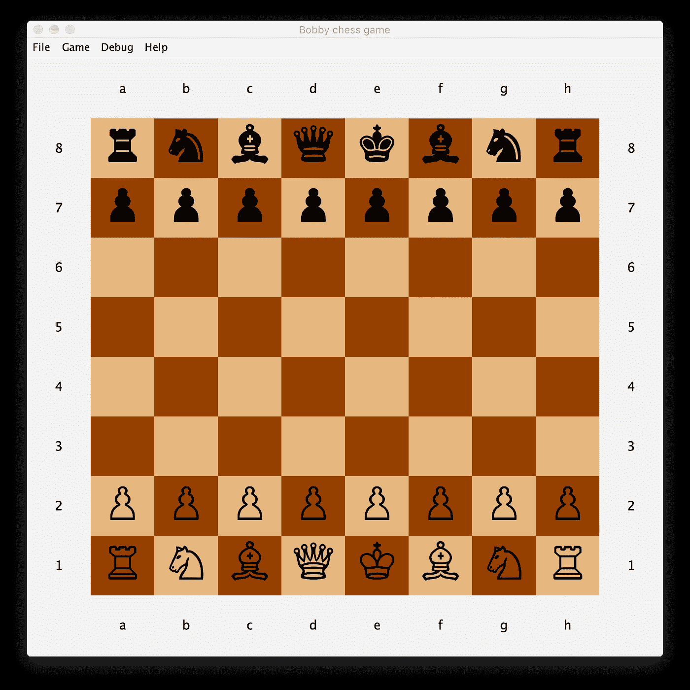
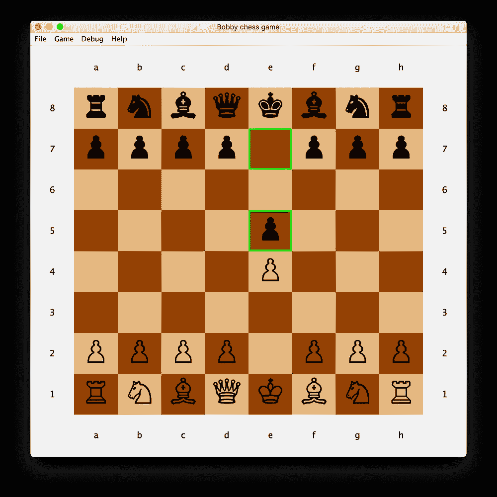
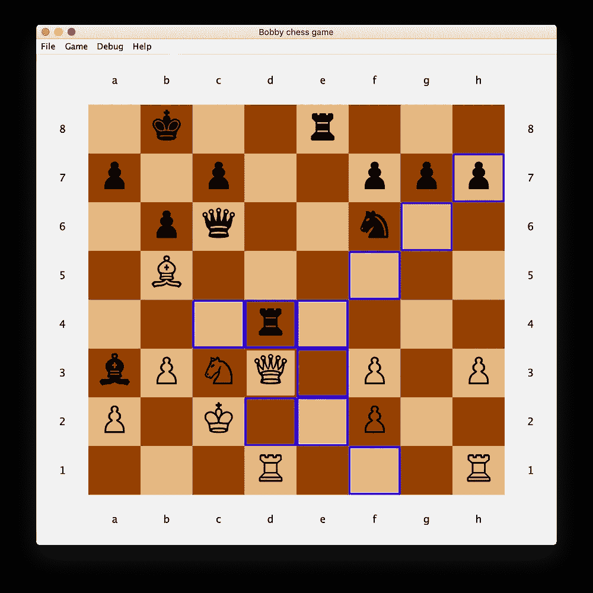
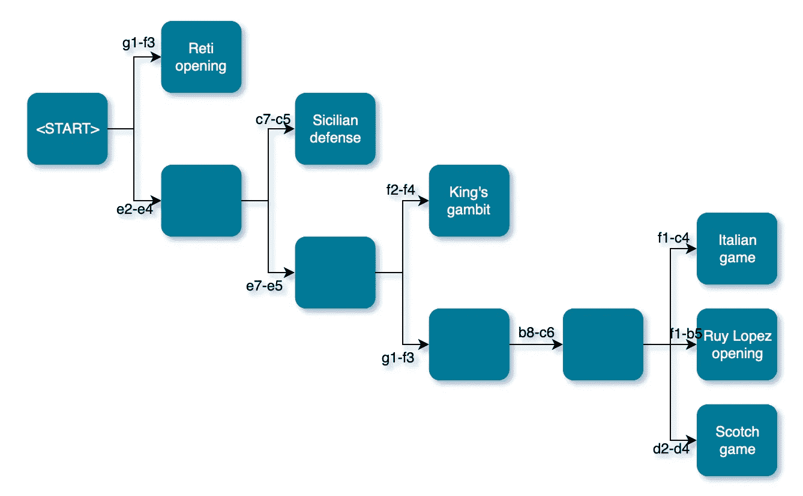
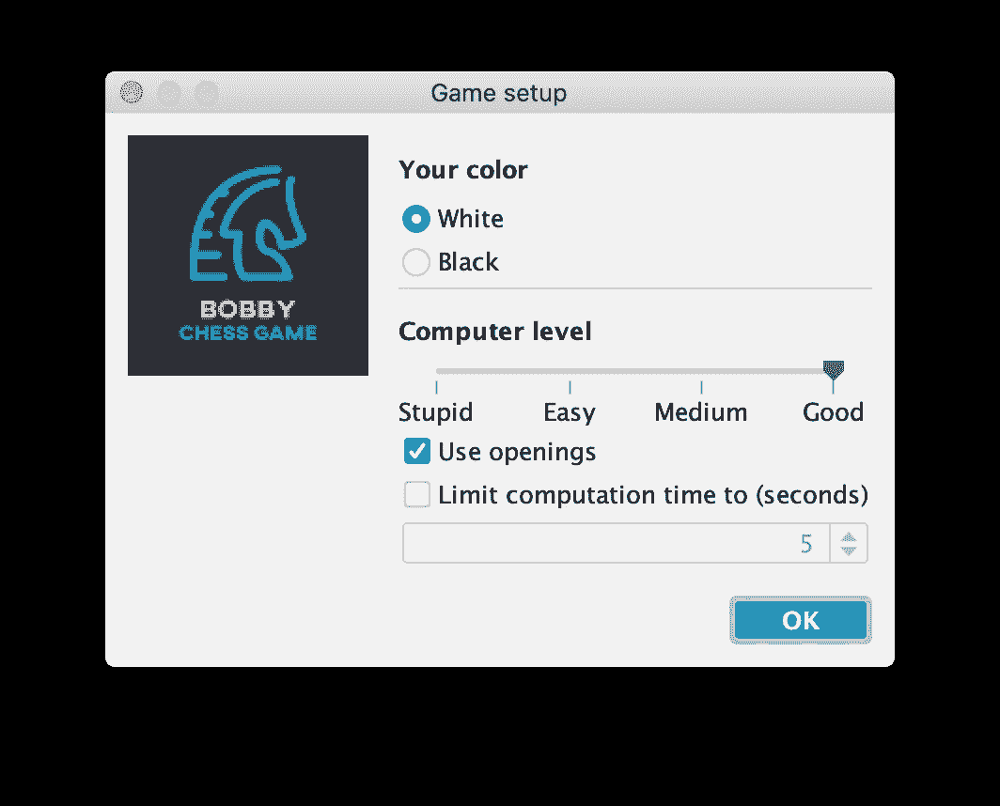

# 从头开始实现象棋引擎

> 原文：<https://towardsdatascience.com/implementing-a-chess-engine-from-scratch-be38cbdae91?source=collection_archive---------2----------------------->

## 教我的电脑和我一起玩

## 国际象棋是一种古老的双人战略棋类游戏。有大量的可能性，因为在每走 5 步之后，有 69，352，859，712，417 种可能的游戏。因此，几乎不可能预测每一步棋。


冰岛举办了 1972 年国际象棋世界锦标赛，Fischer vs spas sky——图片由 [Mike Swigunski](https://unsplash.com/@mike_swigunski?utm_source=medium&utm_medium=referral) 在 [Unsplash](https://unsplash.com?utm_source=medium&utm_medium=referral) 上拍摄

作为一名谦逊的国际象棋业余爱好者，我给自己提出了这样的挑战:**开发一个简单、好看、有人工智能、能打败我的国际象棋游戏，**没有机器学习。这篇文章是关于我实现它的旅程，由 4 部分组成:规则、计算、策略和游戏。

为了把事情弄清楚，我也决定不去阅读象棋引擎上的理论或算法解释，我想基于我的常识和个人经验，建立我自己的算法。

我给它取名为*鲍比*，以此向罗伯特“鲍比”詹姆斯菲舍尔致敬，他是国际象棋世界冠军，也是我年轻时的偶像之一。

# 1.规则

## 片

国际象棋是由两个对手玩的，每个对手一种颜色，白棋和黑棋。然后，每一面都有以下部分:

*   ♔——一个国王
*   ♕——一位女王
*   ♖——两辆车
*   ♗—两位主教
*   ♘——两位骑士
*   ♙——八枚棋子

## 初始位置

游戏开始时，初始位置总是一样的，严格定义的。其他棋子前面的一系列棋子，皇家夫妇在中间，然后对称地出现主教、骑士，最后是车。

棋盘是 8×8 格的正方形格子(即二维阵列)，明暗背景交替。现在是时候对该板进行可视化表示了。

## 直观显示

当我考虑画这些作品时，我首先开始考虑免费的图形资源。但是这将迫使我管理图片，这对于快速开发来说是不可取的。幸运的是，我发现[每个符号都是 Unicode](https://en.wikipedia.org/wiki/Chess_symbols_in_Unicode) 的一部分:一个基本的文本标签就足以画出一幅作品！太好了，我已经能够在控制台日志中打印出板子来可视化它了:

```
♜ ♞ ♝ ♛ ♚ ♝ ♞ ♜ 
♟ ♟ ♟ ♟ ♟ ♟ ♟ ♟ 

♙ ♙ ♙ ♙ ♙ ♙ ♙ ♙ 
♖ ♘ ♗ ♕ ♔ ♗ ♘ ♖
```

有趣，但没有我想象中的好看，所以我决定创建一个基本的 GUI:棋盘是一个单一的框架，具有网格布局，由 MVC 架构驱动。

我从暗背景和亮背景的定义开始，其中每个方块都是一个标签，包含一个空值或一块的 Unicode 符号。

如果你熟悉国际象棋，你可能知道棋盘网格有一个由字母(横轴，或*文件*)和数字(纵轴，*排名*)组成的坐标系统，用于游戏符号，即编写移动脚本。我最终将它们添加到我的板的侧面，这是结果，一个简单的 10x10 网格:



我的象棋游戏的基本图形用户界面

## 移动

我们继续。规则是什么？允许哪些操作？基本上有 4 种类型的移动，可以根据棋子组合:

1.  顺子(用于车、皇后和国王)
2.  对角线(主教、女王、国王)
3.  骑士
4.  棋子移动

注意，特殊招式*顺道*，卒*晋升*，以及*阉割*为了简单起见被故意忽略，但后来已经实现。关于招式的详尽描述可以在维基百科[上找到。](https://en.wikipedia.org/wiki/Chess#Movement)

实现移动的一些附加限制:一个棋子不能跳过另一个棋子，除了骑士，当一个棋子到达敌人的棋子时，它可以抓住它并在棋盘上占据它的位置。

我还设计了一个可选的彩色边框来突出移动:

*   红色-当前选定的部分
*   蓝色-所选棋子的可能目的地
*   绿色——对手的最后一步棋



方块周围的彩色边框可以更好地观察移动

## 规则

既然我们可以移动棋子，我们必须考虑游戏规则:有些事情*可以*做，有些事情*必须*做(通常是逃避检查)。

在这里解释每一个规则超出了范围，但是我尝试实现了大多数约束，其中包括:

*   玩家的回合；
*   检测一个王是否在*检查*中，当无法逃脱时，确定该王是*将死*(游戏失败)；
*   两个国王总是相隔一个广场；

## 游戏结束

现在游戏如何结束？有两种情况:要么一方赢，要么双方都不赢(平局)。

如前所述，当你的国王被牵制时，你就输了，而且没有可能逃脱被牵制。

但是你画如果:

*   没有可能的举动但你的国王不在检查(*相持*)；或者
*   两位玩家连续重复 3 个相同的动作；或者
*   两个国王都单独在棋盘上(或者没有足够的材料获胜)

我还实现了另一个规则来避免永无止境的游戏:如果在最后 50 步内既没有棋子移动，也没有俘获，那么这个游戏就是平局。请注意，这条规则在很大程度上被国际象棋界所接受。

有了上面的规则，两个人类可以玩一局，但是我们要和电脑对战，那就说核心吧。

# 2.计算

## 愚蠢的人工智能

可能的最低智能是什么？选择一个没有任何策略的允许移动。这是我作为机器人实现的第一级“智能”:计算所有可能的移动，并随机选择其中一个。好吧，那很有趣，但是现在让我们严肃点。

## 评估形势

人类如何决定该走哪一步？他/她选择能带来优势的行动，这可以转化为形势的改善。因此，我们需要一个函数来评估当前位置，尝试移动，然后重新评估。

基本上，根据游戏规则，当一步棋导致将死，那么停止搜索，因为这是最好的一步棋。另一方面，如果移动导致平局，我实施了一个惩罚分数，因为我想让 AI 尽可能具有侵略性。

那么，如何计算分数呢？一般来说，对于初学者来说，最简单的策略是捕捉片段。实现是给每种类型的棋子打分，所以你可以通过将你所有棋子的分数相加来计算你当前的分数，对对手的棋子也是如此。然后，通过比较两个分数，就可以很容易地估计出你在多大程度上(或不在多大程度上)超过了你的对手。

块的任意值

## 天真的评价

但不需要成为国际象棋大师就能明白事情没这么简单。在你移动之后，将轮到你的对手。假设你用你的皇后俘获了一个棋子，然后你的对手俘获了你的皇后，你失去了最重要的棋子，所以最后，这是一个可怕的举动。

为了避免这种情况，移动选择函数必须是递归的，以便在尝试移动后，该函数会被再次调用，但对对手来说:这个想法是猜测答案 s *应该是什么*。并评估由此产生的情况。

由于这是一个递归函数，这可以应用几次，让我们尝试想象在 2，3 或更多的回合中可能出现的情况。但这里的成本是指数级的，因为我们计算了所有可能的移动，在实践中，我不得不将它限制在 3 个移动的深度，否则它会花太多时间来玩。

*注:*我稍后会了解到，这种计算是[极小极大](https://www.chessprogramming.org/Minimax)算法家族的一部分——考虑到对手的反应，尽量使你的最小收益最大化。

除此之外，预测 1、2 或 3 步棋允许 AI:

*   玩一个赢得游戏的移动导致立即将死(深度 1)
*   在(深度为 2)之后立即下一步防止损失的棋

这正是我用来测试的:设置一个游戏，可以在 1 或 2 步内导致将死，并让它分别找到获胜和避免失败的最佳步骤。

上面的逻辑在很多情况下都很有效，但是通过将死对手的王来最终获胜是没有效率的。评估功能需要一些额外的智能。

# 3.战略

我经常问自己，当我开始玩游戏时，我得到了什么提示，也就是说，什么使一步棋变好或变坏。

## 控制中心

看似简单，但取胜的关键之一是控制棋盘的中心。把你的棋子放在中间，或者至少让它们覆盖中间，有助于发展军队，进攻和防守。

我用热图的概念实现了这一点:

*   4 个最居中的方块各值 2 分；
*   他们周围的 12 个方块值 1 个点；
*   所有剩余的方块值 0 点。

然后，一个人必须计算每一个棋子的移动，并根据他们可以到达的位置，将上面所有的点加起来，得到最后的分数。


控制电路板中心的热图

## 汇聚到将死

我注意到我的 AI 在游戏的开始和中间都能玩得很好，但在结束游戏时却面临困难，因为它没有启发性地去玩那些导致攻击对手国王的移动。

我决定重新使用上面的想法来解决这个问题，也就是说，定义一个专注于对手王的热图:

*   打王的时候 3 pts，因为有王在牵制非常好；
*   王身边 2 pts，因为你阻止他逃跑；
*   国王区周围 1 pt，因为最终导致限制他的移动；
*   其余所有方块为 0。


以国王为中心的热图，其中国王将位于广场 g1 上(通常在王车易位后)

## 空缺

像在很多游戏或者运动中，有一个理论部分是一定不能忽视的。基于上述启发的策略是好的，但可能不足以有一个好的开始，而象棋中不完美的开始可能会很快导致失败。为了避免早期的糟糕举动，玩家用心学习开局，这就是我实现的。当然，有很多库有大量的空缺，但是因为我的目标是让一个人工智能可以和我相比，我选择只让它知道 15 个主要的空缺，每个空缺有 2-3 步。

我使用了一个树形结构来对开口进行分类:一个移动导致一个节点，一片叶子是给定开口的最后一个已知移动。



开口树的摘录

当人工智能必须从给定的节点中选择一条路径时，它会随机选择一条。我后来注意到这种随机选择是多么明显，因为它在每个游戏中引入了变量，避免了无聊的可预测路径。当树不知道刚刚下的棋时，人工智能会退回到默认的计算。

## 发展奖励和惩罚

给新手一些提示，避免早期游戏出现大的错误。例如，强烈推荐[阉割](https://en.wikipedia.org/wiki/Chess#Castling)(一种同时移动国王和车的特殊移动)，因为它在保护国王的同时激活靠近中心的车。因此，我根据游戏历史实施奖励和惩罚。

在以下情况下给予奖金:

*   阉割完成了

在下列情况下给予处罚:

*   国王在阉割之前已经移动了，因为阉割的权利已经丧失
*   国王、王后或车(阉割除外)在开局时移动(前 5 步)
*   同一个棋子(卒除外)在开局时被移动了不止一次

# 4.(演奏等的)表现，风格；(乐曲)演奏

## 测试游戏

虽然我在开发阶段玩了很多次，但我最终决定创建一个简短的锦标赛，反对机器人和它们的创造者:

*   一个愚蠢的机器人，随机播放
*   机器人分别计算深度为 1、2 和 3 的移动
*   另一个机器人计算移动深度为 3，但也经历了一些开放
*   我，一个业余棋手

所有的参与者都是面对面的，每场比赛都是白棋两次，黑棋两次。这是最后的记分牌:

不确定比开发出来的人工智能更强是好是坏，但可以肯定的是，我赢了大部分与人工智能的比赛。然而，我对三个最好的机器人都丢了一分，可能是因为注意力不集中和/或玩得太快，这仍然是一种满足感，因为它证明了人工智能可以打败我。

不出所料，计算水平最高的机器人是亚军，随机的最后完成。一个有趣的事实是，后者能够通过与更强的机器人打平来获得 0.5 分。至于两个等级为 3 的机器人，他们几乎击败了所有其他机器人，他们的对决以 2 比 2 的比分结束，这也很符合逻辑。最后，人们不能说掌握理论上的开口会带来显著的优势，至少不会对其他采用相同策略的机器人产生影响，但我相信当面对人类时，它确实会产生影响。

## 试一试

现在你知道我是如何建立自己的象棋智能的，你可能希望尝试一下。当然，代码是公开的，可以在我的 [GitHub 库](https://github.com/teemoo7/bobby)中找到。

在你的电脑上本地运行它会给你最好的体验，但也提供了一个[网页版](https://www.bobby-chess.com/bobby/)，尽管有一些限制:一次只有一个会话(即一个玩家)，因为资源有限，移动棋子时会有一些图形延迟。但是它是免费的，在线的:

[](https://www.bobby-chess.com/bobby/) [## 博比象棋游戏

### 这个基本的国际象棋游戏是一个谦虚的敬意，著名的国际象棋选手罗伯特詹姆斯'鲍比'菲舍尔，世界国际象棋冠军。它…

www.bobby-chess.com](https://www.bobby-chess.com/bobby/) 

*注:*如果你有兴趣阅读我是如何通过一个网站展示一个 Java Swing 桌面应用的，我写了另一篇文章专门讨论这个技术方面:

[](https://codeburst.io/enhancing-a-java-swing-app-to-a-clean-elegant-web-app-without-changing-the-code-a69d7c1c2781) [## 在不改变代码的情况下，将 Java Swing 应用程序增强为一个干净、优雅的 Web 应用程序

### 据说 Java Swing 是一种设计桌面应用的过时技术。然而，有一些简单的方法可以改变…

codeburst.io](https://codeburst.io/enhancing-a-java-swing-app-to-a-clean-elegant-web-app-without-changing-the-code-a69d7c1c2781) 

# 结论

## 人工智能的局限性和优势

我意识到我的象棋引擎还有改进的空间，离最好的计算机引擎还差得很远。但是正如我在介绍中所说的，我想用我自己的见解对它进行编程。这就是为什么我拒绝使用理论材料来加强它，但是如果你有兴趣阅读这个主题，我推荐你看一看[国际象棋编程](https://www.chessprogramming.org)。

此外，我完全相信，对于这种游戏来说，没有什么比机器学习更好的了，或者也许是机器学习和传统计算引擎的微妙结合。AlphaGo 是第一个击败围棋世界冠军的基于 ML 的引擎。然后在 2017 年[推出了 AlphaZero](https://deepmind.com/blog/article/alphazero-shedding-new-light-grand-games-chess-shogi-and-go) ，并在很大程度上击败了最好的传统象棋引擎，即 StockFish。

但是当我父亲好心地测试我的象棋引擎时，他说了一句有趣的话:

> 最先进的象棋引擎很无聊。

这尤其正确，原因有二:首先，他们系统地击败了我们这些业余玩家。第二，他们中的一些人可能总是在给定的情况下采取相同的行动，所以他们实际上是可以预测的。



即使在最高的计算水平上，Bobby 也可能被业余玩家打败

博比引擎试图逃避这一点，由于在开放的随机性，以及当计算等效移动。

根据三步棋深度的合理限制，一个业余棋手在想象陷阱时有一点创造力就有机会获胜。

我的引擎的一个弱点是它在游戏开始时的糟糕开发，就在开场后:它试图尽快攻击，就像一个新手，如果对手用正确的防守进行抵抗，这可能会很快变成对 AI 的一个强大的劣势，因为这种贪婪行为的结果是一个重要的棋子可能会被提前捕获。

## 最终考虑

我最初的挑战是建立我自己的国际象棋游戏，有一个漂亮的用户界面和击败我的能力，我认为公平地说这个目标已经实现了。

我对最终的结果很满意，尽管我相信未来还有很多地方需要改进。我特别感兴趣的是开发一个深度学习的人工智能，并让他们一决雌雄。

# 资源

*   [GitHub 上的 Bobby](https://github.com/teemoo7/bobby)—代码库
*   [https://www.bobby-chess.com/bobby/](https://www.bobby-chess.com/bobby/)—在我的象棋引擎上玩在线游戏
*   [在不改变代码的情况下，将一个 Java Swing 应用程序增强为一个干净、优雅的 Web 应用程序](https://codeburst.io/enhancing-a-java-swing-app-to-a-clean-elegant-web-app-without-changing-the-code-a69d7c1c2781)——我的象棋引擎技术方面的另一篇文章
*   [国际象棋编程维基](https://www.chessprogramming.org) —为国际象棋引擎解释理论和算法
*   [alpha zero](https://deepmind.com/blog/article/alphazero-shedding-new-light-grand-games-chess-shogi-and-go)——一个机器学习象棋引擎
*   [Unicode 中的国际象棋符号](https://en.wikipedia.org/wiki/Chess_symbols_in_Unicode) —国际象棋棋子的字符
*   [象棋/运动](https://en.wikipedia.org/wiki/Chess#Movement) —维基百科关于象棋的页面