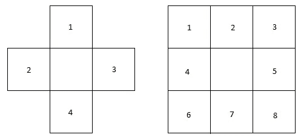
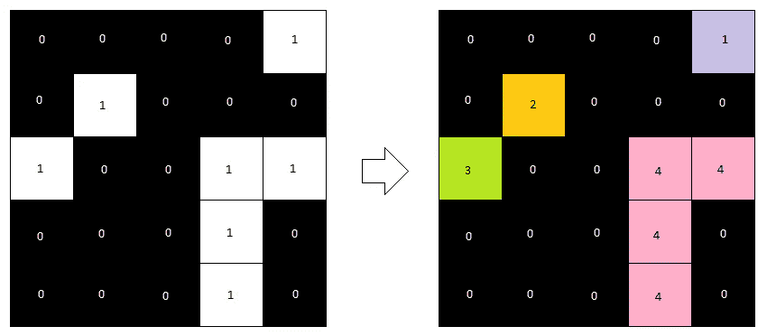
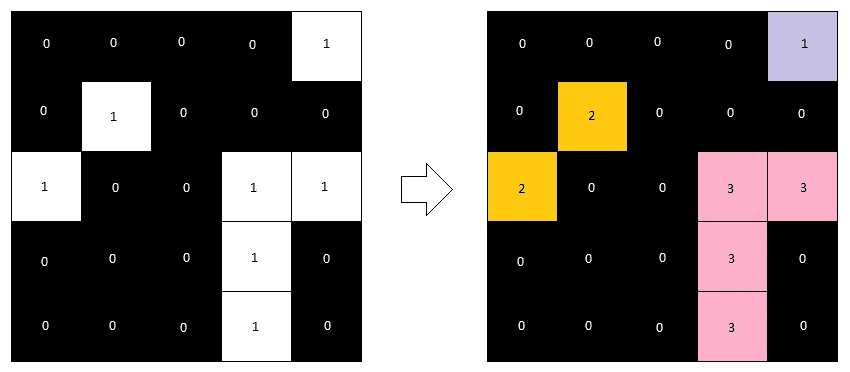
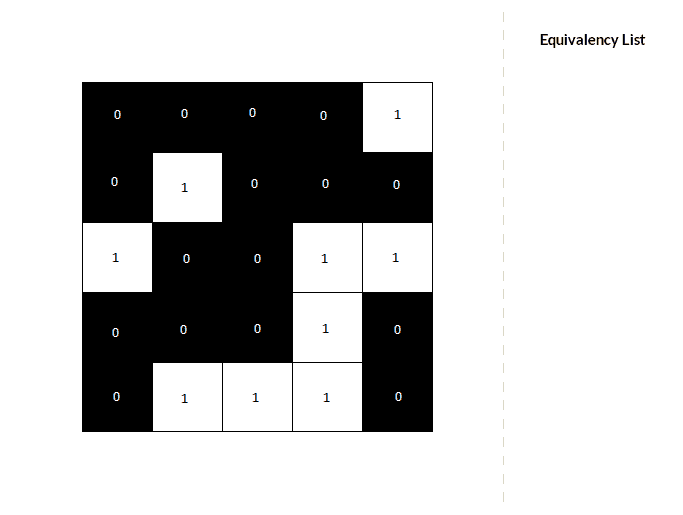
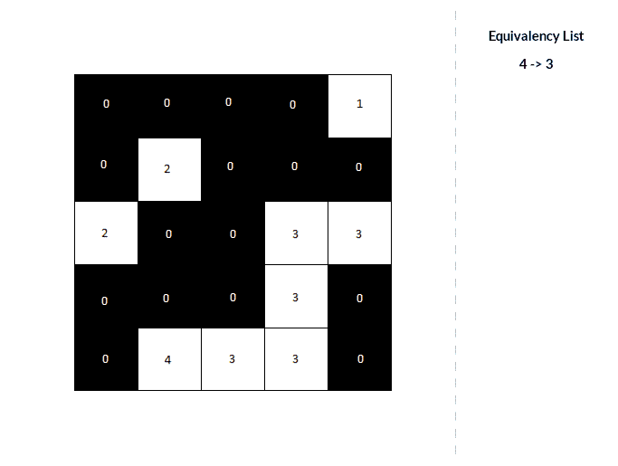

# 从头开始实现连通分量标记算法

> 原文：<https://towardsdatascience.com/implementing-a-connected-component-labeling-algorithm-from-scratch-94e1636554f?source=collection_archive---------9----------------------->

## 我将向你展示如何在 MATLAB 中实现这个算法


Guillaume Bourdages 在 [Unsplash](https://unsplash.com?utm_source=medium&utm_medium=referral) 拍摄的照片

**目录**

*   什么是连通分量标记？
*   一个例子的可视化
*   MATLAB 中的代码

# 什么是连通分量标记？

这是一种计算机视觉算法，用于检测和计数二进制图像中相连区域的数量，也称为斑点。通常，这是在分割算法之后完成的。得到的分割(二进制)掩模然后通过连通分量标记算法运行，以计算不同区域的数量。

## **目标**

该算法的输入是二值图像。目标是用相同的唯一标签标记每个连接的组件(或 blob)。因为每个斑点都会被标记，所以我们可以推断出单个斑点的总数。需要注意的是，输出会因您使用的表示/连接而有所不同。

## **不同的连接性**

有两种常见的方法来定义组件是否连接。一种是说一个像素只有 4 个邻居(有时称为 4-连通性)。另一种是说明一个像素有 8 个邻居。参见图 1。



图一。左图:4 邻居表示法。右图:8 邻居表示法。

## **样品**

让我们看一个这个算法做什么的例子。注意两种表示之间的不同结果(图 2 和图 3)。



图二。假设采用**4-连通性**表示的算法结果。在这种情况下,“2”不是“3”的邻居。



图 3。假设一个**8-连通性**表示的算法的结果。“2”是邻居。

## **算法是如何工作的？**

该算法包括两次通过图像中的每个像素。

**第一遍:**

对于每个非零像素，我们检查它的邻居。

*   如果它没有非零邻居——我们知道它是一个新组件——那么我们给它一个新标签。
*   如果它有一个非零邻居——这些像素是相连的——我们给它与邻居相同的标签。
*   如果它有不止一个非零邻居，有两种情况:

1.  邻居都有相同的标签。所以我们给当前像素同样的标签。
2.  邻居有不同的标签。这是棘手的部分。我们知道所有这些像素现在都是相连的，所以标签应该都是一样的。我们如下解决这个问题。首先，我们将当前像素设置为邻居的最低标签。然后我们记下所有相连标签的等价性，也就是说，哪些不同的标签实际上应该是相同的。我们将在第二遍中解决这些问题！

每个非零像素现在将有一个标签。然而，一些连接的区域将具有不同的标签。所以我们需要再次检查图像来纠正这一点。我们通过使用等价类的记录来做到这一点:所有等价的标签(即，指代相同的斑点)将获得相同的标签。

**第二遍:**

对于每个带标签的像素:

*   检查此标签是否有等价标签，并解决它们。有几种方法可以解决这个问题。关于我的实现，请参见 MATLAB 部分。

# 逐步可视化

让我们来看一个算法做什么的详细例子。这个例子使用了一个**8-连通性**表示法。

**第一关。**注意，图像在边框周围有一个填充。这只是为了使计算变得简单一点。通过填充，您在每个像素处考虑的窗口可以保持一致的大小。正如你所看到的，在每个像素上，它只考虑它左边的像素，以及它上面的三个像素。它不考虑所有的 8 个邻居，因为这样你就不必在整个过程中多次比较相同的像素对。



**算法的第一遍**。由 [Dokyoung Kim](http://www.dokyoungkim.com) 为本博客制作

**第二遍。**填充被移除，因为我们在这里不需要它。它检查每个像素，检查等价列表，并在必要时更新标签。



**算法的第二遍**。由 [Dokyoung Kim](http://www.dokyoungkim.com) 为本博客制作

# MATLAB 中的代码

以下代码是该算法在 MATLAB 中使用 8-连通性表示的实现。通过仅考虑其左侧和上方的像素，可以容易地将其改变为 4-连通性表示。

MATLAB 中的代码。

我将解释每一部分。

第 1 部分:我们读取二进制图像，并给它一个零填充(大小=1)。

第 2 部分:这是算法的第一遍。它循环遍历每个像素并给它一个标签；它还记录等同物。这些等价关系记录在一个散列表中，这样可以快速方便地查找标签。

第 3 部分:散列表需要一些重组，所以第二遍会更容易。散列表产生如下结果:

```
5 -> 6 - 7
6 -> 8
```

我们重组了散列表，这样它会产生如下结果:

```
8 -> 5
7 -> 5
6 -> 5
```

第 4 部分:我们可以删除我们的填充，因为我们不再需要它。

第 5 部分:现在我们可以做第二遍。我们检查每个非零像素。如果它是散列表中的一个键，我们只需查看**值**就可以知道它应该是哪个标签。

现在我们完成了，我们返回斑点的数量和带标签的图像。

**备注:**

*   填充图像的 MATLAB 代码可以在[这里](https://gist.github.com/Saafke/9a07fa30743c280ffd930c4e759e3c61)找到。运行示例(GIF)的脚本可以在[这里](https://gist.github.com/Saafke/c88852cc9bbb8efb8f77ae89ce457a30)找到。
*   Matlab 还有一个[内置的](https://uk.mathworks.com/help/images/ref/bwlabel.html)函数来做连通分量标注。