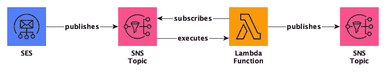

# 为云实施非接触式按需触发

> 原文：<https://towardsdatascience.com/implementing-a-contactless-on-demand-trigger-for-the-cloud-656bcb6495eb?source=collection_archive---------75----------------------->

照片由[lÿv·贾恩](https://unsplash.com/@lyvjaan?utm_source=medium&utm_medium=referral)在 [Unsplash](https://unsplash.com?utm_source=medium&utm_medium=referral) 拍摄

## 使用电子邮件让人们远离你的基础设施

在这篇博文中，我将向您展示 AWS 上按需触发器的一种可能实现。为了让你能够修补架构，我在 GitHub 上公布了代码来重现例子[。我还在整篇文章中包含了代码片段，以帮助您了解实现细节。](https://github.com/timo-boehm/email-trigger-for-aws)

> **注意:**这种方法并不是蓝图，更不是最佳实践架构。相反，它旨在提供一些关于云的可能性以及实际实现情况的见解。建造它也很有趣。

即将到来的模式涵盖了两个主要的功能需求:

1.  我们的**客户** **希望在他们认为有必要时触发计算**。然而，他们拒绝等待人工支持，既不是联系人的形式，也不是售票系统。另一方面，我们绝对无意让他们直接访问我们宝贵的云。因此，我们需要实现一种允许自动触发而无需访问实际基础设施的机制。
2.  此外，**我们希望每次客户触发计算时都能得到通知**。根据经验，当人们使用我们的产品时，问题往往会出现，如果有必要，我们希望做好灭火的准备。

在这篇博文中，我展示了一个使用电子邮件端点来满足这两种需求的解决方案。客户可以向 AWS 管理的地址写一条消息，然后触发计算。让我给你看看细节。

> **注意:**在 AWS 中验证一个域超出了本文的范围，但是需要使用 AWS 电子邮件服务。有关如何操作的信息，请参见此处的[和此处的](https://docs.aws.amazon.com/ses/latest/DeveloperGuide/receiving-email-getting-started.html)和。

# 整体架构

为了满足需求，我们需要实现三个功能:

1.  我们需要实现一个接收邮件的**电子邮件地址**。
2.  我们需要一个**协调机制**，它对收到的邮件做出反应，并触发所需的计算。我们使用相同的机制来满足监控需求。
3.  我们需要一个实际的**计算**发生的地方。

这些功能都转化为 AWS 生态系统中的一项服务:

*   **简单电子邮件服务(SES)** 接收并转发来自外部的邮件。为此，我们需要实现一个合适的**规则**。
*   **简单通知服务(SNS)主题**接受转发的邮件并继续传递。由于 SNS 向所有订阅者推送消息，我们不需要实现轮询机制。
*   **Lambda 的无服务器函数**处理我们想要用我们的架构触发的任何事情。

以下是这种简单架构的图形概述:

接收端和处理逻辑通过 SNS 主题连接。SNS 主题通过发布/订阅模式工作。即 SES 将收到的邮件发布到 SNS 主题；Lambda 函数通过订阅自动接收它们。

在这篇博文中，我展示了在 **Terraform** 中的实现，但是你也可以通过 web 接口或者 CloudFormation 来实现这个架构。如果您以前没有使用 Terraform 的经验，请查看[他们的介绍材料，](https://learn.hashicorp.com/terraform)或者忽略细节。请注意，当您使用 web 界面时，AWS 会在后台配置一些细节。这很方便，但是一旦需要调试基础设施，可能会有问题。

# 实施细节

在开始定义资源之前，我们需要向 Terraform 提供提供者的详细信息。也就是说，我们需要定义一个*轮廓*和一个*区域*。在撰写本文时，只有三个地区允许通过 SES 接收电子邮件。

我还为这个脚本定义了两个局部变量: *common_tags* 和 *open_email* 。 *open_email* 是稍后可用于触发计算的那个。这些主要是为了方便和清晰。

让我们深入研究我们架构的三个服务。

## 简单电子邮件服务

让 SES 工作的两个必要组件是一个**规则集**和一个**规则**。请将规则集视为系统使用的所有规则的总称。作为旁注，确保规则集是活动的。根据您的设置，可能已经有了默认的规则集。Terraform 有两个不同的资源，所以请确保使用正确的资源，即名称中带有*活动*的资源。

**规则**定义接收电子邮件地址、它所属的规则集以及它触发的操作类型。在我们的例子中，我们使用一个 **SNS 动作**，它将邮件转发给一个 **SNS 主题**。

还有 Lambda 操作，我们可以用它来创建一个直接链接，而不需要使用 SNS。然而，这些动作[不接收消息体，只接收消息头](https://docs.aws.amazon.com/ses/latest/DeveloperGuide/receiving-email-action-lambda-event.html)。如果你需要身体，或者如果你预计在某个时候你需要它，SNS 行动是正确的选择。

正如您可以从*位置*参数中推断出的，在一个规则中应用几个不同的动作是可能的。

## 简单通知服务(SNS)

我们的设计使用两个 **SNS 主题**。SES 使用第一个来发布收到的电子邮件。第二个通知产品团队谁触发了新的计算。创建它们的唯一必要参数是主题的名称:

SNS 在设计上是非常轻量级的。也就是说，配置工作主要发生在发布或订阅其主题的服务上。

> **注意**:您不能使用 Terraform 订阅 SNS 主题的电子邮件地址，因为它们必须经过验证([详情](https://www.terraform.io/docs/providers/aws/r/sns_topic_subscription.html))。

## 希腊字母的第 11 个

对于我们的目的，单个**λ函数**就足够了。无服务器功能在计算能力方面有限制，所以您可以考虑切换到其他选项。但是，使用它们作为工作流的入口点通常是一种好的做法。考虑到这一点，让我们来看看启动和运行该功能的不同部分。

我们以 ZIP 文件的形式为该功能提供了**代码**。幸运的是，Terraform 有一个*数据*类型来涵盖这一点。我们所要做的就是定义源文件和目标文件。我在 GitHub repo 中提供了一个基本函数。

该功能还需要一个**角色**和一个**附属策略**才能工作。在这个例子中，我们希望它向 **CloudWatch** 写入日志，并向一个 **SNS 主题**发布信息，以通知产品团队。正如您在代码中看到的，将策略附加到角色是一个单独的资源。该策略需要涵盖 Lambda 函数完成工作所需的一切。例如，如果您想将信息写入 S3 存储桶，您需要扩展策略。

函数资源的**规范**看起来相当吓人。让我依次向您介绍每个参数:

*   **文件名**指向包含代码的 ZIP 文件。
*   Terraform 比较**源代码散列**来检测代码库的变化。幸运的是，*数据*资源自动提供了这个散列。
*   **处理程序**是 Lambda 函数在被触发时执行的代码中的函数名。[这里的](https://docs.aws.amazon.com/lambda/latest/dg/python-handler.html)是关于 Python 的信息，但是文档也涵盖了 Node.js、Ruby、Java 等等。
*   角色是我们上面定义的执行角色。
*   **运行时**告诉 AWS 你的代码想要使用哪种编程语言和版本*标识符*所有可用的运行时都在官方文档中列出[。](https://docs.aws.amazon.com/lambda/latest/dg/lambda-runtimes.html)
*   **环境变量**为你的函数代码提供额外的信息。在我们的示例中，我们使用这样一个变量来传递 SNS 主题的 ARN 进行监控。

所有这些参数的组合如下所示:

剩下的就是触发 SNS 主题和 Lambda 函数之间的连接。要建立这个链接，我们需要实现两个资源:**SNS 执行 Lambda 的权限**和对 SNS 主题的 Lambda 函数的一个**订阅**。权限是允许 Lambda 订阅 SNS 主题的先决条件。请将许可视为一种特殊类型的策略。

**权限**是一个独特的资源，在 Terraform 中是这样的:

另一方面，**订阅**是一个通用资源，我们定义它应用于 Lambda。也就是说，我们将 Lambda 函数配置为其*端点* ，并相应地调整*协议*:

这些资源涵盖了整个架构。你可以从这里克隆必要的代码[。如果你已经在 AWS 注册了一个域名，启动一切需要几秒钟。现在，您可以通过向指定地址发送电子邮件来开始触发流程。确保事后拆除所有东西以避免成本。](https://github.com/timo-boehm/email-trigger-for-aws)

如果您正在寻找如何在 AWS 上实现架构的其他示例，您可能会对我以前关于无服务器 Fargate 架构的博客文章感兴趣:

*   全面了解[提议的架构及其动机](https://blog.codecentric.de/en/2020/06/cost-effective-batch-jobs-on-aws-serverless-infrastructure/)。
*   详细看看它的[联网方面](/network-configurations-for-fargate-tasks-6333314c4001)。
*   详细了解 [IAM 角色和涉及的策略](http://how-to-configure-iam-roles-for-fargate-tasks-on-aws-76ad54f11314)。
*   详细看看[实现的服务](/how-to-implement-a-serverless-batch-job-architecture-on-aws-b3358cd33428)。

请在评论中告诉我你的想法和经历。我也很乐意在 [Twitter](https://twitter.com/timo_data) 和 [LinkedIn](https://www.linkedin.com/in/timo-boehm-datascience/) 上联系。感谢您的阅读！