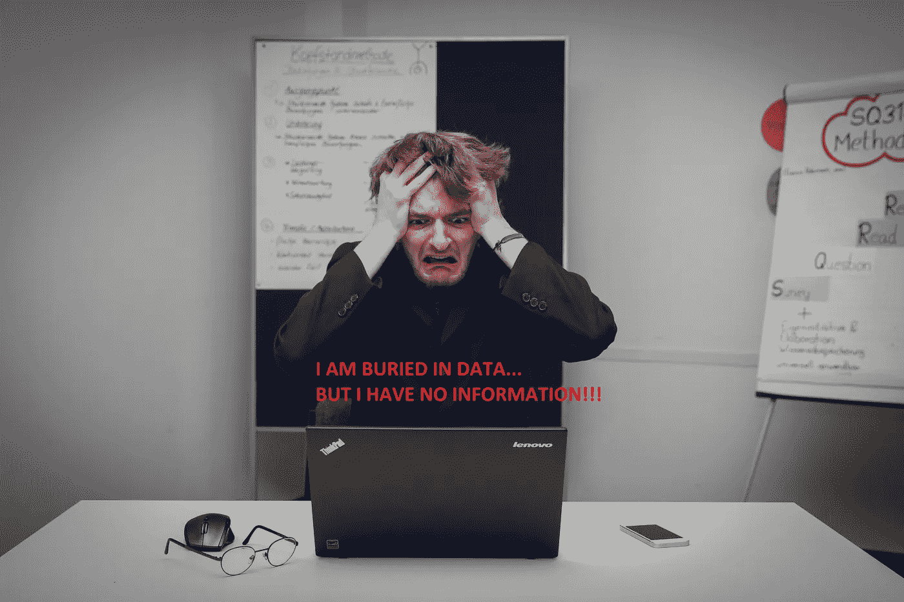
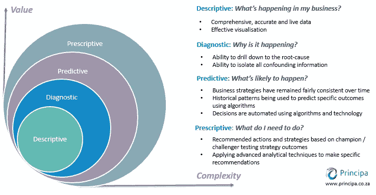
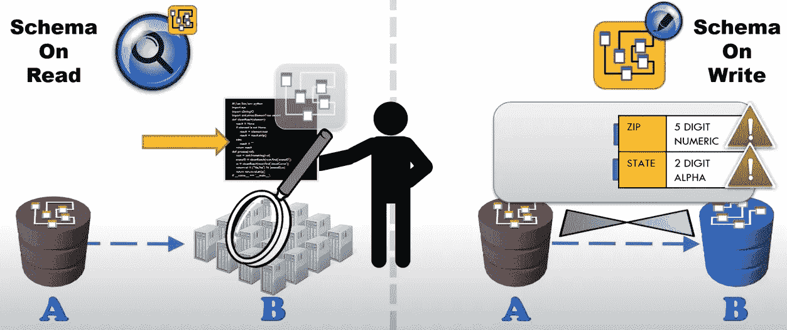
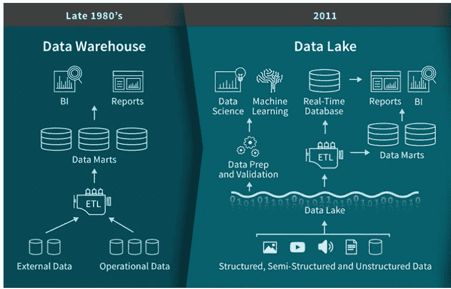
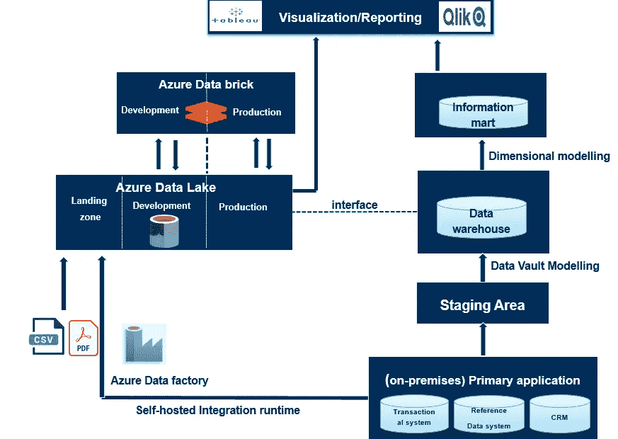
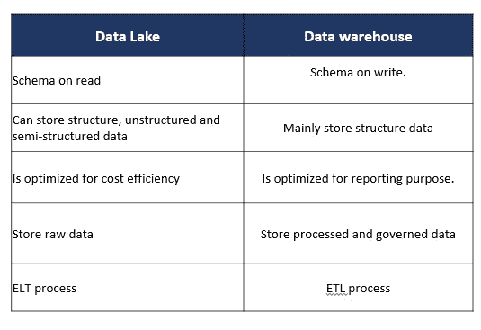
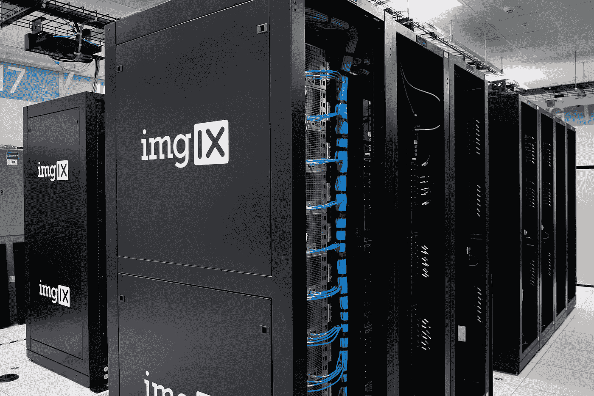
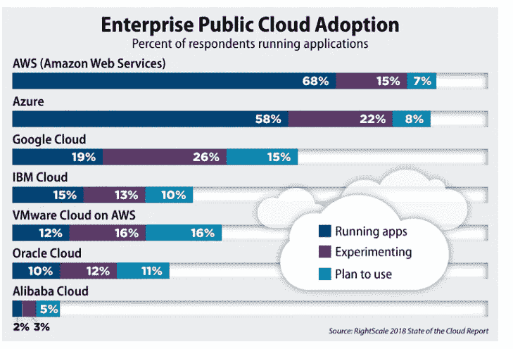

# 为商业智能实现数据湖或数据仓库架构？

> 原文：<https://towardsdatascience.com/implementing-a-data-lake-architecture-for-business-intelligence-f2c99551db1a?source=collection_archive---------4----------------------->

## 解释什么是商业智能，并比较用于商业智能的数据仓库和数据湖架构。

# **1。什么是商业智能？**

作者插图基于[塞巴斯蒂安·赫尔曼](https://unsplash.com/@officestock?utm_source=unsplash&utm_medium=referral&utm_content=creditCopyText)在 [Unsplash](https://unsplash.com/s/photos/frustration?utm_source=unsplash&utm_medium=referral&utm_content=creditCopyText) 上的照片

在数据行业工作了一段时间后，我觉得每个人对商业智能都有不同的理解。然而，用简单的语言来说，商业智能实际上是利用昨天和今天的数据来对明天做出更好的决策。它可以被理解为确保原始数据被转换成有意义的信息的功能，这些信息提供了洞察力并使决策成为可能。如果我们想一想公司长期以来一直试图做的事情，我们经常会听到投资于技术和工具，这些技术和工具本应通过数据和分析来解决业务问题。然而，商业智能不仅仅是技术和工具。BI 的最终目标是使用数据、技术和工具来创造商业洞察力。

简而言之，BI 涉及收集功能性业务需求，并通过设计数据模型、执行 ETL(提取、转换和加载流程)将它们转化为技术解决方案，从而将来自运营源系统的原始数据转换为有意义的信息，并将该信息带到分析/目标数据库，该数据库可用于以实时自动仪表板的形式进行可视化。在企业中，这是为了根据过去的数据而不是“直觉”做出明智的决策。

得到💬任何数据科学或编程问题的 GPT 式答案。为成千上万的人生成摘要和学习笔记📚只需一次点击即可获得学习资源。👉

 [## 面向数据科学家和开发人员的免费学习资源。精选的博客、教程、书籍和…

### 机器学习和人工智能工程师的培训课程、黑客马拉松、活动和工作

aigents.co](https://aigents.co/learn) 

## **BI 实现的最终输出**

***毕提供了真相的单一版本***

单一版本真理的故事是一个数据字典和数据源的故事，它是关于数据的来源和意义的，应该在整个企业中达成一致。我给你举个例子。我曾经为一家银行工作，这家银行无法回答一些简单的问题，比如:它有多少独立客户？根据您询问的对象，您会收到不同的号码。因此，拥有一个独特的真理来源是必须的。BI 产品为用户提供了实时、自动更新且一致的报告，而不是查看多个编号不同的电子表格并进行对账。

***BI 提供描述性分析*** —商业智能是描述性的，因为它告诉你现在发生了什么，过去发生了什么。它显示了公司在设定的 KPI 和指标方面的表现。例如，BI 产品可以告诉经理公司的销售情况以及距离既定目标还有多远。**这些信息通常以仪表盘的形式提供，包括条形图、折线图等，让用户一眼就能看到最重要的信息。**

***BI 提供诊断分析—*** 诊断分析是关于提供深入的见解和回答问题:为什么会发生什么？BI 仪表板提供了深入查看功能，这意味着，从高层次的角度来看，用户可以从不同的角度对信息进行细分，以找出事情发生的原因。

Bi 不会告诉你未来会发生什么。

四种类型的数据分析。来源[原理](https://insights.principa.co.za/4-types-of-data-analytics-descriptive-diagnostic-predictive-prescriptive)

# **2。数据仓库、数据湖:写模式和读模式**

读取模式与写入模式。来源:[intrinity—Hadoop 和 SQL 对比。](https://www.youtube.com/watch?v=MfF750YVDxM)

## **数据仓库架构师**

商业智能是一个通常与数据仓库联系在一起的术语。如果 BI 是前端，那么数据仓库系统就是后端或实现商业智能的基础设施。因此，我们将首先在使用数据仓库视角的上下文中讨论 BI。

BI 实施的最终目的是将运营数据转化为有意义的信息。原始数据分散在不同的操作数据库中，这些数据库是为应用程序的运行而设计和优化的，而不是用于分析目的。有时，为了得到一个数据字段，您必须进行十次连接！开始了。人们提出了一种叫做中央数据存储的解决方案——数据仓库。

数据仓库解决方案出现于 20 世纪 80 年代，它是为提供信息或见解而优化的。数据仓库是一个目标数据库，它集中了来自所有源系统的企业数据。它是一个关系数据库，因为我们可以使用所谓的物理数据模型中的联合字段连接不同表中的数据。数据库模式定义了不同表之间的关系。典型的 SQL 数据库包括 MySQL 和 PostgreSQL。

数据源通过一个 *ETL 过程连接到数据仓库，这个过程被称为*提取、转换和加载*。* **数据仓库遵循写模式，**其中的设计符合预期问题的答案。换句话说，数据仓库收集来自具有预定结构和模式的主要应用程序的数据。在数据仓库体系结构中，当我们将数据从数据库 A 转移到数据库 B 时，我们需要预先了解数据库 B 的结构以及如何调整数据库 A 的数据以适应数据库 B 的结构，例如了解数据库 B 中字段的命名约定和数据类型等。

**三层数据仓库架构**

数据仓库工程师可以使用各种架构来构建数据仓库。常见的数据仓库体系结构基于分层方法。Inmon 推出的众所周知的三层架构[包括以下组件:](https://www.amazon.com/Building-Scalable-Data-Warehouse-Vault/dp/0128025107)

***中转区/登陆区:*** 这是一个用于从源系统加载批量数据的数据库。其目的是从源系统/主要应用程序中提取源数据，以减少操作系统的工作量。临时区域由反映源系统结构的表组成，包括源系统的所有表和列，包括主键。这里没有应用功能性业务规则。但是，在这一阶段会实施一些硬的技术业务规则，例如，数据类型匹配(字符串长度或 Unicode 字符)。这些技术业务规则并没有改变数据的含义，而只是改变了数据的存储方式。

***数据仓库层:*** 这是应用功能性业务规则的转换发生的地方。这些功能性业务规则修改传入的数据以适应业务需求。业务规则在数据仓库体系结构中实现得越早，它对数据仓库上层的依赖性就越强。在数据仓库建模中，您会经常听到维度建模或数据仓库建模。

数据仓库建模技术是由 Dan Linstedlt 在 20 世纪 90 年代发明的。它基于三种基本的实体类型，包括集线器、链路和卫星。hub 是 Data Vault 模型的主要支柱，它提供了业务用户用来识别业务对象的业务键。商业密钥的例子包括客户标识符、产品标识符、员工工号等。链接将中心联系在一起，并存储不同中心(业务对象)之间的关系。卫星被认为是存储[元数据](https://dama.org/content/what-metadata)的标准场所。除此之外，卫星存储描述业务对象或关系的所有属性。他们将一段时间内的业务上下文添加到集线器和链路中。然而，这种商业环境会随着时间的推移而变化，拥有卫星的目的也是为了跟踪这些变化并存储历史数据。

在数据仓库之上， ***可以有一个数据集市层***——用于向最终用户呈现数据的层。我认为称之为信息集市比称之为数据集市更有意义。数据集市的一种常见建模技术是维度建模。维度建模的关键概念包括事实实体和维度实体，这是构建信息集市的标准技术，因为最终用户很容易理解。在维度建模中，您会经常听到星型模式，即一个事实表引用任意数量的维度表。事实表表示发生的事情、订单和事务，同时，维度实体包含构成事实的不同属性/字段。

来源:[“什么是湖畔小屋？”](https://databricks.com/blog/2020/01/30/what-is-a-data-lakehouse.html)通过[数据块](https://databricks.com/)

***加入*** [***中等会员***](https://huonglanchu.medium.com/membership) ***计划继续无限制学习。如果你使用下面的链接，我会收到你的一部分会员费，不需要你额外付费。***

 [## 通过我的推荐链接加入媒体——蓝初

### 阅读兰楚的每一个故事(以及媒体上成千上万的其他作家)。你的会员费直接支持兰初…

huonglanchu.medium.com](https://huonglanchu.medium.com/membership) 

## ***数据湖架构***

因为进入数据仓库的数据在存储之前需要经过严格的治理过程，所以向数据仓库添加新的数据元素意味着改变数据的设计、实现或重构结构化存储以及相应的 ETL 来加载数据。由于数据量巨大，这一过程可能需要大量的时间和资源。这就是数据湖概念出现的原因，它将改变大数据管理的游戏规则。

数据湖的概念出现在 2010 年代，用简单的语言来说，就是所有企业的结构化、非结构化和半结构化数据可以而且应该存储在同一个地方。Apache Hadoop 是数据基础设施的一个例子，它允许存储和处理大量结构化和非结构化数据；这实现了数据湖体系结构。

DWH 和数据湖架构的示例。作者根据 [MS Azure](https://docs.microsoft.com/en-us/azure/synapse-analytics/sql-data-warehouse/sql-data-warehouse-videos) 文档和 [Daniel Linstedt](https://www.amazon.com/s/ref=dp_byline_sr_book_1?ie=UTF8&field-author=Daniel+Linstedt&text=Daniel+Linstedt&sort=relevancerank&search-alias=books) 的 b [ook](https://www.amazon.com/Building-Scalable-Data-Warehouse-Vault/dp/0128025107) 的插图。

数据湖有一种读取模式的方法。它存储原始数据，并以不需要首先定义数据结构和模式的方式进行设置。换句话说，当我们将数据移动到数据湖时，我们只是在没有任何把关规则的情况下引入数据，当我们需要读取数据时，我们将规则应用于读取数据的代码，而不是提前配置数据的结构。与数据仓库中典型的提取、转换和加载不同，在数据湖的世界中，该过程是提取、加载和转换。数据湖用于成本效率和探索目的。因此，数据湖体系结构使企业不仅能够从经过处理和治理的数据中获得洞察力，还能够从以前无法用于分析的原始数据中获得洞察力。由此，原始数据探索可能会引发业务问题。然而，数据湖最大的问题是，如果没有适当的治理，数据湖会很快变成无法管理的数据沼泽。**换句话说，如果不知道湖里的水是怎样的，谁会想去湖里游泳呢？如果业务用户不信任数据湖的数据质量，他们就不能利用数据湖。**

来源:Datavercity

最近出现了这样一种趋势，即公司希望以更保守的方式从数据湖架构中获益。这些公司正在摆脱不受监管的“自由进入”方法，转而开发一个更受监管的数据湖。

数据湖可以包含两种环境:勘探/开发环境和生产环境。数据将被探索、清理和转换，以便构建机器学习模型、构建函数和其他分析目的。由转换过程生成的数据(如度量和函数)将存储在数据湖的生产部分。

另一个趋势是，治理数据湖只允许“经过验证的”数据进入，而不是将所有原始数据都倒入湖中。从本质上讲，受治理的数据湖体系结构不限制存储在其中的数据类型，这意味着受治理的数据湖仍然包含多种数据类型，包括非结构化和半结构化数据，如 XML、JSON、CSV。然而，关键是要确保没有数据存储在湖中，而没有在业务术语表中描述和记录，这将使用户对数据的质量和意义有一些信心。

为了提供这一层的治理，必须有一个业务术语表工具来记录数据的含义。更重要的是，需要有一个围绕这一点的治理过程——这完全是关于角色和职责的，例如，谁拥有数据，谁定义数据，以及谁将对任何数据质量问题负责。采用这种方法将非常耗时，因为定义数据本身可能是一个漫长的过程，因为它涉及到企业中不同学科的人员。

数据湖和数据仓库的比较。作者插图。

# **3。内部部署和云服务**

在过去，公司通常依靠自有主机数据中心。在数据处理期间，必须处理大量数据，并且数据处理同时在一组机器上运行，而不是在一台计算机上运行。这个内部存储设置中心需要大量的服务器和大型计算机，以及足够的处理能力来应对高峰时刻。这也意味着，在较安静的时候，大部分处理能力都没有被使用。因此，内部部署系统具有巨大的前期安装成本，但同时，其容量有时只能得到充分利用。不仅如此，维护这一点需要整个专门的应用程序团队来照顾这些主要系统，解决生产问题，并减少停机时间。

[imgix](https://unsplash.com/@imgix?utm_source=unsplash&utm_medium=referral&utm_content=creditCopyText) 在 [Unsplash](https://unsplash.com/s/photos/big-computer-storage?utm_source=unsplash&utm_medium=referral&utm_content=creditCopyText) 上的照片

本地存储的这些巨大缺点使得使用云的想法变得如此吸引人。许多公司已经将云作为成本优化的一种方式。例如，使用 Azure 和 AWS 在云上构建数据基础设施的兴起完全改变了企业的大数据能力。公司无需在数据中心维护 CPU 和存储，只需租用云资源，例如在需要时租用所需的存储。云提供商负责维护底层基础设施。当云服务用户使用完这些资源后，他们可以归还这些资源，并且只为他们使用的资源付费。这使得扩展变得非常容易，因为如果速度变慢，公司可以分配更多的虚拟机来处理数据。有了云存储，企业不必投资新机器或基础设施，也不必更换老化的服务器。使用云存储的另一个原因是数据库的可靠性。例如，在最坏的情况下，您的数据中心可能会发生火灾。为了安全起见，您需要在不同的地理位置复制您的数据。这带来了一系列的物流问题。基于这些需求，专门从事这类服务的公司诞生了。我们称他们为“云服务提供商”。目前云服务提供商市场有三大巨头。首先也是最重要的，亚马逊网络服务(AWS)是市场领导者，在 2018 年占据了 [32%的市场份额。位居第二的是拥有](https://learn.datacamp.com/courses/introduction-to-data-engineering) [17%](https://learn.datacamp.com/courses/introduction-to-data-engineering) 市场份额的微软 Azure，第三受欢迎的是拥有 [10%](https://learn.datacamp.com/courses/introduction-to-data-engineering) 市场份额的谷歌云服务。

这些云服务提供商能提供什么？

有很多云服务都有不同的使用案例。最简单的服务是存储，它允许云服务用户上传所有类型的文件到云中。存储服务通常很便宜，因为除了可靠地存储文件之外，它们不提供太多功能。AWS 将 S3 托管为存储服务。Azure 有 Blob 存储，google 有云存储。第二个服务是计算服务，它允许你在云上执行计算。本质上，你可以启动一个虚拟机，并随意使用它。例如，计算服务通常用于托管 web 服务器和执行计算。AWS 提供 EC2 作为计算服务，微软 Azure 使用虚拟机，谷歌有计算引擎。云服务提供商也托管数据库。例如，公司可以通过将他们现有的应用程序转移到运行在 Azure 上的虚拟机来开始探索云。云服务的其他用例是人工智能和机器学习。例如，Azure 提供 Azure 机器学习服务，这是一个基于云的环境，可以用来开发、训练、测试和部署机器学习模型。

# **4。对于 BI 来说，数据湖可以取代数据仓库吗？**

毫无疑问，数据湖比数据仓库有多种优势，特别是在处理大数据和成本效率方面。然而，如果不了解数据湖中的数据质量，业务用户就无法信任这些数据。许多数据科学家通常没有意识到从多个来源获取原始数据是准备好的——干净和高质量的建模通常需要花费 [80%的时间](https://www.datacamp.com/community/blog/full-stack-data-science-transcript)。与此同时，不能忽视提供受治理的高质量数据的数据仓库的体系结构和原则。对于定义企业经营状况的一套核心 KPI 仍然有着强烈而持久的需求，这些 KPI 也是报告(尤其是监管报告)所需要的。这种信息需要高度管控的信息。

归根结底，关于公司希望通过数据和技术实现其商业战略的最关键问题必须非常清楚。例如，如果一家公司在其业务和数据战略中不打算涉足数据科学，那么投资允许人工智能和机器学习发生的数据科学/分析平台就没有意义。或者**公司可以在一个业务术语表平台中管理他们所有的数据，然后用直升机将它们送入数据湖，但如果他们不知道为什么，我怀疑这是否会创造价值。**

感谢您的阅读。我希望这个高层次的概述能帮助您更多地了解 BI 及其背后的架构。

参考资料:

[1]使用 Data Vault 2.0 构建可扩展的数据仓库

[2] [1keydata —数据仓库概念](https://www.1keydata.com/datawarehousing/concepts.html)

[3][https://databricks . com/blog/2020/01/30/what-is-a-data-lake house . html](https://databricks.com/blog/2020/01/30/what-is-a-data-lakehouse.html)

[4].[由黄家仪在媒体上发布](/everything-a-data-scientist-should-know-about-data-management-6877788c6a42)。

[5].让数据湖发挥作用。