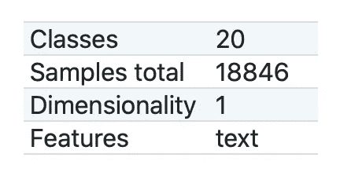
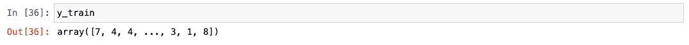
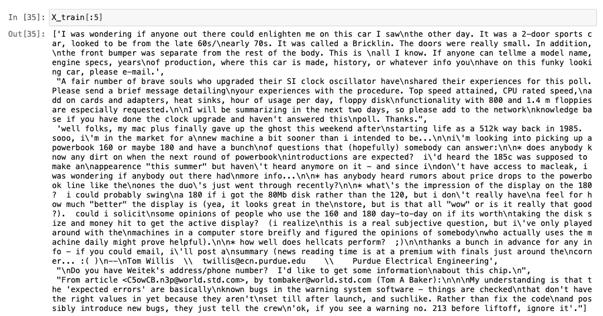
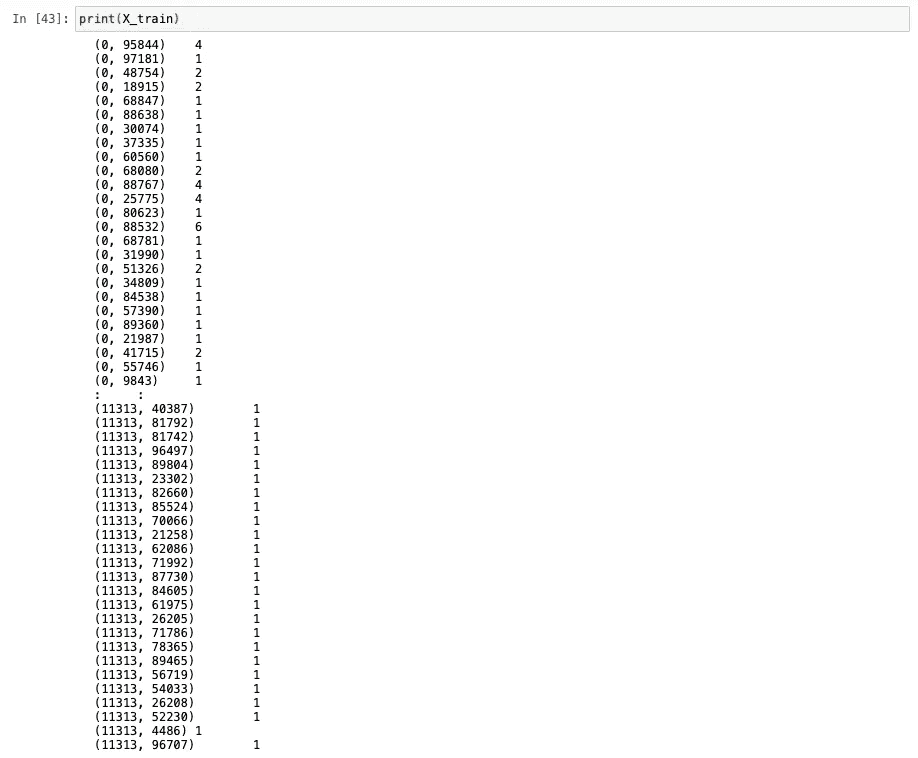
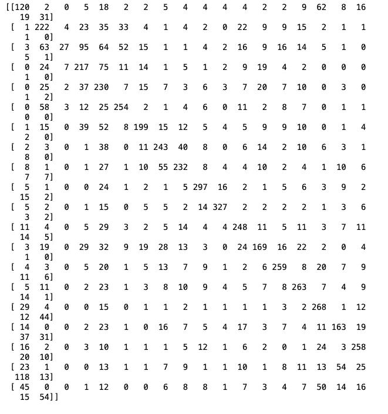
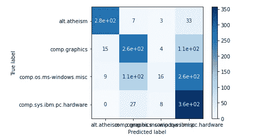

# 实现朴素贝叶斯分类器

> 原文：<https://towardsdatascience.com/implementing-a-naive-bayes-classifier-f206805a95fd?source=collection_archive---------19----------------------->

## 在 Python 中使用真实世界的数据集


凯文·Ku 在 [Unsplash](https://unsplash.com/s/photos/machine-learning?utm_source=unsplash&utm_medium=referral&utm_content=creditCopyText) 上的照片

在的[监督学习(分类)](/basics-of-supervised-learning-classification-d26c00d80100)的背景下，朴素贝叶斯或者更确切地说贝叶斯学习作为评估其他学习算法的黄金标准，同时作为一种强大的概率建模技术。

在这篇文章中，我们将讨论[朴素贝叶斯分类器](/understanding-naive-bayes-classifier-46385aca47ec)的工作原理，通过将它应用于真实世界的数据集，用 Python 实现。

T 岗位更宽泛地分为以下几个部分:

*   [数据预处理](/data-preprocessing-in-python-b52b652e37d5)
*   训练模型
*   预测结果
*   检查模型的性能

上述部分可以进一步划分如下:

→ [数据预处理](/data-preprocessing-in-python-b52b652e37d5)

1.  导入库
2.  导入数据集
3.  将数据集分成训练集和测试集
4.  特征缩放

→训练模型

1.  在训练集上训练朴素贝叶斯模型

→预测结果

1.  预测测试集结果

→检查模型的性能

1.  制作混淆矩阵

→可视化

1.  可视化混淆矩阵

在我们开始深入研究代码本身之前，我们需要谈谈数据集本身。对于这个实现，我们将使用 [**这 20 个新闻组的文本数据集**](https://scikit-learn.org/stable/datasets/index.html#newsgroups-dataset) **。**这个数据集是公开的，目的是人们可以学习和磨练他们的[机器学习](/understanding-naive-bayes-classifier-46385aca47ec)技能。

我们将使用 scikit-learn (sklearn)作为机器学习库和数据集本身的存储库。这就是 **sklearn 的**网站告诉你的数据集。

> 20 个新闻组数据集包含大约 18000 个关于 20 个主题的新闻组帖子，分为两个子集:一个用于培训(或开发)，另一个用于测试(或性能评估)。训练集和测试集之间的划分基于在特定日期之前和之后发布的消息。

## 数据集特征:



[https://scikit-learn . org/stable/datasets/index . html # news groups-dataset](https://scikit-learn.org/stable/datasets/index.html#newsgroups-dataset)

> 注意:由于原始数据是自然语言文本，我们不能直接处理它。在开始处理数据之前，我们需要将数据转换成数字。有多种方法可以做到这一点，即:
> 
> [计数矢量器](https://scikit-learn.org/stable/modules/generated/sklearn.feature_extraction.text.CountVectorizer.html#sklearn.feature_extraction.text.CountVectorizer)
> 
> [tfidf 矢量器](https://scikit-learn.org/stable/modules/generated/sklearn.feature_extraction.text.TfidfVectorizer.html#sklearn.feature_extraction.text.TfidfVectorizer)
> 
> [哈希矢量器](https://scikit-learn.org/stable/modules/generated/sklearn.feature_extraction.text.HashingVectorizer.html#sklearn.feature_extraction.text.HashingVectorizer)
> 
> 选择矢量器取决于解决方案的设计者和问题本身。出于本文的目的，我将使用 CountVectorizer。我已经为所有矢量器提供了 sklearn 文档的链接。你当然可以在那里和网上详细看看。

现在，我们已经谈了一点数据集，让我们从代码本身开始，一步一步来。

## → [数据预处理](/data-preprocessing-in-python-b52b652e37d5)

1.  导入库

```
from sklearn.datasets import fetch_20newsgroups
from sklearn.feature_extraction.text import CountVectorizer
from sklearn.naive_bayes import GaussianNB
from sklearn.metrics import confusion_matrix, plot_confusion_matrix
import matplotlib.pyplot as plt
```

上述库的使用/要求(按顺序解释)如下:

a)从 sklearn 本身导入数据集

b)导入计数矢量器以将原始自然语言文本转换成机器可理解的数字

c)导入[朴素贝叶斯分类器](/understanding-naive-bayes-classifier-46385aca47ec)，在这种情况下，我们使用[高斯朴素贝叶斯](/continuous-data-and-zero-frequency-problem-in-naive-bayes-classifier-7784f4066b51)

d)引入混淆矩阵方法来检查模型的性能并将其可视化。

e)用于混淆矩阵的可视化

2 & 3.导入数据集并将数据集分成训练集和测试集

```
data_train = fetch_20newsgroups(subset='train', categories=None,
                                remove=('headers', 'footers',       
                                'quotes'))data_test = fetch_20newsgroups(subset='test', categories=None,
                               remove=('headers', 'footers', 
                               'quotes'))X_train = data_train.data
y_train = data_train.targetX_test = data_test.data
y_test = data_test.target
```

`data_train`包含来自数据本身的训练集。`fetch_20newsgroups`中传递的参数可以理解为:

I)子集-定义训练或测试集

ii)类别—数据集包含 20 个[类别或分类标签](/journey-into-data-mining-3b5ccfa5343)。通过在参数中提供以下类别的列表，可以使用数据集的子集:

```
from pprint import pprint
pprint(list(newsgroups_train.target_names))
```

输出是:

> ['alt .无神论'，
> 'comp.graphics '，
> 'comp.os.ms-windows.misc '，
> 'comp.sys.ibm.pc.hardware '，
> 'comp.sys.mac.hardware '，
> 'comp.windows.x '，
> 'misc.forsale '，
> 'rec.autos '，
> ' rec . motors '，
> 'rec.sport.baseball '，
> 'rec

iii)移除—数据集中的文本包含页眉、页脚和引号，但我们希望对数据主体应用模型。

通过调用`data_train`和`data_test`上的`.data`和`.target`可以分离自变量和因变量，得到分叉的训练和测试数据。



类别/y_train

数组中的值表示上述类别列表的索引。



在应用 CountVectorizer 之前进行 X_train

4.特征缩放

```
vectorizer = CountVectorizer()
X_train = vectorizer.fit_transform(X_train)
X_test = vectorizer.transform(X_test)
```

创建 CountVectorizer 类的对象，然后在`X_train`和`X_test`数据上拟合矢量器对象。



应用计数矢量器后的 X_train

## →训练模型

1.  在训练集上训练朴素贝叶斯模型

```
classifier = GaussianNB()
classifier.fit(X_train.toarray(), y_train)
```

制作 GaussianNB 类的对象，然后根据`X_train`和`y_train` 数据拟合分类器对象。这里的`.toarray()`与`X_train`用于将稀疏矩阵转换为密集矩阵。

## →预测结果

1.  预测测试集结果

```
y_pred = classifier.predict(X_test.toarray())
```

在分类器对象上调用`.predict`方法，并传递`X_test`来预测之前未见过的数据上的训练模型的结果。这里的`.toarray()`与`X_test`用于将稀疏矩阵转换为密集矩阵。

## →检查模型的性能

1.  制作混淆矩阵

```
cm = confusion_matrix(y_test, y_pred)
print(cm)
```



## →可视化

1.  可视化混淆矩阵

```
plot_confusion_matrix(classifier, X_test.toarray(), y_test, display_labels=['alt.atheism',
 'comp.graphics',
 'comp.os.ms-windows.misc',
 'comp.sys.ibm.pc.hardware'], cmap=plt.cm.Blues)
```

为了形象化的目的，我把类别的数量限制在 4 个，这样它就能被正确地看到。



现在，机器学习模型的整个管道已经完成，我希望我能够分享一些知识。这是一个非常基本的机器学习管道，但当你想建立更好更复杂的机器学习模型时，它在建立基础方面相当重要。我希望在未来带来更多动态和复杂的模型，敬请期待。

这里有一个[链接](https://github.com/tarunlnmiit/machine_learning/blob/master/naive_bayes-20newsgroup.ipynb)到完整的 jupyter 笔记本。

[](https://github.com/tarunlnmiit/machine_learning/blob/master/naive_bayes-20newsgroup.ipynb) [## tarunlnmiti/机器学习

### permalink dissolve GitHub 是超过 5000 万开发人员的家园，他们一起工作来托管和审查代码，管理…

github.com](https://github.com/tarunlnmiit/machine_learning/blob/master/naive_bayes-20newsgroup.ipynb) 

[我正在免费赠送一本关于一致性的电子书。在这里获得你的免费电子书。](https://colossal-hustler-1290.ck.page/c717067eb6)

感谢您的阅读。

如果你喜欢阅读这样的故事，并想支持我成为一名作家，可以考虑[注册成为一名媒体成员](https://tarun-gupta.medium.com/membership)。每月 5 美元，你可以无限制地阅读媒体上的故事。如果你注册使用我的链接，我会赚一小笔佣金，不需要你额外付费。

[](https://tarun-gupta.medium.com/membership) [## 加入我的推荐链接-塔伦古普塔

### 作为一个媒体会员，你的会员费的一部分会给你阅读的作家，你可以完全接触到每一个故事…

tarun-gupta.medium.com](https://tarun-gupta.medium.com/membership) 

你可以在这里阅读我的更多帖子:

 [## 标记故事列表的快速链接—感谢您的访问

### 我也有一份以快节奏出版为目标的出版物。读书成为作家。

tarun-gupta.medium.com](https://tarun-gupta.medium.com/thank-you-for-visiting-my-profile-9f708062c75e)