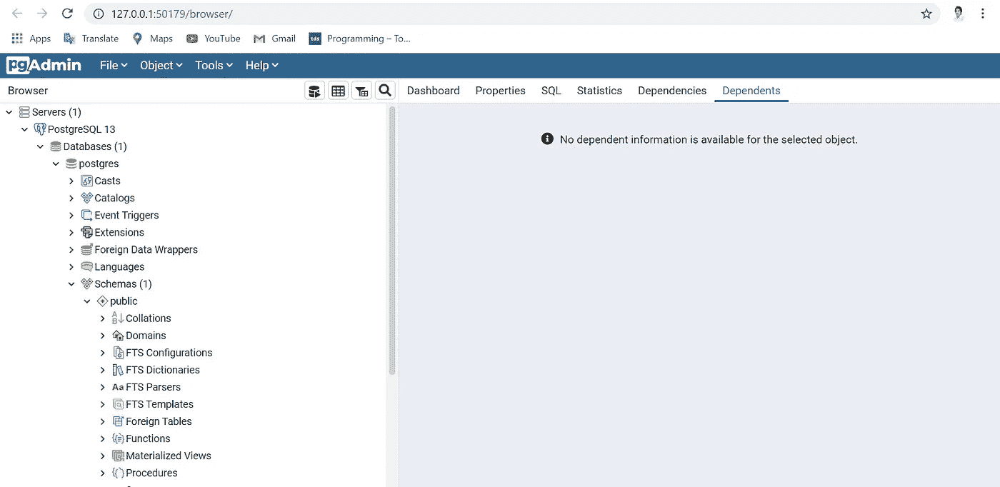
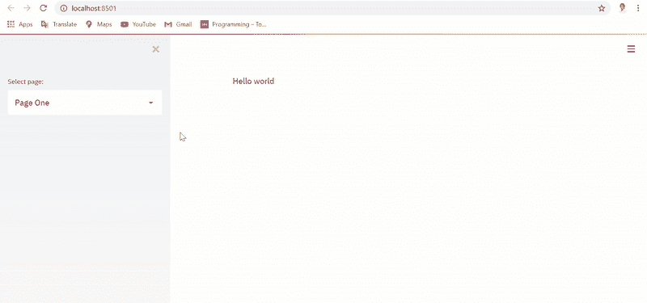
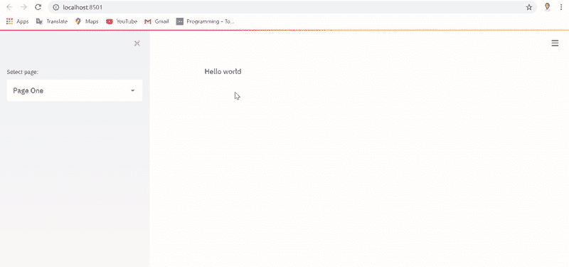
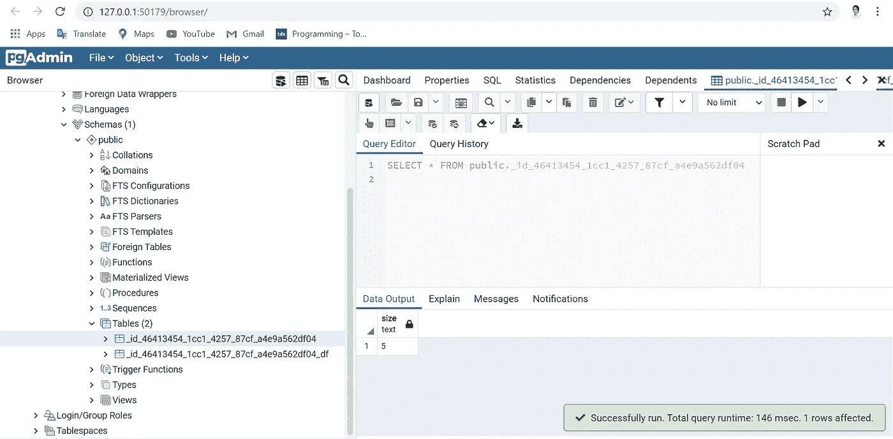

# 使用 Streamlit 实现有状态架构

> 原文：<https://towardsdatascience.com/implementing-a-stateful-architecture-with-streamlit-58e52448efa1?source=collection_archive---------16----------------------->

## 使用 PostgreSQL 通过 Streamlit 创建有状态的多页面应用程序


照片由[米切尔罗](https://unsplash.com/@mitchel3uo?utm_source=medium&utm_medium=referral)在 [Unsplash](https://unsplash.com?utm_source=medium&utm_medium=referral)

## 细流

[Streamlit](https://www.streamlit.io/) 自 2019 年 10 月成立以来已经走过了漫长的道路。它增强了软件开发社区的能力，并有效地使我们开发和部署应用程序到云的方式民主化。然而，与所有新工具一样，仍有一段路要走，当 Streamlit 团队不知疲倦地处理新功能的请求时，我们开发人员自己可以同时创建临时工作。

Streamlit 目前缺乏的一个功能是为其应用程序实现可编程状态的能力。在其当前形式中，没有内部状态可以存储易变数据，如用户输入、数据帧和输入到小部件中的值。考虑到当用户在按下按钮或在页面之间切换的情况下触发一个动作时，Streamlit 固有地重新运行整个脚本，应用程序将重置所有输入和数据帧。虽然对于许多应用程序来说，这不是问题，但对于其他应用程序来说，这可能是一个障碍。想象一下，如果您试图使用增量步骤构建一个具有顺序逻辑的应用程序，缺少有状态架构会使 Streamlit 成为一个不合适的框架。创始人承诺在不久的将来发布一个[有状态版本](https://github.com/streamlit/streamlit/wiki/Roadmap)，但在此之前，人们可以使用开源数据库如 PostgreSQL 来开发一个 hack，我将在下面解释。

## 一种数据库系统

PostgreSQL 或简称 Postgres 是一个免费的开源关系数据库系统，由于其易用性和扩展能力，它通常是大多数开发人员的首选数据库。虽然它表面上是一个结构化的数据库管理系统，但它也可以存储非结构化的数据，如数组和二进制对象，这使得它对开放式项目非常有用。此外，它的图形用户界面非常直观和简单，确保学习曲线非常浅。

在我们的有状态架构的实现中，我们将使用本地 Postgres 服务器来存储我们的状态变量，例如我们的 Streamlit 应用程序中生成的用户输入和数据帧。在我们继续之前，请使用[此链接](https://www.postgresql.org/download/)下载并安装 Postgres。在安装过程中，系统会提示您配置用户名、密码和本地 TCP 端口，以便将数据库服务器转发到。默认端口是 5432，您可以保持不变。安装完成后，您将能够通过运行“pgAdmin 4”应用程序登录到您的服务器，该应用程序将在您的浏览器上打开您的服务器门户，如下所示。



PostgreSQL 门户。图片作者。

默认情况下，还应该有一个名为“Postgres”的数据库显示在左侧栏中，但是，如果没有，您可以右键单击“Databases”并选择“Create”来提供一个新的数据库。

## 履行

现在我们已经解决了后勤问题，让我们转向 Python 来实现。除了通常的嫌疑人(熊猫和显然 Streamlit 本身)，你还需要下载以下软件包。

**Sqlalchemy** 我们将使用这个包来创建和执行我们的 SQL 查询。Sqlalchemy 使编写复杂的查询变得相当简单，如果您将查询字符串作为参数传递(而不是连接)，它具有反 SQL 注入功能，可以确保您的查询是安全的。您可以使用以下命令下载它。

```
pip install sqlalchemy
```

此外，我们需要从 Streamlit 库中导入一个名为“get_report_ctx”的方法。每次运行我们的应用程序时，这个函数都会创建一个唯一的会话 ID。这个 ID 将与我们的每个状态变量相关联，以确保我们从 Postgres 数据库中检索到正确的状态。

继续将以下包导入 Python 脚本。

首先，我们将创建一个提取应用程序实例的会话 ID 的函数。请注意，ID 会在每次应用程序刷新时更新，即当您点击 F5 时。由于会话 ID 将被用作存储我们的状态变量的表的名称，我们将需要遵守 Postgres 的表命名约定，该约定规定名称必须以下划线或字母(不是数字)开头，不能包含破折号，并且长度必须少于 64 个字符。

接下来，我们将创建四个函数，用于从 Streamlit 到 Postgres 读取和写入用户输入和数据帧的状态，如下所示。

现在，我们将创建多页 Streamlit 应用程序的主要功能。首先，我们使用包含用户名、密码和数据库名称的连接字符串来设置 PostgreSQL 客户端。请注意，存储您的数据库凭证的更安全的方法是将它们保存在一个[配置文件](https://medium.com/@t.rosen2101/how-to-create-a-gitignore-file-to-hide-your-api-keys-95b3e6692e41)中，然后在您的代码中将它们作为参数调用。然后，我们获取我们的会话 ID，它应该类似于下面这样:

```
_id_bd3d996d_d887_4ce6_b27d_6b5a85778e60
```

随后，我们将使用当前会话 ID 创建一个表，其中包含一个名为“size”的列，数据类型为“text”。我们需要确保每次更新状态变量时，它都被之前的状态覆盖。因此，我们将查询表的长度，如果它是零，我们将插入一个带有 state 的新行。否则，如果当前会话 ID 中的先前状态已经存在，我们将只更新现有的行。

最后，我们将创建两个页面，可以使用侧边栏中的“st.selectbox”进行切换。第一页包含文本“Hello world ”,第二页包含一个文本输入小部件，用于生成具有用户指定的相应大小的稀疏矩阵。文本输入和生成的数据帧的状态保存在我们的 Postgres 数据库中，每次 Streamlit 本身重新运行脚本时都会对其进行查询。如果脚本在相同的会话 ID 中找到现有状态，它将相应地更新输入和数据帧。

## 结果

使用无状态实现自然运行应用程序，每次我们切换页面时都会重置文本输入和数据帧，如下所示。



无状态实现。图片作者。

但是，使用有状态实现运行应用程序会获得一个持久状态，即使在我们切换页面之后，文本输入和数据帧仍会被存储和检索，如下所示。



有状态实现。图片作者。

同时，您还可以看到我们的 Postgres 数据库正在用我们的状态变量和数据帧进行实时更新，如下所示。



状态变量数据库。图片作者。

任何其他变量都可以使用以下命令保存和读取其状态:

```
write_state('*column name', value, connection string, session ID*)read_state('*column name', connection string, session ID*)
```

类似地，可以使用以下命令保存和读取任何数据帧:

```
write_state_df(dataframe*, connection string, session ID*)read_state_df(*connection string, session ID*)
```

## 结论

这个方法可以扩展到其他小部件，也可以用来存储生成或上传到 Streamlit 的二进制文件。此外，如果想要跟踪他们的用户的输入或者想要记录每个动作的时间戳，那么该方法可以进一步扩展以处理这样的特征。这里唯一需要注意的是，并非 Streamlit 中的所有小部件都有可以存储的值，例如，“st.button”仅用作事件触发器，没有可以保存为状态的相关值。

如果您想了解更多关于数据可视化、Python 以及将 Streamlit web 应用程序部署到云中的信息，请查看以下(附属链接)课程:

## 使用 Streamlit 开发 Web 应用程序:

[](https://www.amazon.com/Web-Application-Development-Streamlit-Applications/dp/1484281101/) [## 使用 Streamlit 开发 Web 应用程序

### 使用纯 Python 框架开发安全且可扩展的 Web 应用程序并将其部署到云中

www.amazon.com](https://www.amazon.com/Web-Application-Development-Streamlit-Applications/dp/1484281101/) 

## 使用 Python 实现数据可视化:

[](https://www.coursera.org/learn/python-for-data-visualization?irclickid=xgMQ4KWb%3AxyIWO7Uo7Vva0OcUkGQgW2aEwvr1c0&irgwc=1&utm_medium=partners&utm_source=impact&utm_campaign=3308031&utm_content=b2c) [## 用 Python 实现数据可视化

### “一图胜千言”。我们都熟悉这个表达。它尤其适用于试图…

www.coursera.org](https://www.coursera.org/learn/python-for-data-visualization?irclickid=xgMQ4KWb%3AxyIWO7Uo7Vva0OcUkGQgW2aEwvr1c0&irgwc=1&utm_medium=partners&utm_source=impact&utm_campaign=3308031&utm_content=b2c) 

## 面向所有人的 Python 专业化:

[](https://www.coursera.org/specializations/python?irclickid=xgMQ4KWb%3AxyIWO7Uo7Vva0OcUkGQgW16Ewvr1c0&irgwc=1&utm_medium=partners&utm_source=impact&utm_campaign=3308031&utm_content=b2c) [## 面向所有人的 Python

### 学习用 Python 编程和分析数据。开发收集、清理、分析和可视化数据的程序…

www.coursera.org](https://www.coursera.org/specializations/python?irclickid=xgMQ4KWb%3AxyIWO7Uo7Vva0OcUkGQgW16Ewvr1c0&irgwc=1&utm_medium=partners&utm_source=impact&utm_campaign=3308031&utm_content=b2c) 

## 使用 Streamlit 和 Python 构建数据科学 Web 应用程序:

[](https://www.coursera.org/projects/data-science-streamlit-python?irclickid=xgMQ4KWb%3AxyIWO7Uo7Vva0OcUkGQgTzrEwvr1c0&irgwc=1&utm_medium=partners&utm_source=impact&utm_campaign=3308031&utm_content=b2c) [## 使用 Streamlit 和 Python 构建数据科学 Web 应用程序

### 在 2 小时内完成这个指导项目。欢迎参加这个构建您的第一个数据科学网站的动手项目…

www.coursera.org](https://www.coursera.org/projects/data-science-streamlit-python?irclickid=xgMQ4KWb%3AxyIWO7Uo7Vva0OcUkGQgTzrEwvr1c0&irgwc=1&utm_medium=partners&utm_source=impact&utm_campaign=3308031&utm_content=b2c) 

## GitHub 资源库:

[](https://github.com/mkhorasani/streamlit_state) [## mkhorasani/streamlit_state

### 使用 PostgreSQL 的 Streamlit 的有状态实现

github.com](https://github.com/mkhorasani/streamlit_state) 

# 新到中？您可以在此订阅和解锁无限文章[。](https://khorasani.medium.com/membership)